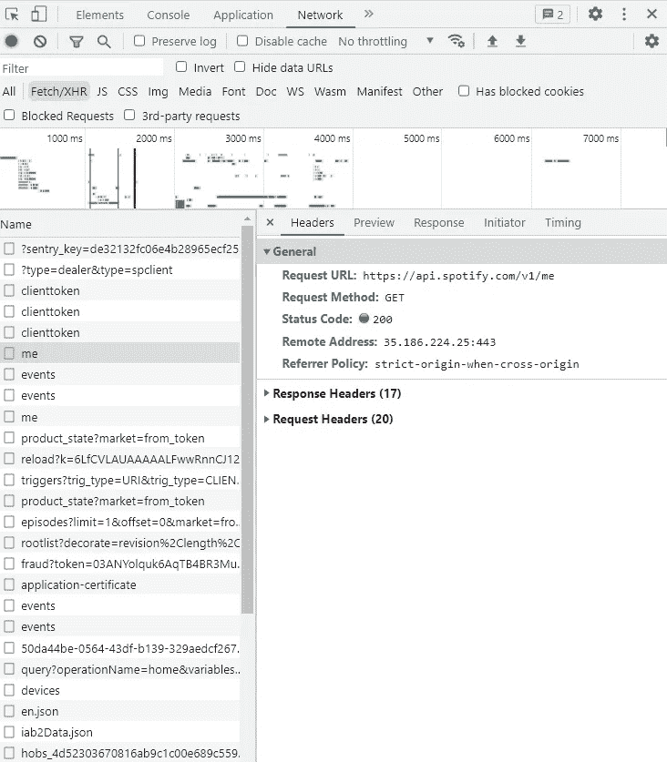
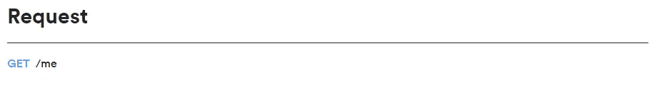
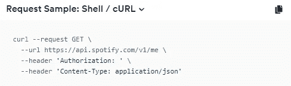
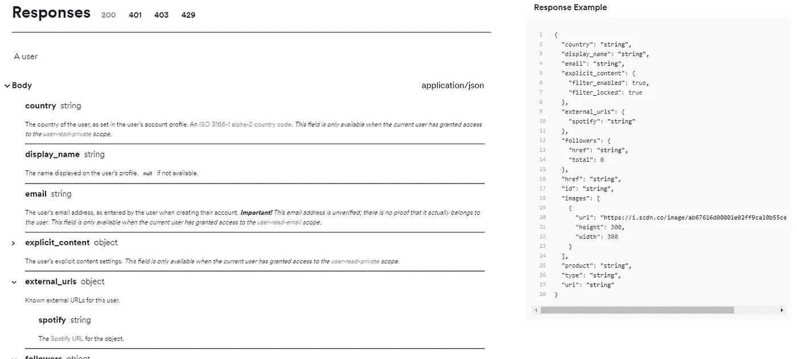
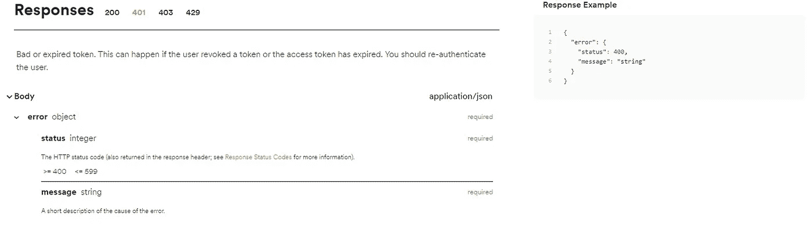
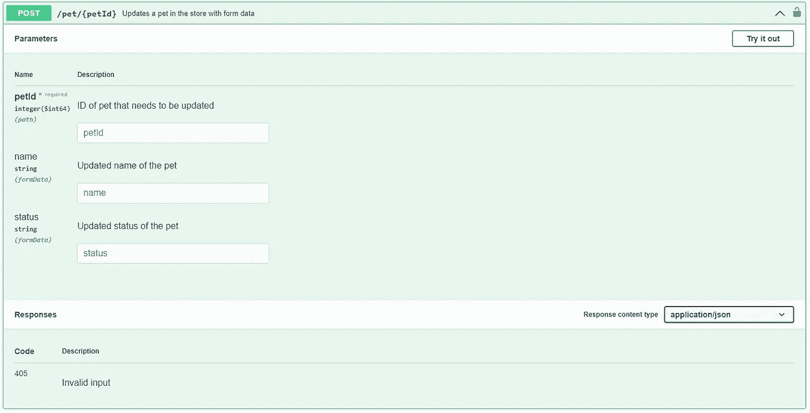

# 以实际方式解释的 API

> 原文：<https://blog.devgenius.io/apis-explained-in-practical-way-4280dfa401e6?source=collection_archive---------16----------------------->

# 学习成果

*   了解 API 的含义
*   了解 rest API 的基础知识
*   能够阅读和理解 API 文档

# 什么是 API？

API 被用作两个应用程序相互通信的一种方式。API 是为应用程序使用而构建的，不像应用程序是为用户使用而构建的。当您听到 API 时，一个常见的误解是，人们会直接从网络的角度来考虑 API。API 的使用并不局限于网络。程序员可以调用操作系统的 APIs 例如，当打开文件时，通过 API 调用操作系统，然后操作系统处理打开文件的所有逻辑。您可能听说过的 API 是 rest APIs，这些是 web 服务中使用的 API。

# 休息 API

Rest APIs 基本上是为网络定制的 API。Rest APIs 的主要目标是标准化 web 服务之间的数据交换。你可能在想我们为什么要这么做？网络已经有了很大的发展，网络上的主要用户界面曾经是 HTML。因此，网络服务器只会将 HTML 发送到网络浏览器，但是随着前端的发展，我们现在有许多不同的东西连接到互联网上，比如移动应用、智能设备甚至烤面包机！所有这些新设备都不呈现 HTML，这是其余 API 介入的地方。

# API 是做什么的？

那么，Rest APIs 实际上是做什么的呢？API 允许提取数据，并对该数据执行 CRUD(创建、读取、上传和删除)操作。

> 注意:CRUD 并不总是存在于 API 中

API 使用一种称为 [JSON](https://www.json.org/json-en.html) 的语言作为通信手段，描述 JSON 最简单的方法是它基本上是一个字典。所有 web 应用程序都可以查看 JSON 数据。下面是 JSON 的一个例子

```
{
    "name": "John",
    "age": 22,
    "gender": "male",

}
```

使用 api 的应用程序的一个例子是 Spotify。



正如您所看到的，网络浏览器对端点进行调用。端点基本上是您想要调用的 API 的 URL，例如，如果您想在耐克网站上查看 Jordan 的，您可以导航到[https://nike.com/air-Jordan](https://nike.com/air-Jordan)。在这种情况下，终点是“/我”。网络浏览器发出我们所说的获取请求。当向 API 点发出请求时，我们可以发出不同类型的请求，我们称之为 [API 动词或 HTTP 请求方法](https://developer.mozilla.org/en-US/docs/Web/HTTP/Methods)。

```
{
   "birthdate":"xxxx–xx–xx",
   "country":"GB",
   "display_name":"xxx",
   "email":"[xxx@gmail.com](mailto:hamadnassor5@gmail.com)",
   "explicit_content":{
      "filter_enabled":false,
      "filter_locked":false
   },
   "external_urls":{
      "spotify":"[https://open.spotify.com/user/x](https://open.spotify.com/user/4521.13)xxx"
   },
   "followers":{
      "href":null,
      "total":xx
   },
   "href":"[https://api.spotify.com/v1/users/x](https://api.spotify.com/v1/users/4521.13)xxx",
   "id":"xxxx",
   "images":[
      {
         "height":null,
         "url":"[https://i.scdn.co/image/ab6775700000ee85743e7a3771dc7132ca47c01b](https://i.scdn.co/image/ab6775700000ee85743e7a3771dc7132ca47c01b)",
         "width":null
      }
   ],
   "policies":{
      "opt_in_trial_premium_only_market":false
   },
   "product":"premium",
   "type":"user",
   "uri":"spotify:user:xxxx"
}
```

这是“/me”端点返回的 JSON 数据，正如您所看到的，这个端点用于检索关于我的用户配置文件的所有数据，但是它如何知道要检索哪个配置文件数据呢？API 就是我们所说的**无状态。**这意味着，与服务器不同，每个端点不会跟踪您的身份，因此您需要使用授权来向 API 证明您的身份，这可以通过多种方式实现。API 授权是一个独立的主题，我将在后面的文章中讨论，但是请记住，您需要向每个端点证明您是谁。现在你可能会想，我们怎么知道哪个端点做什么，我们接收什么数据，我们需要发送什么数据？这就是 API 文档的用武之地。

# API 文档

现在我们有了所有的背景知识，可以开始阅读 API 文档来使用它们了。让我们来看几个例子

## Spotify API 文档

让我们更详细地看看“/me”的例子

[](https://developer.spotify.com/documentation/web-api/reference/#/operations/get-current-users-profile) [## Web API 参考|面向开发者的 Spotify

### 音乐，遇见代码。简单和高级应用程序的强大 API、SDK 和小部件。

developer.spotify.com](https://developer.spotify.com/documentation/web-api/reference/#/operations/get-current-users-profile) 

获取请求

我们可以看到的第一件事是，为了与这个端点通信，必须使用 GET 方法。我们还可以看到端点“/我”



卷曲命令

这是我们需要使用 cURL 命令发出请求的一个例子。 [cURL](https://curl.se/) 是一种使用 shell (cmd)发出 HTTP 请求的方法。

如你所见，我们需要包含一个标题。让我们深入了解一下 HTTP 请求的实际情况。HTTP 请求包括端点、头部，有时还包括主体。标题附在请求上，包括任何附加信息。将数据发送到端点时会附加正文。正如你在这个例子中看到的，因为我们正在发出一个 get 请求，所以我们不需要发送任何数据，因此不需要主体。

在这个例子中，头部告诉 API 我们只接受 JSON 格式的数据，我们发送授权来证明我们是用户。



Spotify /me 端点 200 响应

我们首先能看到的是我们期望得到的回应。它在顶部向我们显示状态代码。[状态码](https://developer.mozilla.org/en-US/docs/Web/HTTP/Status)主要用来告诉我们数据是否发送成功，所有的状态码在一般的 web 服务器和 API 中都是通用的。

正如我们看到的，当我们成功地获得 200 响应时，我们还可以看到主体 JSON 数据。它还向我们展示了返回的数据和数据类型。我们可以在右边看到一个数据的例子。



Spotify /me 端点 401 响应

正如我们看到的，当我们收到 401 响应时，这意味着发送的授权令牌已过期或无效。

# Swagger 文档检查

这是一个虚构的 API，使用一个名为 [swagger.io](https://petstore.swagger.io/?_ga=2.40788132.708436162.1658671977-680043374.1656792702#/pet/updatePetWithForm) 的平台。许多 API 文档可能看起来与此类似。



Swagger.io 文档中的 Pet 端点

如我们所见，这是一个 post 请求。这个端点看起来有点不同，这是因为这个端点带有一个参数。

同样值得一提的是，一些端点也会接受我们所说的查询参数。它们出现在请求 URL 的末尾，在问号 GET /notes 之后。offset = 100 & limit = 50/查询参数可以是必需的，也可以是可选的，但主要用于过滤条件、排序条件或表示分页集合中的当前页码**。**

因此，当发出这个 post 请求时，我们可以看到在端点中需要包含宠物 ID。在正文中，我们需要包括宠物的名字和宠物的状态。如果宠物更新成功，我们可以假设我们将得到 200 响应，如果没有，我们将得到 405，这意味着无效输入。

**总结**

现在，在吸收了所有知识之后，我们现在理解了 API 的实际含义，并且我们已经深入了解了 REST APIs。我们现在知道了

*   REST APIs 如何工作，在哪里使用，为什么
*   我们已经看到了 API 的真实例子
*   JSON 如何工作
*   API 端点
*   不同的 API 动词
*   无国籍的
*   API 文档
*   标题和正文
*   API 状态代码

我建议继续研究 API 授权是如何工作的，同时慢慢积累使用您最喜欢的编程语言或 cURL 从 API 获取数据的实践经验。然后开始真正理解 API