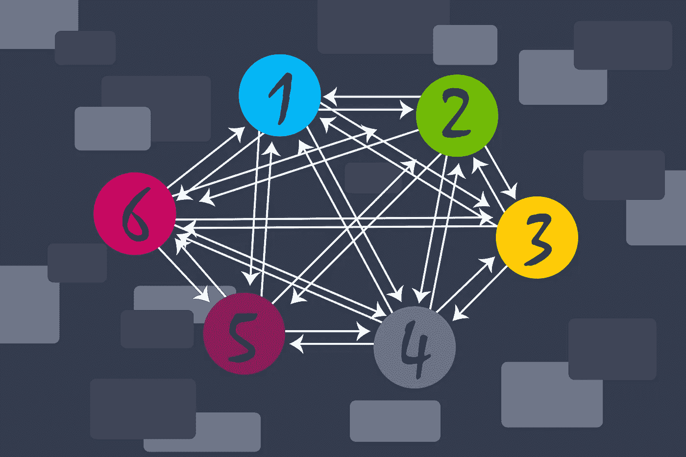

# Apollo 联邦:请求如何通过联邦架构？

> 原文：<https://blog.devgenius.io/apollo-federation-how-do-request-travel-through-a-federated-architecture-e4a4da54f46d?source=collection_archive---------6----------------------->

大家好，感谢您的加入！

今天，我将带您踏上一次旅程——有些人可能会说是一次开发之旅……通过联合 Apollo API 的架构来处理网络请求！

这是一次有趣的冒险，从客户端开始，穿过一个网关(这是本文开始的地方)，到达一个子图，并以解析器结束。有许多事情需要发生，以使这个棘手的旅程成为可能，我们可以确保我们的请求成功，而其余的请求则失败。



# 开始—一些助手

为此，我们将使用`@the-devoyage/micro-auth-helpers`包，它为 auth context 和 Apollo 联邦架构中的更多内容提供了帮助函数。它在 GitHub npm 注册表中，所以一定要登录到 GitHub 注册表并将`@the-devoyage`范围添加到您的。首先是 npmrc。

```
npm login --registry=https://npm.pkg.github.com echo @the-devoyage:--registry=https://npm.pkg.github.com >> .npmrcnpm i @the-devoyage/micro-auth-helpers
```

我会把我们的请求分成三个部分！

1.  网关
2.  子图(外部微服务)
3.  解析器

现在故事开始了——我们的请求即将离开客户机，向网关前进。

PS:像这样的包我一般都是收费的，但是这次是免费的！如果你喜欢使用它，我还有一个快速的方法让你贡献一小笔钱，来表达你的爱！谢谢！— [我喜欢这个想法，我愿意为此出一份力！](https://basetools.io/checkout/mEiqLNPM) < <点击此处

# 网关

当请求进入网关时，我们需要从 ***头*** 中提取对我们的服务 ***重要的数据。*** 有大量有价值的信息在头中发送，比如令牌、内容类型，甚至自定义数据。

这些数据中的一些可能需要被验证和/或解码，以便在服务中使用。

## 生成网关上下文

`@the-devoyage/micro-auth-helpers`包提供了一个函数来帮助从头部提取信息和创建上下文。

从`@the-devoyage/micro-auth-helpers`包中导入`Helpers`，并使用网关模块中的`GenerateContext`，从请求头中创建`Context`。在创建 Apollo 服务器时，将这个函数应用于`context`属性，如下所示:

```
// Gateway
import { Helpers } from '@the-devoyage/micro-auth-helpers';const apolloServer = new ApolloServer({
    gateway,
    context: ({ req }) => {
      return Helpers.Gateway.GenerateContext({
        req,
        secretOrPublicKey: process.env.JWT_ENCRYPTION_KEY,
        headers: ["Authorization", "Content-Type", "Custom_Header"],
      });
    },
  });
```

简单。简单。完成了。

该函数处理所有繁重的工作！让我解释一下这种甜甜的糖。

1.  默认情况下，`GenerateContext`函数不会向`Context`对象添加任何请求头，所以我们必须告诉它要包含哪些头。将`headers`数组中的标题键作为字符串传递，以将它们包含在`Context`对象中。
2.  如果包含了`Authorization`报头，并且它是一个`Bearer`令牌，它将自动解码有效载荷并将其添加到上下文中！只需确保传递密钥来解码令牌。我们将在下面讨论更多关于生成令牌的内容，因为这个包有一个生成类型化令牌的功能！

当所有这些都完成后，它生成一个*漂亮的*上下文，可以传递给联邦子图！

```
export interface Context extends Record<string, any> {
  auth: AuthContext;
  //...all other generated context 
}export interface AuthContext {
  payload?: Payload;
  isAuth: boolean;
  error?: string;
}export interface Payload extends jwt.JwtPayload {
  account: { _id: string; email: string } | null;
  user: { _id: string; role: number; email: string } | null;
}
```

## 在走出大门的路上

既然请求已经被转换成了`Context`，我们需要确保它能够到达联合子图。

如下所示，`ContextDataSource`类扩展了 Apollo 提供的`RemoteGraphQLDataSource`类，将请求和新生成的`Context.`一起发送到子图

简单来说——这个 lil' guy 将生成的`Context`作为字符串化的 JSON 添加到发出的请求中，放在一个名为`context`的头中。稍后，子图将能够接收`context`头，以用作它自己的`Context`。

```
import { Helpers } from '@the-devoyage/micro-auth-helpers';const gateway = new ApolloGateway({
  supergraphSdl,
  buildService({ url }) {
    const dataSource = new Helpers.Gateway.ContextDataSource({ url });
    return dataSource;
  },
});
```

**一些额外的魔法**

除了扩展`RemoteGraphQLDataSource`，它还扩展了`@profusion/apollo-federation-upload`包的文件上传类以允许文件上传。

## 对网关的快速回顾

好吧！我们在一个好地方！让我们快速回顾一下。

1.  请求已经到达网关。
2.  网关将选择的报头转换成`Context`并自动解码 JWT。
3.  最后，一个`context`头被附加到每个传出的请求上。

# 子图助手

## 生成子图上下文帮助器

一旦请求离开网关，它将到达子图。它还需要被解析并添加到子图的上下文中，就像请求到达网关时一样。

像上面一样，使用`GenerateContext`函数，这次来自`Subgraph`模块，为服务生成`Context`。

```
// Subgraph
import { Helpers } from '@the-devoyage/micro-auth-helpers';const apolloServer = new ApolloServer({
  schema: schema,
  context: ({ req }) =>
    Helpers.Subgraph.GenerateContext({
      req,
      inject: { dogName: "Bongo", catName: "Oakley" },
    }),
});
```

子图可能需要特定于服务的附加上下文。上面的例子演示了如何“注入”这样的额外数据。额外的数据被简单地添加到子图服务中的一个对象中。

此时，子图中的解析器现在可以访问`Context`对象了！

```
const resolvers = {
  getPetsString: (parent, args, context) => {
    const isAuthenticated = context.auth.isAuth;
    const { dogName, catName } = context; const petString = `My dog's name is ${dogName}. He does not like my cat, ${catName}.`; return petString;
  },
};
```

# 解析器

通过将上下文传递给联邦子图中的解析器，您允许每个解析器单独处理授权。基本上，子图现在可以包含解析器，它可能需要也可能不需要认证。

`@the-devoyage/micro-auth-helpers`包提供了一些有助于解析器授权、代码生成和令牌生成的功能。

## 生成令牌

如果您使用的是 JWT 认证方法，那么您可以使用`GenerateToken`助手来创建一个具有类型化有效负载的令牌。默认情况下，这个令牌将与这个包一起使用。

```
export interface Payload extends jwt.JwtPayload {
  account?: { _id: string; email: string };
  user?: { _id: string; role: number; email: string };
}
```

调用负责处理“登录”的解析器中的函数除了必需的`user`和`account`属性(可能为空)之外，向有效负载传递您需要的任何附加信息。

```
import { Helpers } from '@the-devoyage/micro-auth-helpers';const resolvers = {
  login: () => {
    const token = Helpers.Resolver.GenerateToken({
      secretOrPublicKey: process.env.JWT_ENCRYPTION_KEY,
      payload: {
        account: { _id: account._id, email: account.email },
        user: null,
        myCustomKey: {any: "Custom", content: allowed},
      },
      options: { expiresIn: "10h" },
    });
  }
}
```

## 检查身份验证

如您所料，使用`CheckAuth`函数检查请求是否已经在解析器级别得到授权。

```
import { Helpers } from "[@the](http://twitter.com/the)-devoyage/micro-auth-helpers";const resolvers = {
  getDogs: async (parent, args, context) => {
    Helpers.Resolver.CheckAuth({ context }); // If auth fails, an auth error is thrown and the rest of the code will not be executed.

    const dogs = [{name: "Bongo", age: 9}, {name: "Oakley", age: 3}]; return dogs;
  },
};
```

更进一步，在上下文中需要一个`user`或`account`属性！

```
import { Helpers } from "[@the](http://twitter.com/the)-devoyage/micro-auth-helpers";const resolvers = {
  getDogs: async (parent, args, context) => {
    Helpers.Resolver.CheckAuth({ 
      context, 
      requireUser: true, 
      requireAccount: true 
    }); // If context.auth.user or context.auth.account is undefined, an auth error is thrown and the rest of the code will not be executed.

    const dogs = [{name: "Bongo", age: 9}, {name: "Oakley", age: 3}];return dogs;
  },
};
```

## **限制作用**

如果您需要用户属性，那么在使用`GenerateToken`助手创建令牌时，默认类型包括一个`role`。这意味着我们现在可以进一步限制解析器了！

```
import { Helpers } from "[@the](http://twitter.com/the)-devoyage/micro-auth-helpers";const resolvers = {
  getDogs: async (parent, args, context) => {
    Helpers.Resolver.CheckAuth({ 
      context, 
      requireUser: true, 
      requireAccount: true 
    }); Helpers.Resolver.LimitRole({
      userRole: context.auth.user.role,
      roleLimit: 1,
      errorMessage:
        "Only users with a role of 1 or lower may get dogs.",
    }); // If limit role fails, an auth error is thrown and the rest of the code will not be executed.

    const dogs = [{name: "Bongo", age: 9}, {name: "Oakley", age: 3}];return dogs;
  },
};
```

# 就是这样！

虽然网络请求的整个“旅程”缺少一些超出本文范围的部分，但我希望这可能有助于您理解来自联邦架构内的请求之旅！

有很多关于如何自己编写所有代码的教程——但是我发现，当有多个服务共享几乎相同的代码时，拥有这样一个包可以很好地帮助保持一切最新并协同工作。再一次，我真的希望这个免费的包对我有用！如果你愿意出一点钱，我会非常高兴的！[贡献 Basetools，一个为你的 git repos/npm 包付费的墙！](https://basetools.io/checkout/mEiqLNPM)

嘿——我叫尼克！非常感谢您花几分钟时间阅读这篇快速文章。希望你觉得有趣，可以帮我分享一下。最简单的方法就是点击 ***中的*** 按钮，非常感谢！

谢谢！