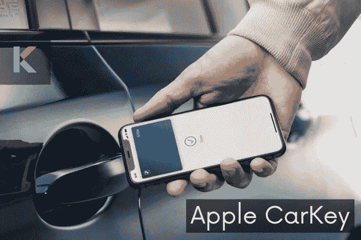
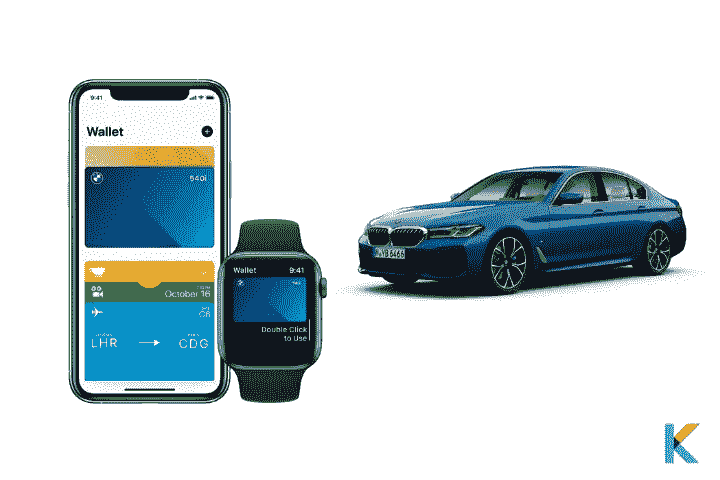
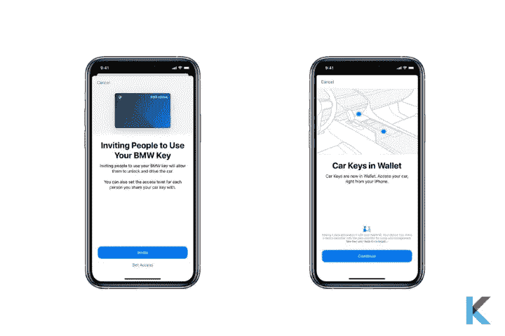
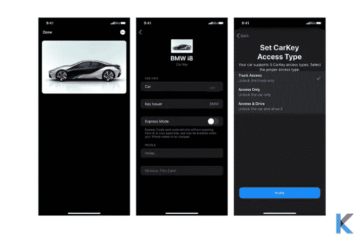
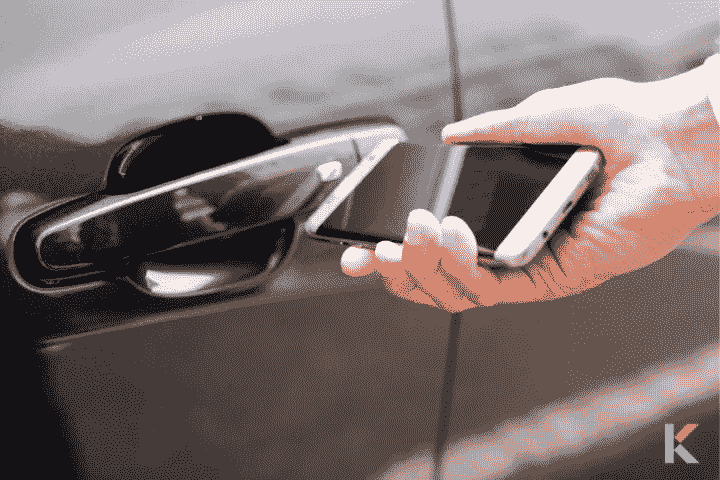

# 苹果车钥匙——智能汽车的新功能

> 原文：<https://blog.devgenius.io/apple-carkey-4df5bc96fc8a?source=collection_archive---------5----------------------->

苹果继续在交通行业进行创新，采用不同的技术，如 Car Key 和 CarPlay。他们试图消除你口袋里的所有东西。哦是的！Apple pay 是你的苹果钱包的第一个功能。

许多新车都有钥匙串，可以通过接近来解锁和启动汽车，苹果汽车钥匙也是如此。它是存储在钱包应用程序中的汽车钥匙的数字版本。如果你有一把数字钥匙，它会提供很多便利。这篇评论涵盖了苹果 CarKey 的一切。那么，我们开始吧。

苹果车钥匙

***在这篇文章中，你会学到；***

*   苹果车钥匙是什么？
*   你需要什么来支持苹果车钥匙
*   苹果车钥匙怎么加？
*   删除或撤销苹果车钥匙
*   共享苹果车钥匙呢？
*   有哪些车支持苹果车钥匙？
*   哪些设备会支持苹果车钥匙？
*   苹果车钥匙的更新功能
*   不同类型的技术
*   苹果车钥匙是怎么用的？
*   车钥匙怎么安装？
*   隐私策略
*   苹果车钥匙值不值？

# 苹果车钥匙是什么？

[苹果车钥匙](https://kodmy.com/apple-carkey/)是苹果设备上的数字车钥匙服务。简单地说，这是一个数字协议。这意味着，现在你可以使用智能手机无线解锁或锁定车门，并使用 NFC 或 iOS 15 中的超宽带启动汽车。所以，你不想要你的实体车钥匙了，它不能自动工作。此外，苹果汽车钥匙是 iOS 14 的一部分，它也将支持旧的 iOS 13。

用 iPhone / Apple watch 当车钥匙

苹果重新设计了它的产品，以配合我们对 iPhone 的日常需求。所以，他们用他们最新版本的 iPhone 和 Apple watch 取代了你的车钥匙。Apple car key 是作为 iOS 14 功能和 iOS 15 新功能中的增强功能推出的。此外，他们还进一步增强了苹果汽车钥匙的安全性。

***做个聪明人***

如果你想成为一个聪明的人，你可能有一些聪明的办法来解决你的汽车，而不是物理的。是真的。你的车钥匙把你的车变成一辆[智能车](https://kodmy.com/intelligent-cars/)。所以，当你丢了车钥匙或忘记带钥匙时，不想再打扰你了。此外，您的车钥匙现在将安全地存储在您的苹果钱包中。

***兼容 NFC***

有 NFC 兼容的车吗？然后，您可以选择使用 CarKey。您希望将 iOS 小工具放在车辆附近。太棒了！现在它可以作为你的车钥匙。支持 NFC 的苹果 iPhones 和苹果手表可用于锁定、解锁和启动兼容的支持 NFC 的汽车。

此外，Apple CarKey 看起来像你钱包应用程序中的标准卡。一旦你点击卡片，就会出现诸如型号和发行汽车制造商的信息。所以，如果你有苹果车钥匙兼容汽车，你可以在 iPhone 或 Apple watch 上轻松地将车钥匙添加到你的钱包应用程序中。

***获得苹果 CarPlay 的无缝体验***

潜水时要安全使用 iPhone 吗？然后，CarPlay 已经展示了一种智能和安全的方法，让司机在开车时使用他们的 iPhone 来获取方向、发送信息和打电话。现在你也可以用这些数字车钥匙获得[苹果 CarPlay](https://carplayhacks.com/apple-carplay/) 的无缝体验。

相反，看看[苹果汽车和现代](https://kodmy.com/apple-car-hyundai/)的故事。

# 你需要什么来支持苹果车钥匙

*   Apple CarKey 兼容汽车
*   iPhone XS 或新款机型
*   Apple Watch Series 5 或更高版本
*   一家汽车制造商提供的账户。
*   使用 Apple ID 登录 iPhone
*   在 iPhone 上设置密码

# 苹果车钥匙怎么加？

首先，您要确保您的汽车与汽车制造商提供的帐户相关联。

# 使用您的 iPhone

*   打开汽车制造商的应用程序，并按照提供的说明进行设置。
*   当应用程序将您转到钱包应用程序时，轻按“继续”
*   您可以看到将 iPhone 放在密钥读取器上的屏幕指示。
*   iPhone 和汽车配对需要几分钟时间
*   点击完成

***从邮件中添加车钥匙***

*   将您的卡添加到帐户中(由汽车制造商提供)
*   然后你可以收到一封电子邮件
*   你想点击邮件中的链接
*   当应用程序将您转到钱包应用程序时，轻按“继续”
*   您可以看到将 iPhone 放在密钥读取器上的屏幕指示。
*   iPhone 和汽车配对需要几分钟时间
*   点击完成

***使用您汽车的信息显示添加车钥匙***

*   您可以导航到汽车信息显示的关键部分
*   按照屏幕指示进行操作
*   当应用程序将您转到钱包应用程序时，轻按“继续”
*   您可以看到将 iPhone 放在密钥读取器上的屏幕指示。
*   iPhone 和汽车配对需要几分钟时间
*   点击完成

# 使用你的苹果手表

*   你现在可以给你的 Apple Watch 添加车钥匙了。
*   首先，你要将车钥匙添加到与 Apple Watch 配对的 iPhone 上的钱包应用程序中
*   打开手表应用程序(在 iPhone 上)
*   向下滚动并点击“我的手表”标签中的钱包和 Apple Pay
*   最后，点击车钥匙卡片旁边的添加

# 删除或撤销车钥匙

您可以从 Apple 设备上删除车钥匙，并撤销对您共享的车钥匙的访问。你应该按照简单的步骤来做。

***删除车钥匙***

*   首先，你要打开 iPhone 上的钱包应用程序
*   然后，点击卡片并点击更多按钮。
*   点击之后，取下车钥匙，点击“取下”进行确认

***撤销权限***

*   打开钱包应用程序，点击汽车钥匙卡
*   轻按“更多”按钮，然后轻按联系人的姓名
*   之后，撤销访问。
*   接收给共享者的通知，告诉他们车钥匙已被撤销

# 共享苹果车钥匙呢？

当然，你可以和别人分享你的钥匙。它就像苹果的 Home 键。一旦您将客户权限作为永久用户权限和临时用户权限授予他们，您就可以通过 iMessage 与任何人共享您的 Apple Car Key 邀请。但他们必须有一部兼容的 iPhone，他们需要用他们的 Apple ID 登录，并打开密码。

与他人分享您的 Apple CarKey

这对于代客泊车、与朋友、配偶共享通道、维修等等非常有用。您可以提供不同级别的访问权限，比如允许某人启动汽车，但不能解锁。并且这种访问可以是暂时的或永久的。此 Apple CarKey 只能在“信息”应用程序中与一个人共享。

您可以按照以下步骤与其他人共享您的车钥匙

*   首先，你必须打开 iPhone 上的钱包应用程序
*   点击卡片，然后点击更多按钮。
*   轻按“邀请”并设置“访问”，然后选择“限制”(您想要在共享汽车钥匙上设置的限制)
*   再次点击邀请，接下来，你可以看到一个新的信息
*   开始在信息的“收件人”栏中键入某人的姓名，然后在姓名出现时轻按其姓名。如果收件人不是您的联系人，您可以键入电话号码
*   点击发送按钮
*   一旦你的收件人在他们的 iPhone 或 Apple Watch 上点击邀请，钱包应用程序就会打开。然后告诉他们如何添加和使用车钥匙。

# 什么车支持 Apple CarKey？

你听说过苹果车钥匙兼容宝马吗？2021 款宝马 5 系在 WWDC 宣布成为首款支持 Apple CarKey 的汽车。此外，苹果和宝马之前也有合作，包括首先提供无线 CarPlay，现在首先支持苹果 CarKey。根据协议，包括 1 系、2 系、3 系、4 系、6 系、8 系、X5、X6、X7、X5M、X6M、Z4 等很多车型。NFC 版本也支持这些型号。

宝马的苹果车钥匙

是的。苹果车钥匙是一个普遍存在的东西。因此，它将在大约 45 个国家上市。宝马九型已宣布超宽带功能。但是不用担心。将来你可以看到更多。

对于这个汽车社区来说，数字车钥匙是令人兴奋的新事物。你可以期待梅塞德斯、丰田、福特等公司很快会推出这些功能。特斯拉已经通过自己的应用程序提供了这些高级功能。此外，车联网联盟(CCC)正在研究使用超宽带技术的下一代数字车钥匙。它由大众、奥迪、通用、现代、松下、LG 和三星等多家制造商组成。

# 哪些设备将支持数字车钥匙？

iPhone XR

iPhone XS

iPhone XS Max

iPhone 11

iPhone 11 Pro

iPhone 11 Pro Max

iPhone SE(第二代)

iPhone 12

iPhone 12 mini

iPhone 12 Pro

iPhone 12 Pro Max

iPhone 13

iPhone 14

iPhone 15

苹果手表系列 5

Apple Watch 系列 6

苹果手表系列 7

# Apple CarKey 的更新功能

*   苹果在 2020 年的 iOS 14 更新中推出了 Apple Car Key。(仅限于 NFC)
*   在 iOS 15 更新中，他们引入了超宽带技术(它允许这些功能通过近距离工作，直到苹果设备仍在用户的包或口袋中)
*   在新的 iOS 更新中，您还可以允许远程汽车功能，如门锁/解锁、后备箱打开、鸣笛、气候调节。
*   用户可以打开引擎，并通过新的汽车钥匙功能与其他人共享汽车访问权限
*   它可以在 iPhone XS 和更新的苹果设备上运行

# 不同类型的技术

有不同类型的技术可用于您的智能汽车。它可以把你的手机变成一个代理钥匙链。特斯拉和林肯使用蓝牙低能耗(BLE)，现代和起亚依赖近场通信(NFC)宝马的 iPhone 兼容版本配有苹果车钥匙。BLE 技术可以作为他们的电话钥匙技术的基础。以及 NFC 技术允许两个设备之间的低速通信。

# 苹果车钥匙是怎么用的？

苹果车钥匙

***解锁你的汽车***——你可以用你的苹果设备轻松解锁你的汽车。你只是想把你的 iPhone 或 Apple Watch 放在汽车的门把手或车内的 NFC 读卡器附近。Apple Car key 使用 NFC 来鉴定您的汽车和设备。一旦 NFC 读取器识别出存储在你的手机或 Apple watch 中的 Apple CarKey，它就会解锁或锁定你的汽车。

***启动你的汽车***——现在用你的苹果设备启动你的汽车很容易。首先，你要把你的 iPhone 放在汽车的钥匙阅读器里。之后，按下汽车的启动按钮来启动你的汽车。

**带 UWB 的新版苹果 CarKey**

你可以把你的 iPhone 放在包里或者口袋里。UWB 提供准确的位置信息，以便您能够解锁和启动您的汽车。汽车会知道你的手机在哪里，你可以验证它在车内。

**使用快速模式**

您可以使用快速模式快速解锁或启动汽车。当您将车钥匙添加到钱包应用程序时，默认情况下会打开该模式。它可以让你自动打开车门，快速启动汽车。

**你的 iPhone 电池快没电了**

当你的 iPhone 在电量储备模式下快要没电的时候，你仍然可以用你的 iPhone 解锁和启动你的汽车。在快速模式开启的情况下，iPhone 进入电力储备后，您可以使用车钥匙长达 5 个小时。然而，它可能并不总是能够与一个死的 iPhone 一起工作。要看 iPhone 死了多久了。

此外，CarKey 通过基于 NFC 的数字钥匙 2.0 规范工作。该规范通过 NFC 在车辆和移动设备之间建立了安全连接。此外，它由车联网联盟开发。

# 车钥匙怎么安装？

你想把苹果车钥匙安装到你的苹果钱包里吗？然后，你需要苹果车钥匙兼容车先装这个。你知道还有哪些苹果 Carplay 兼容的车会有这个功能。

如果你有苹果钱包，你可以很容易地将苹果车钥匙添加到你的钱包中。但重要的是要有汽车制造商的应用程序来继续这个安装过程。在安装过程中，您应该将您的 iPhone 放在车内的 NFC 读卡器上。初始配对过程需要几分钟才能完成。此外，配对代码由您的汽车经销商提供。有时候，你必须从汽车制造商那里下载应用程序。然后，现在是时候打开你的车门，发动你的车了。

如果你对 Carbridge 感兴趣，可以找我们的[在 iOS 14 和 iOS 15 中安装 car bridge](https://kodmy.com/install-carbridge/)文章了解更多。

# 隐私策略

苹果不知道你什么时候用车钥匙锁车或者开锁。在 iOS 13.5.1 中，苹果对车钥匙的内置隐私给出了一些见解。并且在设置过程中进行一次性兑换。必须输入它才能将汽车与钱包应用程序配对。在设置时，它会与有关用户帐户、位置和设备的信息一起发送。因为防止欺诈的目的。

设置车钥匙时，会向汽车经销商发送一个唯一的设备标识符。出于保护隐私的目的，每个经销商的信息都是唯一的。根据经销商的隐私政策，汽车制造商可以将设备标识符与它所拥有的关于你的信息联系起来。

是真的。Apple 不会保留车辆使用信息，例如您汽车的上锁或解锁信息。然而，车辆制造商可以保留这种使用细节。但是他们根据与制造商建立的用户协议来收集这些。此外，如果你丢失了你的苹果设备，你可以通过 iCloud 远程关闭你的苹果车钥匙。

# 苹果车钥匙值不值？

正如我们上面提到的，苹果想用它最新的 iPhone 取代你的车钥匙。因此，它允许用户解锁、锁定和启动汽车发动机，而不需要传统的车钥匙。此外，宝马的新系列 5 已经引入了这一 CarKey 功能，还有更多功能正在开发中。您只需下载数字钥匙应用程序，将手机与汽车配对即可。

此外，你还可以在钱包应用程序中保存你家和汽车的钥匙。当你到家门口时，你的 iPhone 会自动为你显示正确的钥匙，并允许你通过 NFC 轻轻一点就能进入。太棒了！即使在电量储备模式下 iPhone 电池电量不足，您的按键也能正常工作。

还有什么..

*   不需要物理钥匙—安全数字认证(将钥匙留在家里)
*   可以对该数字键设置限制或约束——限制最高速度、立体声音量或马力
*   通过 iMessage 共享密钥—如果您丢失了设备，可以通过 iCloud 取消密钥。

如果你对 Carplay 应用程序的流行调整感兴趣，你可以找到我们的文章[在 iOS 14/ iOS 15](https://kodmy.com/install-ngxplay/) 中安装 NGXPlay。