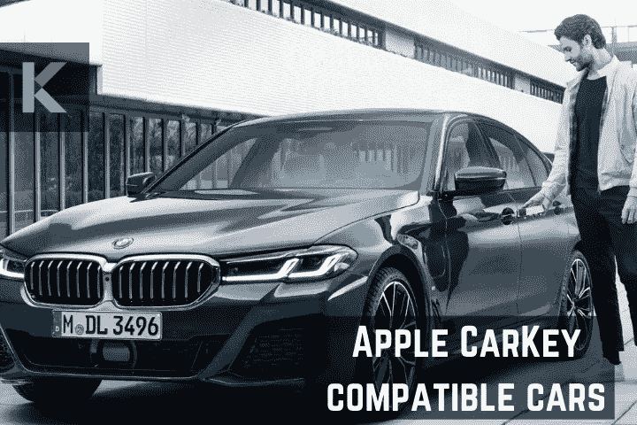
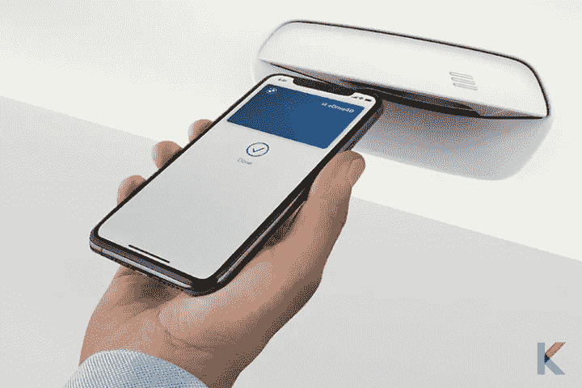
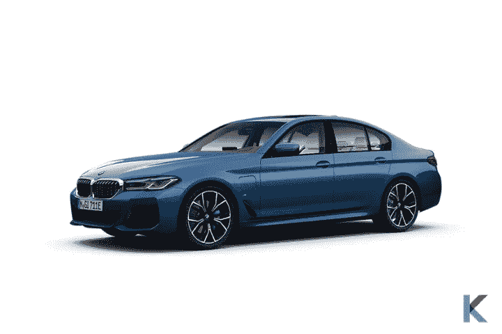
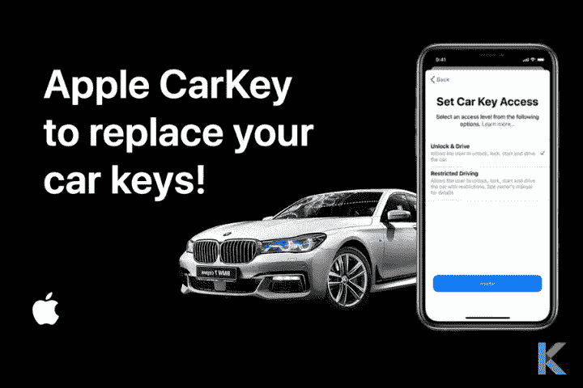
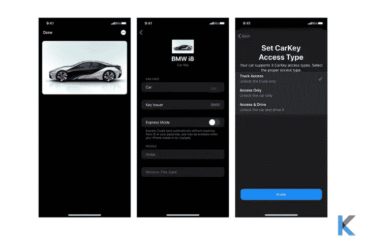

# Apple Car Key 兼容汽车[2022 年更新列表]

> 原文：<https://blog.devgenius.io/apple-carkey-compatible-cars-abc838400a94?source=collection_archive---------2----------------------->

新技术正以一种令人惊讶的方式帮助我们实现梦想。汽车制造商在其中发挥了作用。他们正试图用新技术装备他们的汽车。有时候，你讨厌口袋里有东西。对于那些能够与苹果设备和已经具备 CarPlay 等功能的汽车进行通信的车主来说，苹果 CarKey 可能是一个令人兴奋的消息。

苹果和宝马与车联网联盟(CCC)合作，确定并制定数字关键功能的全球标准。好消息是，iPhone 的宝马数字钥匙对车钥匙配方进行了一些创新。这个钥匙希望在手机和汽车之间配对，它存储在你的苹果钱包应用程序中。声音不错。然后，让我们更深入地了解苹果车钥匙兼容的汽车。

Apple CarKey 兼容汽车

***在这篇文章中，你会学到；***

*   苹果车钥匙
*   苹果车钥匙兼容的车呢？
*   老款车可以用 Apple CarKey 吗？
*   你没有苹果车钥匙吗？—智能解决方案
*   宝马数字钥匙是如何工作的？
*   我的宝马应用
*   如何设置宝马数字钥匙？
*   宝马数字钥匙有多安全？

# 苹果车钥匙

[Apple CarKey](https://kodmy.com/apple-carkey/) 允许其用户通过 NFC、Bluetooth/Bluetooth LE 等通信渠道使用个人设备作为苹果钱包等数字钱包中虚拟钥匙的存储。是的。从现在开始，你可以用 iPhone 和 Apple Watch 无线锁定、解锁和启动你的汽车。但是，并不是所有的 iPhone/ Apple Watch 设备和汽车都支持 Apple CarKey。

苹果车钥匙

然而，当考虑数字车钥匙时，有几个限制以及好处。进入汽车时，手机作为关键技术可以让你的手机放在口袋里。此外，接近式遥控钥匙允许用户在没有物理钥匙的情况下锁定、解锁和启动他们的汽车。而且，它会以一种令人惊讶的方式将你的车变成一辆[智能车](https://kodmy.com/intelligent-cars)。

***快速模式***

如果你想限制一些访问权限，你甚至可以限制最大速度或立体声音量。此外，还有一个快速模式来锁定、解锁和启动您的汽车，无需您输入密码。此外，您还可以选择禁用这种快速模式。所以，你只能用触控 ID、Face ID 或安全密码打开车门。这将使苹果汽车钥匙更加安全。

***远离传统按键***

今天，大多数汽车制造商都有自己专有的钥匙解决方案，如遥控无钥匙进入系统和被动进入系统。遥控无钥匙进入系统使用户能够按下其遥控钥匙上的按钮来访问其车辆功能。此外，另一种广泛使用的被动进入系统允许带遥控钥匙的用户在不按任何按钮的情况下进入车辆功能。

***特征***

它有更酷的功能，如通过 iMessage 与朋友分享车钥匙。并且有机会与其他多达五个用户共享车钥匙，并且可以是受限访问选项(限制最高速度、最大无线电音量)。不要担心你的死电话。在低电量关机后，你还可以带着没电的手机进入汽车长达五个小时。此外，如果您丢失了 Apple 设备，可以通过 iCloud 禁用 Apple CarKey 功能。

# 苹果 CarKey 兼容车呢？

大多数新的宝马汽车将与苹果汽车钥匙功能兼容。所以，你可以用你的 iPhone 和 Apple Watch 当车钥匙。它允许 iPhones 锁定、解锁和启动用户注册的车辆。为什么宝马的最新车型在苹果的活动中展示了 CarKey 功能。

兼容苹果 CarKey 的宝马

即使您的苹果设备(iPhone、Apple Watch)与 Apple CarKey 兼容，您的汽车也可能与它不兼容。在撰写本文时，宝马车型仅支持此功能。如果你不知道你的汽车的宝马型号，你可以使用宝马连接的应用程序找到它。

宝马不仅是第一款支持苹果 CarKey 功能的汽车，也是第一家采用无线 CarPlay 和 iPod 兼容的汽车制造商。然而，苹果公司还没有给出任何官方声明，哪些汽车制造商将与苹果公司合作开发苹果汽车钥匙兼容性。当然可以！在不久的将来，大多数汽车都将支持苹果的 CarKey 功能。

由于 CarKey 基于近场通信(NFC)技术，因此所有汽车都应与 CarKey 兼容，并具有完全相同的实施系统。此外，汽车应该有制造商为你的 iPhone 开发的应用程序。它还希望支持 CarKey 功能。现在，是时候为一些好消息祈祷了。

***这里是苹果车钥匙兼容的宝马汽车列表。***

*   宝马 1 系
*   宝马 2 系
*   宝马 3 系
*   宝马 4 系
*   宝马 5 系
*   宝马 6 系
*   宝马 8 系
*   宝马 M8
*   宝马 X5
*   宝马 X5 M
*   宝马 X6
*   宝马 X6 M
*   宝马 X7
*   宝马 Z4

许多技术爱好者认为，其他汽车制造商很快也会提供数字汽车的关键功能。为了能够充分利用 Apple CarKey 的兼容性功能，设备需要具备后台标签读取技术。这种所需的技术在最新版本的 iOS 智能手机和 iPhone XR 上都有。

Apple CarKey 的功能很有前途，苹果可能会与其他汽车制造商一起将更多创新功能内置到 iOS 中以提供支持。请注意，大多数汽车制造商的应用程序都支持苹果 CarKey，如宝马和丰田。

然而，现代汽车目前有通过 NFC 工作的数字钥匙。因此，我们可以期待在不久的将来现代汽车的苹果车钥匙功能。这样，你很快就能看到苹果车钥匙兼容丰田汽车，苹果车钥匙兼容现代汽车。

*让我们了解更多关于 Apple CarKey 兼容汽车的信息。*

**宝马 2 系**

宝马 2 系是一系列超小型行政车。该系列有许多令人惊叹的新功能，包括 230i 车型和 M240i 中提供的新发动机，230i 中的四缸涡轮发动机，M240i 的新 18 英寸车轮和轮胎套件，具有非漏气保用的米其林 Pilot Super Sport 轮胎，以及 230i 上作为标准设备的新 17 英寸车轮。

**宝马 3 系**

宝马 3 系是一个紧凑的行政车系列，将动力和创新结合在一起。它在紧凑型豪华运动轿车中保持着标准制定者的地位。这是豪华紧凑型轿车领域最容易识别的品牌。此外，它还提供 xDrive AWD 作为选项，RWD 作为标准。每个系列都配备了 12.3 英寸的全数字仪表和 10.3 英寸的信息娱乐触摸屏。都有 Android Auto，蓝牙连接，[苹果 Carplay](https://carplayhacks.com/apple-carplay/) ，内置 GPS。

**宝马 4 系**

宝马 4 系有着独特的设计，随性的双门车顶，以及吻状的前格栅。4 系列与其他德国豪华汽车竞争，如奥迪 A5 和奔驰 C 级，并提供硬顶轿跑车或软顶敞篷车。此外，它还提供涡轮增压四缸或涡轮增压直列六缸发动机，这两种发动机都可以采用后轮或全轮驱动。

**宝马 5 系**

宝马 5 系与其说是驾驶机器，不如说是豪华巡洋舰。去年，540i 进行了翻新，并配备了一套适中的混合动力系统，但这并没有改善驾驶体验中普遍存在的麻木感。5 系车的内部空间是一个标志，车厢材料通常质量上乘。尽管如此，内饰缺乏梅赛德斯-奔驰 E 级车的无缝优雅和奥迪 A6 的纯粹宁静。虽然 5 系缺乏宝马最新一代的 iDrive 信息娱乐系统，但该技术非常出色。

**宝马 M5**

这包括一个新的标准 12.3 英寸触摸屏信息娱乐显示器，宝马新的基于云的导航系统，以及重新设计的 M5 前灯和尾灯。还有一些针对 M5 的调整。内部用于改变阻尼、转向和油门响应设置的三个控件已被移除。相反，它们被转移到了信息娱乐显示屏上。有些人可能会错过触觉控制，但宝马声称新系统更直观。

**宝马 8 系**

宝马 8 系 Gran Coupe 是个尤物。具有后掠造型的豪华四门跑车现在风靡一时，宝马 8 系 Gran Coupe 也不例外。轿跑和敞篷版车型采用双门而非四门，更具特色。宝马 8 系作为 6 系的替代车型首次亮相 2019 车型年，自那以来基本保持不变。

此外，8 系还与奥迪 A7 和梅赛德斯-奔驰 CLS 级等其他高端敞篷车以及保时捷 Taycan 和特斯拉 Model S 等电动选装配置竞争，尤其是 Gran Coupe 车型。

**宝马 X7**

因为宝马 X7 太大了，在镇上驾驶和停放它可能是一个挑战。尽管如此，X7 有前后传感器，各种用于车辆 3D 视觉的摄像头，以及可以为你停车和倒车的系统。所以没有更多的借口。

X7 是出城和在蜿蜒的乡村道路上行驶的最整洁的 SUV 之一，但你会对它的空气悬架在颠簸中的舒适程度以及在高速公路上的安静程度更感兴趣。几乎没有风或道路噪音，宝马的驾驶助理专业人员增加了一个系统，可以加速，刹车，并让你在你的车道上更轻松地驾驶。

# 老款车可以用 Apple CarKey 吗？

Apple CarKey 仅适用于指定的宝马汽车。但是一些老款车使用了数字车钥匙技术。他们也许可以在未来的更新中使用 Apple CarKey。但是，苹果还没有宣布兼容的老款汽车。

# 你没有苹果车钥匙吗？—智能解决方案

有没有苹果车钥匙兼容车都没什么好担心的。我们都知道，为了享受 Apple Car Key 功能，您需要满足几个标准，例如 Apple Car Key 兼容 iPhone，以及 Apple Car Key 兼容 Car。如果没有的话，现在可以用这些智能小工具代替苹果车钥匙。

在不久的将来，你一定可以享受这个智能功能。所以，你现在可以用这些了。以下是几个智能小工具，如钥匙寻找器，钥匙持有人，加密狗，等等。

*   **VODESON 无线钥匙追踪器**

VODESON 无线钥匙探测器是最好的便携式发射器设计的钥匙探测器之一。当你快没时间的时候，它就派上用场了。此外，对于那些日程繁忙的人来说，这是一个绝妙的选择。它非常方便易用，不需要在手机上安装任何应用程序。

你是一个大忙人，鄙视浪费时间找你的钥匙，钱包，包，钱包，电视遥控器，空调遥控器，u 盘，眼镜盒，和其他物品？不要担心！这就是找钥匙人来的原因。

你可以从亚马逊花 16.99 美元买到 VODESON 无线钥匙追踪器。

*   **苹果空中标签**

在沙发上你永远不会失去任何东西。在“查找我的”应用程序中，您可以跟踪和查找您的物品以及朋友和设备。你只需要简单的一键设置就可以把它连接到你的 iPhone 或 iPad 上。而且，你可以在内置扬声器上播放声音，或者直接向 Siri 寻求帮助。

苹果的 AirTag 利用紧密的 iOS 集成和世界上庞大的 iOS 设备网络来创建蓝牙追踪器，这些追踪器的设置和操作非常简单。此外，AirTag 是一个光滑可爱的解决方案，可以追踪你丢失的 iPhone 或 iPad(如果你有的话)。

你可以[从亚马逊花 29 美元](https://amzn.to/3m5G8fP)买到苹果 AirTag。

**适用于苹果 Airtags 支架的 Eusty Air Tag 钥匙扣**

你正在寻找最好的标签钥匙链或持有人？苹果航空标签持有者有很多选择。Eusty Air Tag 钥匙扣配有保护性皮革 Airtags 盒跟踪器盖，带有 Air Tag 支架。这款 AirTag 支架兼容苹果新 Air Tag 狗项圈。此外，这款 AirTag 保护套包括一个钥匙链，您可以用它来挂在车钥匙、包、孩子的书包、狗皮带、贵重物品等物品上。轻松更改您想要跟踪的项目上的 AirTag 的位置。

你可以从亚马逊花 17.88 美元买到苹果 Airtags Holder 的 Eusty Air Tag 钥匙链。

*   **Tile Pro 强大的蓝牙追踪器**

这个最新版本的瓷砖专业是一个最广泛的范围和最响亮的警报关键发现者。Tile 2022 恢复了以前型号的所有功能，您可以使用设备上的按键查找器跟踪您的手机。此外，免费的磁贴应用程序可以在 iOS 和 Android 设备上运行。

除了 Alexa、谷歌助手和 Xfinity，Tile 还可以与 Siri 配合使用。当您的磁贴在蓝牙范围内时，您可以使用磁贴应用程序来响铃，或者让您的智能家居设备找到它。使用图块应用程序，当图块超出蓝牙范围时，您可以在地图上查看其位置。

你可以从亚马逊花 27.99 美元买到 Tile Pro 强大的蓝牙追踪器。

*   **金属数字钥匙卡座**

金属数字钥匙卡夹配有一个钥匙圈、一根皮革挂绳和 2 个高品质 TPE 保护套，分别位于卡的两侧。它有一个多场景应用程序，所以它可以利用任何徽章，门禁卡，钥匙链，或其他兼容大小的钥匙卡。它将在硅树脂、塑料和皮革产品中脱颖而出。此外，它有三种颜色。所以，所有的颜色都很适合特斯拉的车钥匙。是的。它也是作为特殊礼物的理想选择。

你可以[从亚马逊花 18.99 美元](https://amzn.to/3EZAqU2)买到金属数字钥匙卡座。

*   **Mstick MG-S01 车载信息娱乐系统 Android 车载加密狗**

你想把你的汽车显示器变成一台安卓电脑吗？那么，这是一个完美的小工具给你。此加密狗与 Android Auto 兼容。您只是想插上电源获得更好的指示，欣赏您最喜爱的音乐，接听电话，用语音控制设置日历，以及享受高清电容屏。此外，它还具有出色的功能，如带 GPS 导航的实时导航、网飞、YouTube、游戏、体育等等。此外，它还支持语音识别服务，如使用车载麦克风、触摸控制和蓝牙的谷歌助手。

你可能[以 159.99 美元](https://amzn.to/3s6YHnv)从亚马逊获得 Mstick MG-S01 车载信息娱乐 Android 车载加密狗。

# 宝马数字钥匙是如何工作的？

苹果车钥匙

如果你有一把宝马的数字钥匙，第一次用起来很方便。你只是想把你的 iPhone 放在汽车的智能手机托盘里，然后按下开始键。由于预设的快速模式，您的 iPhone 在打开车门或启动汽车之前不需要解锁。如果您想禁用此功能，您可以手动禁用此功能。禁用此功能后，您必须通过 TouchID、FaceID 或密码来验证您的身份。

如果您想与他人分享您的 BMW 数字车钥匙，首先您可以选择您授予他人的访问权限类型。当您与他人共享您的 BMW 车钥匙时，您可以修改您授予他们的访问权限，例如您可以授予他们完全访问权限或限制他们的访问权限。但是可用的限制取决于你拥有的汽车。

# 我的宝马应用

您可以使用“我的宝马”应用程序来查看您的车辆是否与您的苹果设备兼容。您可以使用兼容的 iPhone 登录该应用程序，并且有必要拥有您的宝马 ID，然后您可以将您的车辆添加到您的帐户。在车辆选项卡上，如果您看到标有“数字钥匙”的部分，则您的汽车是兼容的。一旦设置了车钥匙，即使卸载了 MY BMW 应用程序，也可以使用它。

# 如何设置宝马数字钥匙？

设置车钥匙访问类型

你需要的只是一辆兼容苹果车钥匙的宝马汽车和一个兼容的 iOS 设备来设置数字钥匙。首先，您希望将您的宝马汽车链接到一个宝马 ID。您可以使用“我的宝马”应用程序将钥匙添加到您的宝马 ID。否则，您可以创建新的 BMW ID，而不是现有的 ID。

*   创建一个宝马 ID
*   使用“我的宝马”应用程序添加您的宝马汽车
*   访问应用程序中的数字键菜单
*   为了安全起见，你必须坐在你的车里，并且随身携带两把普通的车钥匙
*   按下开始配对按钮
*   按照“我的宝马”应用程序菜单中的说明操作
*   将您的 iPhone 放入带有 NFC 传感器的智能手机托盘中
*   然后，你的车钥匙将被储存在苹果钱包应用程序中

相反，看看 iOS 14 和 15 中的[安装卡布里奇](https://kodmy.com/install-carbridge/)

# 宝马数字钥匙有多安全？

不要担心你的数字钥匙。它保存在 iPhone 的安全元素中。因为发送者和接收者必须非常接近才能通信，所以近场通信技术确保了高水平的数据安全性。

***雄霸天下***

如前所述，车钥匙功能需要 iPhone XR、iPhone XS 或更新版本，而 Apple Watch 支持仅限于最新的 Apple Watch。而且，车钥匙要求你的 iPhone 上有 iOS 13.6 或更高版本。宝马司机将能够使用他们的 iPhone 或苹果手表锁定和解锁他们的车辆，以及在 iPhone 放在智能手机托盘上时启动车辆。

您也可以让其他人通过 iMessage 访问您的帐户，并设置某些限制，如速度限制。此外，宝马联网应用程序可以在 iPhone 和 Apple Watch 的应用程序商店免费下载。让我们等待苹果的下一个高级功能和[苹果汽车](https://kodmy.com/apple-car-hyundai/)很快。