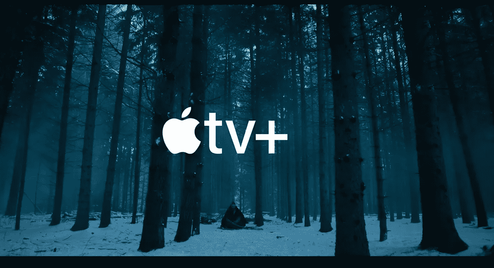
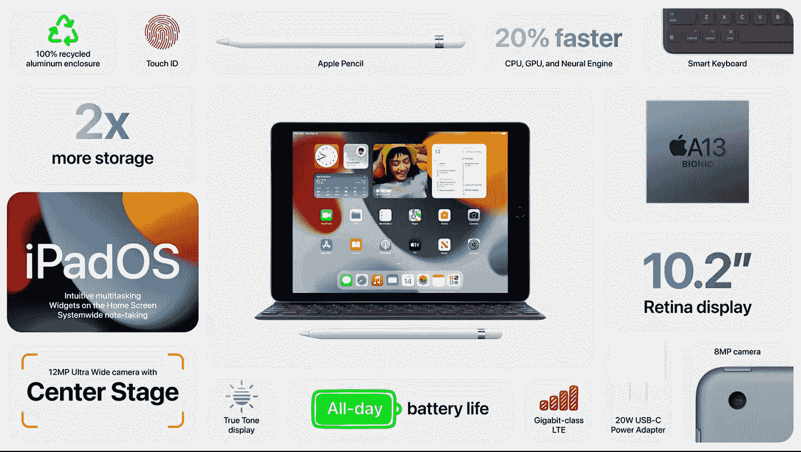
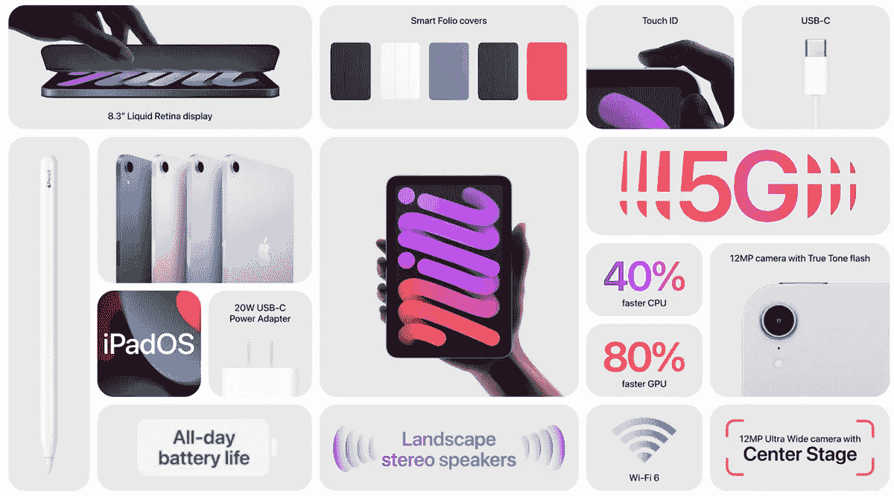
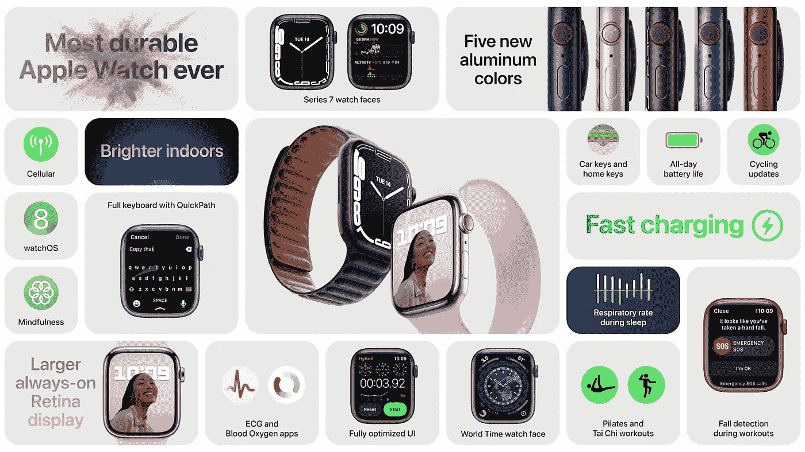
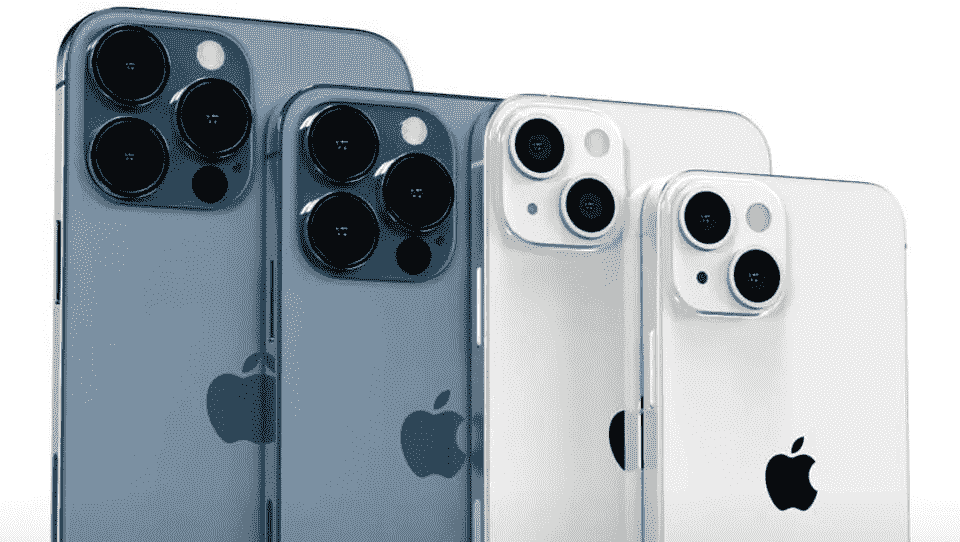
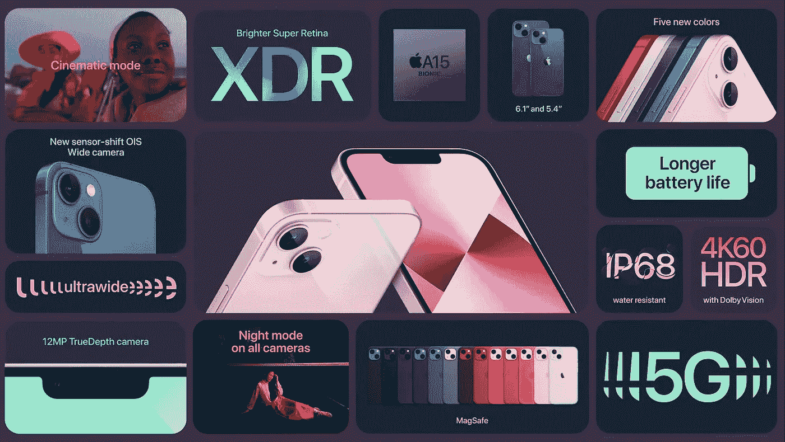
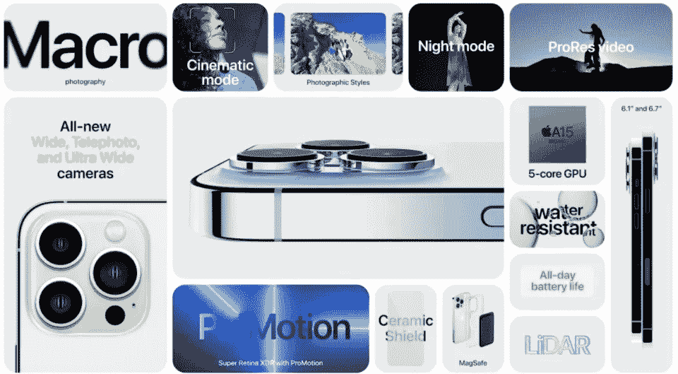

# 苹果事件 2021— iPhone 13、Watch Series 7、iPad 等等！

> 原文：<https://blog.devgenius.io/apple-event-2021-iphone-13-watch-series-7-ipad-and-more-91403019f34b?source=collection_archive---------2----------------------->

资料来源:Apple.com

苹果已经真正掌握了虚拟产品发布的艺术。
特别是今年“产品发布视频”的制作价值非常高。他们会让我们从尼斯变成世界。

> 令人惊叹的是那些营销视频

我们都知道史蒂夫·乔布斯是最会讲故事的人之一。他是打造史诗级用户体验的大师。他也是正确推出/销售它们的专家。

随着今天早些时候刚刚结束的苹果活动，苹果再次证明了为什么他们最擅长讲故事和营销——这要感谢史蒂夫·乔布斯。

一如既往，苹果以其独特的风格开始了这次活动。但是，这一次，这是一首“加州灵魂”的歌曲。

来源:苹果

视频在加州的沙漠中开始，伴随着活泼的小提琴音乐。然后，它带我们去看不同的风景，人们在公园里演奏欢快的摇滚乐，而一个人在城市的中心弹钢琴。这个视频是一首关于加州地标的感觉很好的歌。太令人兴奋了。

大多数公告都是按照每个人的猜测——苹果产品系列的后续升级。然而，iPad mini 抢尽了风头。

以下是本次活动宣布的所有内容:

# 首先—苹果电视+ |新季、新节目、新电影

来源:苹果事件

该视频首先播放了今年秋天即将上映的剧集的预告片，包括*早间秀——第二季*、*见*——第二季，以及其他一些看起来有希望和令人兴奋的剧集。

老实说，苹果为其 Apple TV Plus 节目吸引了许多大牌明星。

# 下一个——iPad |任何人都猜不到的东西

## **iPad —第九代**:

iPad 第八代于 2020 年 9 月公布。没有多少人猜到会有 iPad 的发布。以下是主要特性:

> 蒂姆·库克说，iPad“可以变成你想要的任何东西”。

比畅销的 Chromebook 快 3 倍，比畅销的 Android 平板快 6 倍。

**上升—**

1.  运行 A13 仿生芯片，比上一代产品快 20%。
2.  前置摄像头从 800 万像素升级到 1200 万像素超宽镜头。
3.  中央舞台—自动重新构建正面视频，使用户在房间内走动时面部保持居中。
4.  自动翻译。

**不利方面—**

1.  还在用闪电线。
2.  仍然有一个 Home 键和厚厚的边框。
3.  它仍然只支持苹果第一代铅笔。

## **iPad mini:** 获得梦幻般的升级。更新的设计

来源:苹果事件

**上行—**

1.  经过重新设计，边框更细，边缘更圆。8.3 英寸的屏幕。
2.  电源按钮上的触控 ID 传感器——在我看来，选择触控 ID 而不是 Face ID 是正确的选择。
3.  500 尼特亮度，真色调，宽色彩。
4.  USB-C 端口。
5.  支持苹果中央舞台技术的 12MP 超宽前置摄像头。
6.  它支持第二代 Apple Pencil，可以磁性连接到桌子的侧面。

**不利方面—**

1.  没有 Face ID。
2.  如果你问我，这是一个令人困惑的细分市场，它既不是手机也不是平板电脑。
3.  没有提到键盘盖。

# **下一个——Apple Watch Series 7 |不是传闻中的平面屏幕设计，而是更大的屏幕**

来源:苹果事件

苹果公司的首席运营官杰夫·威廉姆斯通过介绍几个即将在 **WatchOS 8** 推出的新功能开始了手表市场

1.  骑车人跌倒检测。
2.  检测燃烧卡路里的改进算法。

> 新款 watchOS 的按键更大——谢谢你，苹果。

**上行—**

1.  通过缩小屏幕边框，这款显示器比上一代产品大了 20%。
2.  用户界面上更大的按钮，利用更大的屏幕。
3.  Apple Watch 的键盘也是滑动式预测键盘。
4.  抗裂和 IP6X 防尘认证。
5.  充电速度提高 33%—八分钟的充电时间足以进行八小时的睡眠跟踪。

**不利方面—**

1.  看起来很像之前的设计。
2.  同样的 18 小时续航。

## **苹果健身+**

1.  健身加来到 15 个新的国家。
2.  支持普拉提、滑雪、冥想和单板滑雪等新运动。
3.  集体锻炼。

# 接下来——iPhone 13 |更快的芯片，更好的摄像头，更长的电池寿命

我们将获得四款新手机——iPhone 13、iPhone 13 mini、iPhone 13 Pro 和 iPhone 13 Pro Max。

来源:苹果

## 重大升级包括:iPhone 13 和 iPhone 13 mini —

来源:苹果

1.  缺口小了 20%。
2.  苹果新的 A15 仿生芯片。
3.  苹果声称，这是一种“陶瓷防护屏”，比任何其他智能手机的玻璃都要坚硬。
4.  亮了 28%。
5.  获得传感器偏移稳定性。
6.  基本型号从 128 GB 的存储空间开始。

我们需要详细讨论一个关键功能:摄像头，尤其是视频的“电影”模式功能。

> 这是具有选择性聚焦的视频的纵向模式。真的很酷。

焦点转换会自动发生。它预测主体何时进入画面或从相机移开视线。所有这一切都是实时的，而且是“智能地聚焦”

> 我很好奇苹果是如何做出这些焦点选择的！

为了更好地理解它，观看苹果在活动中播放的精彩视频是唯一的解决方案。

## **现在，iPhone 13 Pro 和 Pro Max —**

来源:苹果

**上行—**

1.  三个后置摄像头都是新的。
2.  全新前脸，凹口缩小 20%。
3.  最大的升级是屏幕:他们支持苹果的推广自适应刷新率技术，最高可达 120 赫兹。

> 苹果推广的自适应刷新率技术最高可达 120 赫兹——这是为了超级流畅的移动/滚动——游戏玩家将会得到它

1.  支持电影模式。
2.  现在提供 1TB 存储选项。

**不利方面—**

1.  iPhone 13 阵容仍然使用闪电端口——希望苹果将其升级到 UBS-C。
2.  设计没有重大变化。

# **另外，注意:**

苹果手机和平板电脑的后续主要软件更新——iOS 15、iPadOS 15 和 watch OS 8——将于 9 月 20 日推出。

> 如果要我挑选一个让我印象深刻的公告，那就是 iPad mini。

那都是我这边的。你从今年的活动中挑选了什么？