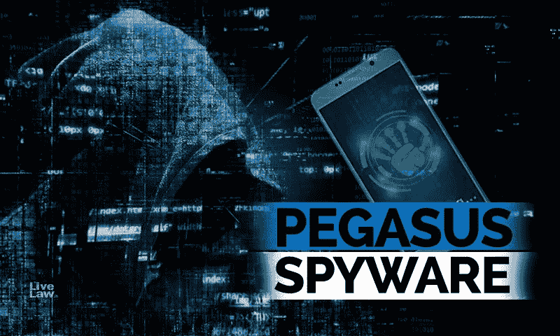

# 苹果已经对 NSO 集团提起诉讼，指控其使用 Pegasus 间谍软件感染 iPhones。

> 原文：<https://blog.devgenius.io/apple-has-filed-a-lawsuit-against-nso-group-for-using-pegasus-spyware-to-infect-iphones-26d53c463bea?source=collection_archive---------3----------------------->

从 livelaw.in 中检索

苹果现在加入了 WhatsApp 及其母公司 Meta T1(之前被称为脸书)起诉 NSO 集团 T3(Pegasus 恶意软件的开发者)的行列。苹果声称，它“正在寻求一项法律裁决，以阻止 NSO 集团访问任何苹果软件、服务或设备”，同时提供了关于 NSO 集团如何通过一个零点击漏洞(研究人员后来称之为 ForcedEntry)瞄准选定 iPhones 的新信息。

软件工程高级副总裁 Craig Federighi 在一份声明中说:“像 NSO 集团这样的国家支持的实体在先进的监控技术上花费了数百万美元，却没有承担足够的责任。”。这种情况必须改变……苹果产品是市场上最安全的消费电子产品，但制造国家支持的间谍软件的私营企业变得更具破坏性。“在与 NSO 集团的法律战中，苹果和 WhatsApp 并不孤单；去年，[微软和谷歌加入苹果和 WhatsApp 支持脸书的投诉](https://www.theverge.com/2020/12/22/22194930/microsoft-google-cisco-vmware-internet-association-amicus-brief-nso-group-spyware-whatsapp-facebook)。

根据苹果的新闻稿，Pegasus 间谍软件是为了让当局远程控制手机的麦克风，摄像头和 iphone 和 Androids 上的其他信息而创建的。根据一个名为 [Pegasus 项目的新闻联盟的声明和苹果今年早些时候发表的投诉](https://www.theverge.com/22589942/nso-group-pegasus-project-amnesty-investigation-journalists-activists-targeted)，它也意味着渗透到手机中，不需要用户的任何互动，也不会留下任何痕迹。

苹果的诉状解释了攻击的工作原理:NSO 在识别出他们使用的 iPhone 是欺诈性构建的后，会通过 iMessage 向目标传输数据，以使用其创建的苹果 id 关闭 iPhone 的日志记录。这将允许 NSO 安装飞马间谍软件隐形，并控制手机上获得的数据。据苹果公司称，NSO 利用的漏洞在 iOS 14.8 中得到修复。NSO 在传输文件时利用了 iMessage 处理 gif 和 pdf 的方式中的一个缺陷。

NSO 最近被列入美国实体名单，限制了美国公司向 NSO 出售或贡献技术的方式。根据《麻省理工技术评论》的一篇文章，禁令对 NSO 集团的员工士气和经营能力产生了严重的负面影响。根据该报告，该公司必须获得美国政府的批准才能购买 Windows 电脑和 iPhones 等产品，而政府已表示其默认做法是拒绝此类请求。

如果你喜欢这篇文章，并想支持我写更多这样的文章，考虑注册成为一个媒体成员。只需 5 美元，你就可以无限制地阅读媒体上的故事。

 [## 通过我的推荐链接加入 Medium—David Artykov

### 作为一个媒体会员，你的会员费的一部分会给你阅读的作家，你可以完全接触到每一个故事…

david-artykov.medium.com](https://david-artykov.medium.com/membership)