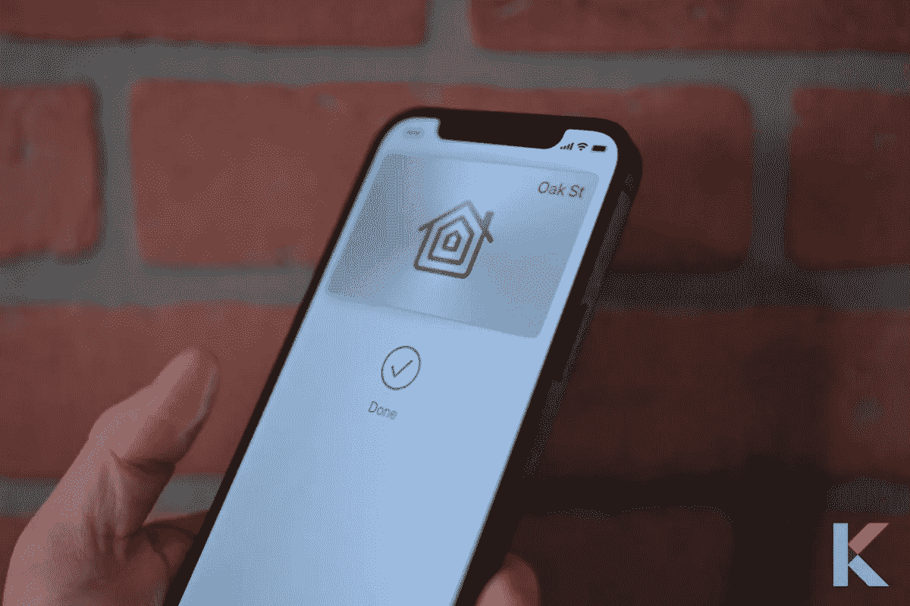
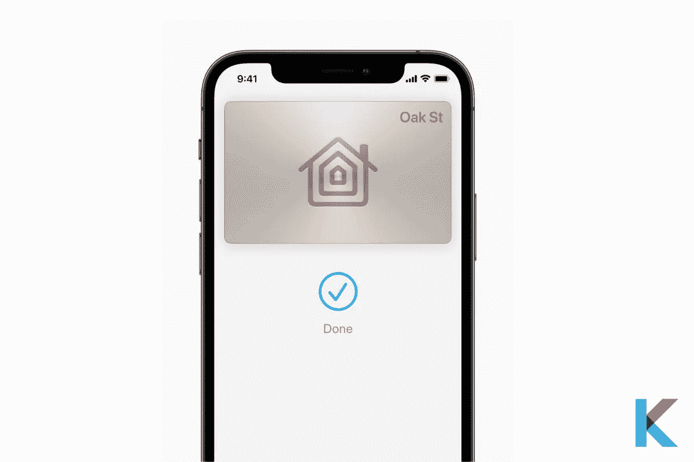
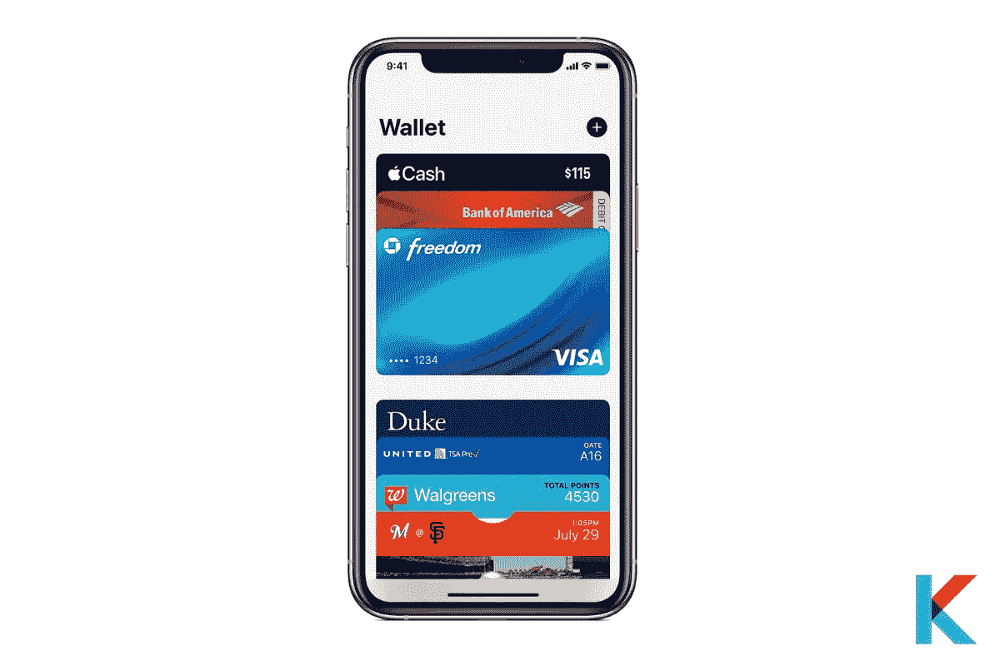
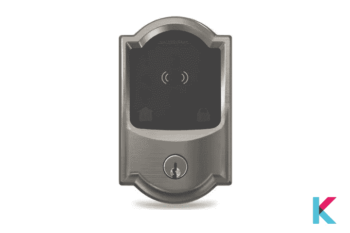
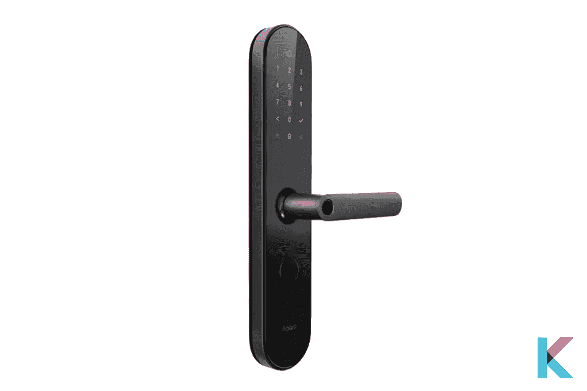
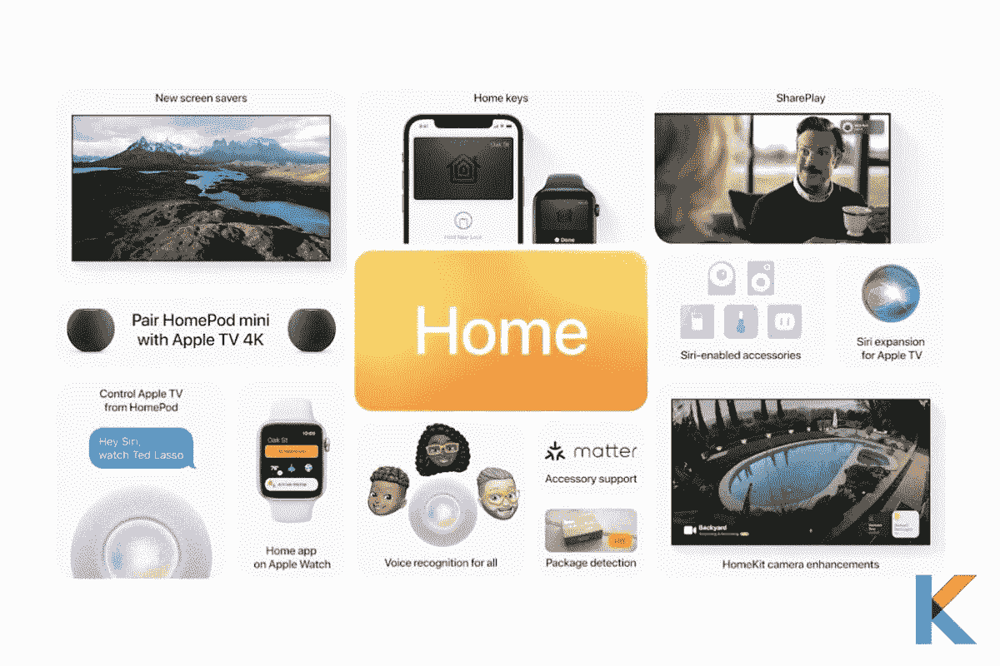

# 苹果 Home 键 iOS 15 智能家居的新功能

> 原文：<https://blog.devgenius.io/apple-home-key-new-feature-of-ios-15-to-your-smart-home-8ecd10d5b687?source=collection_archive---------7----------------------->

当我们谈论家庭时，苹果为家庭设计的产品代表了三个关键属性。它们从易于使用开始。他们高度相信你家里的技术应该为你工作，而不是相反。此外，他们设计的产品可以更好地协同工作。以便您的 iPhone、Apple TV、iPod 和其他 Apple 设备可以相互利用，提供流畅的体验。他们建造的一切都是隐私和安全的。这对我们所有人都很重要。

苹果 Home 键

在此基础上，他们于今年 6 月 7 日发布了一系列出色的功能。他们在 2021 年的 iOS 15 iPhone 软件更新中引入了几个奇妙的功能。是的。新的苹果 Home 键来到苹果钱包。

***本文中:***

*   苹果 Home 键是什么？
*   什么是苹果钱包？
*   Apple HomeKit 兼容锁
*   Apple Home 键是如何工作的？
*   如何给钱包加通行证？
*   iOS 15 中还有哪些新的 iPhone 功能？
*   哪些 iPhones 会获得 iOS 15？
*   钱包里的苹果 Home 键有多安全？

# 苹果 Home 键是什么？

[苹果 Home 键](https://original.newsbreak.com/@ishara-fernando-1590158/2404657515220-apple-home-key-new-feature-of-ios-15-to-your-smart-home?s=influencer)是 iOS 15 的新功能之一。有了这项新功能，房主只需用 iPhone 或 Apple watch 轻轻一按，就能打开前门。这是一个非常容易和安全的进入他们家的方法。

苹果 Home 键

你可以在苹果手表上控制你的智能家居设备。首先你要[把 HomeKit 和一个智能锁](https://kodmy.com/smart-lock-for-smart-life/)集成在一起，然后你只需要轻点你的 iPhone 和 Apple Watch 就可以打开你的门。它不仅方便，而且非常酷，还能让你的智能家居控制器具有额外的移动性。

# 苹果钱包是什么？

苹果钱包是 Apple Watch 和 iPhone 上的一款应用。它可以方便地将您的借记卡和信用卡、学生证、车钥匙等全部放在一个地方。通过苹果钱包应用程序，他们开始取代你的实体钱包。

苹果钱包

他们增加了支付卡，使支付更加安全可靠。然后，他们在 iPhone 上增加了快速模式的交通卡。最近，他们给钱包添加了新的钥匙，即苹果 Home 键。还有，他们从车钥匙开始。在超宽带支持下，它正在不断改进。

此外，它还向前迈出了一步，有可能为苹果钱包添加一把开门钥匙。虽然智能锁的这一功能并没有提到 UI 芯片，但数字车钥匙的相同更新将利用 UI 芯片。此外，一些制造商已经签署了这一倡议，如 Aqura 和西勒奇。

# Apple HomeKit 兼容锁

有几种智能家居锁与苹果 home 键兼容。以下是与您的 HomeKit 兼容的几款[智能锁。](https://kodmy.com/apple-home-key/)

**西勒奇智能锁**

西勒奇发布首款兼容苹果 Home 键的智能锁

西勒奇是一种著名的智能锁，有多种风格和饰面可供选择。好消息是，西勒奇宣布推出首款兼容苹果 Home 键的智能锁。是的。西勒奇 Encode Plus 是第一款苹果 home 键智能锁。

*   品牌:西勒奇
*   锁类型:死栓
*   连接选项:Apple HomeKit、蓝牙和 Wi-Fi
*   支持的语音识别设备:Siri 和 [Alexa](https://kodmy.com/the-best-alexa-compatible-devices-in-2021/#alexa)

**Aqura N100**

Aqara N100 智能锁

Aqura N100 是 Aqura S2 智能锁的新版本。它有能力从应用程序解锁，一次性密码，并暂时。

*   品牌:Aqura
*   连接选项:Apple HomeKit、蓝牙和 Wi-Fi
*   支持的语音识别设备:Siri 和 Alexa

# Apple Home 键是如何工作的？

在苹果钱包中使用不同的通行证是非常容易的。一些过程可以根据时间和位置自动出现。你可以用你的 Apple Watch 或者 iPhone 作为门钥匙。这款钱包现在支持遥控无钥匙进入控制。

# 如何给钱包加通行证？

您可以使用多种方法在 iPhone 或 iPod touch 和 Apple Watch 上添加通行证。

**在 iPod touch 或 iPhone 上**

*   首先，你可以使用支持钱包的应用
*   您可以在钱包中向下滚动。然后编辑凭证并轻按“查找钱包应用程序”。
*   扫描二维码或条形码
*   在 Wallet 中向下滚动时，您可以轻按“编辑凭证”。然后点击扫码，用你的 iPhone 摄像头扫描。
*   如果你用 Apple pay 支付给支持的商家，你会收到通知。然后点击钱包通知。
*   使用信息或邮件，并通过您的网络浏览器。
*   您可以通过隔空投送共享并使用您的 Mac。
*   对于车钥匙，可以使用汽车厂商提供的 app。然后从电子邮件中添加钥匙，并使用汽车的信息显示。

**在苹果手表上**

*   您可以按照通行证发放者发送的电子邮件中的说明进行操作。
*   通行证发放处有 app，那就打开 app。
*   您可以从通行证发放者处获得通知，然后点击添加。

# iOS 15 中还有哪些新的 iPhone 功能？

iOS 15 的新功能

**FaceTime 增强** —苹果在 FaceTime 中加入了空间音频。它将使每个参与者的音频贡献看起来来自屏幕上的适当位置。它还可以消除不必要的背景噪音。在肖像模式下，FaceTime 将智能地模糊扬声器的背景。

**苹果地图功能** —增强现实步行方向是苹果地图的一项新功能，灵感来自谷歌地图。他们在苹果地图上添加了新功能，比如互动地球仪和详细的城市体验。

**新的相机技巧** -他们给相机增加了新的功能，如实时文本和视觉查找，以及放大快速拍摄的视频。

**更好、更快的 Sri**——他们提高了设备上的处理速度和隐私。此外，他们还增加了设备上 Siri 个性化、Siri 离线支持和设备上听写等新功能。

更戏剧性的天气 -他们通过计算机生成的图形展示当前的气象条件。

**空间音频升级** -随着空间音频升级，你有能力获得动态头部跟踪组件。

# 哪些 iPhones 会获得 iOS 15？

您可以将 iOS 15 软件更新安装到多台设备上。这里是所有的设备。

o iPhone 6s

o iPhone 6s Plus

o iPhone SE (2016)

o iPhone 7

o iPhone 7 Plus

o iPhone 8

o iPhone 8 Plus

o iPhone X

o iPhone XS

o iPhone XS Max

o iPhone XR

o iPhone 11

o iPhone 11 Pro

o iPhone 11 Pro Max

o iPhone SE (2020 年)

o iPhone 12 mini

o iPhone 12

o iPhone 12 Pro

o iPhone 12 Pro Max

o 所有 iPhone 13 型号

o iPod touch

# 钱包里的苹果 Home 键有多安全？

您的钥匙和卡与您的 Apple ID 安全关联。它可以帮助您管理和添加设备上的卡、通行证和钥匙。此外，他们还使用 iCloud 增加了额外的安全性。当它通过互联网发送时，它会对你的钱包数据进行加密。当它在苹果服务器上时，以加密格式储存它。