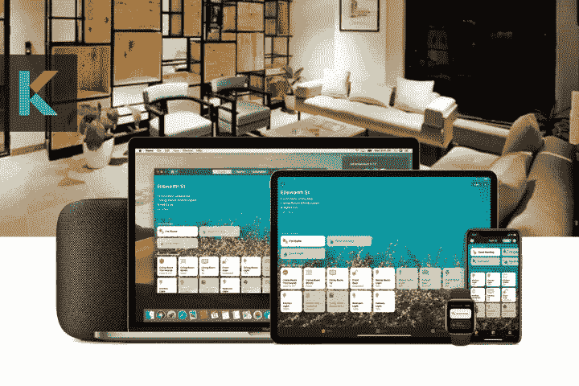
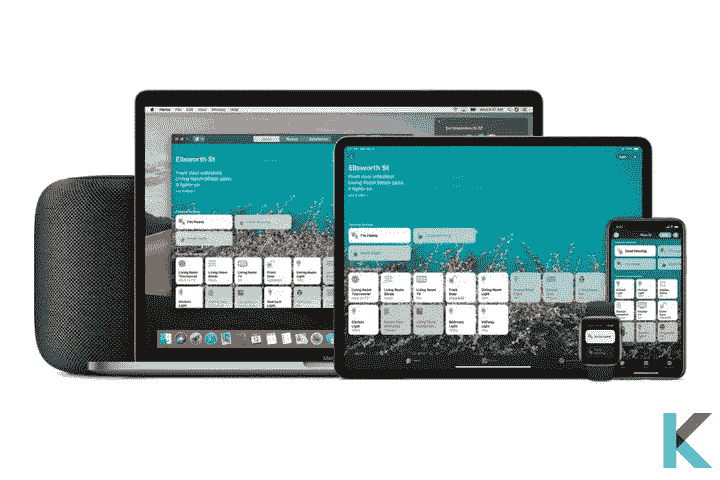
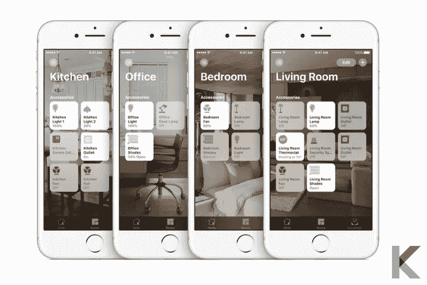
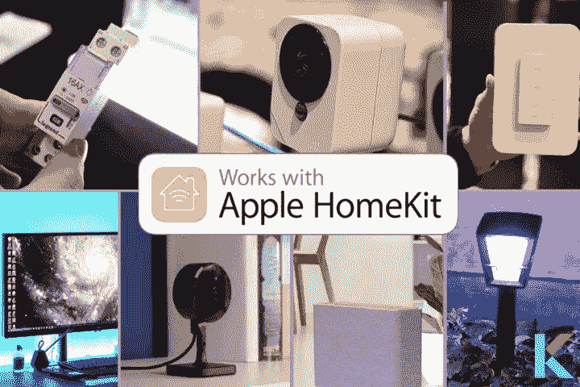
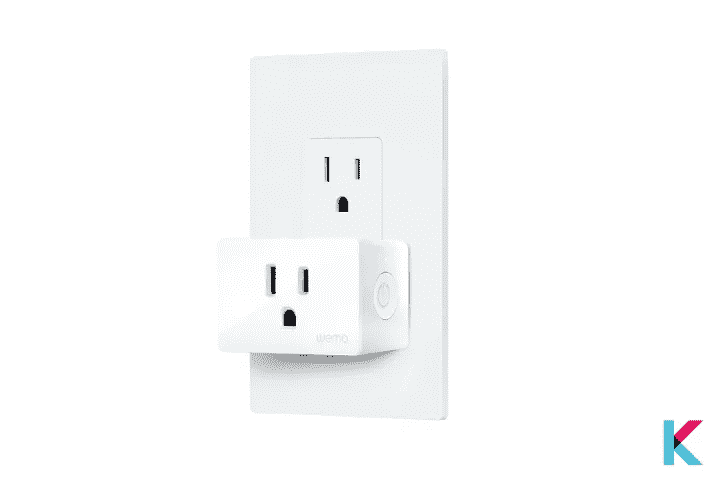
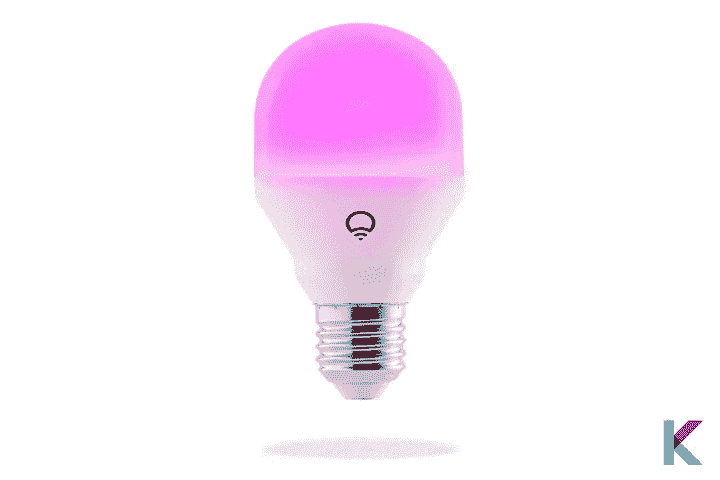
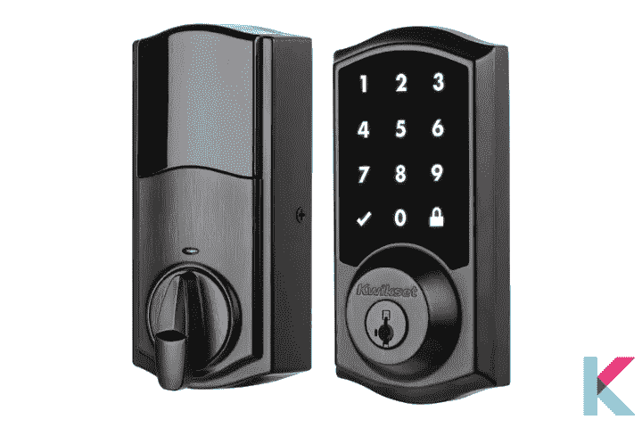
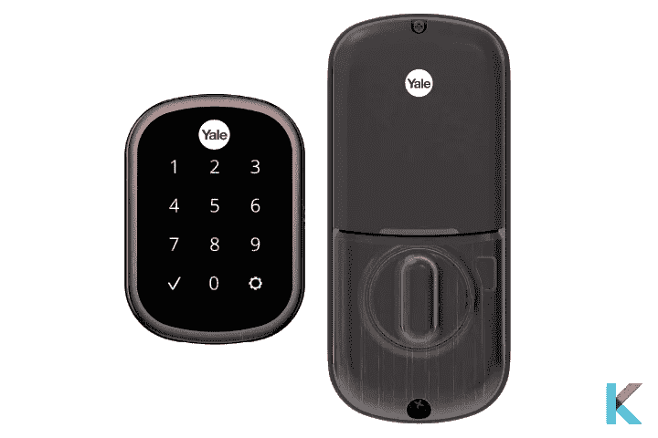
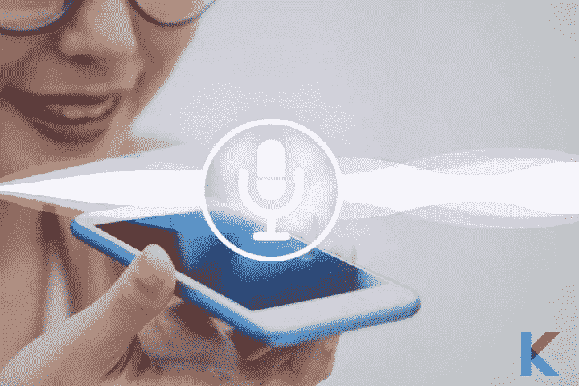

# apple home kit——控制智能家居所需的一切

> 原文：<https://blog.devgenius.io/apple-homekit-8a1a83c30601?source=collection_archive---------3----------------------->

当你想从联网家庭开始时，知道最适合你家的智能家居系统总是很方便的。有大量的设备被设计成与苹果 HomeKit 配对。在早期，HomeKit 设备很少，但苹果已经在每个类别中推出了许多设备。因此，支持 Apple HomeKit 的设备迅速增加。是真的。HomeKit 提供控制智能家居所需的一切。让我们更深入地了解苹果 HomeKit。

# 在这篇文章中，你会学到；

*   什么是苹果 HomeKit？
*   用苹果 HomeKit 可以做什么？
*   什么是首页 App？
*   有哪些最好的 HomeKit 支持设备？
*   苹果 HomeKit 需要 hub 吗？
*   最佳 Siri HomeKit 命令
*   如何设置遥控器？

# 什么是苹果 HomeKit？

苹果 HomeKit

[苹果 HomeKit](https://kodmy.com/homekit/) 是最好的智能家居系统之一。您可以控制所有智能家居设备，如灯、智能恒温器、锁等。你只需要在智能手机上发出简单的命令或简单的点击，就可以自动打开前门，打开/关闭灯，以及设置温度。它也是一个控制你的智能家居的平台。

我们都知道 Homekit 与亚马逊 Alexa 和谷歌助手等许多设备不兼容，但他们每天都在集成许多第三方设备。我确定。如果你想开始用苹果设置你的智能家居，你可以很容易地从 HomeKit 开始。

对于苹果 HomeKit 用户来说，有一个好消息。现在，他们可以通过新的 iOS 15 软件更新来使用 iOS 15、Homepod 15、tvOS 15 和 watchOS 8。他们还可以使用苹果 Home 键、空间音频、共享播放、AirPods 功能等新功能。太棒了！你可以使用带有[苹果 Home 键](https://kodmy.com/apple-home-key/)功能的 iPhone 或 Apple Watch 打开前门。

# 用苹果 HomeKit 可以做什么？

更重要的是知道你可以用这个神奇的平台做什么。它可以让你调整智能恒温器，锁定和解锁前门，查看谁在你家门口，打开和关闭和调暗智能灯，使用智能插头打开和关闭连接到插座的设备，等等。是的。如果您是智能家居的新手，它可以帮助您非常轻松地设置智能家居。是苹果的目标之一。

还有很多其他的家庭自动化系统，比如 [KNX 智能家居](https://kodmy.com/knx-smart-home/)、 [wink solution](https://kodmy.com/wink-smart-home-solution/) 等等。

# 什么是首页 App？

主页应用程序

如果您想要非常轻松安全地控制您的智能家居设备，您可以在 iOS 设备上使用 Apple Home 应用程序。有时你可能会看到一些家用配件标着“与 Apple HomeKit 配合使用”。如果你更喜欢苹果，你可以为你的家庭选择这些苹果 HomeKit 兼容设备。使用 iPhone 上的 Home 应用程序，您可以通过 Siri 语音助手控制您的家庭，同时管理不同的设备，并按房间等整理您的设备。是的。它可以作为智能设备的通用遥控器。因此，你可以在任何你想使用 Apple TV、Home pod 或 iPad 的地方使用 [Home App](https://www.apple.com/ios/home/) 。然后，Homekit 现在就在你的 iPhone 上了。

有时你可能想知道如何在 Apple TV 上获得 HomeKit。很简单。您想在 Apple TV 上第一次进入设置并选择帐户。然后，使用 Apple ID 登录 iCloud。现在，您将登录到您的 iOS 设备。最后，从那时起，Apple TV 将作为您的家庭中枢进行连接。

# 有哪些最好的 HomeKit 支持设备？

许多领先品牌都提供与苹果 HomeKit 兼容的设备。横跨空调、[空气净化器、](https://kodmy.com/best-smart-air-purifiers/)、[智能摄像头、](https://kodmy.com/best-home-security-cameras/)、[门铃、](https://kodmy.com/ring-video-doorbell-3-plus/)、[灯、](https://kodmy.com/the-best-smart-lighting-2021/)、[门锁、](https://kodmy.com/smart-lock-for-smart-life/)、插座、[智能 Wi-Fi 路由器、](https://kodmy.com/best-smart-wi-fi-routers/)、音箱、[开关、](https://kodmy.com/smart-light-switch-dimmer/)、恒温器等所有智能家居品类。以下是几款兼容苹果 HomeKit 的设备。

*   **生态蜜蜂(第五代)**

生态蜜蜂第五代

如果你想控制家里的温度，Ecobee 第 5 代是 HomeKit 用户最好的苹果 Homekit 恒温器。它还可以与 Spotify 配合使用，因此可以提供背景声音。当它与您的 HomeKit 集成时，您可以使用智能手机从任何地方控制它。此外，它还改进了远程传感器和一个更好的扬声器。如果您在家，它会检测温度，并使用传感器相应地调节温度。

快一点！ [***现在从亚马逊拿到 eco bee 5 代***](https://amzn.to/3uqtRFB) 。

*   **Wemo WiFi 智能插头**

Wemo WiFi 智能插头

Wemo WiFi 智能插头是一款比较吸引人的智能插头，兼容苹果 HomeKit。如果你有一个哑电器，你可以使用 Wemo 智能插头使其智能化。这是一种更经济实惠的智能插头，具有更小的尺寸。

快一点！ [***现在从亚马逊获得 Wemo WiFi 智能插头***](https://amzn.to/3ulk3Nb) 。

*   **Lifx 迷你智能灯泡**

Lifx 迷你智能灯泡

Lifx Mini 智能灯泡是最佳 Google Home 设备、最佳 Alexa 兼容设备和最佳 Apple HomeKit 兼容智能灯泡之一。这是一个明显更小更轻的鸡蛋大小的智能灯泡。他们可以直接连接到网络，而不需要智能家居集线器，因为它支持 Wi-Fi。您可以使用 Lifx 应用程序轻松控制和创建时间表。我认为这对聪明的房主来说是个不错的选择。

快一点！ [***现在就从亚马逊获取 Lifx 迷你智能灯泡。***](https://www.amazon.com/gp/product/B073168GYG/ref=as_li_tl?ie=UTF8&camp=1789&creative=9325&creativeASIN=B073168GYG&linkCode=as2&tag=kodmy-20&linkId=5e8869877ec15d011d160b732b71cd17)

*   **苹果 HomePod 迷你**

苹果 HomePod 迷你

苹果 HomePod 迷你是苹果公司最可爱的智能扬声器，具有吸引力的设计。由于出色的音频和巨大的散热器。它是充当 HomeKit 中枢的最佳 HomeKit 设备之一。它可以与 Apple TV 4K 连接，并进行立体声配对。它与你的 iPhone 和苹果生态系统中的其他产品相集成。它有一个离开模式。当你不在家时，它可以打开灯，让你看起来像在家一样。

快一点！你可以从沃尔玛花 108.97 美元[买到苹果 HomePod 迷你(灰色)](https://www.walmart.com/ip/Apple-HomePod-mini-MY5G2LL-A-Space-Gray/363773225?irgwc=1&sourceid=imp_UK6XGHX-zxyLUxKR-pw1BWvlUkG1M-zfKRYJ0A0&veh=aff&wmlspartner=imp_3127890&clickid=UK6XGHX-zxyLUxKR-pw1BWvlUkG1M-zfKRYJ0A0&sharedid=&affiliates_ad_id=568833&campaign_id=9383)和从沃尔玛花 99.00 美元买到苹果 HomePod 迷你(白色)。

*   **Lutron Caseta 调光开关启动套件**

Lutron Caseta 调光开关启动套件

Lutron Caseta 调光开关入门套件是 HomeKit 用户的最佳调光开关。它适用于任何桌子或台灯。因此，您可以使用这个调光开关将这些哑设备转换成智能设备。它不仅可以用来开关，还可以在你需要的时候调暗灯泡。这个套件包括一个遥控器，你可以用 Siri 来控制它。然而，它比另一种调光器更贵。但它值得投资，因为它需要非常有限的投入。

快一点！ [***从亚马逊***](https://amzn.to/3kSLUkw) 获得 Lutron Caseta 调光开关入门套件。

*   **快速溢价**

Kwikset Premis 锁

当你处于 iOS/Apple 生态系统中时，Kwikset Premis lock 是一款令人难以置信的设备。智能钥匙功能和可定制的代码是共享您的家庭访问权限的绝佳方式。如果你是新一代苹果电视或 HomePod 的用户，它毫无疑问可以正常工作。您可以使用带有错误代码和锁定模式的警报来防止入侵者。使用 Premis 应用程序，您可以检查他们的门的锁状态。苹果的端到端加密有助于保护您的电子通信。

*   **耶鲁保证锁**

耶鲁 Assure SL 智能锁

Yale Assure SL 智能锁是苹果 HomeKit 智能锁，设计小巧简洁。它可以通过其所有无线电产品与您的任何智能家居集线器和安全系统连接。如果你有一台用于 HomeKit 版本或安全系统或智能家居中枢的 Apple TV，当你不在家时，你可以集成、监控和控制你的智能锁。

正如我们上面提到的，市面上有很多苹果 HomeKit 门铃，苹果 HomeKit 摄像头，苹果 HomeKit 集线器，苹果 Homekit 门锁，苹果 HomeKit 恒温器。如果你对[苹果 HomeKey 兼容门锁](https://kodmy.com/apple-home-key-compatible-locks/)感兴趣，可以在这里找到。

快一点！ [***从亚马逊***](https://amzn.to/3zXNoP6) 获得耶鲁 Assure SL 智能锁。

# 苹果 HomeKit 需要 hub 吗？

当你在家时，Apple Home app 只是你控制 Wi-Fi 或蓝牙 HomeKit 兼容设备的一件事情。您可以使用家庭应用程序打开或关闭智能设备。你知道你只想在应用程序上简单地触摸什么。但是，当你不在家时，为了增加功能，你需要一台运行 iOS 10 或更高版本的 Homepod 或 iPad，以及一台运行 tvOS 9 或更高版本的第三代或第四代 Apple TV。

一些设备通过 Wi-Fi 网络连接到集线器。但是，有些需要蓝牙连接。如果您想要控制 30 英尺以上的设备，您需要一个蓝牙扩展器。它充当蓝牙到 Wi-Fi 的桥梁。

# 最佳 Siri HomeKit 命令

Siri 语音助手

如果你已经是苹果 HomeKit 的拥有者，你应该了解 Siri。但是，如果你是一个陌生人，不要担心。我们将解释 Siri 语音助手背后的具体细节。Siri 是苹果用户的语音控制个人助理，她可以为你做任何事情。你只是想和她谈谈，帮她把事情做好。Siri 可以与您的 iPhone、iPod Touch、iPad、HomePod、Apple Watch 或 Mac 进行交互。你可以告诉她展示一些东西，问她一些问题或者给她一些命令让她去执行。她可以访问应用程序中的其他构件，如信息、邮件、通讯录、地图等。

用语音控制所有智能家居设备更加方便。这里有一些你可以使用的命令，以“嘿，Siri ..”开始

“将温度设置为 65 度”

“打开灯”

“关灯”

"将亮度设置为 75% "

“调暗灯光”

“设定我的睡前场景”

“打开咖啡机”

“锁上前门”

“打开车库门”

"把楼下的恒温器调到 60 度"

# 如何设置遥控器？

首先，你要在 iOS 设备上打开 Home 应用来设置你的 HomeKit。然后，点击右上角的加号按钮。现在，您可以连接设备或创建场景。场景会让不同的设备同时触发。例如，它可以关掉所有的灯，在睡觉时锁上前门。设置 HomeKit 兼容设备很容易。你只要扫描一个二维码，就可以回复 Siri 语音指令。

# 我们的选择

如果你想买一部 iPhone 或者你已经在用一部 iPhone，HomeKit 很适合你。感谢苹果。因为它们允许第三方制造商将其智能设备制作成家庭友好型的。苹果的安全要求比谷歌助手和 Alexa 更严格。当我们考虑家庭应用程序时，它是一个非常强大的智能家庭管理器。与 Alexa 相比，它为自动化和控制提供了更多选择。此外，它更符合智能家居系统，如 SmartThings。感谢被本地控制。所以它是一个非常安全的平台，不依赖于云。如果你喜欢在家里制造奢华，Apple HomeKit 是特别为你准备的。

如果你有兴趣，你可以阅读我们的 [Ring HomeKit](https://kodmy.com/ring-homekit/) 文章，了解如何使用 Apple HomeKit 的戒指设备。