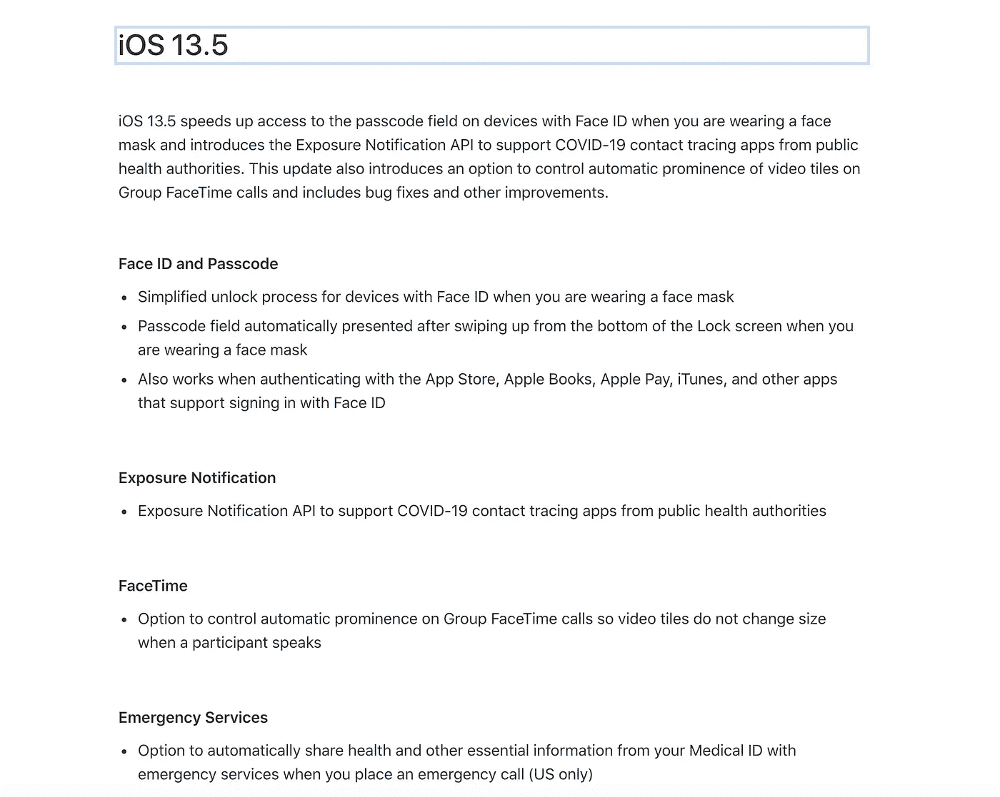
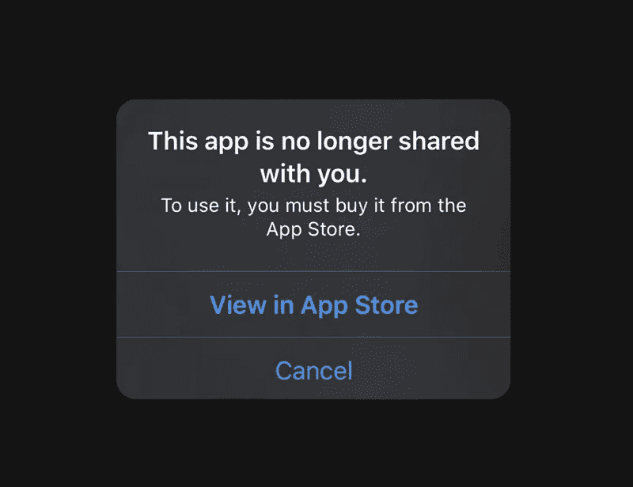
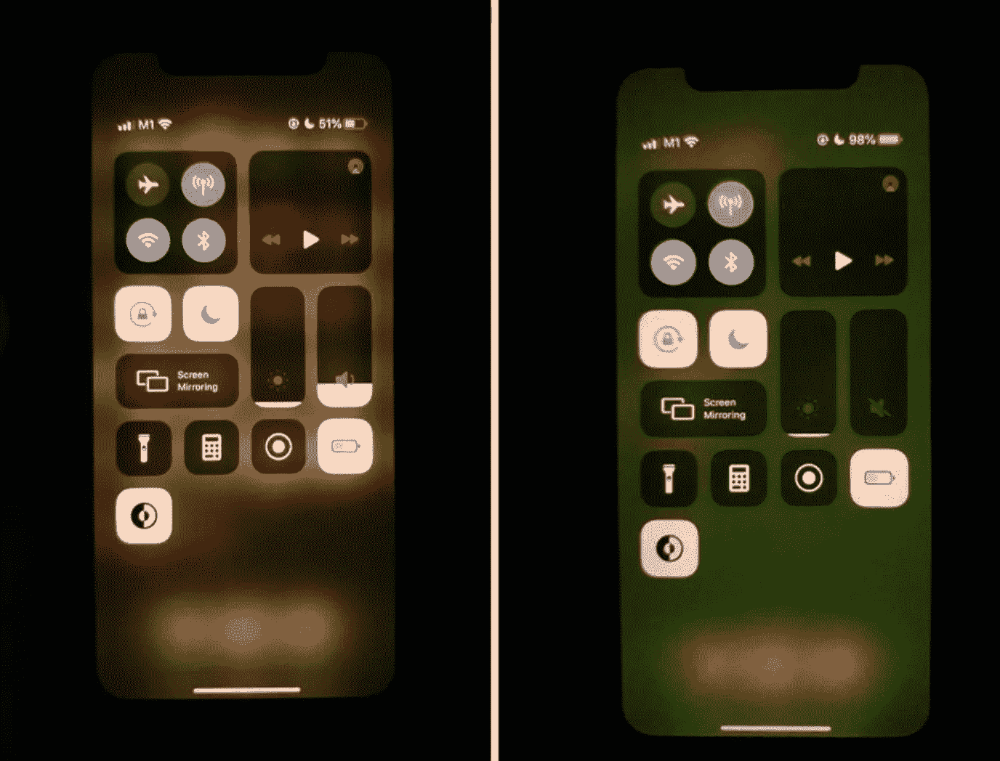

# 苹果 iPhone 的新更新可以帮助拯救你的生命！

> 原文：<https://blog.devgenius.io/apple-iphones-new-update-can-help-save-your-life-f8c1d5c9648f?source=collection_archive---------39----------------------->

或者将您的显示器颜色变为绿色..？！它可以双向进行…👀

在 [Unsplash](https://unsplash.com/s/photos/covid?utm_source=unsplash&utm_medium=referral&utm_content=creditCopyText) 上 [engin akyurt](https://unsplash.com/@enginakyurt?utm_source=unsplash&utm_medium=referral&utm_content=creditCopyText) 拍摄的照片

随着苹果 iOS 13 的更新，黑暗模式不仅有助于缓解你的眼部疼痛，使你免受蓝光的伤害，而且还升级了医疗 id 共享设施，使其更容易与紧急服务部门共享你的信息。

*世界各地的许多健康研究中心都在尝试开发选择加入接触追踪技术。随着最新的 iOS 13.5 发布，苹果(与谷歌合作)成功推出了新冠肺炎追踪技术的第一阶段。*

苹果官网关于 iOS 13.5 更新

这对我的健康有什么好处？

*   作为苹果原生健康应用的一部分，你的医疗 ID 会保存你的健康数据*(如血型、月经周期*)、身体尺寸*(如身高、体重)*和用户可能患有的现有医疗状况*(如血压或食物过敏)。*
*   当需要时，可以与卫生当局共享该医疗 ID。当病人无法做出反应或寻求帮助时，它就派上了用场。
*   在 911 紧急情况下，该功能将使用增强的紧急数据服务，并向 911 调度员提供用户的位置和医疗 ID。这意味着—
    1)当局的响应时间更短。护理人员可以更好地处理病人的医疗紧急情况。
    *3)如果患者不能说话，医疗 ID 可以向急救人员显示现有的健康状况，而无需解锁手机；从而秉承* ***的社会距离感，在时代的光环下。***

**那么苹果在这项技术上做的怎么样呢？**

苹果推出了软件阶段，这是一个名为暴露通知 API 的 API 集成功能，新冠肺炎追踪应用程序可以使用它来帮助他们追踪联系人。这些数据可以帮助我们了解相关症状、邻近程度和持续时间等信息。

在第二阶段，苹果和谷歌计划通过在硬件层面增强这一功能来增加基于蓝牙的联系人追踪平台。这是一种更稳健的方法，目前两家公司都在尽最大努力。但是升级到 iOS 13.5 后，我的屏幕变成了绿色，很多应用程序都没用了！😱

如右侧所示的绿色色调

**如何处理 iOS 13.5 的 bug？**

*   据 Macrumors 报道，越来越多的 iPhone 用户在社交媒体平台上抱怨他们的显示屏呈绿色。
*   一些人说这是从 13.5.1 的更新开始的，另一些人说这是硬件问题，他们一打开新 iPhones 就发生了。对一些人来说，这个问题是暂时的，但对另一些人来说，它是永久的。
*   iPhone 11 系列受影响最大，常见因素是有机发光二极管屏幕。
*   苹果也承认在某些情况下存在问题，并批准官方经销商更换保修期内的显示器。
*   降级并没有帮助用户摆脱这个问题，因此这个 bug 的真实性质仍然未知。苹果公司尚未证实它计划如何解决这个问题。
*   **但是，在弹出问题上有好消息。只需要删除重装 app 就可以解决**了！根据上次备份，您不会丢失太多数据。

**还不升级？嗯，做** [**设置**](https://support.apple.com/en-us/HT207021) **收起你的医疗 ID** 🔴但是现在还不清楚是否应该更新到 iOS 13.5。如果你是美国以外的人，你可能最终会看到一个没有任何替换选项的绿屏。由于 API 是刚刚提供的，应用程序在整合这项技术之前还需要一些时间。除了这两个，新的更新还有一系列其他与邮件应用程序相关的错误，丢失旧图片等。与其遗憾，不如保存，等待一个更稳定的版本来帮助修复这个错误！📱

我写关于技术、人工智能和意识的文章。如果你想阅读我即将推出的作品，请关注我，保持更新；在 [*推特*](https://twitter.com/Anurita_S) *上找我。*👩🏻‍💻