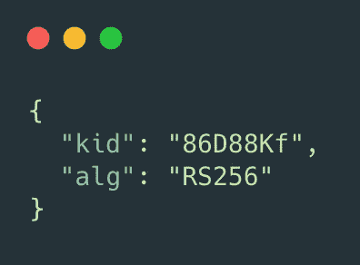
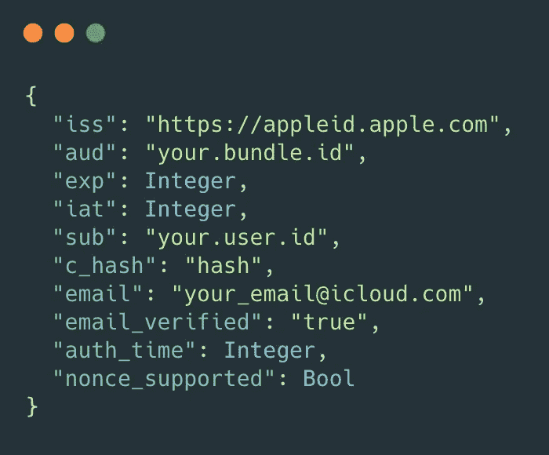

# Apple 登录指南

> 原文：<https://blog.devgenius.io/apple-signin-inside-the-token-e51c58d94e86?source=collection_archive---------13----------------------->

## 在令牌内部

在 [Unsplash](https://unsplash.com?utm_source=medium&utm_medium=referral) 上 [Medhat Dawoud](https://unsplash.com/@medhatdawoud?utm_source=medium&utm_medium=referral) 拍摄的照片

您知道在登录 apple 时收到的身份令牌里面有什么吗？

让我们简单地看一下登录例程:

正如苹果所说，我们应该有这样的东西:

然后，代表会收到类似这样的内容:

那么，身份令牌里面是什么？我们可以用 JWTDecode 包来探索一下。

 [## auth0/JWTDecode.swift

### 帮助您在 Swift 中解码 jwt 的库。通过在…上创建帐户，为 auth0/JWTDecode.swift 开发做出贡献

github.com](https://github.com/auth0/JWTDecode.swift) 

最后，它会给你一个标准的 jwt 令牌:

令牌头

令牌有效负载

在这里，您可以看到用户的电子邮件地址，并将其用于营销目的。如果用户喜欢隐藏他们的电子邮件地址，你需要做一些额外的步骤来发送电子邮件。

 [## 使用私人电子邮件中继服务进行通信

### 用户通常希望与开发人员交流，但可能担心他们的私人电子邮件信息会被…

developer.apple.com](https://developer.apple.com/documentation/sign_in_with_apple/sign_in_with_apple_js/communicating_using_the_private_email_relay_service) 

要在代码中实现这一点，您可以向 JWTDecode 添加一个小的扩展:

哦，顺便说一下，json 中的“sub”字段匹配 **appleIDCredential.user** 属性。

对于这样一个方便又酷的功能来说，没有这么多。但仍然值得研究，以了解它是如何工作的，以及我们可以用它做什么。