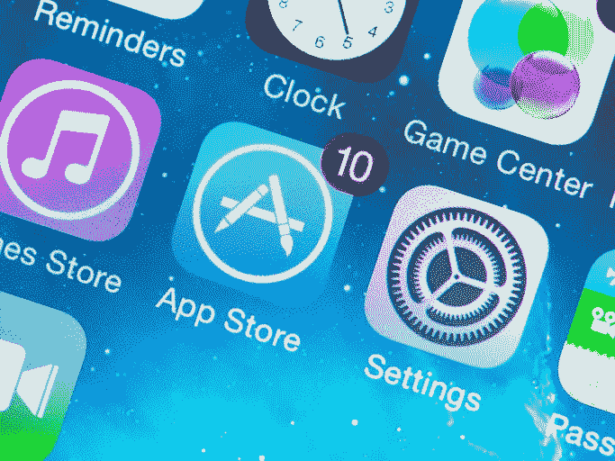

# 苹果将小开发者的应用商店“税”减半

> 原文：<https://blog.devgenius.io/apple-slashes-app-store-tax-in-half-for-small-developers-10302a1ffdd9?source=collection_archive---------4----------------------->

## 有人说这还不够

图片:iStock

众所周知，iOS 开发者对苹果每次在 App Store 上销售一款应用收取的费用不满意。事实上，当“堡垒之夜”开发商 [Epic Games 决定对这个科技巨头提起诉讼](https://www.theburnin.com/games/epic-games-lawsuit-apple-google-fortnite-ban-2020-08-14/)时，这个问题成为了一个全国性的头条新闻。

现在，面对越来越多的反垄断担忧，苹果公司[决定降低小开发商的应用商店“税”。虽然这对 Epic Games 这样的公司没有帮助，但年销售额低于 100 万美元的开发商现在将支付每笔购买的 15%。这是苹果通常 30%费用的一半。新费率适用于付费应用下载和应用内购买。](https://www.theverge.com/2020/11/18/21572302/apple-app-store-small-business-program-commission-cut-15-percent-reduction)

即便如此，[一些开发者还是不高兴](https://www.cnet.com/news/apple-lowers-app-store-tax-to-15-for-developers-making-under-1m-a-year/)。

# 放松一下

苹果的最新举措被官方称为 App Store 小企业计划，是数字市场历史上最值得关注的举措之一。

iPhone 制造商声称“绝大多数”iOS 开发者将有资格参加该计划。它没有提到一个确切的百分比。然而，[分析公司 Sensor Tower](https://sensortower.com/) 估计 98%的开发者都有资格。

苹果公司也拒绝就新政策将影响其多少收入发表评论。

也就是说，考虑到它只影响小开发商，损害应该不会很大。Sensor Tower 还估计，有资格获得减免费用的开发者仅占应用商店总收入的 5%。去年，应用商店为苹果带来了大约 500 亿美元的收入。

随着该公司将重点从硬件转向服务，应用商店发挥了关键作用。这种情况不会很快改变，因为消费者市场正迅速被智能手机、平板电脑甚至智能手表和无线耳塞等可穿戴设备所饱和。

展望未来，苹果将需要继续严重依赖其旗舰数字市场作为主要收入来源。

# 混合情绪

到目前为止，开发者对苹果降低应用商店费用的决定反应不一。独立开发者和小工作室当然没什么好抱怨的。将费用从 30%降低到 15%是一个巨大的降低，每次购买都会带来更多的收入。

苹果在一份声明中表示，“节省下来的资金意味着小企业和开发者将有更多的资金投资于他们的业务，扩大他们的劳动力，并为世界各地的应用用户开发新的创新功能。”

对于应用开发者来说，不在 App Store 上发布几乎是不可想象的。全球有超过 15 亿人使用苹果的数字市场。那是一个不容忽视的巨大市场份额。因此，苹果可以收取 30%的费用，开发者别无选择，只能支付这笔费用。

尽管最近有所下降，一些开发商并不高兴。最不满的两家是 Epic Games 和 Spotify。后者在周三的一份声明中表示，“我们希望监管机构不要理会苹果的‘装饰门面’，立即采取行动，保护消费者的选择，确保公平竞争，为所有人创造公平的竞争环境。”

Spotify 对苹果的不满始于大约三年前，当时它退出了苹果的应用内购买计划。流媒体平台声称，它支付了 30%的订阅费，而苹果的竞争对手苹果音乐却没有，这是不公平的。那是一个合理的抱怨。

最近几个月，这也是监管机构讨论的话题。

# 方便的时间

苹果和 iOS 开发者之间的分歧从未如此之大。对反竞争行为的担忧和对 App Store 高收费的抱怨促使监管机构和立法者更加密切地关注这家大型科技公司。

今年 6 月，欧盟对苹果发起了两项调查。其应用商店的做法是其中一个亮点。欧盟竞争专员玛格丽特·维斯特格(Margrethe Vestager)在一份声明中表示，“在向苹果热门设备的用户分发应用和内容方面，苹果似乎获得了一个‘看门人’的角色。”

微软是另一家对苹果的应用商店政策表示不满的公司。虽然不是付费问题，但苹果当时的政策限制了它没有审查的应用程序。这意味着通过 xCloud 等服务可以访问的游戏是不允许的。最终，[苹果改变了政策](https://www.theburnin.com/games/apple-changes-app-store-rules-allow-game-streaming-services-2020-09-11/)，为 iOS 上的游戏流媒体服务铺平了道路。

苹果与 Basecamp、脸书和 WordPress 等公司也有过较小的冲突。

方便的是，苹果将新的 App Store 小企业计划框定为新冠肺炎救济的一种形式。它声称，它旨在为处于病毒造成的经济困难中的小型应用程序制造商提供支持。

虽然这是真的，但时机令人怀疑。苹果尚未证实该程序是否在疫情发布之前就已开发。

无论如何，苹果似乎在最佳时机伸出了橄榄枝。在监管机构的密切关注下，该公司向开发商展示了诚意。这可能不足以使其免受未来几天的反垄断裁决。

# 开发者如何报名？

撇开时间上的阴谋不谈，App Store 费用的降低对较小的开发者来说是一个不可否认的推动。为了利用这一优势，苹果要求开发者申请该程序。这意味着它不会自动降低费用。

目前，100 万美元的门槛将根据开发商 2020 年的收入来衡量。新开发人员将立即获得资格。

值得注意的是，100 万美元的临界值是可变的。换句话说，如果一个开发者在一个日历年内的年收入超过 100 万美元，他们的费用会回到 30%。然而，如果他们回落到标记线以下，他们的费用也会回落。

苹果确实注意到该计划将于 1 月 1 日生效。然而，它还没有公布如何注册的所有细节。开发者应该在下个月的某个时候关注更多的更新。

*原载于 2020 年 11 月 18 日***。**