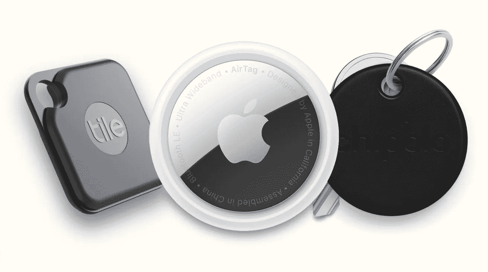
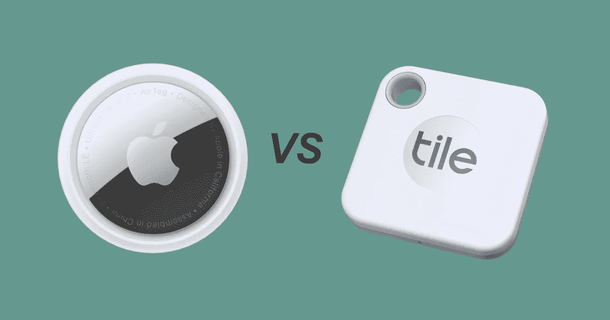
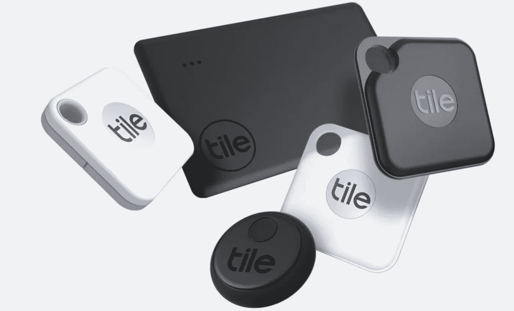
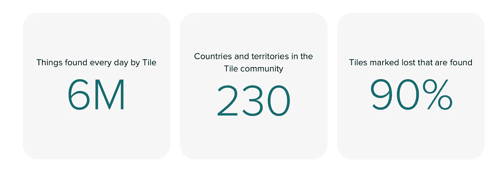
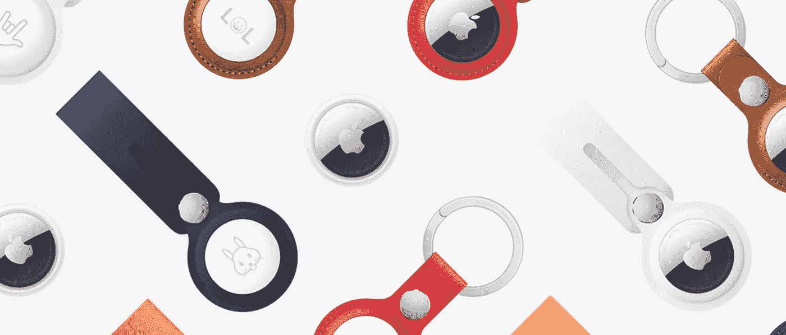
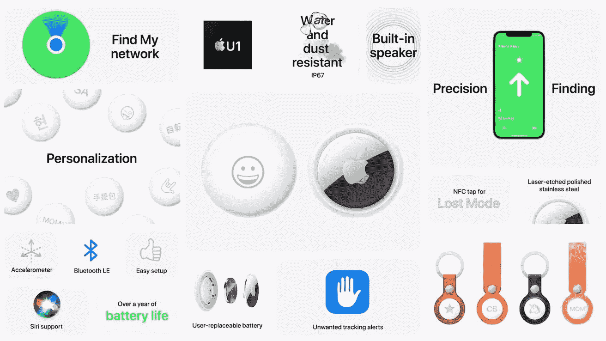
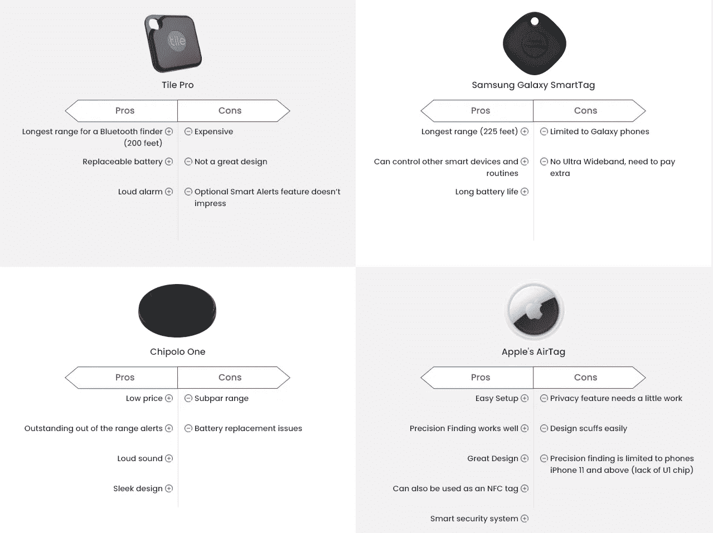

# 苹果的 AirTag 与 Tile Pro——哪个智能追踪器更适合你？

> 原文：<https://blog.devgenius.io/apples-airtag-vs-tile-pro-which-smart-tracker-is-better-for-you-196be4206de1?source=collection_archive---------3----------------------->

2020 年，全球“智能追踪器”市场价值为 4.1314 亿美元，预计到 2024 年将达到 8.0766 亿美元。

来源:Technavio

虽然许多不同的概念促成了这种增长，但本文只关注一个特定的细分市场——帮助用户定位日常必需品的跟踪设备。让我们称它们为“物品查找器”或“标签”

来源:谷歌

这个小工具的基本思想是，如果你丢失了任何连接到物品查找设备的东西，你手机上的应用程序可以帮助你找到它。

这些小工具使用蓝牙与物品查找器连接，并可以告诉你它最后一次“看到”设备的位置。当你靠近你要找的设备时，它也能提醒你。

尽管有多家公司活跃在这一领域，但没有明确的领导者。你会发现一些更大的名字是-

1.  瓷砖
2.  奇波洛
3.  三星 Galaxy 智能标签
4.  苹果的 AirTag

> 然而，Tile 以 1.65 亿美元的总价值在这个细分市场中领先，苹果的 AirTag 是一个新进入者。

## 在本文中，我将重点介绍这两种产品——Tile 和 AirTag

来源:iThink

# **磁贴追踪器:**

Tile 是同类公司中第一家以蓝牙追踪器闻名的公司。

从一开始，他们的座右铭就很简单-

> “仅仅是能够利用技术来解决生活中的一个长期存在的问题。”

资料来源:thetileapp.com

**一些关键特性:**

1.  众包/磁贴社区—位置会传回给您，在那里另一个磁贴用户会检测到您丢失的物品。都是匿名的。
2.  令人印象深刻的范围—支持高达 200 英尺的距离
3.  智能提醒通知你，如果你离开家没有你通常带的东西
4.  30 天的位置历史记录，以便您可以看到您的瓷砖在哪里
5.  免费更换电池
6.  定制瓷砖
7.  智能助理连接——Tile 可以与 Google Home 和 Alexa 配合使用。用户也可以使用 Siri 快捷键。
8.  适用于 iPhones 和 Android 设备
9.  瓷砖提供更多产品

> 随着时间的推移，该公司不断通过添加新功能和额外支持来改进自己！

资料来源:thetileapp.com

另一方面，

Tile 仍在致力于引入 UWB(超宽带技术)。UWB 是一种短程无线协议，非常适合精确的方向定位。

对于那些不知道 UWB 是什么的人:

例如，这项技术可以让你比当前的蓝牙方法更精确地定位一件物品，并使用增强现实(AR)通过手机屏幕找到该设备。换句话说，导航用户到确切的点。

*新闻* : *正如你们大多数人可能知道的，Tile 抨击苹果的新 AirTag 是不公平竞争，这种担心是真实的。*

# 苹果的 AirTag:

苹果最近在 2021 年 4 月推出了传闻已久的 AirTags。

苹果利用其生态系统，将 AirTags 打包成了一系列功能。

> 岁差发现是苹果 Airtag 与众不同的地方。它非常准确——多种来源

鉴于苹果对减少电子垃圾的关注，你可以正确地假设 AirTag 使用可更换电池。

**AirTag 的一些关键特性:**

1.  建立一个航空标签是惊人的顺利
2.  丢失模式——无论操作系统如何，任何支持 NFC 的手机都可以识别机主。你所需要做的就是，点击“丢失模式”并输入你的电话号码。
3.  FindMy 生态系统——air tags 使用 Find My 生态系统在丢失模式下 ping 附近的苹果设备，以便用户可以找到它们。
4.  Siri 集成—只需激活 Siri，就可以找到任何带有 Airtags 标签的东西
5.  NFC 快捷方式——空中标签也是 NFC 标签。用户可以创建新的自动化，选择 NFC。一旦用户扫描了标签，给它一个名字。现在，用户可以选择他们想要创建的操作或自动化

I)打电话给某人—标记一个号码进行 AirTag。

ii)打开 YouTube

iii)做语音记录

iv)截图，选项层出不穷。

6.如果其他人的 AirTag 进入了你的物品，你的 iPhone 会注意到它与你同行，并向你发送提醒。然后，过一会儿，如果你仍然没有找到它，AirTag 会开始播放声音，让你知道它在那里。

> 我们帮助人们找到对他们最重要的东西——苹果。

资料来源:WWDC

另一方面，

1.  说的最多的“精准找”需要 iPhone 11 及以上。此外，它还要求手机具备 U1 芯片功能。
2.  它只适用于 iPhones。
3.  配件——苹果品牌的 Airtag 支架比 AirTag 本身还贵，这很奇怪。

***提示***——幸运的是，市场上有大量其他更便宜的选择。

## **最后，如何选择一个？**

如果你是苹果用户，你应该选择利用苹果生态系统的 AirTags。

另一方面，如果你是 Android 或 Windows 用户，磁贴可能是最好的选择。

## 附加说明:

**什么是苹果的 U1 芯片:**U1 是苹果公司的一款芯片，允许 iPhone 精确定位并与其他配备 U1 的设备或其他支持超宽带的设备通信。

当苹果宣布 iPhone 11 时，它也迅速推出了 U1 芯片。

> 虽然它没有在舞台上获得巨大的成功，但苹果公司表示，该芯片将为新款 iPhone 提供“令人惊叹的新功能”。

# **物品查找器对比:**

版权所有:保留所有权利