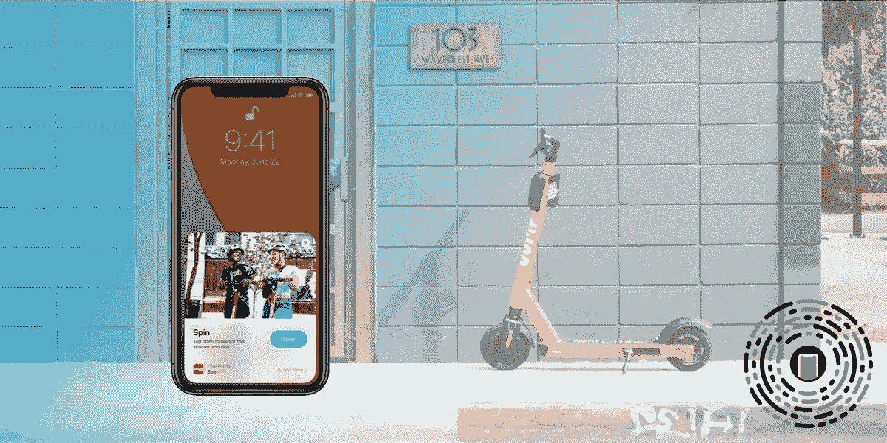
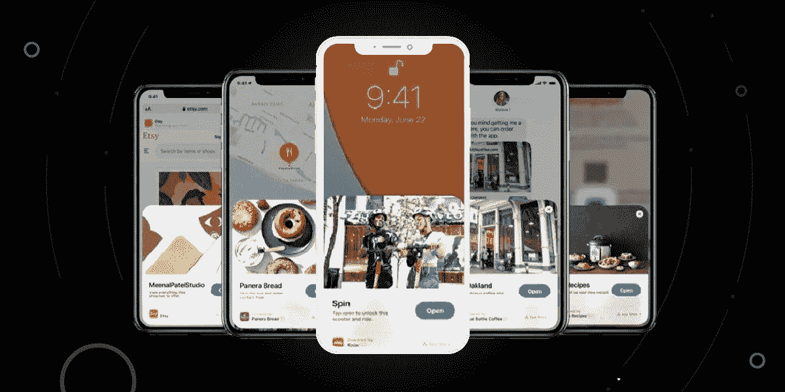
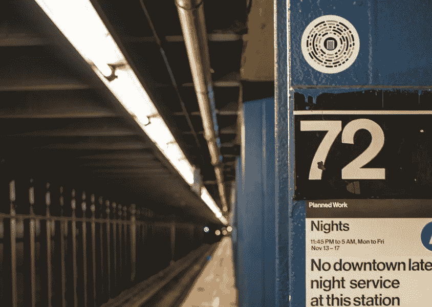
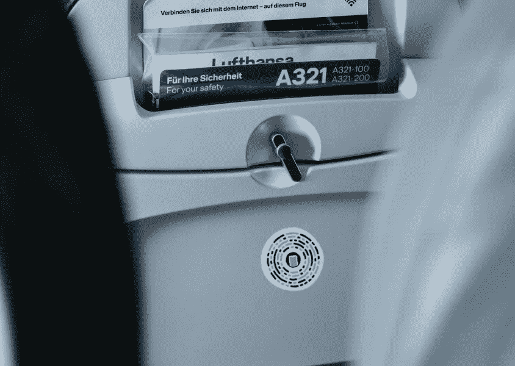

# 苹果的新应用程序 Clips 使获取应用程序变得即时。

> 原文：<https://blog.devgenius.io/apples-app-clips-make-getting-apps-instantaneous-eedecf4f5af8?source=collection_archive---------21----------------------->

## 以下是你如何利用它来推广你的应用并提升你的应用业务。

应用剪辑是苹果今年秋天向公众推出的一项新功能。它可以让你通过点击或扫描标签来下载你需要的应用程序的一部分。这意味着当你在人行道上看到一辆 Lyft 滑板车时，你可以走到它面前，用手机点击图标，然后下载 Lyft 应用程序的滑板车部分，为你的滑板车付款，然后上路。同样，对于餐馆外卖订单，如果你看到一家你想订餐的餐馆，你只需点击你的手机，选择你想要的食物，然后点餐，而不是等待 1 到 2 分钟来下载一个 100+ MB 的应用程序，添加你的所有信息，搜索餐馆，然后点餐。

应用程序剪辑必须小于 10MB，因此它们将几乎瞬间启动并运行，为用户带来他们需要的更大应用程序的确切功能。开发者可以选择将应用程序的哪些部分制作成应用程序剪辑，然后根据用户扫描的链接或代码制作多个应用程序剪辑。

客户可以通过五种主要方式下载应用程序剪辑

1.  用他们的手机背面点击 NFC 贴纸
2.  用你的相机扫描标签的代码
3.  扫描二维码
4.  在线点击应用程序剪辑链接
5.  根据地图位置显示应用程序剪辑

应用程序剪辑无缝连接物理和数字世界，使您能够更轻松地尽快完成您需要完成的特定任务。

# **这对用户来说意味着什么？**

很久以前，你不必为特定任务下载 100 个不同的应用程序，你可以在需要时获得这些特定任务的应用程序。音乐会、聚会、会议，所有这些我们多年来一直装在手机上的应用程序，从来没有抽出时间删除。他们中的一些人仍然在用偶尔的通知来打扰我们，但大多数情况下他们只是在我们的设备上浪费空间。

最重要的是，应用程序剪辑允许我们在下载完整版本之前测试应用程序。如果我们喜欢我们下载的东西，无论是游戏、食物还是其他东西，我们都可以点击下面的底部按钮获得完整版本。这也意味着我们不必滚动应用页面来查找我们下载的最新应用。我们需要的应用程序部分就在那里，随时可以使用，而不必经历我们今天习惯的漫长过程。

# **对于开发者来说，这些变化有好有坏**

## **好的**

你的应用更有可能被实际使用，因为用户一点击标签，它就被下载了。而不是用户点击下载，在下载过程中分心，永远不打开应用。这也使得为离线服务转化新用户变得容易得多。通常，如果用户附近有多家公司的电动滑板车或自行车，他们会使用他们有应用程序的任何一个。现在，没有应用程序几乎不是一个大问题，因为用户只要点一下标签就有了应用程序。总的来说，这意味着获得一个应用程序不再像以前那样困难。

除了更简单的离线服务转换，快速点击、扫描或点击链接可以使应用营销更容易。对于在等车或地铁的顾客来说，点击附近的贴纸来玩快速游戏要容易得多。轻按贴纸，获得游戏，并在通勤期间玩它。如果你喜欢这个游戏，你可以随时轻松下载完整版。

应用程序剪辑也可以从在线链接下载或发送给您。这意味着移动广告可以立即让你进入他们应用的应用剪辑体验，帮助你决定是否要下载。我很好奇浏览器将如何处理这一问题，因为这一功能肯定有被滥用的可能，但这也是公司将人们推至其应用的一个很好的方式。

## **坏的**

现在说说不太好的。让客户下载应用程序片段而不是完整的应用程序意味着失去应用程序下载和通过推送通知重新吸引客户的能力。没有长期的客户参与意味着更少的数据来更好地训练你的营销引擎，可能很少或没有广告收入。因为开发者将无法轻松推动下载或重复参与，所以支持应用剪辑的决定实际上取决于你公司的 KPI。

如果你的应用程序大部分收入来自离线服务，那么应用程序剪辑是一个显而易见的功能。如果你提供食品、最后一英里运输、活动门票、食品提货、非接触式零售购买、停车或任何其他特定的短期基于应用程序的交互，那么尽管失去了数据和向上销售客户的潜力并不大，但增加产品的覆盖范围和潜在收入可能会超过负面影响。

# **为什么我对应用程序剪辑感到兴奋**

除了应用剪辑的明显优势，它还可以围绕互联网连接设备(IoT)开发一系列令人兴奋的功能。如今，智能恒温器、路由器、智能插头等物联网设备都与安装设备的人联系在一起。在我的房子里，那就是我。也就是说我是唯一能用手机控制这些设备的人。

当我有任何客人时，他们被锁定在此功能之外。但是，如果我能在我的冰箱上贴上这些可扫描的代码，这样我的客人就可以使用恒温器和智能插头，那会怎么样呢？然后，他们将拥有这些产品带来的额外舒适和定制，以及节能功能。每个 HomeKit 帐户持有人是否可以打印出一个唯一的代码，让任何人都可以使用该代码来访问 HomeKit 设备？也许它甚至可以在 HomeKit 中定制，所以你可以将基于应用程序剪辑的访问设置为在你喜欢的任何时间后过期。

座位背后的应用程序剪辑代码，以获取航班的娱乐应用程序剪辑。

更进一步说，像航空公司、酒店和会议这样的企业呢？现在，这些公司除了能够为自己节约能源之外，还能提供另一个层次的便利设施。客人只需扫描代码，酒店房间的智能恒温器就会知道他们的手机是否在房间里，并且只在客人在房间时打开空调，而不是让客人将房间钥匙放在他们可能会忘记的插槽中来开灯。

对于航空公司来说，乘客可以扫描座位背面的娱乐应用代码，下载机上娱乐应用剪辑，在自己的 iPad 或 iPhone 上欣赏航班电影。

简而言之，我最感兴趣的是 App Clips 如何将如此多的功能大众化，这些功能往往被隐藏或锁定，只是因为转移访问权限非常困难。

应用程序剪辑将进一步模糊物理和数字鸿沟，我很高兴看到开发者提出的其他可能性。