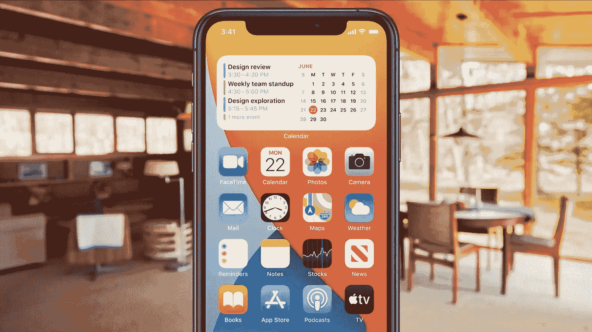

# 苹果的 iOS 14 引入了自 iOS 7 以来最大的重新设计

> 原文：<https://blog.devgenius.io/apples-ios-14-introduces-biggest-redesign-since-ios-7-9967aff3755d?source=collection_archive---------6----------------------->

## 是的，iOS 14 看起来比以往任何时候都更像 Android 但这未必是一件坏事

图片:苹果

自从 iOS 登场以来，苹果一直保持主屏幕相对不变。除了在 iOS 7 中进行了视觉上的彻底改革，苹果还保持了 iOS 不变的图标网格。但随着 iOS 14 的推出，这种情况正在发生变化，iOS 14 终于推出了主屏幕小部件。

我已经能听到来自 Android 用户的笑话了。“安卓这么做已经很多年了！”还有，“苹果会宣称是它发明了小部件！”我们都是成年人，知道这些笑话是愚蠢的。还有:谁在乎。是的，苹果迟到了，这很可笑，但现在是时候改变了。

# 主屏幕已经改变

多年来，苹果已经慢慢接受了小部件的概念。在 iOS 10 中，它在主屏幕左侧引入了一个专用区域，用户可以在那里放置小工具。更早以前，在 iOS 8 中，它将小部件带到了通知中心，但都不如 Android 上可用的那样容易访问。这就是 iOS 14 的用武之地。

苹果将 iOS 14 的主屏幕描述为“更加有用和个性化”除了图标网格，日历、天气和笔记等应用程序的小部件也可以添加到主屏幕上，让用户一目了然。甚至还有一个“智能堆栈”小工具，可以循环显示人们最常用的应用程序。

据苹果公司称，小工具有不同的尺寸，可以放在你主屏幕的任何地方。多个 widgets 也可以添加到同一个主屏幕，这取决于您选择的大小。苹果表示，在为 iOS 14 创建小工具时，它使用了从 watchOS 工作中学到的东西。

至关重要的是，苹果对 widgets 的实现并没有损害 iOS 的外观。诚然，Android 已经提供了多年的小工具，但苹果的 iOS 14 看起来仍然非常像 iOS。即使主屏幕上满是小工具，也不会弄错哪个平台来自库比蒂诺。

苹果的 iOS 长期以来一直因缺乏定制选项而受到嘲笑，尽管该软件仍不像 Android 那样可定制，但 iOS 14 是朝着正确方向迈出的一大步。我从没想过苹果会推出小部件，但事情终于发生了变化。

除了 widgets，苹果还推出了一个名为 App Library 的功能，可以将你所有的应用组织到基于应用功能自动创建的文件夹中。所以，你可以有一个或两个主屏幕，上面有你最喜欢的应用程序，然后在应用程序库中包含你所有的其他应用程序，以便于访问。

# 仍然不完美

iOS 14 最令人失望的是没有做任何事情来解决锁屏问题。在介绍 iOS 14 的 widgets 时，苹果提到 watchOS 为用户提供一目了然的信息是多么伟大。然而，除了查看时间和日期之外，锁屏对任何事情来说都很糟糕。

现在本来是苹果为 iPhone 的锁屏引入复杂功能的绝佳机会——你可以在不解锁手机的情况下快速浏览这些信息。当然，你可以向左滑动进入今天视图，显示你最喜欢的小工具。但这仍然是用户为了查看简单信息而需要采取的额外步骤。

就目前而言，主屏小工具是向 iPhone 用户提供一览式信息的第一步。苹果当然可以走得更远，但主屏幕小工具花了几年时间才出现在 iOS 上，所以也许再过几年我们会看到苹果的平台变得更加可定制。