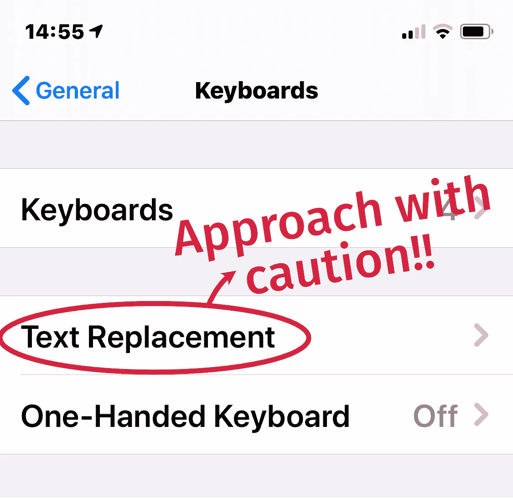
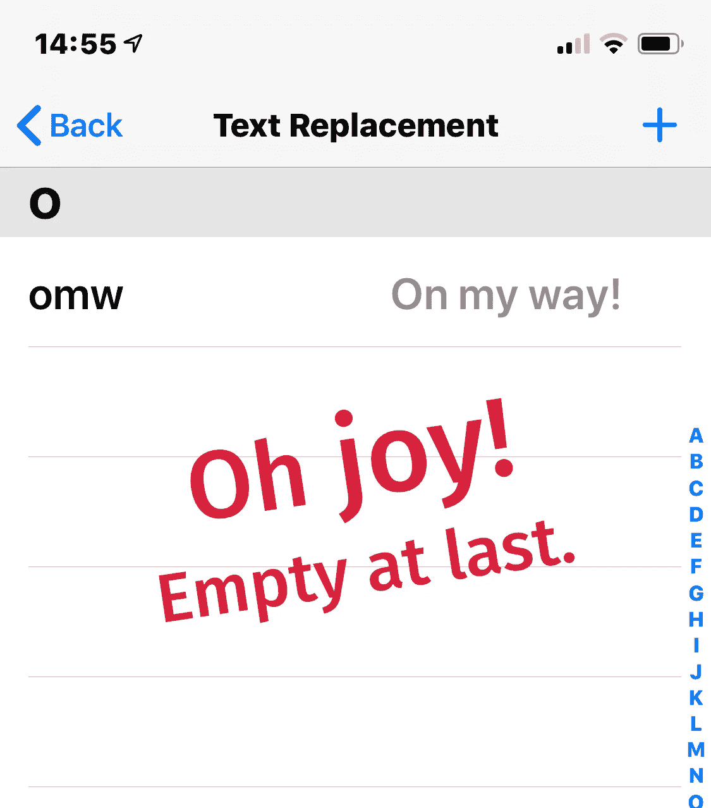

# 如果你重视你的理智，就远离苹果的键盘快捷键

> 原文：<https://blog.devgenius.io/apples-keyboard-shortcuts-destroyed-my-productivity-bcb04b2e884c?source=collection_archive---------11----------------------->

## 彻底擦除我所有的设备是一件痛苦的事，但它解决了这个问题

伊万·弗拉尼奇在 [Unsplash](https://unsplash.com?utm_source=medium&utm_medium=referral) 上的照片

**Tl；内置的苹果键盘快捷键听起来很棒，但它们给我带来了很多痛苦，直到我最终发现如何删除它们。文本扩展器是一个更好的选择。**

作者设置截图

# 好人

我有一部 iPhone X，一部 9.7 寸的 iPad Pro，一部 12.9 寸的 iPad Pro，一部 2019 款 15 寸的 MacBook Pro，还有一部 27 寸的 iMac。当这些设备作为一个团队很好地一起工作时(大多数时候)，生活是美好的，工作也完成了。当我得知可以创建文本快捷方式的那天，阳光似乎更加灿烂了！幸运的是，我没有意识到后果，我开始疯狂地为任何事情创造捷径。多么有趣越过“omw ”(在我的路上),我现在可以即时准确地输入长电子邮件地址，让我的联系方式神奇地自动存在，并通过一串表情符号添加星级——只需输入三个字符的字符串(或任何我想要的字符串)。真是幸福！
直到不是。

# 坏事

我的快捷方式中的一些字符串是在正常输入时出现的；我选错了。我是一个打字高手，手速快的话，一分钟能流利地说出 80 多个单词。想象一下在普通单词中扩展文本会是什么样子:我可以告诉你，在某些情况下，这是一种烦恼，而在其他情况下，这是一种噩梦！编辑突然花了两到三倍的时间，所以我不得不开始看着屏幕，而不是在房间里或窗外打字。这打破了流动，并迅速成为我急于摆脱的瘙痒。如果你摇头想知道为什么我没有编辑或删除那些讨厌的快捷方式，请继续读下去。

# 可怕的丑陋

在设置/系统偏好中编辑我考虑不周的快捷方式没有任何作用。删除快捷方式没有任何作用。什么都没有，我告诉你！！

无论我怎么尝试，这些快捷方式都只是在每台设备上从云端重新组装。每一个。单身。时间。发现数百名其他不满的灵魂在同一条船上并不令人放心；我了解到这个问题已经存在*年*了，还没有官方的解决方案。当你去[苹果讨论论坛](https://discussions.apple.com/thread/6656922?page=44)时，你就会知道事情很糟糕，而且“我也有这个问题”框有将近 500 个(这还只是发现那个帖子的人)。

# 解决方案

经过多年的研究和试验，我终于找到了一种有效的方法。真是松了一口气！谢谢， [iBarrett](https://discussions.apple.com/thread/6659918?answerId=27763261022#27763261022) (也是你的开发者朋友)，发自内心的感谢。
[**这是我所知道的唯一一个解决老版本键盘快捷键问题的方法:**](https://discussions.apple.com/thread/6659918?answerId=27763261022#27763261022)

> 1.在任何受影响的 iOS 设备上，前往“设置”>“通用”>“还原”>“抹掉所有内容和设置”
> 
> (警告这显然会删除所有内容，所以你必须愿意在没有保证的情况下走到这一步)
> 
> 2.如果您也有 Mac，请继续执行步骤 3，否则跳到步骤 6。
> 
> 3.在 Mac 上，进入系统偏好设置>键盘>文本标签，删除所有的快捷键。
> 
> 4.使用 Mac 上的“终端”应用程序，以下命令会在您的桌面上放置一个“真实 iCloud Drive”文件夹，这将允许您查看 iCloud Drive 中所有隐藏的项目:
> 
> ln-s ~/Library/Mobile \ Documents/~/Desktop/Real \ I cloud \ Drive
> 
> 5.打开这个新的 iCloud 文件夹替身(您必须选择在 Finder 窗口中以列表视图方式查看它)。这个文件夹里面是名为“设置”的文件夹，里面是“词典”删除“字典”文件夹并清空废纸篓。
> 
> 6.将您的 iOS 设备设置为新设备。这意味着，你必须手动重新安装任何应用程序，设置等。不要从 iTunes 或 iCloud 备份恢复，因为这只会给你留下相同的损坏问题。在花这么多时间之前，先用你的 Apple/iCloud ID 登录你的设备，看看快捷方式问题是否已经解决，当你输入新的快捷方式时，它们会在设备和/或 Mac 之间同步。

键盘快捷键面板截图作者

# 走向

我现在在 iOS 上使用[文本扩展器](https://textexpander.com/)，在 Mac 上使用[键盘大师](https://www.keyboardmaestro.com/main/)(因为我已经拥有它了)。是的，我必须在每个应用程序中输入快捷方式，但这没什么大不了的，对我来说完全值得，以避免另一次订阅。

对我有用的短语:

- ;银行=我的银行存款明细
-；dd =当前日期和时间
- zE =我的名字，按发音拼写—区分大小写(ĕllāne)

看起来 Text Expander 现在只有订阅了——我花了一次钱买的——所以如果你不想花钱，那就用苹果键盘快捷键吧；*花点时间非常非常仔细地选择你的触发短语*。