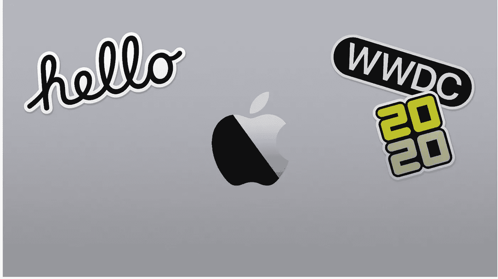
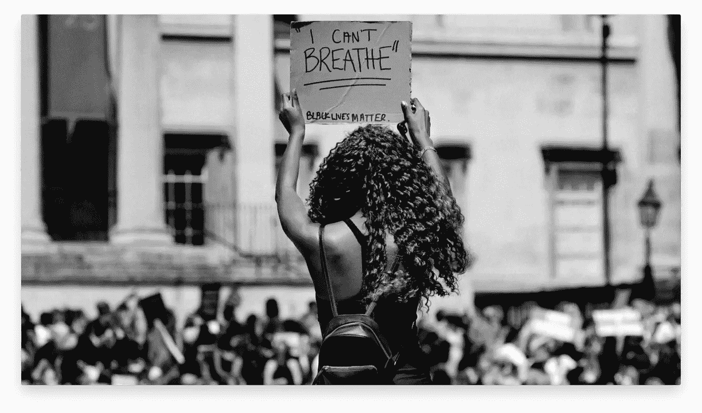
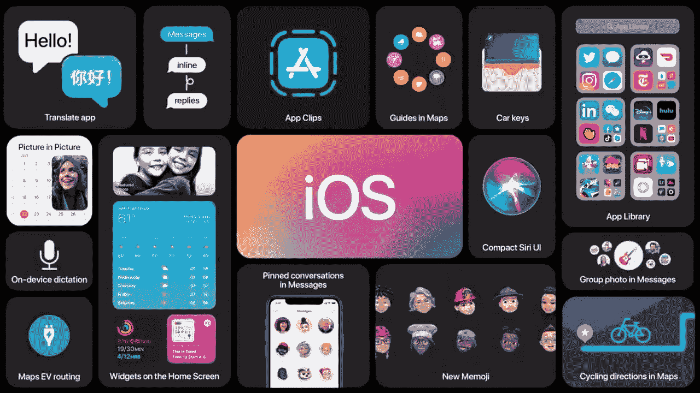
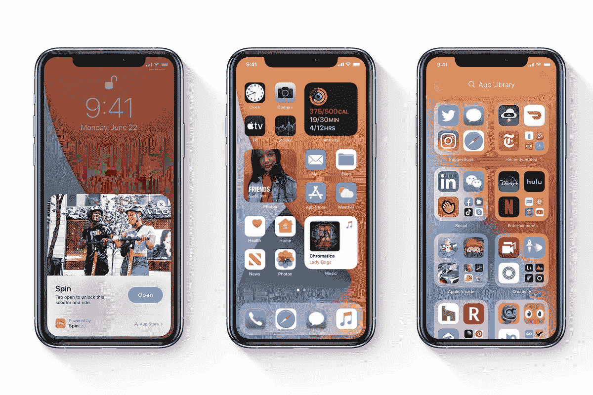
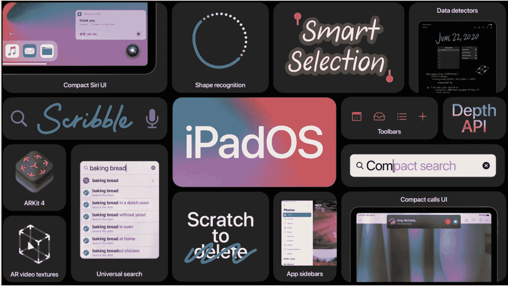
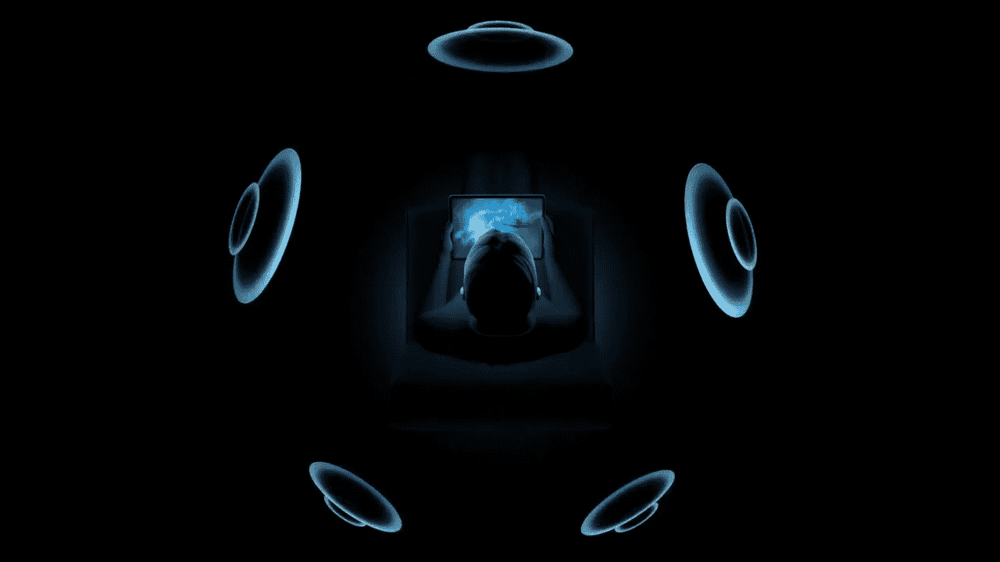
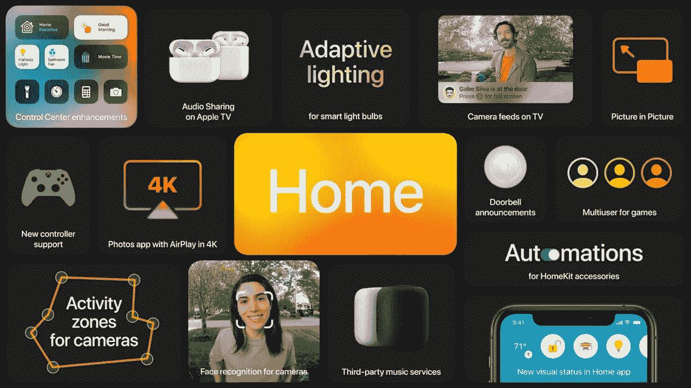
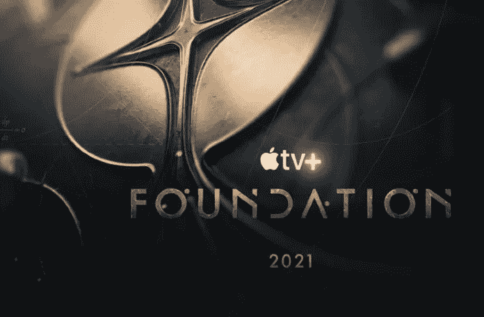

# 苹果的 wwdc 2020——一个虚拟的魔法！

> 原文：<https://blog.devgenius.io/apples-wwdc2020-a-virtual-magic-90cf43a2ead6?source=collection_archive---------22----------------------->

来源:苹果

WWDC20 是苹果有史以来第一次“虚拟开发者大会”，在没有人亲临史蒂夫·乔布斯剧院的情况下独家“在线”直播。尽管如此，这一经历仍然是不可思议的。

活动中发布了如此多的公告，令人激动不已；有些是意料之中的，有些出乎我们大多数人的意料。

> 正是在这里，我们实现了一些最大的创新。蒂姆·库克

一如既往地有会前音乐；然而，这一次，有一些梦幻般的催眠音乐播放着宁静的图像，一个旋转的地球仪，上面有世界各地 Macbooks 的 Mimojis。

蒂姆·库克在 WWDC2020 开幕式上谈到了多样性(当前的需要)。

来源:谷歌

> "我们必须志存高远，建设一个符合我们理想的未来。"蒂姆·库克

没有任何进一步的延误，这里是所有亮点的快速纲要。

# **iOS14:**

来源:谷歌

*   无处不在的小部件

小部件经过了重新设计，变得更加漂亮，数据更加丰富，因此它们可以在一天中提供更多的功能。

几乎所有东西都有小部件:

天气、时钟、日历、新闻、备忘录、地图、健身、照片、提醒事项、股票、音乐、播客、提示、电池、屏幕时间、文件、Siri 建议、快捷方式和应用程序建议。

*   应用程序库——我们所有人都期待已久的功能——

它会自动对你的所有应用程序进行分类和排序，突出显示你最常用的应用程序。

*   画中画来到 iPhone。
*   Siri 界面已被修改，使其更具互动性和实用性。它不再占据整个屏幕，可以完全在设备上进行语音到文本的转换。
*   翻译——一款具有高级设备智能的应用程序，可以让您将语音从一种语言翻译成另一种语言

来源:谷歌

*   iMessages——苹果正在追逐 Whatsapp。我们在 WhatsApp 中使用的每一项功能都与 iMessages 有关——内嵌回复、提及等等。然而，一个突出的特点是，“你现在可以把你最重要的对话放在你的信息列表的顶部。”
*   地图——苹果地图引入了自行车路线和电动汽车路线，包括电池通道和充电地点。此外，一个改进的指南与最新的建议。
*   CarPlay——CarPlay 进行了改头换面，提供了新的壁纸选项，以及一些新的内置应用程序，专注于停车、充电和点餐。

> "苹果公司把你的手机变成了你汽车的数字钥匙."

苹果正在与少数汽车制造商合作，宝马是第一款将你的 iPhone 变成数字钥匙的汽车。

*   app clips——苹果效仿安卓。这个功能类似于“GooglePlay Instant”。它可以帮助你发现应用程序，只要你按下 AppClip 代码。开发人员可以为他们的每个应用程序创建/添加 appclips。

**下一个，iPadOS14:**

iPadOS

iPad OS 获得了 iOS14 提到的大部分功能。此外，

*   新的通用搜索
*   apple Pencil/Scribble——手写识别现在可以在任何文本栏中工作，允许您在不放下铅笔打字的情况下快速记下笔记。像谷歌 AutoDraw，它使用 ML 算法来理解和预测图纸，苹果也提出了类似的东西。

**接下来，AirPods:**

*   自动设备切换—这是 WWDC2020 中宣布的最佳功能之一。我知道 AirPods 在不同设备之间切换的麻烦。

现在，AirPods 可以自动在多种设备之间切换——iPhone 到 iPad 到 Macbook，具体取决于什么是活动的。

*   Airpods pro 正在获得特殊的音频——模拟环绕声。

特殊音频

为了创造身临其境的体验，苹果使用 AirPod 的内置加速度计来跟踪你的头部和设备的位置。

**下一个，手表 7:**

*   睡眠追踪来到 Apple Watch。一个我们大多数人一直在等待的功能，因为系列 1 终于来了。
*   面部分享——苹果现在允许你通过信息、电子邮件或 safari 与他人分享。
*   洗手检测——Apple Watch 现在可以检测你洗手的时间，使用加速度计寻找适当的动作，使用麦克风倾听擦洗的声音。它会自动开始倒计时。

**接下来，HomeKit:**

*   引入了自适应照明、人脸识别和活动区域等新功能。

支持 Homekit 的门铃摄像头现在可以识别已知的面孔，并通过 Homepod/AppleTV 通知让你知道谁在门口。

HomeKit

> 苹果计划通过与谷歌、亚马逊、Zigbee 和其他公司结盟来扩展其智能家居功能。

除了兼容 HomeKit 的设备之外，苹果希望扩大用户可以使用的智能家居技术的种类。

**接下来，苹果电脑:**

> 向大苏尔马科斯问好。

资料来源:Apple.com

下一个 macOS 将被称为大苏尔

**亮点:**

*   控制中心——像 iPhone 一样
*   通知中心已经清理完毕。
*   新地图
*   Safari 改进

还有很多。

**接下来，tvOS:**

*   tvOS 也开始画中画了

我提到 tvOS 的唯一原因是讨论在活动中宣布的新标题。

基础——预告片令人兴奋，我坚持每个人都要看。

**特别说明:**

苹果未来所有的电脑都将使用它的处理器。

> Mac 正在向苹果芯片过渡。

像 iPhones 和 iPads 一样，苹果决定在未来的所有电脑上使用自己的技术。

活动中展示的演示非常精彩；它能够轻松处理最复杂的任务。表演非常流畅。并且实时渲染速度令人印象深刻。

**WWDC 2020 没有口头强调的事情:**

*   苹果计划将其用于定位真实设备的 Find My 网络扩展到第三方公司
*   iOS14 在辅助功能中支持声音识别。你的手机现在可以监听特定的声音，比如烟雾警报、水流声等。，并通知用户。
*   通过在 iPhone 背面轻按，你可以通过在 iPhone 背面轻按两次或三次来执行各种操作，如截图、启动应用程序等。,
*   具有深度 API 的 ARKit4，位置锚定(使用地图)
*   扩展的面部跟踪支持

当然，在这场 2 小时的精彩活动中，苹果还有很多功能没有展示出来。然而，我们将通过测试版来探索它们。

总之，苹果公司如何保持这种魔力，仍然让我感到惊讶。

这些操作系统的开发者测试版今天已经发布。我会带着另一篇关于苹果不能在活动中宣布的所有功能的文章回来。

在那之前，保持转身。

来源:一堆技术网站和事件