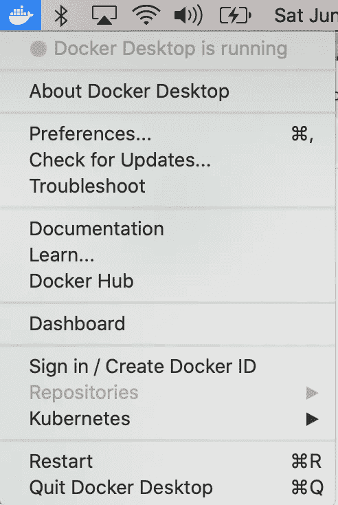
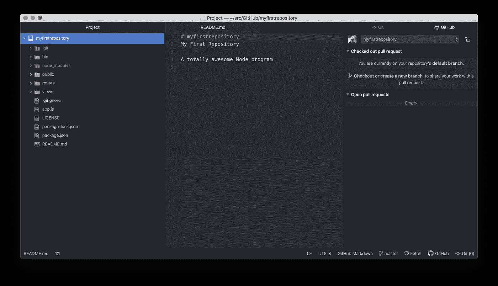
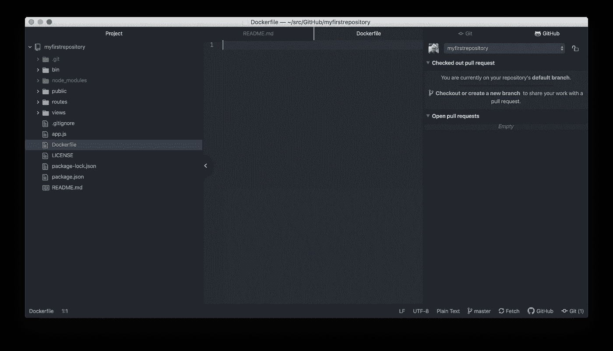
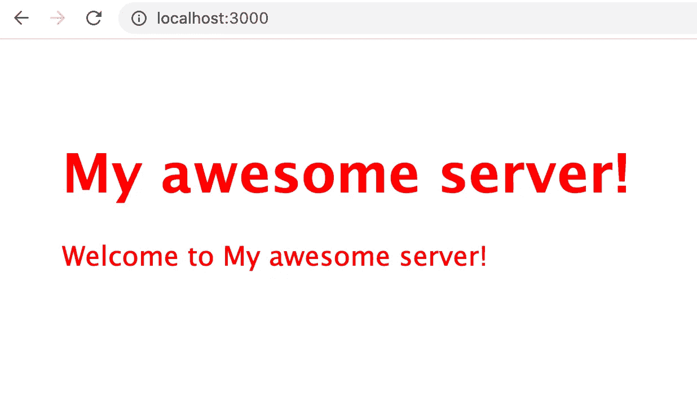
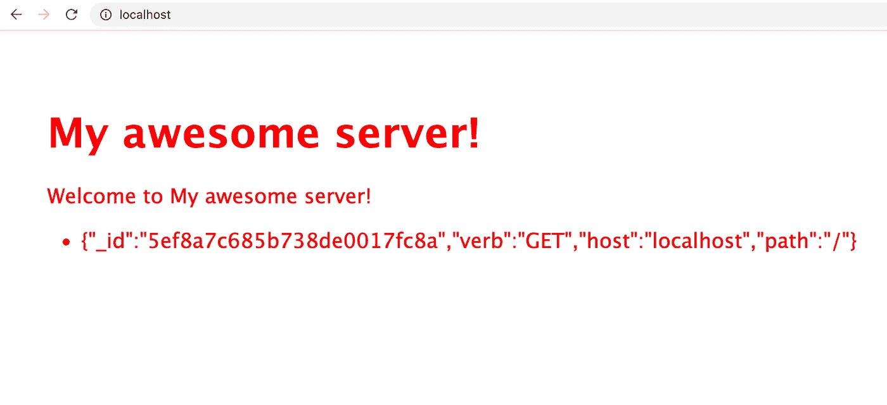
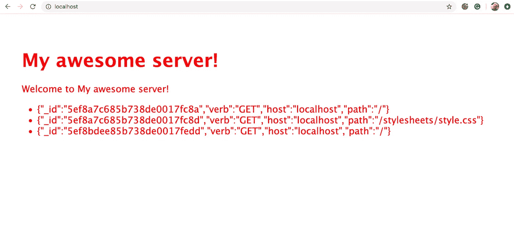

# 绝对初学者的应用程序容器

> 原文：<https://blog.devgenius.io/application-containers-for-absolute-beginners-253a61bb6e39?source=collection_archive---------10----------------------->

## 为真实世界准备您的应用程序


Avel Chuklanov 在 [Unsplash](/s/photos/laptop?utm_source=unsplash&utm_medium=referral&utm_content=creditCopyText) 上拍摄的照片

在我之前的帖子[绝对初学者的应用程序编程](https://medium.com/dev-genius/application-programming-for-absolute-beginners-bf2a035efdf6)中，我谈了很多关于编程的过程，而不是实际的编程。你可以找到很多你想用哪种语言编写的教程，它们会告诉你如何在屏幕上放置小部件并把它们附加到数据上。我想展示的是如何从存储库中获取代码，如何在不熟悉的代码库中找到自己的路，以及如何跟踪并最终共享您的更改。这些是程序员每天都要做的事情，你越早适应这些过程，你就越早能够在专业的协作环境中工作。

但是在你分享你的改变之后会发生什么呢？你的改变是如何通过系统出现在你公司的网站上的？糟糕的程序员不在乎，他们只是修改，推动，交叉手指。其他的都是别人的工作。我和很多这样的程序员一起工作过，他们非常讨厌。如果你想让自己在工作中变得不可或缺，那就要知道从开始到结束的所有流程，并确保你的改变通过每一步，而不必让你的老板告诉你一切都坏了，都是你的错。

这篇文章不是关于如何把你的程序放在某个应用商店里，甚至也不是关于如何打包它以便在你朋友的电脑上安装和运行。它是关于如何将你的应用程序部署到网络上，以便它可以在浏览器中运行。虽然我们不会一路走到互联网，但我们将创造一个与云提供商提供的环境足够相似的环境，这将使最后一步相对简单。如果您读完这篇文章，并想知道如何利用现有资源实现向云提供商的飞跃，请参阅我的文章拥抱云。

今天，在容器中运行的图像是用于在互联网上运行的 web 应用程序和 API 的打包系统。正如我们有 Git 和 GitHub 来社会化我们的源代码一样，我们有 Docker 和 DockerHub 来社会化我们的图像。虽然运行容器化应用程序有很多选择，但 Kubernetes 在企业中非常受欢迎，可以在最新的 macOS Docker 桌面上使用。Kubernetes 也可以通过大多数大型云提供商获得。

为了阅读本文，您应该已经阅读了针对绝对初学者的应用程序编程。如果你的笔记本电脑真的很低端，你可能要有一些耐心，因为事情可能会运行得有点慢。我写这篇文章的笔记本电脑有 16g 的内存，但你也可以用 8g，甚至 4gb。您还应该了解互联网的基础知识，如 URL 中的元素、基本协议(如 HTTP)和 IP 端口/地址系统。了解诸如`json`和`yaml`这样的文件格式会有所帮助，但不是绝对必要的。在本文中，我们将在您的计算机上安装的唯一软件是 Docker，所以现在就开始吧。

你可以在[https://docs.docker.com/get-docker/](https://docs.docker.com/get-docker/)找到安装程序和说明。点击“Mac 版 Docker 桌面”,你会发现很多说明和“自述文件”,如果你愿意，你可以通读。准备好后，点击“从 Docker Hub 下载”按钮，在下一页点击“获取 Docker”。这会将 Docker.dmg 下载到您的下载文件夹中。使用 Finder 找到它并连按它。它应该会弹出一个窗口，允许您将应用程序拖动到您的应用程序文件夹。现在，它将从启动板可用，你可以点击它开始运行。启动可能需要一段时间。一旦启动，它会在右上角的工具栏中显示一个图标


左边的那个，我想应该是一条鲸鱼，上面有一堆货物集装箱。当它加载时，它会激活，一旦它停止激活，它就准备好了。点击它会弹出一个下拉菜单



点击“登录/创建 Docker ID”为 DockerHub 创建一个登录名，您将在此处存储您的图像。按照 DockerHub 页面上的说明注册，并记住您的用户名/密码以备后用。

如果你跟随绝对初学者的应用程序编程，你将已经有一个`~/src/GitHub/myfirstrepository`目录(记住`~`是你的主目录的简写)。如果没有，你可以从这里克隆/下载:[https://github.com/rlkamradt/myfirstrepository](https://github.com/rlkamradt/myfirstrepository)。您还应该安装了 Atom 编辑器。打开 Atom 编辑器，如果`myfirstrepository`项目还没有打开，你可以从“添加项目文件夹”下的“文件”菜单中打开它。您的屏幕应该是这样的:



现在，右击`myfirstrepository`文件夹，选择‘新建文件’，在提示中键入 Dockerfile。您的屏幕现在应该看起来像这样:



`Dockerfile`文件是 Docker 寻找的从应用程序构建图像的指令。粘贴以下内容:

```
FROM node:10.15.3-alpine# Create app directory
WORKDIR /usr/src/appCOPY package*.json ./RUN npm install# Bundle app source
COPY . .CMD [ "node", "bin/www" ]
```

按 Control-s 保存。我们需要创建的另一个文件是`.dockerignore`,以确保 Docker 只选取我们需要的文件来保持图像较小。右键单击`myfirstrepository`文件夹，选择“新建文件”，在提示符下输入`.dockerignore`。现在将以下内容添加到该文件中:

```
node_modules
npm-debug.log.DS_Store
```

再次按下 Control-s 进行保存。Atom 编辑器不会自动保存，所以每当我在最近的更改中遇到问题时，我会立即返回 Atom 以确保我保存了所有内容。如果你在菜单中挖得足够深，你可能会发现一些设置来定期自动保存。

现在我们准备创建我们的第一个图像。打开终端，确保你在`~/src/GitHub/myfirstrepository`目录中。您可以使用`ls`命令列出文件，以确保您位于正确的位置，并且所有内容都已保存:

```
Fuji:myfirstrepository randalkamradt$ ls -l
total 96
-rw-r--r--   1 randalkamradt  staff    162 Jun 27 08:14 Dockerfile
-rw-r--r--   1 randalkamradt  staff   1066 Jun 21 10:50 LICENSE
-rw-r--r--   1 randalkamradt  staff     72 Jun 21 10:55 README.md
-rw-r--r--   1 randalkamradt  staff   1075 Jun 21 12:22 app.js
drwxr-xr-x   3 randalkamradt  staff     96 Jun 21 12:22 bin
drwxr-xr-x  94 randalkamradt  staff   3008 Jun 21 12:27 node_modules
-rw-r--r--   1 randalkamradt  staff  26702 Jun 21 12:27 package-lock.json
-rw-r--r--   1 randalkamradt  staff    305 Jun 21 12:22 package.json
drwxr-xr-x   5 randalkamradt  staff    160 Jun 21 12:22 public
drwxr-xr-x   4 randalkamradt  staff    128 Jun 21 12:22 routes
drwxr-xr-x   5 randalkamradt  staff    160 Jun 21 12:22 views
```

因为文件名以点开始，所以`.dockerignore`没有显示。在 Unix/Linux 世界中(macOS 的基础),以点开头的文件名是一个隐藏文件。您可以在`ls`命令中添加`-a`选项来查看隐藏文件。

现在，您可以构建图像了。回想一下您在注册 DockerHub 时使用的用户名，运行以下命令，用您的 DockerHub 用户名替换`<dhusername>`。

```
docker build --tag <dhusername>/myfirstrepository .
```

不要忘记命令末尾的点。`.`字符是当前目录的简写。您应该会看到类似这样的内容:

```
Fuji:myfirstrepository randalkamradt$ docker build --tag rlkamradt/myfirstrepository .
Sending build context to Docker daemon  7.037MB
Step 1/6 : FROM node:10.15.3-alpine
 ---> 56bc3a1ed035
Step 2/6 : WORKDIR /usr/src/app
 ---> Using cache
 ---> 3b21d13ce8b8
Step 3/6 : COPY package*.json ./
 ---> 076b958e8e3e
Step 4/6 : RUN npm install
 ---> Running in 636193ab1213
added 100 packages from 139 contributors and audited 101 packages in 2.651s
found 4 vulnerabilities (3 low, 1 critical)
  run `npm audit fix` to fix them, or `npm audit` for details
Removing intermediate container 636193ab1213
 ---> b8715884601e
Step 5/6 : COPY . .
 ---> e07942d2fee9
Step 6/6 : CMD [ "node", "bin/www" ]
 ---> Running in 16164d30e424
Removing intermediate container 16164d30e424
 ---> dff8469752f0
Successfully built dff8469752f0
Successfully tagged rlkamradt/myfirstrepository:latest
```

Docker 逐步构建图像，在本例中，有六个步骤。如果一个步骤中的值保持不变，则可以通过跳过该步骤来节省时间和空间。这应该会在您的本地机器上创建一个映像。要运行您的新映像，请使用 docker run 命令:

```
docker run -p 3000:3000 <dhusername>/myfirstrepository
```

现在打开你的浏览器到 [http://localhost:3000](http://localhost:3000.) 。您应该会看到与我们在应用程序编程中为绝对初学者提供的屏幕相同的屏幕。



现在我们知道它可以工作了，我们可以用这个命令把它推送到 DockerHub:

```
docker push <dhusername>/myfirstrepository
```

您可能需要首先使用`docker login`命令登录。现在，你在世界任何地方的任何朋友都可以运行你的程序，只要他们安装了 Docker，只需使用上面的`docker run`命令。

让我们变得更复杂一点。如果应用程序没有一些变化，特别是持续的变化，它们就不会很令人兴奋。很久以前，当每个人都想建立一个网站，但它只是所有的静态 HTML，可能还有一些 JavaScript，人们能做的最好的事情就是一个访问计数器。它会显示人们访问该网站的次数。

我们将做得更好一点，将每次访问的信息存储到数据库中。当我们构建的服务器收到请求时，它会获得请求者的一定数量的信息。我们可以将它存储在数据库中，然后在主屏幕上，我们将它显示为一行文本。我们将使用的数据库是 MongoDB。我不想把它安装在我的笔记本电脑上，因为我使用许多不同的数据库，我不想把它们都安装好，所以我将使用一个预构建的映像，在一个名为 Kubernetes 的容器编排服务中运行 MongoDB 和我们的应用程序。

## 设置 Kubernetes

为了在我们的笔记本电脑上运行 Kubernetes，我们必须启用它。再次右键单击 Docker 图标并选择“首选项”。首先，让我们给 Docker 多一点内存，在“资源”选项卡上，将内存提升到 4g(除非您的机器只有 4g，在这种情况下，请保持为 2，并期待最好的结果)。如果你的电脑有 16 千兆字节的内存，你甚至可以把它提升到 6 千兆字节。记忆是机器中的润滑油；它的内存越大，性能就越好。如果您进行了更改，请单击“应用并重新启动”。

一旦 Docker 图标停止活动，右键单击并再次选择“首选项”。这次选择 Kubernetes 选项卡，选择“启用 Kubernetes”复选框，并再次单击“应用并重启”。它会在页面上停留一段时间，直到 Kubernetes 启动并运行。

一旦 Kubernetes 启动，回到您的终端，您将有一个新的命令可用。这几乎是 Kubernetes 使用的唯一命令，但是它的子命令比您想知道的还要多。但是我们先从一个很常见的开始:

```
Fuji:myfirstrepository randalkamradt$ kubectl get all
NAME                 TYPE        CLUSTER-IP   EXTERNAL-IP   PORT(S)   AGE
service/kubernetes   ClusterIP   10.96.0.1    <none>        443/TCP   4m17s
```

`kubectl get all`命令将返回 Kubernetes 集群中运行的所有非系统内容。现在，所有正在运行的都是`kubectl`命令用来访问 Kubernetes 的服务。

现在我将创建一个描述文件，Kubernetes 将使用它来启动应用程序。我通常不会在代码所在的位置创建描述文件，但是在这种情况下，我会保持简单。回到 Atom 编辑器，右键单击`myfirstrepository`文件夹并选择“添加文件”。将文件命名为`myfirstrepository.yaml`。一个`yaml`文件是对文件格式的最新狂热，类似于`json`，但是没有花括号。它依靠缩进来跟踪块，所以要密切注意每一行的缩进。您可以将以下内容添加到我们刚刚创建的`myfirstrepository.yaml`中，用您的 DockerHub 用户名替换`<dhusername>`。

```
apiVersion: apps/v1
kind: Deployment
metadata:
  name: myfirstrepository-deployment
  labels:
    app: myfirstrepository
spec:
  selector:
    matchLabels:
      app: myfirstrepository
  template:
    metadata:
      labels:
        app: myfirstrepository
    spec:
      containers:
      - name: myfirstrepository
        image: docker.io/<dhusername>/myfirstrepository:latest
        ports:
        - containerPort: 3000
---
apiVersion: v1
kind: Service
metadata:
  name: myfirstrepository-service
spec:
  type: LoadBalancer
  selector:
    app: myfirstrepository
  ports:
  - port: 80
    targetPort: 3000
```

这是很多！但基本上它说，‘创建我的应用程序的一个实例，并在端口 80 上公开它(确保你的计算机没有在端口 80 上提供其他服务)。现在，我们可以使用以下命令启动它:

`kubectl apply -f myfirstrepository.yaml`

然后，如果我们运行`kubectl get all`，我们应该会看到更多的东西:

```
Fuji:myfirstrepository randalkamradt$ kubectl get all
NAME                                               READY   STATUS    RESTARTS   AGE
pod/myfirstrepository-deployment-8f4579fc6-wczt6   1/1     Running   0          6m40sNAME                                TYPE           CLUSTER-IP      EXTERNAL-IP   PORT(S)        AGE
service/kubernetes                  ClusterIP      10.96.0.1       <none>        443/TCP        27m
service/myfirstrepository-service   LoadBalancer   10.103.94.152   localhost     80:30609/TCP   6m40sNAME                                           READY   UP-TO-DATE   AVAILABLE   AGE
deployment.apps/myfirstrepository-deployment   1/1     1            1           6m40sNAME                                                     DESIRED   CURRENT   READY   AGE
replicaset.apps/myfirstrepository-deployment-8f4579fc6   1         1         1       6m40s
```

我们真正感兴趣的是`service/myfirstrepository-service`系列。`EXTERNAL-IP`应该是`localhost`是这台电脑的简写。如果这个 Kubernetes 集群来自云提供商，它会给你一个真实的 IP 地址，世界上任何人都可以访问。要了解更多信息，请参阅我的文章“拥抱云”，因为现在只有你能看到它，但它离在互联网上公开只有一步之遥。要访问您的新服务，请浏览到 [http://localhost](http://localhost) (注意，因为它是 http 协议的默认端口 80，所以不需要在主机名后面添加端口号)。该网站应该看起来一样。

## 使用 MongoDB

我答应了数据库，所以现在我要交付。将所有请求参数插入数据库并在主屏幕上列出它们需要对代码进行一些更改。但是首先，让我们添加对 MongoDB 驱动程序的依赖。

```
npm install mongodb
```

这将 MongoDB 驱动程序添加到该应用程序所需的依赖项列表中。现在让我们添加一个新文件来设置 MongoDB，并公开一些简单的方法。回到 Atom 编辑器，右键单击`myfirstrepository`文件夹，选择“新建文件”，并将文件命名为`mongoservice.js`。我会一点一点地检查这份文件。第一部分是设置常量值的部分:

```
const MongoClient = require('mongodb').MongoClientconst MONGO_USER = process.env.MONGO_USER
const MONGO_PASS = process.env.MONGO_PASS
const MONGO_SERVER = process.env.MONGO_SERVER || 'mongodb'
const MONGO_PORT = process.env.MONGO_PORT || 27017const dbName = 'requests'const mongourl = `mongodb://${MONGO_USER}:${MONGO_PASS}@${MONGO_SERVER}:${MONGO_PORT}`;
const client = new MongoClient(mongourl, {
  useUnifiedTopology: true
})
```

这个部分导入`mongodb`驱动程序并将其分配给`MongoClient`。然后，它从环境中设置一些常量，如用户名和密码。MongoDB 主机和端口被默认为合理的值，但是它们也可以被环境覆盖。`mongourl`构建了访问 MongoDB 的 URL，最后，我们创建了一个`client`，稍后我们将连接到它。

接下来是一个初始化方法，我们将向外部模块公开它:

```
module.exports.initialize = async () => {
  try {
    await client.connect()
    console.log('Connected correctly to server')
  } catch (err) {
    console.log(err.stack);
  }
}
```

`module.exports.initialize`常量意味着我们可以从其他 JavaScript 文件中访问这个方法。这就是 Node.js 允许我们构建模块化应用程序的方式。`initialize`方法是一个`async`方法，这意味着我们可以使用`await`关键字来消除回调。如果你以前从未用 JavaScript 或 Node.js 编程，你可以认为自己是幸运的，回调是开发人员存在的祸根，现在几乎完全消除了。`await`关键字允许我们以更自然的“先做这个再做那个”的风格编写代码，但仍然受益于 Node.js 的非阻塞、单线程方法。在`initialize`方法中，我们简单地连接到 MongoDB 客户端。

接下来的两个部分称为中间件，它们是 Express.js 库能够被轻松扩展的原因。第一种中间件方法将拦截所有请求，并将关于请求的数据插入数据库:

```
module.exports.saveRequestAsync = async (req, res, next) => {
  try {
    const db = client.db(dbName) const r = await db.collection('inserts').insertOne({
        'verb': req.method,
        'host': req.host,
        'path': req.path
      }, {
        w: 'majority',
        wtimeout: 10000,
        serializeFunctions: true,
        forceServerObjectId: true
      }
    )
    console.log('Inserted')
  } catch (err) {
    console.log(err.stack)
  } next()
}
```

同样，我们使用`module.exports.saveRequestAsync`来允许其他文件访问这个方法。在其中，我们收集请求方法(通常是 GET)、请求主机和请求路径，并将它们存储在数据库中。中间件总是要求你在最后调用传入的`next`方法来继续请求处理链。

最后，我们有一个中间件，它将读取数据库，并将所有请求列表添加到一个名为`list`的新请求字段中，稍后可以访问这个字段:

```
module.exports.addListToRequest = async (req,res,next) => {
  try {
    const db = client.db(dbName) req.list = await db.collection('inserts').find({}).toArray();
  } catch (err) {
    console.log(err.stack)
  }
  next()
}
```

所以现在，我们有三个可以被其他模块访问的方法。我们把它们都放在哪里？前两个，`initialize`和`saveRequestAsync`将被添加到`app.js`文件中:

```
var createError = require('http-errors');
var express = require('express');
var path = require('path');
var cookieParser = require('cookie-parser');
var logger = require('morgan');
var mongoservice = require('./mongoservice')var indexRouter = require('./routes/index');
var usersRouter = require('./routes/users');mongoservice.initialize();var app = express();// view engine setup
app.set('views', path.join(__dirname, 'views'));
app.set('view engine', 'jade');app.use(logger('dev'));
app.use(express.json());
app.use(express.urlencoded({ extended: false }));
app.use(cookieParser());
app.use(mongoservice.saveRequestAsync);
app.use(express.static(path.join(__dirname, 'public')));app.use('/', indexRouter);
app.use('/users', usersRouter);// catch 404 and forward to error handler
app.use(function(req, res, next) {
  next(createError(404));
});// error handler
app.use(function(err, req, res, next) {
  // set locals, only providing error in development
  res.locals.message = err.message;
  res.locals.error = req.app.get('env') === 'development' ? err : {};// render the error page
  res.status(err.status || 500);
  res.render('error');
});module.exports = app;
```

还有三行:

```
var mongoservice = require('./mongoservice')
```

这用于加载 mongoservices.js 并将模块导出分配给变量`mongoservice`，我们稍后可以使用该变量:

```
mongoservice.initialize();
```

这将在早期显式调用`initialize`方法，以确保我们可以连接到 MongoDB 数据库。请注意，我们从不断开连接，因为服务器是长期运行的程序，不会被有意停止。可能有一种方法可以很好地关闭所有的东西，但是对于我们的目的来说，让它正常关闭似乎效果很好。

最后，我们将把方法`saveRequestAsync`插入到处理链中，就在 cookie 处理之后:

```
app.use(mongoservice.saveRequestAsync);
```

这告诉 express 无论何时我们得到一个请求，调用这个方法。

公开的最后一个方法是`addListToRequest`，它将用于在主页的浏览器中呈现列表。为此，我们需要两个文件之间的协调，`routes/index.js`和`views/index.jade`。在`routes/index.js`中，我们将插入`addListToRequest`作为请求中间件:

```
var express = require('express');
var router = express.Router();
var mongoservice = require('../mongoservice')/* GET home page. */
router.get('/', mongoservice.addListToRequest, (req,res) => {
  res.render('index', {
    title: 'My awesome server!',
    list: req.list
  });
});module.exports = router;
```

我们将它添加为`router.get`方法的第二个参数。这意味着它将在实际处理作为最后一个参数的请求之前被调用。我们还需要将`list`字段添加到传递给渲染引擎的对象中，在这里`views/index.jade`文件可以看到它:

```
extends layoutblock content
  h1= title
  p Welcome to #{title}
  ul
    each val in list
      li= JSON.stringify(val)
```

最后三行创建一个无序列表`<ul>`，然后将我们通过`routes/index.js`传入的列表中的每个值放入一个列表项标签`<li>`。这些就是我们需要做的所有代码更改。

## 一起运行它

为了一起运行所有的东西，必须进行一些协调。我们需要保留一个`secret`来保存 MongoDB 数据库的凭证。然后我们可以在 MongoDB 服务和应用程序服务的描述中使用这个秘密。它看起来是这样的:

```
kubectl create secret generic mongo-secret \
    --from-literal=username=mongo \
    --from-literal=password=ognom
```

显然，选择一个更好的密码。

接下来，我们需要为 MongoDB 服务创建一个描述。这将看起来非常类似于我们为我们的应用程序想出的描述。在名为`mongodb.yaml`的`myfirstrepository`文件夹中创建一个新文件，并添加以下内容:

```
apiVersion: apps/v1
kind: StatefulSet
metadata:
  name: mongodb
spec:
  serviceName: "mongodb"
  replicas: 1
  selector:
    matchLabels:
      app: mongodb
  template:
    metadata:
      labels:
        app: mongodb
        selector: mongodb
    spec:
      containers:
      - name: mongodb
        image: mongo:4.0.8
        env:
          - name: MONGO_INITDB_ROOT_USERNAME
            valueFrom:
              secretKeyRef:
                name: mongo-secret
                key: username
          - name: MONGO_INITDB_ROOT_PASSWORD
            valueFrom:
              secretKeyRef:
                name: mongo-secret
                key: password
---
apiVersion: v1
kind: Service
metadata:
  name: mongodb
  labels:
    name: mongodb
spec:
  ports:
  - port: 27017
    targetPort: 27017
  clusterIP: None
  selector:
    app: mongodb
```

注意我们是如何根据刚刚创建的密码为用户名和密码设置环境变量的。现在，我们可以使用以下命令启动它:

```
kubectl apply -f mongodb.yaml
```

运行`kubectl get all`命令，直到`mongodb-0` pod 启动并运行。

关于故障排除的快速说明。如果您发现事情没有按预期进行，您可以使用两个命令`kubectl describe pod <pod-name>`和`kubectl logs <pod-name>`,这些命令是您将在大多数时间使用的，以查看 pod 出现了什么问题。您可以使用`kubectl get pods`命令找到 pod 名称，正常的 pod 会附加两个随机字符串。MongoDB pod 不正常，所以它被附加了一个`-0`。习惯在终端中使用剪切和粘贴是一个好主意，这样您就不必键入 log pod 名称。

我们还需要添加从应用程序访问 MongoDB 的环境变量。修改你的`myfirstrepository.yaml`,使它看起来像这样:

```
apiVersion: apps/v1
kind: Deployment
metadata:
  name: myfirstrepository-deployment
  labels:
    app: myfirstrepository
spec:
  selector:
    matchLabels:
      app: myfirstrepository
  template:
    metadata:
      labels:
        app: myfirstrepository
    spec:
      containers:
      - name: myfirstrepository
        image: docker.io/<dhusername>/myfirstrepository:latest
        ports:
        - containerPort: 3000
        env:
          - name: MONGO_USER
            valueFrom:
              secretKeyRef:
                name: mongo-secret
                key: username
          - name: MONGO_PASS
            valueFrom:
              secretKeyRef:
                name: mongo-secret
                key: password
---
apiVersion: v1
kind: Service
metadata:
  name: myfirstrepository-service
spec:
  type: LoadBalancer
  selector:
    app: myfirstrepository
  ports:
  - port: 80
    targetPort: 3000
```

现在用`kubectl apply -f myfirstrepository.yaml`启动它。现在您可以浏览到 [http://local](http://local) host，您应该会看到类似这样的内容:



“_id”是 MongoDB 为您添加的一个值，如果您没有标识一个键值的话。点击刷新按钮，您应该会得到几行:



注意，除了对`/`的请求之外，还有对`/stylesheets/style.css`的请求。浏览器会要求这样做，因为它在返回的 HTML 中被引用。但是它没有出现在第一个屏幕上，因为在呈现 HTML 之前没有请求它。

这是一次非常漫长的旅程。如果你设法坚持到了最后，祝贺你自己；你刚刚跳过了许多还没有学会使用容器的有经验的开发人员。诚然，它非常复杂，在我们所处的阶段回报很少，但它为我们打开了一个新的世界。

和我的上一篇文章《绝对初学者的应用程序编程》一样，这篇文章中没有太多的代码。任何像样的应用程序，90%的代码都应该在别人写的库中。尽管你可能擅长编程，但编写你所听说的流行库的人可能是更好的开发人员。您应该做的就是添加业务逻辑或任何其他使您的应用程序独一无二的魔法。对于您使用的任何语言和您需要的任何业务逻辑，您可能会找到一个不错的例子，您可以从互联网上的某个地方开始。

在本系列的下一篇文章中，我将介绍使用 Jenkins 的管道，它们都运行在 Kubernetes 上。在这个过程中，我还将讨论测试和分阶段部署。我希望你也加入进来，因为不管你用什么语言写作，也不管你从事什么行业，这些都将是你作为软件开发人员的整体工具箱的一部分。

您可以在这里找到本文的所有代码:

[](https://github.com/rkamradt/myfirstrepository/tree/v0.0) [## rkamradt/myfirstrepository

### 我的第一个仓库。通过在 GitHub 上创建一个帐户，为 rkamradt/myfirstrepository 开发做出贡献。

github.com](https://github.com/rkamradt/myfirstrepository/tree/v0.0) 

注意，在最初的文章中，代码库位于我专门为那篇文章创建的用户名下，以便更好地描述如何自己设置 GitHub。从那以后，我把它“分”到了我常用的 GitHub 账户上，并将继续在此基础上进行开发。

这是本系列的前一篇文章

[](https://medium.com/dev-genius/application-programming-for-absolute-beginners-bf2a035efdf6) [## 绝对初学者的应用程序设计

### 如何将您的普通 Mac 笔记本电脑变成一个疯狂的开发怪物

medium.com](https://medium.com/dev-genius/application-programming-for-absolute-beginners-bf2a035efdf6) 

这里有一些文章可能会对你继续学习有用。

[](https://levelup.gitconnected.com/how-to-use-kubernetes-cron-jobs-to-periodically-read-the-news-8b3b4513f8b7) [## 如何使用 Kubernetes Cron Jobs 定期阅读新闻

### 阅读新闻的微服务。

levelup.gitconnected.com](https://levelup.gitconnected.com/how-to-use-kubernetes-cron-jobs-to-periodically-read-the-news-8b3b4513f8b7) [](https://levelup.gitconnected.com/making-golang-go-43c800b4b754) [## 让 Golang 前进

### 学习新语言的冒险经历

levelup.gitconnected.com](https://levelup.gitconnected.com/making-golang-go-43c800b4b754)