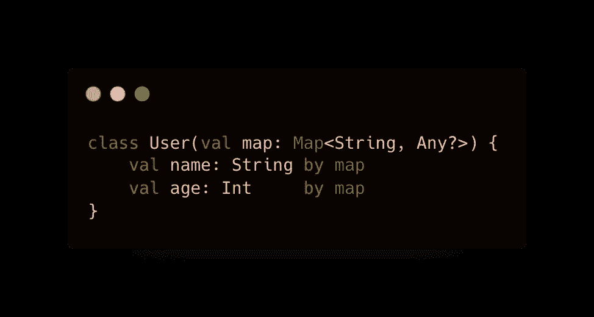

# 单一属性和委托属性的应用

> 原文：<https://blog.devgenius.io/application-of-singleton-and-delegated-properties-d8ddd18bc7b3?source=collection_archive---------1----------------------->

## 让我们通过学习 Singleton 和 Delegates 属性来实现数据库。

在 Android 中创建单例类的一个简单方法是:

现在我们知道在 **onCreate** invoke 之前，我们不会使用实例，所以实例总是不可空的。

这个解决方案似乎有点怪异。我们需要定义一个属性，然后定义一个函数来返回该属性。

我们有别的方法得到类似的结果吗？是的，我们可以将一个属性的值委托给另一个类。这些就是俗称的**委托属性**。

在一个属性中有一些我们可能需要的常见行为会很有趣地被重用，比如**懒惰**值或者**可观察**属性。Kotlin 提供了一种方法，将一个属性需要的代码委托给另一个类，而不是重复声明相同的代码。这就是所谓的 ***委托属性*** 。

当我们使用从属性中获取或设置时，调用**委托属性**的 **getValue** 和 **setValue** 。

T 是委托其行为的属性类型。 *getValue* 函数接收对类的引用和属性的元数据。*设置值*功能也接收正在分配的值。如果属性是不可变的( ***Val*** )，那么只会需要 *getValue* 函数。这是属性委托的分配方式:

> **类示例{ var p: String by Delegate() }**

**标准代表**

Kotlin 标准库中包含一组**标准委托**。这些是委托非常有用的最常见的情况，但是我们也可以创建自己的委托。

**懒惰**

它需要一个在第一次调用 **getValue** 时执行的 lambda，所以属性的初始化被延迟到那个时刻。后续调用将返回相同的值。这对于那些并不总是必需的和/或需要一些其他部件在这个部件被使用之前准备好的东西来说是非常有趣的。我们可以节省内存并跳过初始化，直到需要该属性。

默认情况下，惰性属性的计算是 *synchronized* :该值只在一个线程中计算，但是所有线程都会看到相同的值。如果不需要初始化委托的同步来允许多个线程同时执行它，则将`LazyThreadSafetyMode.PUBLICATION`作为参数传递给`lazy()`。

如果你确定初始化总是发生在使用属性的线程中，你可以使用`LazyThreadSafetyMode.NONE`。它不会产生任何线程安全保证和相关的开销。

**可观察的**

这个**委托**将帮助我们检测我们需要观察的任何属性的变化。每次调用 set 函数时，它都会执行我们指定的 lambda 表达式。因此，在新值被赋值后，我们接收到**委托属性、**旧的**值和**新的**值。**

这个例子代表了某种 ViewModel 类，它知道我的属性更改，并在每次分配新值时将它们保存到数据库中。

**可否决**

这是一种特殊的可观察值，让您决定是否必须保存该值。它可用于在保存值之前检查某些条件。

# 在地图中存储属性

一个日常用例是在一个**地图**中存储属性值。这经常出现在应用程序中，比如解析 JSON 或者执行其他动态任务。在这种情况下，您可以使用映射实例作为委托属性的委托。

在此示例中，构造函数获取一个地图:

委派属性通过与属性名称相关联的字符串键从该映射中获取值:

如果你使用一个`MutableMap`而不是一个只读的`Map`，这也适用于`var`的属性:

**如何创建自定义代表**

比方说，我们想要创建一个只能赋值一次的不可空委托。第二次赋值时，会抛出异常。Kotlin 库提供了我们的委托必须实现的两个接口:ReadOnlyProperty 和 ReadWriteProperty。应该使用哪一个取决于委托的属性是 val 还是 var。

我们可以在 Android 视图绑定中创建[自定义委托属性](https://medium.com/@dev.soni04/get-rid-of-lateinit-var-when-using-databinding-e9e8c9d6c559)来消除绑定中的 **lateinit var** 。

 [## 使用数据绑定时删除 lateinit 变量

### 让我们先来谈谈活动绑定类:

medium.com](https://medium.com/@dev.soni04/get-rid-of-lateinit-var-when-using-databinding-e9e8c9d6c559) 

我们可以做的第一件事是创建一个扩展 ReadWriteProperty 的类:

这个**委托**可以处理任何**不可空的**类型。它将接收任何类型对象的引用，并使用 **T** 作为 getter 和 setter 的类型。

现在我们需要实现这些方法。

*   如果被赋值的话， **getter** 将返回一个值，否则将抛出一个**异常**。
*   **设置器**将赋值给仍然为空的值，否则将抛出**异常**。

现在让我们创建一个对象，该对象具有一个提供新委托的函数:

> 现在让我们使用自定义委托创建一个 App 类的对象:
> **var 实例:App by delegates XT . notnullsinglevalue()**

就是这样。感谢阅读；请不要忘记鼓掌并关注关于高级 **kotlin** 的新文章。

敬请关注…

 [## 现代世界中的抽象

### 本文将定义如何在 Kotlin 世界中准确地使用现代世界中的抽象。

blog.devgenius.io](/abstraction-in-modern-world-54022c477912)  [## 每当 Dev Soni 发布时收到一封电子邮件。

### 每当 Dev Soni 发布时收到一封电子邮件。注册后，如果您还没有，您将创建一个中型帐户…

medium.com](https://medium.com/subscribe/@dev.soni04) 

给我买一杯[咖啡](https://www.buymeacoffee.com/devsoni044)

