# 绝对初学者的应用程序设计

> 原文：<https://blog.devgenius.io/application-programming-for-absolute-beginners-bf2a035efdf6?source=collection_archive---------10----------------------->

## 如何将您的普通 Mac 笔记本电脑变成一个疯狂的开发怪物


潘卡杰·帕特尔在 [Unsplash](https://unsplash.com?utm_source=medium&utm_medium=referral) 上的照片

有没有不太旧的 Mac 笔记本电脑？想学习如何开发现代应用程序吗？那么你就是这篇文章的目标。我想引导你进入有趣和令人兴奋的应用程序编程世界！

注意:本文指的是“主”分支。因为单词很重要，所以后来被重新命名为“main ”!

每台 Mac 都有相对简单的编程能力。它们被隐藏起来，这样就不会让不想编程的人感到困惑。从这些简单的工具中，我们可以加载更复杂的工具，帮助我们制作真正酷的现代应用程序。

但我应该让你的期望值持平。我说的“非常酷”是指你的应用程序可以在浏览器窗口中写出一串文本，或者加载一张图片并有几个按钮。与所有的网站建设者相比，这并不酷。满足感是你已经自己做了，并且你已经打开了一个几乎无限量的自由去做任何你想要的*事情，而不仅仅是网站建设者认为你想要的。*

*我承认，要让网站变得像网站建设者一样漂亮是一件很困难的事情。每一次奋斗都是从第一步开始的。我打算帮助你走出这第一步，让你尽快找到正确的方向。之后，你将不得不控制自己的旅程和你想要关注的事情。*

*让我从一些你可能已经知道的非常基本的东西开始。每台 Mac 的底部都是 Dock 这是一个带有图标的工具栏，应该有应用程序商店和启动板。我假设你已经知道如何在 Mac 上进行基本的导航，从 Dock 或 Launchpad 打开应用程序，用每个窗口左上角的红色按钮关闭它们。我还假设您知道如何从浏览器下载应用程序并将其安装到系统上。*

*你首先需要的是苹果开发代码的另一半，Xcode。Xcode 应该是用于 iOS 或 iPhone 开发的，但它也有其他我们通用编程需要的项目。若要查找 Xcode，请打开 App Store 并搜索它。*

*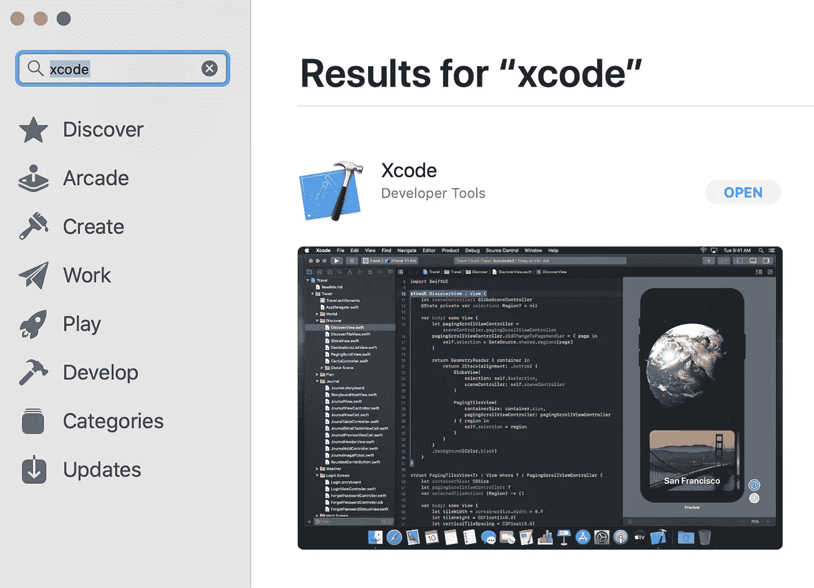*

*我的有一个写着打开的按钮，因为我已经安装了。如果你还没有安装它，它会说获取。现在就去拿吧。下载和安装可能需要一段时间，所以去喝杯咖啡休息一下吧。这将是你等待下载或构建的第一次工间休息。*

*您需要找到的第二个东西是终端模拟器。这是程序员大量打字的地方。您可以通过打开 Dock 中的 Launchpad 并打开“其他”文件夹来找到它*

*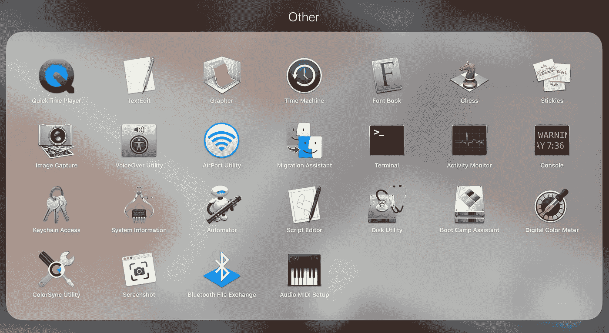*

*点击“终端”打开一个终端模拟器。*

*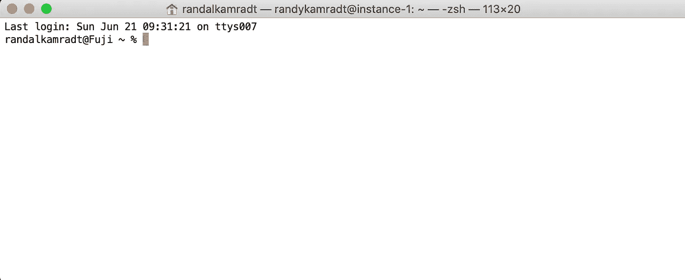*

*您的屏幕看起来可能略有不同；您可以根据自己的喜好设置不同的字体或配色方案。行`<username>@<computername> ~ %`是您的命令提示符(行中元素的顺序在您的终端模拟器上可能略有不同，但是元素应该都在那里)。当我告诉你运行一个命令，或者从命令行运行，你将在终端窗口中输入它。下面是一些需要运行的命令:*

```
*mkdir src
cd src*
```

*`mkdir`命令将创建一个新的目录或文件夹，您可以在其中存储内容。`cd`命令会将命令提示符移到那个目录中。您可以在终端中运行许多命令，但我们不会一一介绍。运行以上命令后，您应该会看到类似这样的内容:*

```
*randalkamradt@Fuji ~ % mkdir src
randalkamradt@Fuji ~ % cd src
randalkamradt@Fuji src %*
```

*请注意，`~`已经变成了`src`，命令行提示符的元素是当前目录，以帮助您跟踪您所在的位置。`~`是你的“主”目录的简写，通常是`/Users/<username>`。运行`pwd`命令看看你在哪里*

```
*randalkamradt@Fuji src % pwd
/Users/randalkamradt/src
randalkamradt@Fuji src %*
```

*这说明你在一个名为 src 的目录中，它在一个名为`<username>`的目录中，而后者在一个名为`Users`的目录中。*

*接下来你需要的是一个编辑器。这是开发世界中许多争论的来源。每个人都爱上了自己最喜欢的编辑，对某人的编辑进行诽谤绝对是“开枪”。但是我要冒险做一个推荐。Atom 编辑器是一个不错的基本编辑器，没有很多可能会让编程新手感到困惑的特性。你可以在这里下载 https://atom.io/。应该有下载按钮；点击它会将`atom-mac.zip`下载到你的下载文件夹。使用 Dock 中的 Finder，您可以找到您的下载文件夹，您可以双击`atom-mac.zip`将其展开。*

*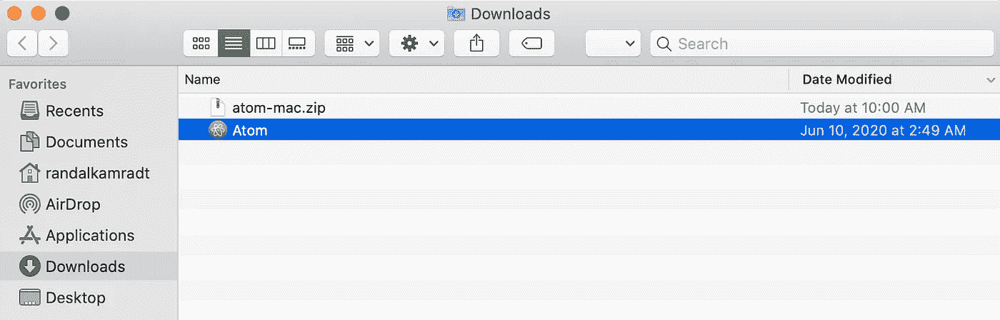*

*现在，将 Atom 应用程序拖动到左侧的 Applications 选项卡上，这应该会将它添加到您的 Launchpad 中。从那里启动它，打开一个新的 Atom 窗口。*

*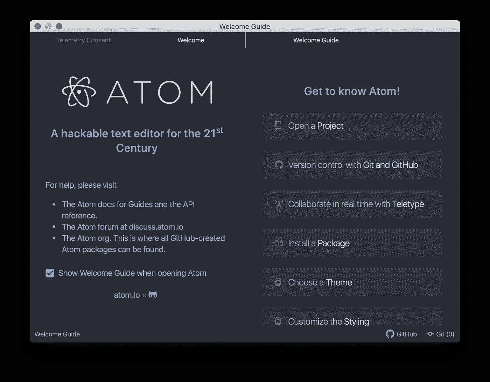*

*单击打开一个项目，它将下拉关于“项目”的信息，并给你另一个按钮来实际打开一个项目。点击那个按钮，它会把你带到一个 finder 屏幕。选择我们之前创建的`src`文件夹，它将在左侧打开一个窗格，以`src`文件夹作为树根。实际上，这是一个存储所有项目的地方，而不是一个项目本身。*

*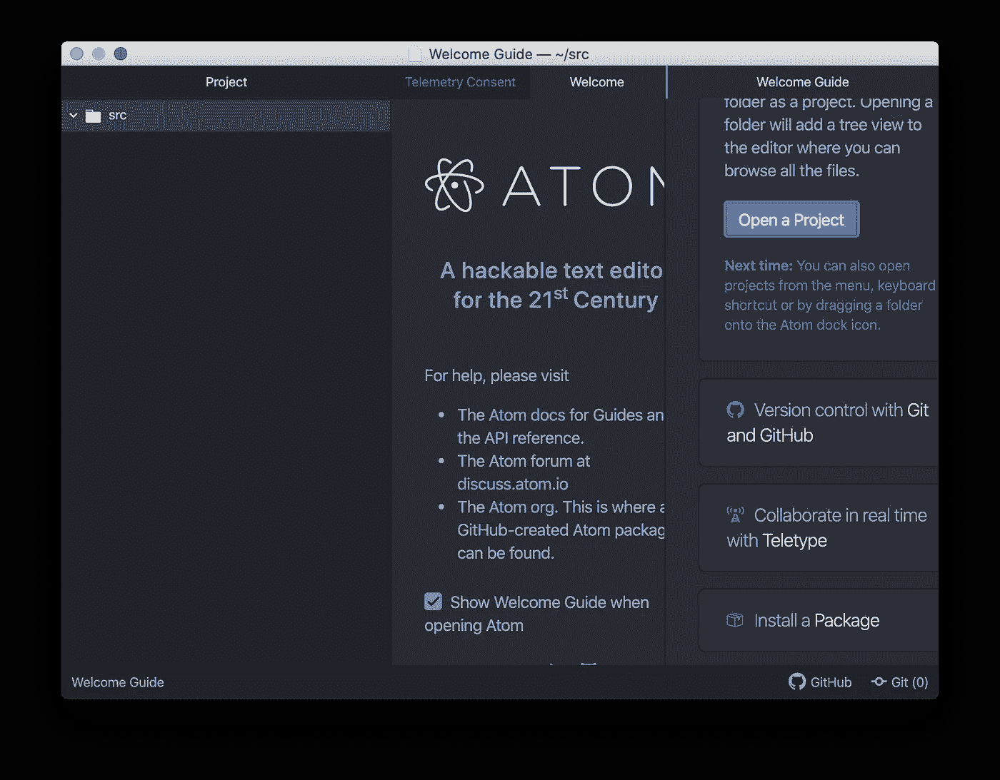*

*下一个按钮是“用 Git 和 GitHub 进行版本控制”。GitHub 是一个可以和朋友分享所有代码的地方。对于开发者来说，这有点像脸书，只是没那么令人毛骨悚然。每个开发者都应该有一个 GitHub 帐户，这将是我们的下一步。*

*如果您还没有 GitHub 帐户，请前往[https://github.com/](https://github.com/)，使用电子邮件地址、用户名和密码登录。选择免费帐户，回答几个问题，并确认您的电子邮件地址。最后，它会把你带到一个启动屏幕，询问“你想先做什么？”选择“创建存储库”,它会将您带到存储库创建屏幕。给存储库一个名称、一个描述，并告诉它创建一个 README.md。gitignore dropdown)并给它一个合适的许可证。它应该看起来像这样:*

*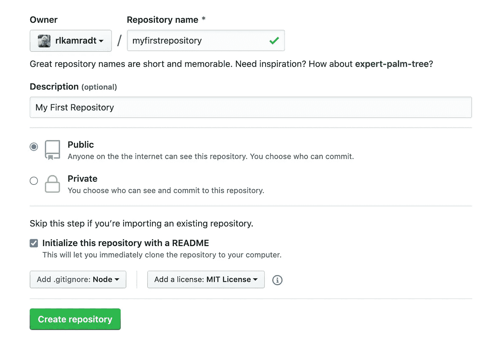*

*我使用麻省理工学院的许可证，因为它听起来真的很聪明。单击 Create repository 按钮，您的存储库将被创建！*

*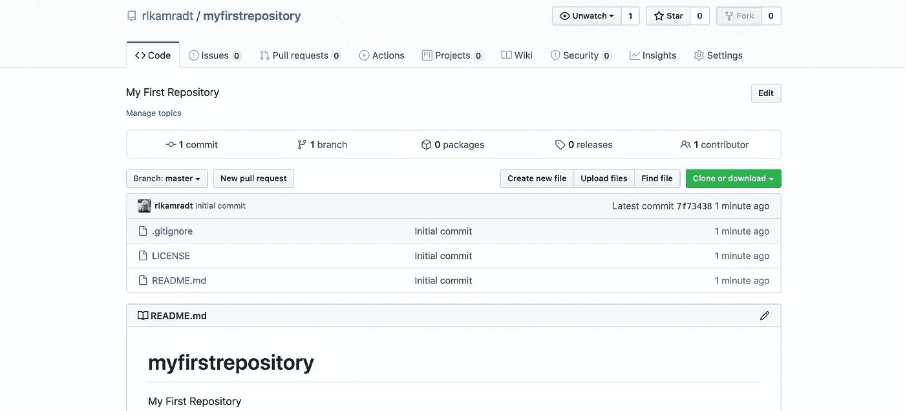*

*GitHub 库的目的是让你(或其他拥有 GitHub 帐户的人)可以轻松下载你所有的代码。你可以修改它，然后“推”回 GitHub。其他人也可以更改它，但是他们必须通过“拉请求”来请求许可，以便将他们的更改合并回库中。*

*那么，我们如何将代码下载到我们的计算机上呢？有几个方法，但是我现在要说一下我认为最简单的方法。点击绿色的“克隆”或“下载”按钮，然后选择“在桌面打开”。这将把你带到一个屏幕，上面有一个紫色的“macOS 下载”按钮。点击那个按钮，它会下载一个`GitHubDesktop.zip`文件到你的下载文件夹。就像您对 Atom 所做的那样，找到它并双击以提取它。提取后，您可以将它拖到应用程序中，然后从启动板启动它。它会要求你通过 GitHub 认证并设置 Git。然后，它会将您带到存储库屏幕。*

*您应该在右侧窗格中找到您刚刚创建的存储库。选择它，然后选择克隆按钮。它会问你放在哪里；我改变了它，所以它不进入`Documents`，而是进入我们之前创建的`src`目录。*

*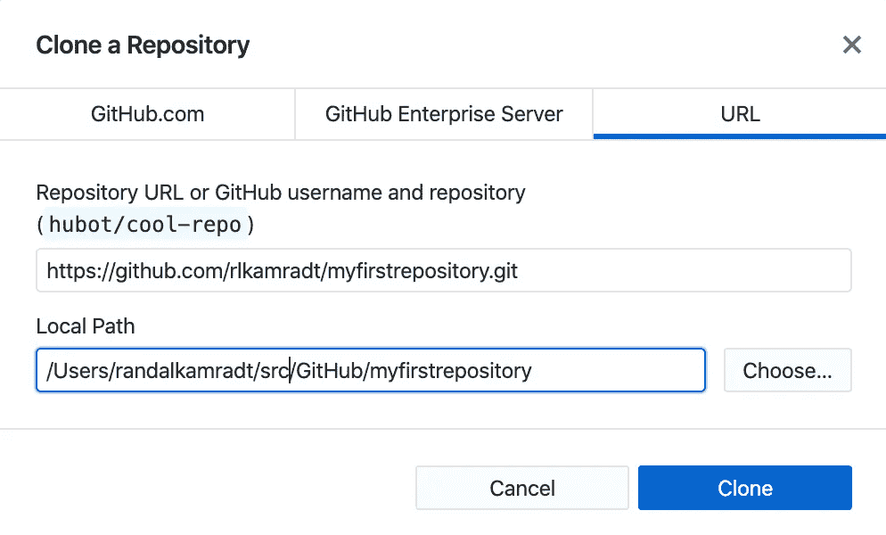*

*在下一个屏幕中，单击“在 Atom 中打开”按钮，它将在新的 Atom 编辑器中打开您的新存储库！您可以关闭所有欢迎屏幕，并单击左侧窗格中的`README.md`文件，您可以看到该文件的内容。*

*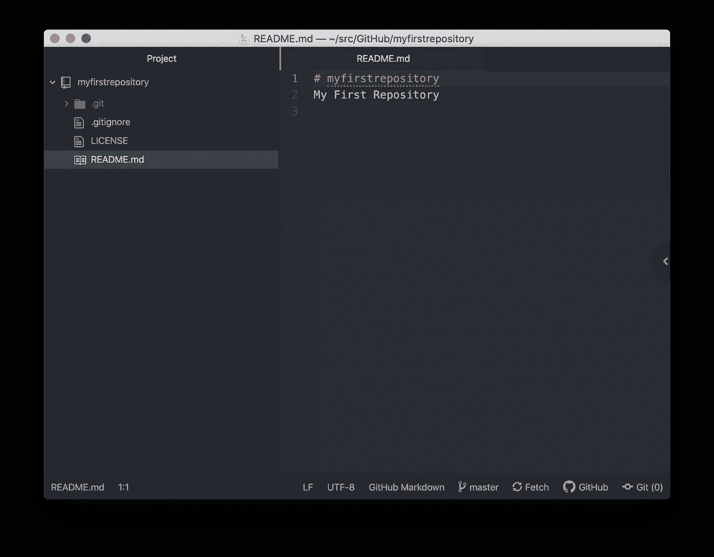*

*注意，在右边底部的栏中，显示了 GitHub 和 Git 图标。这意味着它知道 Git 正在跟踪你的更改(关于它为什么被称为‘Git’的原因，请看这里:【https://en.wikipedia.org/wiki/Git#Naming】T2)。让我们改变一下，看看会发生什么。在右侧面板中键入一些内容，然后使用 Command-s 保存(或者浏览菜单进行保存)。现在，您的屏幕应该是这样的:*

*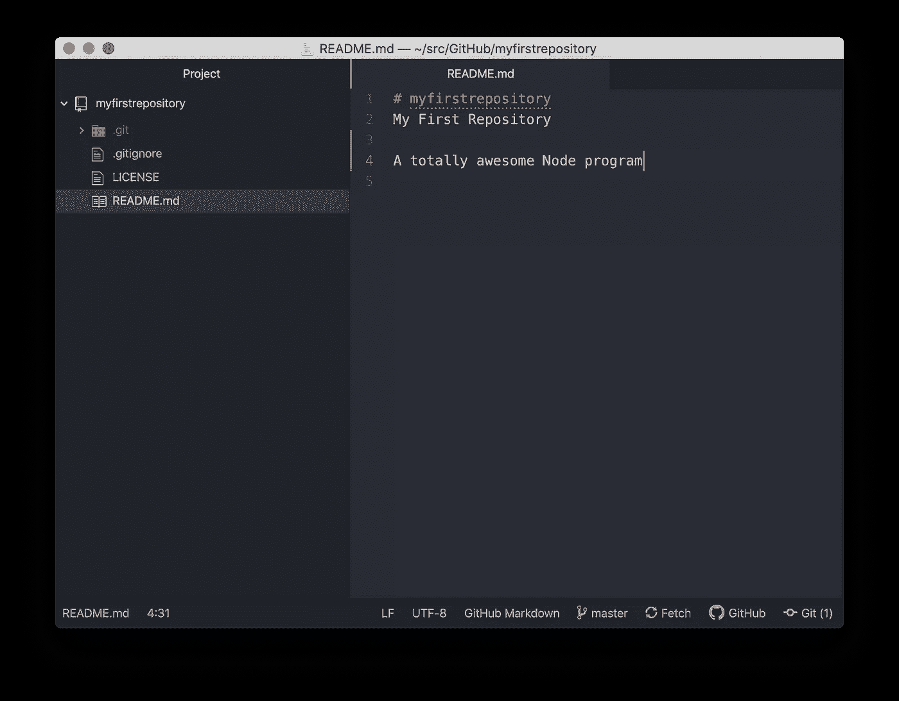*

*README.md 文件改变了颜色以表示它已被更改。现在我们可以提交更改了。*

*要提交您的更改，请单击右下角的 Git 图标，它将弹出一个提交屏幕。Git 有一个“分阶段”变更的概念，这意味着变更已经准备好提交。通常，您会将所有的更改分阶段进行，手动选择它们容易出错。单击“全部登台”按钮，并添加对您的更改的描述*

*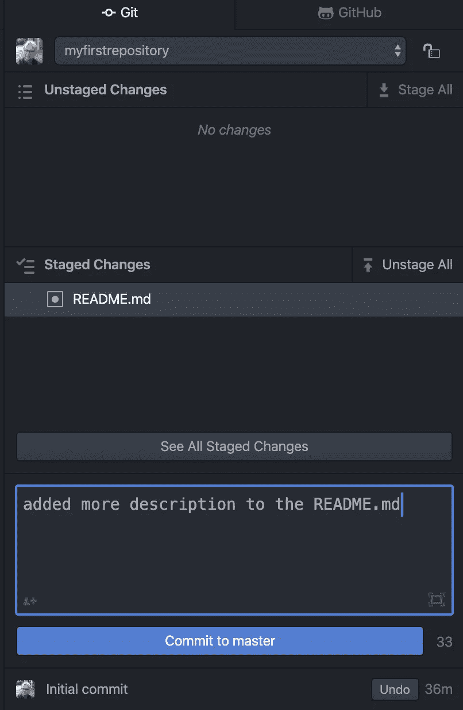*

*现在，您可以单击“提交到主服务器”按钮。但是这并没有把你的修改放回 GitHub。他们在哪里？当你下载一个 Git 库时，它实际上是一个“克隆”操作。它将整个存储库克隆到您的本地空间。如果你看左边的窗格，你可以看到一个名为`.git`的灰色目录。该目录中的文件包含了您对该存储库所做的所有提交。您可以在 Git 窗格中看到所有提交的描述，就在 Commit to master 按钮的下面。现在应该有两个，一个是你刚才做的，另一个是“初始提交”*

*这个多步骤的过程意味着我们可以在将它“推”回 GitHub 之前进行一些修改。让我们再做一些改变。我在 README.md 中添加了“一个非常棒的节点程序”,现在我必须实现它。最后，我们开始做一些真正的编程！*

## *真实编程*

*但是首先，我们必须安装一些编程语言，这是比较棘手的地方。程序员从哪里获得 MAC 电脑的编程语言？App Store 不是一个好的来源。所以他们想出了一个为我们安装开源工具的包管理器。一旦你安装了它，你就可以安装几十种不同的编程语言。它叫做家酿啤酒，简称 brew，你可以在 https://brew.sh/找到安装说明。它的安装程序是一个在你的终端模拟器中运行的脚本；您可以将该命令从他们的网站复制并粘贴到您的终端来运行它。因此，再次打开您的终端，从家酿网站复制并粘贴安装命令。安装需要一段时间，所以是时候休息一下了。*

*在安装结束时，它可能会打印出一些行，要求您运行一些其他命令，使事情可以运行。当你安装东西时，Homebrew 会尽可能地安装某个特定项目所需的所有其他东西，但有时，会出现先有鸡还是先有蛋的问题，它会要求你运行一些其他命令，然后再试一次。如果这似乎是一个永无止境的过程，不要沮丧。自制可能很棘手；如果你陷入了死胡同，不能让它工作，留下评论，我会尽力帮助你。*

*我们将安装 Node.js，这是一种 JavaScript，设计用于在浏览器之外运行。通常，我们认为 JavaScript 是浏览器的脚本语言，但是使用 Node.js，我们可以从命令行运行进程。*

```
*brew install node*
```

*这个安装还将安装`npm`和`npx`节点的包管理器和包执行器，我们将在下一步中使用它们*

*如果您的终端模拟器仍然在`src`目录中，运行命令`cd GitHub`到达我们克隆您的 GitHub 项目的目录。运行`ls`命令，列出目录内容:*

```
*randalkamradt@Fuji GitHub % ls
myfirstrepository*
```

*您应该在那里看到`myfirstrepository`(或者您所创建的存储库)。如果你迷路了，输入`cd`会把你带到主目录，然后输入`cd src/GitHub`。现在运行这些命令来构建一个简单服务器的框架(注意第一行和第二行中的`myfirstrepsitory`必须与上面列出的目录名*完全匹配):**

```
*npx express-generator -f myfirstrepository
cd myfirstrepository
npm install
npm start*
```

*在`npm start`之后，它应该打印出几行然后停止。它在做什么？它正在等待为您的浏览器提供网站。要查看它，请打开浏览器并转到 [http://localhost:3000/](http://localhost:3000/) 。*

*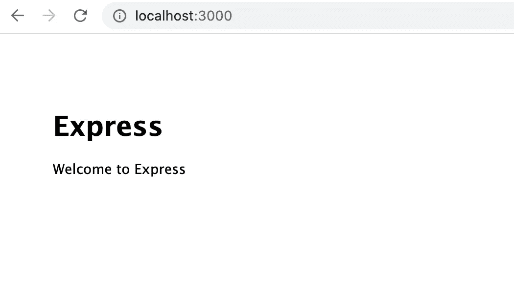*

*我希望你会觉得这很刺激！如果没有，也许编程不适合你:)当我能创作出如预期运行的东西时，我觉得非常令人满意。*

*回到您的终端，您可以看到我们的服务器打印出更多的行:*

```
*randalkamradt@Fuji myfirstrepository % npm start> myfirstrepository@0.0.0 start /Users/randalkamradt/src/GitHub/myfirstrepository
> node ./bin/wwwGET / 200 252.652 ms - 170
GET /stylesheets/style.css 200 2.954 ms - 111*
```

*服务器是一个 HTTP 服务器，它响应一组很小的命令，T1 就是其中之一。`GET`动词的意思是给我一些东西；在这种情况下，浏览器要求`/`和`/stylesheets/style.css`。在这两种情况下，服务器返回状态 200，表示正常。它还会显示用了多长时间(以毫秒为单位)以及返回了多少字符。浏览器被设计成向你输入的 URL 的主机发送`GET`命令。在这种情况下`localhost`是‘这台电脑’的简写*

*如果您正在运行 Chrome 浏览器，您可以在浏览器中按 Option-Command-i 键打开开发人员控制台。单击“元素”选项卡，查看浏览器正在渲染的所有元素。一切都是层次结构，你可以用旁边的小三角形图标来展开和收缩。您还会注意到，当您将鼠标悬停在元素上时，它们将在主屏幕上高亮显示:*

*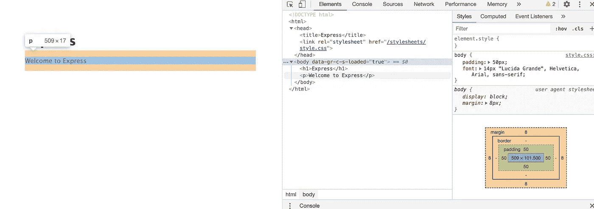*

*这里，我突出显示了“欢迎使用快递”段落标记(`<p>`)。当你构建更复杂的网站时，这个开发者控制台将会非常方便。*

*当我们生成这一切时，我们到底做了什么？如果您回到 Atom 编辑器，您可以看到:*

*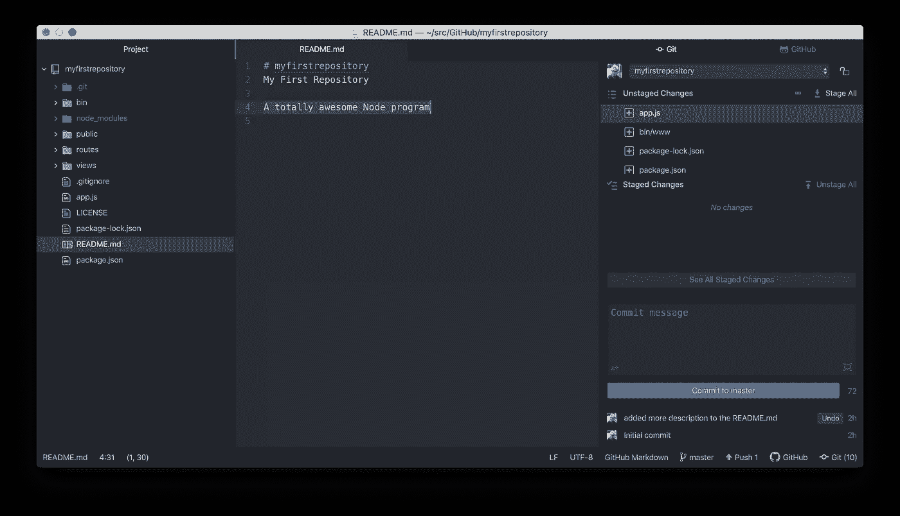*

*左侧窗格中所有的绿色都是生成器为您创建的新文件。重要的是`package.json`、`app.js`，以及文件夹`views`、`routes`、`bin/www`和`public`。`package.json`描述了应用程序，它需要什么附加库，以及如何运行它。`bin/www`是程序启动的主 JavaScript 文件。对于一个在屏幕上显示简单欢迎信息的服务器来说，所有这些看起来都很重要。但它会给你很大的成长空间。你可以打开不同的文件，看看里面有什么，然后我们会做一些改变。*

*当浏览器转到末尾没有文件的 URL 时，默认情况下，服务器会尝试显示一组文件。在大多数情况下，这些会像`index.html`一样以`index`开始。这多半是历史文物。在早期的网络时代，`index.html`是特定目录下的文件列表。但是这个指数默认保存至今，如果你探索的足够多，你会发现一个`index.js`，和`index.jade`。Jade 是一个为我们生成 HTML 的模板引擎。如果你看一下`index.js`，你会发现:*

```
*var express = require('express');
var router = express.Router();/* GET home page. */
router.get('/', function(req, res, next) {
  res.render('index', { title: 'Express' });
});module.exports = router;*
```

*这是每当服务器获得一个没有文件或路径的 URL 时，它将从`index.jade`内容中呈现。`index.jade`的内容是*

```
*extends layoutblock content
  h1= title
  p Welcome to #{title}*
```

*这是一个简化的、模板化的 HTML，将由`GET /`请求返回给服务器。所以修改`index.js`文件中的`res.render(‘index’, { title: ‘Express’ });`行，这样标题就不是`'Express'`了。*

```
*var express = require('express');
var router = express.Router();/* GET home page. */
router.get('/', function(req, res, next) {
  res.render('index', { title: 'My awesome server' });
});module.exports = router;*
```

*确保使用 Command-s 保存。现在回到终端窗口，键入 Control-c 停止服务器，并键入`npm start`重新启动它。现在，回到浏览器，刷新页面:*

*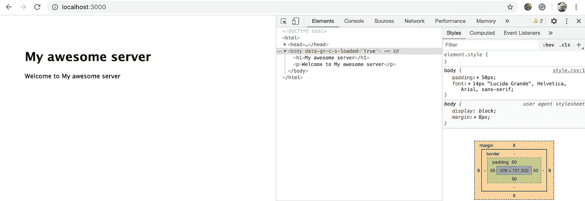*

*现在你的应用就牛逼多了！再做一个改动，然后我们会把它发送回 GitHub，你可以在那里向你的朋友炫耀。在`public/stylesheets/style.css`中，我们可以给网站添加一些令人惊叹的颜色。什么颜色比红色更酷？更改`public/stylesheets/style.css`使所有文本变大变红:*

```
*body {
  padding: 50px;
  font: 24px "Lucida Grande", Helvetica, Arial, sans-serif;
  color: #FF0000;
}a {
  color: #FF0000;
}*
```

*再次按下 Control-c 键停止，按下`npm start`键重启(提示，在终端中按下向上箭头将调出之前的命令)。现在刷新你的浏览器。*

*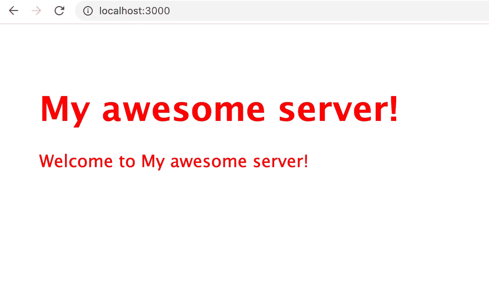*

*请注意，我说的是“我的牛逼服务器”，而不是“我的牛逼网站”。这一点非常重要，因为您正在构建的是一个服务器。服务器可以运行各种在浏览器代码中很难或不可能实现的技巧。他们可以与数据库和其他服务器对话。他们可以通过 cookies 和其他状态机制记住你是谁。他们可以动态地创建 HTML。*

*让我们策划、提交并把这一切推回 GitHub。回到 Atom 编辑器的 Git 窗格中，您可以单击“Stage All”按钮，为您的提交添加描述，然后单击“Commit to master”按钮。*

**

*现在，回到你的 Github 桌面应用，你可以推回到 GitHub。*

*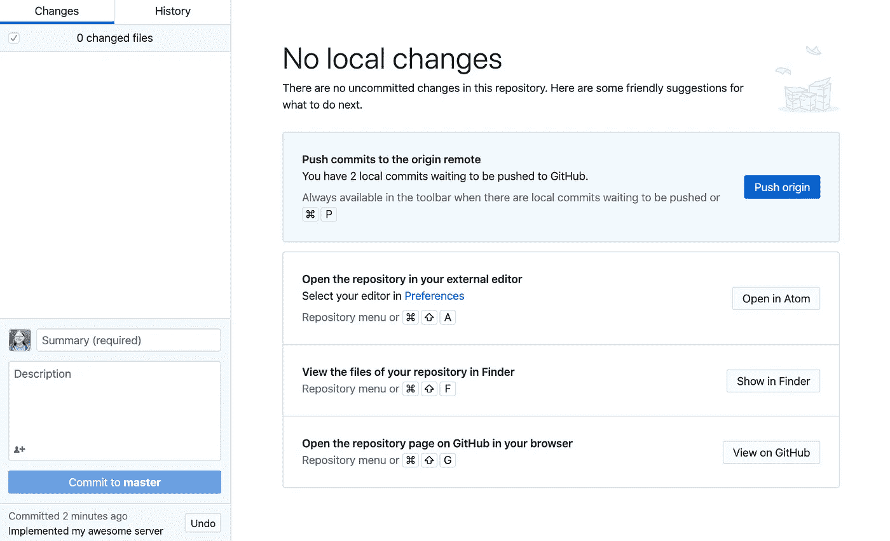*

*上面写着“不允许局部改动”，这可能会让人感到困惑。这仅仅意味着你已经提交了所有的变更，一切都准备好了。所以点击“推送原点”按钮，这将把所有代码推回 GitHub。Git 有一个“原点”的概念，即存储库被克隆的地方。这很有可能是你想要去的地方。*

*当你在一个团队中工作时，你几乎不会将你的代码提交给 master，这正是我们一直在做的。最常见的方法是创建一个“分支”，提交到分支，然后您可以推送并创建一个“拉式请求”供您的团队成员审查。一旦每个人都批准了，您就可以将分支合并回主数据库，每个人都可以用“pull”命令更新他们的本地存储库。但这本身就是一整篇文章。*

*如果你还在使用 GitHub 桌面应用程序，你可以点击“在 GitHub 上查看”按钮，它会把你带回 GitHub，在那里你会看到你所有的修改都被安全地保存起来，并且全世界都可以看到。*

*也许使用为您创建所有代码的 express generator 感觉像是被丢进了一个迷宫，必须找到出路。但是当你得到第一份编程工作时，你的老板可能不会让你从头开始写程序。他们会给你指出一个可能写得很差的代码库，并告诉你在不破坏其他任何东西的情况下给站点添加一个新按钮。*

*我希望我已经为您提供了继续学习编程所需的所有信息。我不打算在付费墙后面发表这个，所以大家可以学习。我希望外面的一些孩子可以乞求他们的父母凑够钱给他们买一台 Mac 电脑，并学习一项有用的技能。尤其对于女性和有色人种来说，软件开发是一个平等的行业。如果你能证明你能做到，你就能获得成功。*

*我相信你们中的一些人可能会奇怪，为什么我不在便宜得多的 Windows 笔记本电脑或 PC 上提供说明。在我看来，Windows 提供了高度的开发阻力。在我 30 多年的职业生涯中，大部分时间我都在使用 Windows，Mac 是迄今为止最简单的开发环境。编程已经够难的了，支付额外的费用购买一台 Mac 电脑将会大大有助于你更容易地学习编程。你仍然可以用一台 Windows 笔记本电脑做我在这里谈到的所有事情，但是你可能要经历一些磨难才能完成它。*