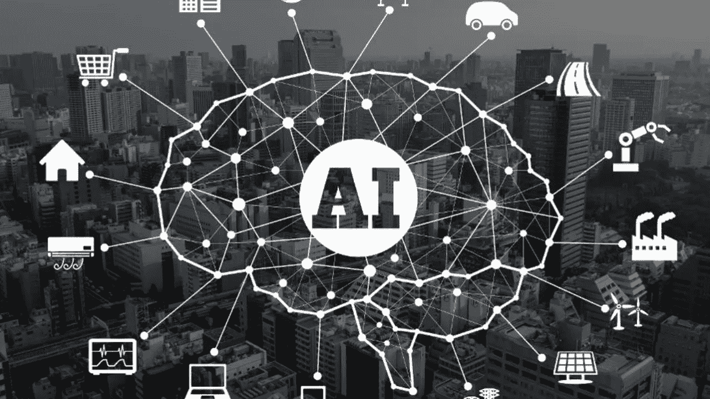
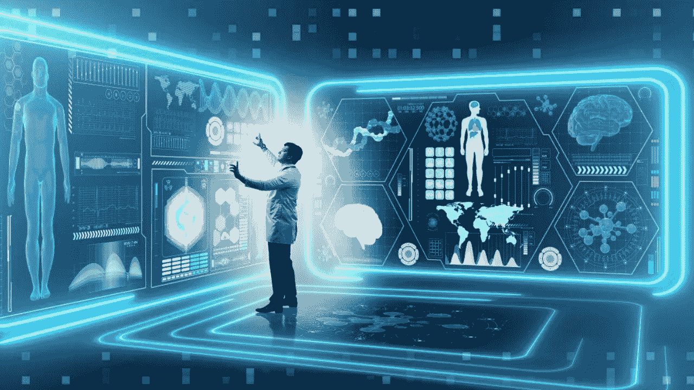
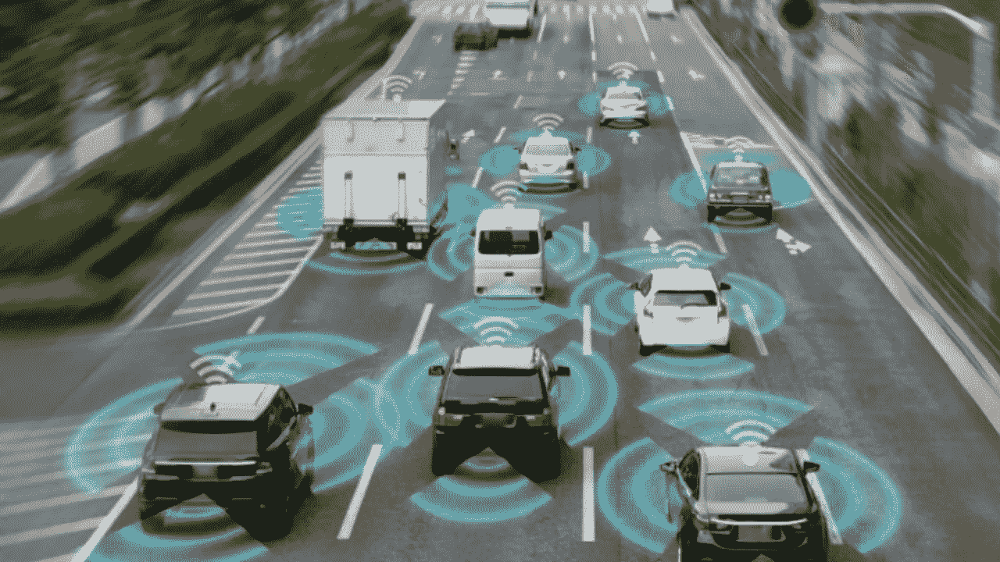
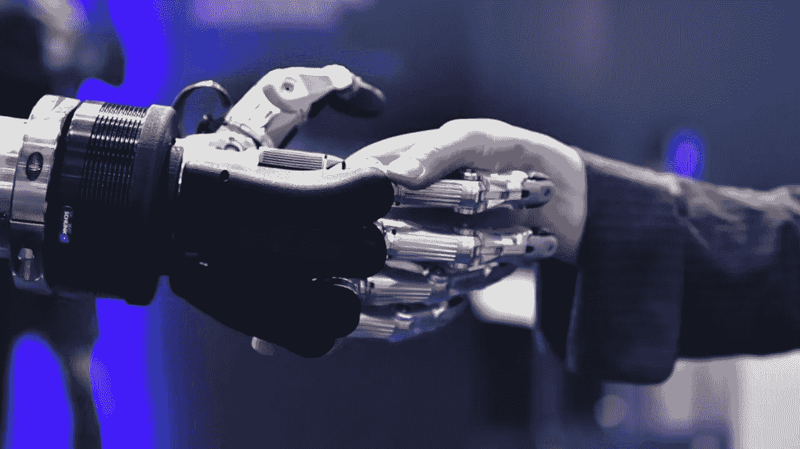
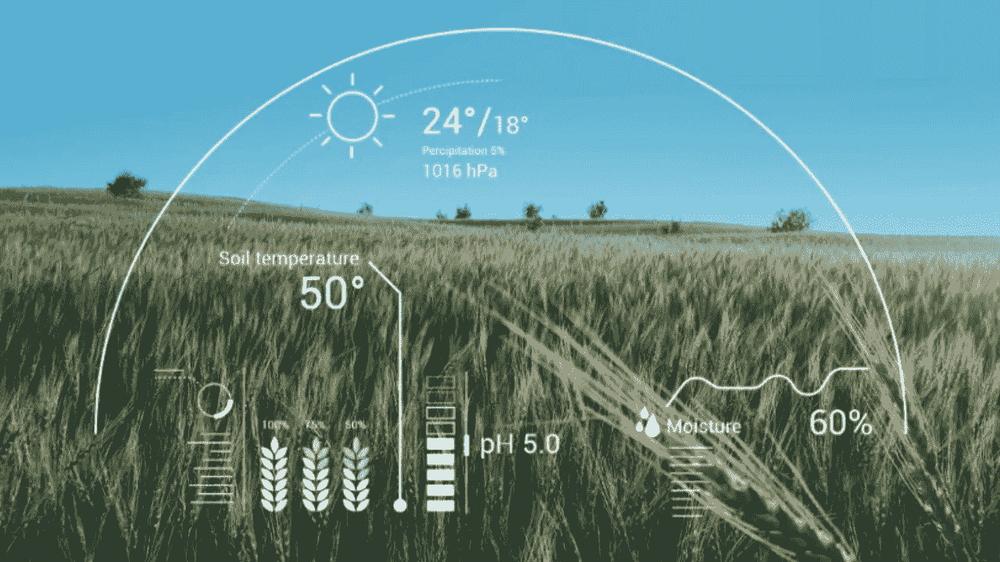

# 人工智能的应用

> 原文：<https://blog.devgenius.io/applications-of-artificial-intelligence-bfd9d405d388?source=collection_archive---------21----------------------->

在现代世界，人工智能经常成为头条新闻，并成为一个趋势性的话题。基于我在这里提到的**技术的人工智能在世界的不同部门用于不同的目的。**

**然而，使用人工智能的主要目的是更容易和有效地管理日常工作。此外，在将人工智能应用于人类日常工作流程的过程中，也考虑了工作的速度和效率。因此，目前，人工智能几乎应用于社会的所有领域，如医疗保健、交通、娱乐、营销、银行、金融、游戏、安全和农业。**

**让我们来看看 AI 在这些部门是如何使用的。**

## ****1。医疗保健中的人工智能****

****

**随着技术的发展，科学家们多年来对在医疗保健领域使用人工智能进行了大量研究。因此，人工智能技术在医疗保健领域有许多用途。有很多国家研发的机器人，可以进行辅助医生等医疗活动。此外，其中一些机器人也用于外科手术，并取得了成功的结果。当治疗患有病毒性疾病的患者时，这些机器人可以用于接触患者，并在医生和患者之间建立一个交流平台。最近的事件是医院使用这种技术治疗新冠肺炎疫情患者的方式。**

**除了机器人，还有许多医疗服务供应商开发的虚拟护理助理服务。这些是用来监控病人和提供指导的，比如按时服药。此外，虚拟护理助理有助于保持医疗服务和患者之间的良好沟通。一天中任何时间的可用性是这些虚拟护理助理服务的优势。此外，人工智能用于医疗保健管理系统，以更高效地提供服务。**

## ****2。运输中的人工智能****

****

**交通部门是另一个随着人工智能及其技术的实施而取得巨大进步的部门。目前有特斯拉、谷歌等公司研发的自动驾驶汽车。虽然目前使用的自动驾驶车辆数量有限，但这将是不久的将来的趋势。此外，中国和新加坡等国家也在使用自动驾驶公交车。**

**此外，在机器学习算法的帮助下，人工智能也被用于交通管理。交通是现代世界的一个重要问题，人工智能被用来寻找有效的解决方案。更进一步，人工智能被用于预测航班延误。因此，它可以节省成本，也可以帮助乘客以更好的方式管理时间。此外，人工智能在飞行中被用于自动驾驶模式。除了客运，人工智能还用于货物运输。**

**人工智能驱动的无人机的使用就是最好的例子。这是一种将商品送到顾客家门口的有效方法，因为它不会造成交通堵塞，而且环保。**

## ****3。娱乐和游戏中的人工智能****

****

**人工智能也用于娱乐领域。例如，网飞等品牌使用人工智能来改善定制功能和推荐。随着机器学习和深度学习等技术的使用，这些品牌专注于提高服务和客户满意度。**

**此外，人工智能技术被用于搜索优化，以提供客户想要的准确内容。此外，现代电影也在制作阶段使用了人工智能技术。**

**游戏行业也随着人工智能的使用而发展。从简单的国际象棋游戏到现代游戏，人工智能已经被用来改善用户的游戏体验，使其具有更逼真的功能。目前，有几个移动游戏和其他应用程序使用人工智能来改善用户体验。然而，人工智能在娱乐中最受欢迎的用途之一是虚拟现实耳机和虚拟现实护目镜的创新，为用户提供了逼真的体验。**

## ****4。社交媒体中的人工智能****

****

**社交媒体平台是世界上使用最多、最受欢迎的领域之一。社交媒体不仅用于交流，还用于商业活动。因此，这些社交媒体平台的受欢迎程度与日俱增。因此，脸书、Instagram、Twitter 和 YouTube 等社交媒体平台也使用人工智能来改善用户体验。**

**YouTube 使用人工智能进行推荐和搜索优化过程，以改善用户体验。脸书正在使用深度学习和图像识别技术，根据用户的好恶来改善用户体验。Instagram 还使用深度学习技术为用户提供相关内容。**

**随着自然语言处理的使用，Twitter 使用 AI 机器人来反击传播假新闻和种族主义的账户。此外，所有这些平台都使用人工智能技术根据用户的兴趣为商业内容做广告。然而，人工智能在社交媒体中的实施所产生的影响已经在使事情变得简单和有效方面获得了成功的结果。**

## ****5。商业和营销中的人工智能****

****

**人工智能技术的发展也影响了商业和营销部门。近年来，人工智能已经成为营销和商业领域的重要组成部分。人工智能技术的使用是使网上购物更受欢迎的主要原因之一。在线购物网站中的产品推荐过程是使用人工智能来完成的。**

**此外，特定的基于受众的广告是使用人工智能完成的。聊天机器人通过与客户保持良好的沟通来改善客户服务。自然语言处理和语音识别是在这个营销和商业领域使用的人工智能技术。随着基于人工智能的技术的实施，营销和商业部门近年来有了很大的改善。**

## ****6。农业中的人工智能****

****

**农业是随着技术的使用而得到革命性发展的部门之一。农业中的人工智能允许农民有效地监控作物和土壤健康。此外，人工智能农业机器人被用作农民的助手，并为劳动力问题提供了解决方案。通过使用人工智能技术，农民可以分析对农药的需求，减少农药的使用，从而降低成本。**

**此外，利用人工智能技术预测天气状况的能力让农民有机会决定何时需要收获作物。它可以帮助农民通过增加产量获得更多的利润。因此，人工智能技术的显著崛起通过提高工作效率加强了农业部门及其业务。**

**观看以下视频了解更多关于这个话题的信息。**

***你对此有什么想法？如果你有任何问题或其他事实，请在下面评论。敬请关注下一篇文章。***

***业务查询，可以在这里* ***找我* [***。***](https://linktr.ee/Chamod_Kavishka)****