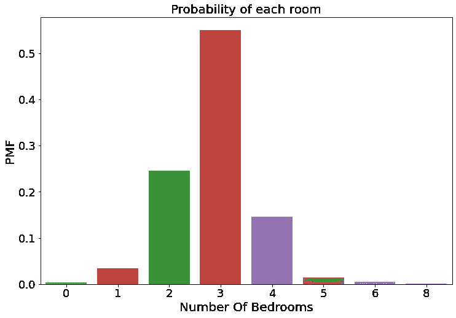
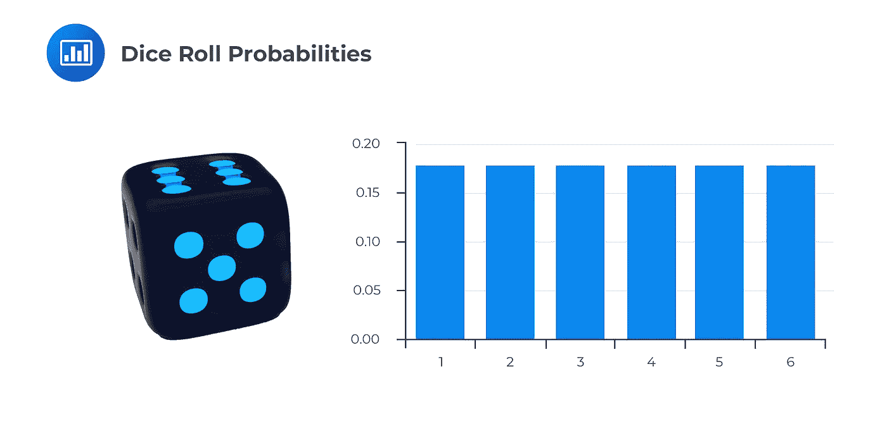

# 在真实数据中应用概率分布

> 原文：<https://blog.devgenius.io/apply-probability-distributions-in-real-data-90a9a87a2dd7?source=collection_archive---------3----------------------->

在这个时代，数据变得非常重要，因为它被认为是 21 世纪的石油。数据无处不在，所有机构和国家每天都在产生大量数据。如今最令人兴奋的领域之一是数据科学领域。要成为一名数据科学家，你必须具备统计概念和概率的知识，因此本文将带你踏上一段有趣的旅程，了解概率分布以及如何在真实数据中应用它们。在这本笔记本中，我们将解释概率分布，并将其应用于真实数据集。


```
import pandas as pd 
import numpy as np 
import seaborn as sns 
from scipy import stats 
import matplotlib.pyplot as plt
from empiricaldist import Pmf , Cdf
from matplotlib.ticker import PercentFormatter
```

我们将解释波士顿大厦、泰坦尼克号、120 年奥运历史和斯坦福开放治安项目数据的概率分布。Kaggle 上的这些数据这些数据的链接:

波士顿房屋:[https://www . ka ggle . com/competitions/house-prices-advanced-regression-techniques](https://www.kaggle.com/competitions/house-prices-advanced-regression-techniques)

泰坦尼克号:【https://www.kaggle.com/competitions/titanic 

120 年奥运历史:[https://www . ka ggle . com/datasets/hee soo 37/120 年奥运历史-运动员与成绩](https://www.kaggle.com/datasets/heesoo37/120-years-of-olympic-history-athletes-and-results)

斯坦福开放警务项目:[https://www . ka ggle . com/datasets/faressayah/Stanford-Open-Policing-Project](https://www.kaggle.com/datasets/faressayah/stanford-open-policing-project)

```
df_titanic = pd.read_csv('../input/titanic/train.csv')
df_house = pd.read_csv('../input/house-prices-advanced-regression-techniques/train.csv')
df_police = pd.read_csv('../input/stanford-open-policing-project/police_project.csv')
df_olympic = pd.read_csv('../input/120-years-of-olympic-history-athletes-and-results/athlete_events.csv')
```

我们将使用此函数来标记轴

```
def label_graph(ticksfont , x_label , y_label , title_label , fontsize):

    plt.xticks(fontsize = ticksfont)
    plt.yticks(fontsize = ticksfont)

    plt.xlabel(x_label, fontsize = fontsize)
    plt.ylabel(y_label , fontsize = fontsize)
    plt.title(title_label, fontsize = fontsize)
```

概率分布可以分为两类

**1-离散分布**

**2-连续分配**

我们将从解释离散分布开始，但首先我们要理解三个概念，这将有助于我们理解概率分布。

这些概念是:

> **1-概率质量函数(PMF)**
> 
> **2-累积分布函数(CMF)**
> 
> **3-概率密度函数(PDF)**

如果我们想知道如果我们再次收集这些数据或根据样本数据处理人口数据，找到有一定数量房间的房子的概率是多少

我们可以使用概率密度函数或概率质量函数

## 1-概率质量函数

> 概率质量函数(PMF)用于表示分布，从每个值映射到其概率。概率是以样本大小 n 的分数表示的频率。为了从频率得到概率，我们除以 n，这称为归一化。它与区分变量一起使用

我们现在将处理波士顿房屋数据。

例如，我们想知道找到有三间卧室的房子的概率是多少

注意:如果你在自己的设备上做自己的项目。你可以使用**经验值**套装中的 **Pmf** 。像这样

```
fig, ax = plt.subplots(figsize=(12,8))
pmf = Pmf.from_seq(df_house[‘BedroomAbvGr’])
pmf.bar()label_graph(18 ,’Number Of Bedrooms’ , ‘PMF’ , ‘Probability of each room’ , 20 )
```


在上图中，你可以看到找到有三间卧室的房子的概率约为 55%

如果你在 kaggle 上工作，你将不能使用这个包，因为 Kaggle 不允许安装这个包，不要担心，有另一种方法可以通过使用 seaborn 来知道概率

```
fig, ax = plt.subplots(figsize=(12,8))probabilities = df_house[‘BedroomAbvGr’].value_counts(normalize=True) 
sns.barplot(probabilities.index, probabilities.values)label_graph(18 ,’Number Of Bedrooms’ , ‘PMF’ , ‘Probability of each room’ , 20 )
```



PMF 在处理许多独特的价值观方面有局限性。在下图中，您会看到有许多条形，并且您无法确定每个值的概率


因此，如果你想处理一个包含许多唯一值的列，或者处理连续值，如价格、面积等。，可以使用**【累积分布函数(CDF)】T5**

## 2-累积分布函数(CDF)

> CDF 是描述连续变量分布的另一种方法。CDF 的优点是它可以被定义为任何种类的变量(离散的、连续的和混合的)。

如果我们想知道在你自己的设备上找到售价 100，000 或更低的房子的概率，你可以像这样使用**经验值软件包**中的 **Cdf** :

```
fig, ax = plt.subplots(figsize=(12,8))
sns.set_style(“whitegrid”)cdf = Cdf.from_seq(df_house[‘SalePrice’])
cdf.plot()ax.annotate(“25% of houses <= 129900$ “, xy=(140000, 0.24), xytext=(150000, 0.06) , fontsize = 18 ,
 arrowprops={‘arrowstyle’: ‘-|>’, ‘lw’: 2 , ‘color’ : ‘b’})plt.plot(129900 , 0.25 , marker = ‘o’ , color = ‘r’ , markersize = 15)
label_graph(18 ,’Sale Price’ , ‘CDF’ , “ “ , 20 )
```


正如你在上面的图表中看到的，我们有 25%的机会找到价格在 129，900 美元或更低的房子。

对于 **Cdf** 和 **Pmf** 在 **empiricalcdf** 包中有一个很棒的特性，例如，如果你想知道某个值的概率是多少，你可以将这个值传递给你之前创建的变量 Cdf 或 Pmf。反之亦然，也就是你可以通过概率，看到它的值，比如

```
print(‘The probability of 100000$ is : ‘ + str(cdf(100000)))
print(“The value of probability 25% is : “ + str(cdf.inverse(0.25)))The probability of 100000$ is : 0.08424657534246575
The value of probability 25% is : 129900.0
```

还有另外两种方法来绘制 **Cdf** 一种使用函数，另一种使用 **seaborn**

**Cdf** 使用功能:

```
def cdf(data):
 “””Compute CDF for a one-dimensional array of measurements.”””
 # Number of data points: n
 n = len(data)# x-data for the ECDF: x
 x = np.sort(data)

 # y-data for the ECDF: y
 y = np.arange(1, n+1) / nreturn x, y
```

绘制 cdf 函数

```
fig, ax = plt.subplots(figsize=(10,6))
x_price , y_price = cdf(df_house[‘SalePrice’])
plt.plot(x_price , y_price)
label_graph(18 ,’Sale Price’ , ‘CDF’ , “ “ , 20 )
```


使用 seaborn 的 cdf:

```
fig, ax = plt.subplots(figsize=(10,6))sns.ecdfplot(data=df_house, x="SalePrice")#label axis
label_graph(18 ,'Sale Price' ,  'CDF'  , " " ,  20 )
```


## 三概率密度函数(PDF)

> 概率密度是为每个可能的结果分配相对可能性的函数。我们稍后会处理它

很好，现在让我们来解释离散概率分布

## 1-伯努利分布

> 这种分布与二进制分类有关。(例如，这个人生病或不生病的概率有多大？或者该客户购买或不购买该产品的概率是多少等等)

在泰坦尼克号数据集中，我们想知道船上的人幸存的概率是多少？

```
sns.set_style(“white”)
fig, ax = plt.subplots(figsize=(12,8))# calculate the probability for each class# perform Bernoulli Distribution using empiricaldist package 
#pmf_survive = Pmf.from_seq(df_titanic[‘Survived’])
#pmf_survive.bar()#another way to perform Bernoulli 
probabilities = df_titanic[‘Survived’].value_counts(normalize=True) 
ax = sns.barplot(probabilities.index, probabilities.values, palette=’PuBuGn_r’)# to write percentage on the top of bar 
patches = ax.patches
for i in range(len(patches)):
 x = patches[i].get_x() + patches[i].get_width()/2
 y = patches[i].get_height()+.001
 ax.annotate(‘{:.1f}%’.format(y), (x, y), ha=’center’ , fontsize = 18)#plt.locator_params(integer = True)label_graph(18 ,’Survived’ , ‘Probability’ , ‘Bernoulli Distribution’ , 20 )
```


0 表示未存活

1 指生存

一个人活不下来的概率高于他活下来的概率

## 2-二项分布

> 二项式分布是一系列 n 次独立实验中成功次数的离散概率分布。它通常用于模拟从 N 个样本中抽取替换样本的成功次数

让我们解释一下这个定义

在任何实验中，这个实验的结果不是成功就是失败，在概率分布中，我们是根据我们的兴趣来决定成功与失败的人

例如，如果我们从泰坦尼克号幸存者中随机抽取 10 个人，我们在这个样本中找到 3 或 4 个人的概率是多少？

在这个例子中，我有兴趣知道。在我画的样本中找到一定数量男性的概率是多少？这个对我来说算是成功，失败就是样本中包含女性。

> 成功的概率= p
> 
> 失败的概率是 1 — p

二项式分布的数学公式是:


> 其中:
> 
> n:样本数据
> 
> x:我们预测的数字(我们想知道在样本中找到一个或多个男性的概率是多少)
> 
> p:我们根据人口数据中我们所关心的(这里我们关心的是男性)而确定的成功的百分比

```
#get percentage for male and female in dataset
survived = df_titanic[df_titanic[‘Survived’] == 1]
survived[‘Sex’].value_counts(normalize = True)
```

确定变量并绘制二项式分布图

```
n = 10 
p = 0.31 
x = np.arange(0 , 5)fig, ax = plt.subplots(figsize=(12,8))# calculate and plot binomial distribution
pmf = stats.binom.pmf(x , n , p)
pps = plt.bar(x , pmf)
print(pmf)# write percentage on the top of bar 
for w in pps:
 height = w.get_height()
 ax.text(x=w.get_x() + w.get_width() / 2, y=height+.0001 ,
 s=”{}%”.format(round(height ,2)),ha=’center’ , fontsize=20 , color = ‘r’)# convert x-axis from float type to int type
plt.locator_params(integer = True)# label the axis
label_graph(15 ,’Surviving men’ , ‘Probability’ , f”Binomial Distribution(n = {n} , p={p})” , 20 )
```


## 3-多项式分布

在二项分布中，我们总是有两种分类(我们可以说这是一个伯努利过程),我们有兴趣了解其中一种分类的详细情况(也就是说，我们有兴趣了解样本中男性的数量)

但是如果我们想知道不止一个事件发生的概率呢？

举个例子，我们将处理记录交通违规的数据，在该数据中有一列包含违规者的性别(黑人-白人-西班牙裔-亚裔-其他)

例如，如果我们再次抽取一个等于 10 的随机样本，这个样本中有 5 个白人、2 个黑人和 3 个亚洲人的概率是多少？

首先计算每个性别的百分比

```
df_police[‘driver_race’].value_counts(normalize = True)
```

注意元素 x 和 p 中的顺序，x 中的第一个元素是白人的数量，p 中的第一个元素是数据中白人数量的百分比，x 的元素之和必须等于随机样本

```
stats.multinomial.pmf(x = [5 , 2 , 3] , n = 10 , p=[0.7 , 0.14 , 0.02])
```

## 4-超几何分布

在深入超几何之前，我们有一个重要的问题需要回答。

二项式分布和超几何分布有什么区别？

两种发行版的主要区别在于替换原则。

**置换的原理是什么？**

假设我们要计算其中一所大学学生的平均体重这所大学的学生人数等于 10，000 名学生(人口数据)，我们将从这些学生中随机抽取一个样本，假设这个样本由 10 名学生组成。我将第一个样本返回到总体数据，并抽取另一个样本(我可能会在这个样本中再次获得相同的学生)，这就是替换原则。我有能力提取人口数据的样本，然后再返回给它

在没有替换的情况下，如果我从人口数据中随机抽取一个样本，我不能返回这个样本一次，例如，如果我们抽取一个随机样本的人，发现其中一些人感染了冠状病毒，我们会离开这些人，再次做实验，并抽取新的随机样本，还是将这些感染者隔离？我们一定会孤立他们。这是一个**超几何分布**

在实际应用这个分布之前，让我们总结一下所有这些。如果你只是在探索你的数据，例如你想知道样本中有多少男性，有多少男性在泰坦尼克号沉没时幸存，或者有多少女性员工在这个职位上得到提升，我们将使用二项分布。但是，如果你打算根据这个样本采取行动，例如，你吊销了吸毒者的驾照，或者你隔离了感染艾滋病或冠状病毒的人，在这种情况下，我们将使用超几何分布

让我们用我们的数据来解释这种分布。在斯坦福警察项目的数据中，有一栏叫做 drugs_related_stop。这一栏记录的是这个人是否吸毒。在这种情况下，我们应该对滥用者进行处罚，无论是吊销驾照还是罚款或监禁，因此我们将使用超几何分布

首先，我们将计算使用和不使用药物的人数，从中我们看到使用药物的人数是 815

```
df_police[‘drugs_related_stop’].value_counts()
```

其次，我们在 scipy 中使用超几何函数，它的参数是

```
x_hyper = np.arange(0, 8)
p = 91741 
N = 815
n = 10
```

> **哪里:**
> 
> **x_hyper:是我们要预测的人数(我们想知道样本中有多少人有可能是吸毒者)。**
> 
> 人口数据。
> 
> **N:是人群(吸毒人群)中成功的人数。**
> 
> **n:样本数据。**

```
fig = plt.figure(figsize =(15 , 8))
ax = fig.add_subplot(111)
ax.grid()hypergeom = stats.hypergeom.pmf(x_hyper ,p , N, n)ax.plot(x_hyper, hypergeom, ‘o’ , color = ‘b’ , markersize = 15)
ax.vlines(x_hyper, 0, hypergeom, lw=3 , color = ‘black’)# label the axis
label_graph(15 , ‘drugs related stop’ , ‘hypergeom PMF’ ,’Hypergeomatric Distribution’ , 20 )
```

## 5-几何分布:

> 是一个概率离散分布代表你在一系列伯努利试验(实验的成功或失败)中获得成功之前的失败次数，再一次，你决定了实验的成功或失败

如果我们想知道 c 罗打进第二个点球的概率是多少。在这种情况下，我们可以使用几何分布

这种分布的方程式是:


> **其中:**
> 
> **n =试验次数。**
> 
> **P =成功的概率。**

c 罗罚分 0.83 (p = 0.83)


我们也将看到克里斯蒂亚诺打进第三和第四球的可能性

```
sns.set_style(‘white’)
fig, ax = plt.subplots(figsize=(15,8))for number in range(1 , 5):
 probability = stats.geom.pmf(k=number, p=0.83)
 pps = ax.bar(number , probability , color = ‘b’)
 ax.locator_params(integer=True)

 for p in pps:
 height = p.get_height()
 ax.text(x=p.get_x() + p.get_width() / 2, y=height+.002 , s=”{}%”.format(round(height ,2)),ha=’center’ , fontsize=20)# label the axis
label_graph(15 , ‘Penalty kicks’ , ‘Geomatric PMF’ ,’Geomatric Distribution’ , 20 )
```


**c 罗打进第二个点球的概率= 0.14%**

## 6-均匀分布:

> 当所有事件发生的概率相同时，那么我们的分布就是均匀分布。

例如，你会或不会被一份新工作或新奖学金接受的概率是 50 比 50。同样，当掷骰子时，骰子的六个面出现的概率是 1/6 (0.16%)

您可以使用来自 empiricalcdf 的 Pmf 或者使用 seaborn 来执行这个分发



## 7-泊松分布:

> 是一种概率离散分布，用于显示某一事件在特定时期内可能发生的次数

如果我们想知道交通官员在特定时间内(假设全天)拦下一个或两个或更多司机的概率，在这种情况下我们将使用泊松分布

泊松分布方程是:


> ***其中:***
> 
> ***μ = 1 / λ(平均事件数)***
> 
> ***×事件数=***
> 
> ***e = 2.71828 (e 是欧拉数，一个常数)***

我们将致力于斯坦福开放警务项目数据集

***第一步:***

我们筛选了从 2005 年 1 月 10 日到 2005 年 7 月 10 日的数据

```
police = df_police[(df_police[‘stop_date’] >= ‘2005–10–01’) & (df_police[‘stop_date’] <= ‘2005–10–07’)]
```

***第二步:***

我们将日期列和时间列合并成一列

```
police[‘Stop_date’] = police[‘stop_date’]+ ‘ ‘ + police[‘stop_time’]
```

***第三步:***

我们将**停止日期**列类型从对象转换为日期时间

```
police[‘date_time’] = pd.to_datetime(police[‘Stop_date’] , format = ‘%Y/%m/%d %H:%M’)
```

***第四步:***

我们向数据集添加了两列，一列是停止发生的时间，另一列是日期

```
police[‘Hour’] = police[‘date_time’].dt.hour
police[‘day’] = police[‘date_time’].dt.day
```

关于如何计算给定时间段内事件平均值的注释。例如，如果您想计算下一年发生地震的概率，并且您有关于此事件的历史数据，您将计算前几年的平均地震数(通过计算今年每个月发生的地震数)，然后进行预测。如果您想计算下个月发生特定事件的概率，并且您有历史数据， 像我们现在所做的那样，计算每个月的平均事件数(通过计算本月每天发生的事件数，并计算本月的平均事件数)

***第五步:***

计算每天的停车次数，并将小时列的名称更改为停车次数

```
stops = pd.DataFrame(police.groupby(‘day’)[‘Hour’].value_counts())
stops.rename(columns = {‘Hour’:’Stops’}, inplace = True)
```

***第六步:***

计算每天的平均停留次数

```
stops.groupby(‘day’)[‘Stops’].mean()
```

正如你所看到的，每天的平均停车次数是 2 次(当然我们将小数四舍五入成整数)

***第七步:***

执行并绘制泊松分布

```
fig, ax = plt.subplots(figsize=(15,8))
ax.grid()number_of_stops = np.arange(0, 6)
poiss = stats.poisson.pmf(k=number_of_stops, mu=2)
print(poiss)ax.plot(number_of_stops, poiss , ‘o’ , ms = 15)
ax.vlines(number_of_stops, 0 , poiss , colors=’Black’ , lw = 3)# covert x-axis from float to integer
ax.locator_params(integer=True)# label the axis
label_graph(15 , ‘Number of Stops’ , ‘Poisson PMF’ ,’Poisson Distribution’ , 20 )
```


很好，现在我们来谈谈连续概率分布

## 8-正态分布:

> 正态分布是一种连续的概率分布，围绕其平均值对称，大多数观察值聚集在中心峰值周围。在正态分布中，平均数等于中位数。它也被称为高斯分布

在下图中，您可以看到一些数据形状以及每个形状的属性:


在连续变量中，我们可以使用 **CDF** 或 **PDF** 来给出每个值的概率。上次我们使用 **CDF** ，这次我们将使用 **PDF** (我们将使用 seaborn 来显示连续变量的 PDF)

下图显示了正态分布的 **Cdf** :


让我们现在开始工作，我们将研究 2016 年里约热内卢奥运会的数据。我们将展示排球和篮球运动员的身高

```
sports_hall = [‘Volleyball’ , ‘Basketball’]
basket_volley = df_olympic[(df_olympic[‘Year’] == 2016) & df_olympic[‘Sport’].isin(sports_hall)]sns.set_style(“darkgrid”)
fig, ax = plt.subplots(figsize=(15,8))
sns.distplot(basket_volley[‘Height’] , kde = True , hist = False)# label the axis
label_graph(15 , ‘Players Heights’ , ‘Probability density (PDF)’ ,’Normal Distribution’ , 20 )
```


如你所见，这些数据呈正态分布，y 轴代表概率。
比如找到一个身高 190 米(球员平均身高)的球员的概率在 0.035 左右及其 on。我们也可以用 Cdf 来表示这些数据

```
fig, ax = plt.subplots(figsize=(12,8))players_heights = Cdf.from_seq(basket_volley[‘Height’])
players_heights.plot()# label the axis
label_graph(18 , ‘Players Heights’ , ‘CDF’ ,’Cdf for Normal Distribution’ , 20 )
```


**正态分布的 CDF**

## 正规性检验

我们刚刚谈到了正态分布，但是如果我们想知道我们的数据是否遵循正态分布呢？

我们可以用很多方法来检验正态性，但是我们将只关注这个叫做分位数-分位数或 Q-Q 图的可视化

```
stats.probplot(basket_volley[‘Height’], dist = ‘norm’ , plot=plt) 
plt.show()
```


蓝点代表我们的数据，对角线代表正态分布。如果数据点遵循对角线，则数据将呈正态分布。数据点离对角线越远，我们的数据就离正态分布越远。在上图中，我们的数据沿着对角线，所以它是正态分布的，但在下图中。

让我们看另一个例子。

```
sns.set_style(“darkgrid”)
sns.distplot(df_house[‘SalePrice’], fit=stats.norm)
fig = plt.figure()
stats.probplot(df_house[‘SalePrice’], plot=plt)
```


数据点不遵循对角线，所以不遵循正态分布。该数据的分布是对数正态分布

执行 Q-Q 绘图的另一个代码:

```
import statsmodels.api as sm
fig = sm.qqplot(df_house['SalePrice'], line='s')
plt.show()
```

## 正态分布与对数正态分布

在统计数学中，正态分布和对数正态分布都用于描述事件发生的概率。但是它们之间有许多不同之处

> 正态分布的形状是对称分布，而对数正态分布的形状是正态分布，它们创建了一条右偏曲线。
> 
> **2-在正态分布中，均值、中值和众数都相同，而在对数正态分布中，均值>中值>众数**


让我们看看数据中的对数正态分布

## 为什么需要将对数正态分布转化为正态分布？

现在你知道自然对数向右倾斜，这对我们不利，因为我们稍后会将这些数据输入到机器学习的模型中，倾斜的数据对我们的数据和模型有一些负面影响

例如:

> 1-当您的数据有偏差时，数据的平均值与中值不同，这可能会使平均值产生误导，因为这些值并不接近平均值
> 
> 2-偏斜的数据导致异常值，这导致破坏和误导训练过程，从而导致训练时间更长、模型更不准确以及最终结果更差。例如，在线性回归模型中，它可以完全改变模型方程，即坏的预测或估计

为了将对数正态分布转换为正态分布，我们取数据中每个点的对数

```
df_house[‘SalePrice’] = np.log(df_house[‘SalePrice’])
sns.distplot(df_house[‘SalePrice’], fit= stats.norm)
fig = plt.figure()
stats.probplot(df_house[‘SalePrice’], plot=plt)
```


## 9-学生 t (T 分布) :

> 学生的 T 或 T 分布是一种连续的概率分布，是一种描述服从正态分布的数据的方法

t 分布用于:

**当数据近似正态分布时，求置信区间的临界值。用于 t 检验和回归分析。**

使用 t 分布有几种情况:

> **1-数据遵循正态分布。**
> 
> **2-样本量应小于 30**
> 
> **3-总体方差或标准差未知(t 分布中的方差是根据数据集的自由度(观察总数减 1)估算的)。**

如果我们知道总体标准偏差，我们可以使用 z 分布(我们将应用 z 分布)

## 10-标准正态分布(Z 分布) :

> 标准正态分布也称为 Z 分布，是一种连续的概率分布，是一种特殊的正态分布，其中 Z 分布的平均值始终为 0，标准差= 1。


通过将其值转换为 Z 得分，任何正态分布都可以转换为 Z 分布。z 分数让你知道一个数据点离平均值有多远。
如果值高于平均值，则 z 值为正，如果值低于平均值，则为负

z 得分公式:


让我们以 Z 分布为例(我们将研究球员的身高)，如果我们随机抽取一名球员。球员身高会高于 195 厘米的概率有多大？

首先，确定两个参数:

> **1-数据的平均值(这里是球员的平均身高)
> 2-标准差**

```
mu = np.mean(basket_volley[‘Height’])
std = np.std(basket_volley[‘Height’])cdf_195 = stats.norm(loc = mu , scale = std).cdf(195)
probability = 1- cdf_195
print(‘The probability is {} or {}%’.format(round(probability , 2) , round(probability*100 , 2)))The probability is 0.37 or 36.63%
```

再比如:
玩家身高小于 170 厘米的概率有多大？

```
prob = stats.norm(loc = mu , scale = std).cdf(170)
print(‘The probability is {} or {}%’.format(round(prob , 2) , round(prob*100 , 2)))The probability is 0.03 or 3.11%
```

最后一个例子:
玩家身高在 170 到 185 厘米之间的概率有多大？

```
cdf_upper = norm(loc = mu , scale = std).cdf(185)
cdf_lower = norm(loc = mu , scale = std).cdf(170)

prob = cdf_upper — cdf_lower
print(‘The probability is {} or {}%’.format(round(prob , 2) , round(prob*100 , 2)))The probability is 0.26 or 26.32%
```

## 11-帕累托分布:

> 帕累托分布以意大利经济学家和社会学家维尔弗雷多·帕累托的名字命名。它有时被称为帕累托原则或 80-20 法则。

在帕累托分布中，我们关注最常见的问题并加以解决。例如，在一个农业国家，农民向政府抱怨一些农业问题，要求政府解决这些问题。政府收集了农民的各种投诉，我们发现 97%的农民抱怨化肥质量，140%抱怨灌溉系统，58%抱怨农业种子，6%抱怨缺水，17%抱怨土壤含盐量高。

**第一步:** 首先使用数据帧创建数据

```
data = pd.DataFrame({‘Count’ : [97 , 140 ,58 , 6 , 17]})
data.index = [‘compost quality’ , ‘irrigation network’ , ‘agricultural seeds’ , ‘Water scarcity’ , ‘ soil salinization’]
```

**第二步:** 按降序排列问题，然后计算累计百分比

```
#sort DataFrame by count descending
data = data.sort_values(by=’Count’, ascending=False)#add column to display cumulative percentage
data[‘cumulative’] = data[‘Count’].cumsum()/data[‘Count’].sum()*100
```

**第三步:** 绘制帕累托图

```
fig, ax = plt.subplots(figsize = (15 , 8))
ax.bar(data.index, data[‘Count’], color=’b’)#add cumulative percentage line to plot
ax2 = ax.twinx()
ax2.plot(data.index, data[‘cumulative’], color=’r’, marker=”D”, ms=4)
ax2.yaxis.set_major_formatter(PercentFormatter())#specify axis colors
ax.tick_params(axis=’y’, colors=’b’)
ax2.tick_params(axis=’y’, colors=’r’)#display Pareto chart
plt.show()
```


正如你在上面的图表中看到的，我们将在一开始就全力以赴解决灌溉网络和堆肥质量的问题

你也可以通过这个包直接实现一个帕累托图:[https://pypi.org/project/paretochart/?FB clid = iwar 3 lov l5 j 4 qyi RC 3 vcb D1 prxdx 7 qdyy 6 rehghregafq 8j 8 nzcoxq 0 voaw](https://pypi.org/project/paretochart/?fbclid=IwAR3lovL5j4qyirC3vCBbd1pRXDX7qdyy6RehhGHREGAFq8J8nzCOXq0VOaw)

我们一起在概率分布方面做了很好的工作，现在你已经学习了一些概念，可以在你自己的工作和项目中帮助你。我希望您喜欢这本笔记本，并记住要成为一名独一无二的数据科学家，在统计学和概率方面还有更多的东西要学。