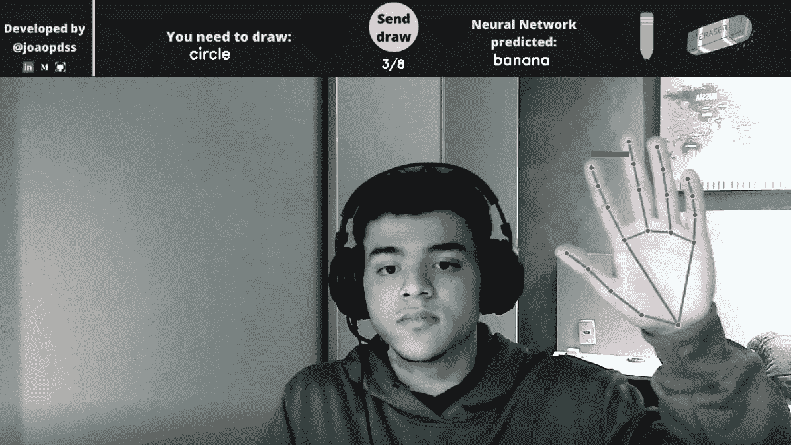

# 计算机视觉在绘画游戏中的应用

> 原文：<https://blog.devgenius.io/applying-computer-vision-to-a-drawing-game-15a0f961fcfa?source=collection_archive---------5----------------------->

使用计算机视觉，一只手和一个摄像头来创建一个抽奖游戏。

# 介绍

我想做一些项目应用一些计算机视觉技能，但不同的东西。经过几天对一些数据集的观察，我发现了一个来自谷歌的令人难以置信的数据集，[快速，绘制！数据集](http://The Quick, Draw! Dataset)。它是世界上最大的图纸数据集，拥有超过 5000 万张图纸。我们可以发现很多人在做神经网络预测绘画的项目。然后我觉得用你自己的手画画会很酷，只使用你的网络摄像头，同时，和 AI 玩游戏，试着猜测你画的一些东西。项目剧&的抽签就是这样诞生的。

# 它是如何工作的

当游戏开始时，你会看到一个文本，说明你需要绘制哪个对象。该游戏有八个对象，如香蕉、彩虹、教堂、裤子、太阳、比萨饼、圆圈和云。你需要把它们都画出来，排序是随机的。游戏的每一轮人工智能都会预测你画的物体，如果它是正确的，你就会得到一分。

第一步是向网络摄像头显示手掌，并慢慢移动，直到检测到您的手。

你需要选择铅笔或橡皮擦来使用它们各自的工具，之后我们可以通过举起食指和中指来做到这一点，然后定义我们想要哪一个。

现在我们可以画画了。

画好之后，我们必须再次竖起食指和中指，选择上方的按钮“发送画图”

每次绘制完成后，在“神经网络预测”按钮下面，你会看到人工智能为你的绘制预测了哪个对象。你需要重复以上所有的过程八次，直到你画出游戏中所有的物体。当你完成后，一个新的屏幕会出现你的分数。

这里有一个关于以上所有这些过程的短片。

如果你想了解更多的代码，这里是 [GitHub 项目](https://github.com/joaopdss/drawing-game-computer-vision)。

# 结论

如果你喜欢这篇文章(或者即使你不喜欢)，并且你想了解更多关于 A.I 的信息，你可以:
在 [**Linkedin**](https://www.linkedin.com/in/joaopdss/)
上联系我，在 [**Medium**](https://medium.com/@joaopdss) 上关注我，并查看我写的其他文章
在 [**GitHub**](https://github.com/joaopdss) 上关注我

# 资源

[快，画！数据集](https://github.com/googlecreativelab/quickdraw-dataset)

[AI 虚拟画师| OpenCV Python |计算机视觉](https://www.youtube.com/watch?v=ZiwZaAVbXQo)

[使用 CPU 进行 30 FPS 的手部跟踪| OpenCV Python (2021) |计算机视觉](https://www.youtube.com/watch?v=NZde8Xt78Iw&t=2479s)

[用 Colab 在 tf.keras 中训练一个模型，用 TensorFlow.js 在浏览器中运行](https://medium.com/tensorflow/train-on-google-colab-and-run-on-the-browser-a-case-study-8a45f9b1474e)