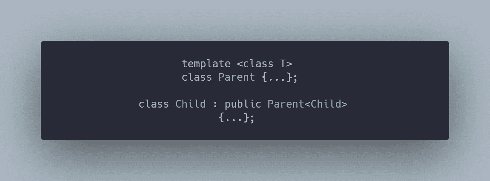

# 在日常 C++编码中应用奇怪的重复模板模式

> 原文：<https://blog.devgenius.io/applying-curiously-recurring-template-pattern-in-day-to-day-c-coding-4e4136dbc10c?source=collection_archive---------14----------------------->



奇怪的是，C++中重复出现的模板模式(CRTP)绝对是一种强大的技术&虚函数的静态替代。但与此同时，一开始学习它可能会显得有点怪异。如果你和我一样挣扎着想要一口气抓住任何东西。那么这篇文章可能会帮助你提供一个思考过程，让你知道 CRTP 在日常编码中的位置。而且，如果你是一名嵌入式程序员，你可能会更经常地遇到 CRTP。虽然，`std::variant` + `std::visit`也会有所帮助，但是 90%的嵌入式处理器编译器要么不是最新的标准，要么是哑的。

> */！\:这篇文章最初发表在我的博客上。如果你有兴趣接收我的最新文章，* [*请注册我的简讯*](http://eepurl.com/gDNybv) *。*

在 CRTP 有各种各样关于“如何做”和“做什么”的材料。因此，我不会把重点放在 CRTP 适用性的“在哪里”部分。

# C++中的 CRTP 和静态多态

```
template<typename specific_animal>
struct animal {
    void who() { static_cast<specific_animal*>(this)->who(); }
};struct dog : animal<dog> {
    void who() { cout << "dog" << endl; }
};struct cat : animal<cat> {
    void who() { cout << "cat" << endl; }
};template<typename specific_animal>
void who_am_i(animal<specific_animal> &animal) {
    animal.who();
}cat c;
who_am_i(c); // prints `cat`dog d;
who_am_i(d); // prints `dog`
```

*   ***奇怪的是，重复出现的模板模式被广泛用于静态多态*** 而不承担虚拟调度机制的成本。考虑到上面的代码，我们没有使用虚拟关键字&仍然实现了多态性的功能。
*   它是如何工作的不是本文的主题。所以，我让你来想办法。

# 使用 CRTP 限制对象计数

*   有时，您必须使用单个或预定义的对象计数来管理关键资源。对此我们有[单例&单调设计模式](http://www.vishalchovatiya.com/singleton-design-pattern-in-modern-cpp/)。但是，只要对象数量较少，这种方法就有效。
*   ***当你想用任意数量的实例来限制任意类型时*** 。CRTP 会来救援的:

```
template <class ToBeLimited, uint32_t maxInstance>
struct LimitNoOfInstances {
    static atomic<uint32_t> cnt; LimitNoOfInstances() {
        if (cnt >= maxInstance)
            throw logic_error{"Too Many Instances"};
        ++cnt;
    }
    ~LimitNoOfInstances() { --cnt; }
}; // Copy, move & other sanity checks to be completestruct One : LimitNoOfInstances<One, 1> {};
struct Two : LimitNoOfInstances<Two, 2> {};template <class T, uint32_t maxNoOfInstace>
atomic<uint32_t> LimitNoOfInstances<T, maxNoOfInstace>::cnt(0); void use_case() {
    Two _2_0, _2_1; try {
        One _1_0, _1_1;
    } catch (exception &e) {
        cout << e.what() << endl;
    }
}
```

*   你可能想知道，如果模板参数`ToBeLimited`没有被使用，它有什么意义。在这种情况下，你应该温习一下你的 [C++模板](http://www.vishalchovatiya.com/c-template-a-quick-uptodate-look/)基础或者使用 [cppinsights.io](https://cppinsights.io/) 。因为它不是没用的。

# CRTP 避免代码重复

*   假设您有一组支持函数`begin()` & `end()`的容器。但是，标准库对容器的要求需要更多的功能，如`front()`、`back()`、`size()`等。
*   我们可以用一个 ***CRTP 基类来设计这样的功能，该基类仅基于派生类成员函数*** 来提供公共实用程序，即在我们的例子中的`begin()` & `end()`:

```
template <typename T>
class Container {
    T &actual() { return *static_cast<T *>(this); }
    T const &actual() const { return *static_cast<T const *>(this); }public:
    decltype(auto) front() { return *actual().begin(); }
    decltype(auto) back() { return *std::prev(actual().end()); }
    decltype(auto) size() const { return std::distance(actual().begin(), actual().end()); }
    decltype(auto) operator[](size_t i) { return *std::next(actual().begin(), i); }
};
```

*   上面的类为任何有`begin()` & `end()`的子类提供了`front()`、`back()`、`size()`和`operator[ ]`的函数。
*   例如，子类可以是一个简单的动态分配数组，如下所示:

```
template <typename T>
class DynArray : public Container<DynArray<T>> {
    size_t m_size;
    unique_ptr<T[]> m_data; public:
    DynArray(size_t s) : m_size{s}, m_data{make_unique<T[]>(s)} {} T *begin() { return m_data.get(); }
    const T *begin() const { return m_data.get(); } T *end() { return m_data.get() + m_size; }
    const T *end() const { return m_data.get() + m_size; }
};DynArray<int> arr(10);
arr.front() = 2;
arr[2]        = 5;
asssert(arr.size() == 10);
```

# 利用 CRTP 的现代 C++复合设计模式

*   [复合设计模式](http://www.vishalchovatiya.com/composite-design-pattern-in-modern-cpp/)声明我们应该 ***像对待单个对象*** 一样对待一组对象。为了实现这种模式，我们可以利用 CRTP。
*   例如，作为机器学习的一部分，我们必须处理`Neuron`，为简单起见，它定义为:

```
struct Neuron {
    vector<Neuron*>     in, out;    // Stores the input-output connnections to other Neurons
    uint32_t            id; Neuron() {
        static int id = 1;
        this->id = id++;
    } void connect_to(Neuron &other) {
        out.push_back(&other);
        other.in.push_back(this);
    } friend ostream &operator<<(ostream &os, const Neuron &obj) {
        for (Neuron *n : obj.in)
            os << n->id << "\t-->\t[" << obj.id << "]" << endl; for (Neuron *n : obj.out)
            os << "[" << obj.id << "]\t-->\t" << n->id << endl; return os;
    }
};Neuron n1, n2;
n1.connect_to(n2);
cout << n1 << n2 << endl;/* Output
[1]    -->    2
1    -->    [2]
*/
```

*   还有一个`NeuronLayer`，即`Neuron`的集合，为简单起见，定义为:

```
struct NeuronLayer : vector<Neuron> {
    NeuronLayer(int count) {
        while (count --> 0)
            emplace_back(Neuron{});
    } friend ostream &operator<<(ostream &os, NeuronLayer &obj) {
        for (auto &n : obj)
            os << n;
        return os;
    }
};
```

*   现在，如果你想连接`Neuron`和`NeuronLayer`，反之亦然。您总共将拥有四种不同的功能，如下所示:

```
Neuron::connect_to(Neuron&)
Neuron::connect_to(NeuronLayer&)NeuronLayer::connect_to(NeuronLayer&)
NeuronLayer::connect_to(Neuron&)
```

*   你看这是状态空间爆炸(外行术语中的排列)问题，这不好。因为我们想要一个既能枚举层又能枚举单个神经元的函数。CRTP 在这里派上了用场:

```
template <typename Self>
struct SomeNeurons {
    template <typename T>
    void connect_to(T &other);
};struct Neuron : SomeNeurons<Neuron> {
    vector<Neuron*>     in, out;
    uint32_t            id; Neuron() {
        static int id = 1;
        this->id = id++;
    } Neuron* begin() { return this; }
    Neuron* end() { return this + 1; }
};struct NeuronLayer : vector<Neuron>, SomeNeurons<NeuronLayer> {
    NeuronLayer(int count) {
        while (count-- > 0)
            emplace_back(Neuron{});
    }
};/* ----------------------------------------------------------------------- */
template <typename Self>
template <typename T>
void SomeNeurons<Self>::connect_to(T &other) {
    for (Neuron &from : *static_cast<Self *>(this)) {
        for (Neuron &to : other) {
            from.out.push_back(&to);
            to.in.push_back(&from);
        }
    }
}
/* ----------------------------------------------------------------------- */template <typename Self>
ostream &operator<<(ostream &os, SomeNeurons<Self> &object) {
    for (Neuron &obj : *static_cast<Self *>(&object)) {
        for (Neuron *n : obj.in)
            os << n->id << "\t-->\t[" << obj.id << "]" << endl; for (Neuron *n : obj.out)
            os << "[" << obj.id << "]\t-->\t" << n->id << endl;
    }
    return os;
}int main() {
    Neuron n1, n2;
    NeuronLayer l1{1}, l2{2}; n1.connect_to(l1); // Scenario 1: Neuron connects to Layer
    l2.connect_to(n2); // Scenario 2: Layer connects to Neuron
    l1.connect_to(l2); // Scenario 3: Layer connects to Layer
    n1.connect_to(n2); // Scenario 4: Neuron connects to Neuron cout << "Neuron " << n1.id << endl << n1 << endl;
    cout << "Neuron " << n2.id << endl << n2 << endl; cout << "Layer " << endl << l1 << endl;
    cout << "Layer " << endl << l2 << endl; return EXIT_SUCCESS;
}
/* Output
Neuron 1
[1]    -->    3
[1]    -->    2Neuron 2
4    -->    [2]
5    -->    [2]
1    -->    [2]Layer 
1    -->    [3]
[3]    -->    4
[3]    -->    5Layer 
3    -->    [4]
[4]    -->    2
3    -->    [5]
[5]    -->    2
*/
```

*   如你所见，我们已经用一个`SomeNeurons::connect_to`方法涵盖了所有四种不同的置换场景。并且`Neuron` & `NeuronLayer`都通过自己的模板化符合这个接口。

# C++20 飞船操作员在 CRTP 的帮助下

# 问题

```
struct obj_type_1 {
    bool operator<(const value &rhs) const { return m_x < rhs.m_x; }
    // bool operator==(const value &rhs) const;
    // bool operator!=(const value &rhs) const;    
    // List goes on. . . . . . . . . . . . . . . . . . . .
private:
    // data members to compare
};struct obj_type_2 {
    bool operator<(const value &rhs) const { return m_x < rhs.m_x; }
    // bool operator==(const value &rhs) const;
    // bool operator!=(const value &rhs) const;    
    // List goes on. . . . . . . . . . . . . . . . . . . .
private:
    // data members to compare
};struct obj_type_3 { ...
struct obj_type_4 { ...
// List goes on. . . . . . . . . . . . . . . . . . . .
```

*   对于每个可比较的对象，您需要定义各自的比较运算符。这是多余的，因为如果我们有一个`operator <`，我们可以在它的基础上重载其他操作符。
*   因此，`operator <`是唯一一个具有类型信息的操作符，出于可重用性的目的，可以使其他操作符与类型无关。

# 解决方案直到 C++17 与 CRTP

```
template <class derived>
struct compare {};struct value : compare<value> {
    int m_x;
    value(int x) : m_x(x) {}
    bool operator < (const value &rhs) const { return m_x < rhs.m_x; }
};template <class derived>
bool operator > (const compare<derived> &lhs, const compare<derived> &rhs) {
    // static_assert(std::is_base_of_v<compare<derived>, derived>); // Compile time safety measures
    return (static_cast<const derived&>(rhs) < static_cast<const derived&>(lhs));
}/*  Same goes with other operators
    == :: returns !(lhs < rhs) and !(rhs < lhs)
    != :: returns !(lhs == rhs)
    >= :: returns (rhs < lhs) or (rhs == lhs)
    <= :: returns (lhs < rhs) or (rhs == lhs) 
*/int main() {   
    value v1{5}, v2{10};
    cout << boolalpha << "v1 > v2: " << (v1 > v2) << '\n';
    return EXIT_SUCCESS;
}
// Now no need to write comparator operators for all the classes, 
// Write only type dependent `operator <` & inherit with `compare<T>`
```

# C++20 解决方案:宇宙飞船操作员

```
struct value{
    int m_x;
    value(int x) : m_x(x) {}
    auto operator<=>(const value &rhs) const = default;
};
// Defaulted equality comparisons
// More Info: [https://en.cppreference.com/w/cpp/language/default_comparisons](https://en.cppreference.com/w/cpp/language/default_comparisons)
```

# 启用多态方法链接

*   *方法链接*是一种常见的语法，用于连续调用单个对象上的多个方法。这也是在一条语句中完成的，不需要变量来存储中间结果。例如:

```
class Printer {
    ostream &m_stream;
public:
    Printer(ostream &s) : m_stream(s) { } Printer &print(auto &&t) {
        m_stream << t;
        return *this;
    } Printer &println(auto &&t) {
        m_stream << t << endl;
        return *this;
    }
};Printer{cout}.println("hello").println(500);     // Method Chaining
```

*   但是，当方法链应用于对象层次结构时，事情可能会出错。例如:

```
struct ColorPrinter : Printer {
    enum Color{red, blue, green};
    ColorPrinter(ostream &s) : Printer(s) {} ColorPrinter &SetConsoleColor(Color c) {
        // ...
        return *this;
    }
};ColorPrinter(cout).print("Hello ").SetConsoleColor(ColorPrinter::Color::red).println("Printer!"); // Not OK
```

*   编译上面的代码会提示您以下错误:

```
error: 'class Printer' has no member named 'SetConsoleColor'
     ColorPrinter(cout).print("Hello ").SetConsoleColor(ColorPrinter::Color::red).println("Printer!");
                                        ^
                                        |______________ We have a 'Printer' here, not a 'ColorPrinter'
```

*   这是因为我们一调用基类的函数就“失去”了具体的类。
*   CRTP 有助于避免此类问题，并支持多态方法链接。

```
template <typename ConcretePrinter>
class Printer {
    ostream &m_stream;
public:
    Printer(ostream &s) : m_stream(s) { } ConcretePrinter &print(auto &&t) {
        m_stream << t;
        return static_cast<ConcretePrinter &>(*this);
    } ConcretePrinter &println(auto &&t) {
        m_stream << t << endl;
        return static_cast<ConcretePrinter &>(*this);
    }
};struct ColorPrinter : Printer<ColorPrinter> {
    enum Color { red, blue, green };
    ColorPrinter(ostream &s) : Printer(s) {} ColorPrinter &SetConsoleColor(Color c) {
        // ...
        return *this;
    }
};int main() {
    ColorPrinter(cout).print("Hello ").SetConsoleColor(ColorPrinter::Color::red).println("Printer!");
    return EXIT_SUCCESS;
}
```

# 用 CRTP 在 C++中实现多态副本构造

# 问题

*   C++使用基类的[虚拟析构函数](http://www.vishalchovatiya.com/part-3-all-about-virtual-keyword-in-c-how-virtual-destructor-works/)支持多态对象析构。但是，由于с++不支持虚拟构造函数/ [复制构造函数](http://www.vishalchovatiya.com/all-about-copy-constructor-in-cpp-with-example/)，因此缺少对对象创建和复制的等效支持。
*   此外，除非知道对象的静态类型，否则无法创建对象，因为编译器必须知道它需要分配的空间量。出于同样的原因，复制一个对象也需要在编译时知道它的类型。

```
struct animal {  virtual ~animal(){ cout << "~animal\n"; } };struct dog : animal  { ~dog(){ cout << "~dog\n"; } };
struct cat : animal  { ~cat(){ cout << "~cat\n"; } };void who_am_i(animal *who) { // not sure whether `dog` would be passed here or `cat` // How to `copy` object of the same type i.e. pointed by who? delete who; // you can delete object pointed by who
}
```

# 解决方案 1:动态多态性

*   顾名思义，我们将使用虚拟方法来委托对象的复制(和/或创建)动作，如下所示:

```
struct animal {
    virtual unique_ptr<animal> clone() = 0;
};struct dog : animal {
    unique_ptr<animal> clone() override { return make_unique<dog>(*this); }
};struct cat : animal {
    unique_ptr<animal> clone() override { return make_unique<cat>(*this); }
};void who_am_i(animal *who) {
    auto duplicate_who = who->clone(); // `copy` object of same type i.e. pointed by who ?    
}
```

# 解决方案 2:静态多态性

*   同样的事情可以用 CRTP 来完成，如下所示:

```
template <class specific>
struct animal {
    unique_ptr<animal> clone() {
        return make_unique<specific>(static_cast<specific &>(*this));
    }protected: // Forcing animal class to be inherited
    animal(const animal &) = default;
};struct dog : animal<dog> {
    dog(const dog &) { cout << "copied dog" << endl; }
};struct cat : animal<cat> {
    cat(const cat &) { cout << "copied cat" << endl; }
};template <class specific>
void who_am_i(animal<specific> *who) {
    auto duplicate_who = who->clone(); // `copy` object of same type i.e. pointed by who ?
}
```

# 结束语

每样东西都有它自己的价格。CRTP 也不例外。例如，如果您使用 CRTP 创建运行时对象，您的代码可能会表现得很奇怪。此外，

*   由于基类是模板化的，所以不能用基类指针指向派生类对象。
*   此外，您不能创建类似于`std::vector<animal*>`的通用容器，因为`animal`不是一个类，而是一个需要专门化的模板。定义为`std::vector<animal<dog>*>`的容器只能存储`dog` s，而不能存储`cat` s。这是因为从 CRTP 基类`animal`派生的每个类都是唯一的类型。这个问题的一个常见解决方案是增加一个间接层，即带有虚拟析构函数的抽象类，如`abstract_animal` &继承`animal`类，允许创建`std::vector<abstract_animal*>`。

CRTP 还有其他有用应用。如果你认为我错过了什么重要的事情，或者有什么建议，你可以通过这里的联系我。

# 参考

*   [维基百科](https://www.wikiwand.com/en/Curiously_recurring_template_pattern)
*   [面向专业人士的 C++注释堆栈溢出文档](https://books.goalkicker.com/CPlusPlusBook/)
*   [高级 C++概念](http://www.vishalchovatiya.com/7-advance-cpp-concepts-idiom-examples-you-should-know/)