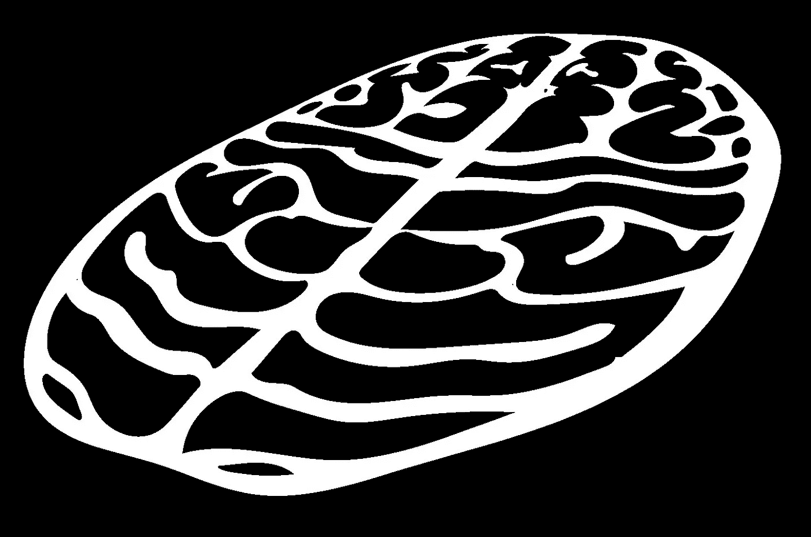

# 伦理考虑+将自然系统应用于人工智能以更好地理解情境

> 原文：<https://blog.devgenius.io/applying-neuroscience-to-artificial-intelligence-systems-for-situational-understanding-6fb4f006854e?source=collection_archive---------0----------------------->

及时更新 2021 年大脑认知周的 Pi 日-扩大半径是一项持续进行的工作

作者插图

“计算机很难知道杯子是什么，”我的实验室伙伴说。

他的朋友们嘲笑这种说法——对我们人类来说如此微不足道的事情，计算机怎么会如此难以理解？一个杯子如此简单，人类从婴儿期就能准确识别。大多数成年人几乎不用思考就能判断什么是杯子，什么不是杯子。技术越来越接近能够接管许多认知要求高的任务。如果计算机很难对一个杯子进行分类，那么更复杂的分类会怎么样，比如识别一个人的语调和肢体语言之间的情感不匹配？为什么计算机缺乏这种直觉？

在我们的一生中，我们观察他人的行为。我们理解因果关系，以一种整体的方式将事情放入背景中，创造出丰富的故事织锦，而不是简单的数字向量。我们讲述我们所经历的故事，我们不断地创造故事和解释。整体方法让人类比许多人工智能系统更具优势:它们将因果关系联系起来。

人类可以利用相对较短的属性列表之外的上下文来确定事情发生的原因。他们可以看到一些人工智能看不到的东西，因为他们的大脑以某种方式合成信息，比他们各部分的总和更具洞察力。虽然机器可能需要大量的例子来学习杯子是什么，但人类可能只需要一个例子。一次创伤性的经历或者一次非常积极的经历可以改变很多事情，比如人们如何理解未来生活中的许多情况。顶级工程师、数据科学家和软件开发人员需要解决的一个主要问题是如何创建能够类似于或比人类更好地解释情况的人工智能。

# **关于人性、移情和视角的笔记**

是什么让人类成为人类？我认为有三个主要方面在人类中是普遍的。要成为人类，这三个条件都必须满足，然而这三个条件都是没有绝对定义的模糊概念:

1.  活着。
2.  有他们自己发自内心的观点。
3.  以人类的形式存在。

人类倾向于以人为中心，因为他们的神经系统倾向于更重视人类的利益。人类也可能会冲动地看重短期结果而非长期结果。因此，我认为即使人类神经系统的能力可以创造更好的人工智能，“人性化”人工智能也不是目标。目标是为了所有人的利益创造最真实的情境理解，不仅仅是短期的，也是长期的。在一个包含比人类多得多的生物的世界里，这可能是最理想的。这个世界也有动物、植物、水和一个更大的背景。外部环境会影响反思的内心状态。自动驾驶汽车并没有真正与它们所在的地方或与它们互动的人分开。宇宙最终是一个相互关联的系统。这就是为什么**在创造人工智能时必须考虑人类和非人类观点的广泛多样性的部分原因。幸运的是，我们也许能够利用其他自然系统的智能能力来创造更好的人工智能。**

**换位思考，即站在另一个人的角度思考的能力，经常被认为是人类之所以为人的一部分。这种观念是有缺陷的，因为它使许多种类的人失去人性。与普通成年人相比，非常小的孩子通常更难接受他人的观点。这是否会使非常年幼的孩子比成人更不像人？类似地，不同的成年人有不同的能力去接受他人的观点。有时，人们对他人观点的判断是不正确的假设，这是由于从外部看情感表达的差异。移情者真的比普通人更有人情味吗，或者他们只是从外表上看起来如此，因为他们在互动中使用了与普通人不同的策略？如果一个高度敏感的人更容易与同样高度敏感的人产生共鸣，因为他们有独特的共同经历，而这种经历是具有典型感觉系统的人无法真正理解的，那会怎么样？**

一个人可能对他人感同身受，但并不富有同情心:他们可能会从他人的角度出发，但并不真正关心他人的福祉。一个人也可能是富有同情心或同情心的，而不是同理心的:尽管很难设身处地地为他人着想，但利用对他人好恶的理性而非直觉理解，非常谨慎地对待他人。在一天结束的时候，人类无法真正知道成为别人是什么样子，除非他们实际上已经成为除了自己以外的人。

现代人生活在一个越来越虚拟、被动的世界里，思想和身体脱节。从兴奋时心跳加速，疲劳时感觉沉重，每种情绪自然都有伴随的感觉。通过思想和身体语言有意地反映另一个人，并注意在这种反映过程中你自己身体产生的感觉是一种策略，可以让人类更好地理解他人的情绪。除了镜像，在解读他人时，关注另一个人当前身体语言之外的更大的情境背景，并整合来自两者的信息也很有帮助:两者都做是我称之为“超镜像”的策略。如果注意力不集中、不知所措、恐惧、疲劳或有压力，过度镜像是一个挑战。但是，处于压力状态的人比处于放松状态的人更没有人性吗？由于生活在现代工业化的世界中，不良的姿势和被动的虚拟动作往往是常态，一些人经历了精神和身体之间的分离感。他们变得不那么人性化是因为他们更难完全展现自己，进而与他人互动吗？

一旦一些人被认为不如其他人“人性”，这就通过价值判断在人与人之间制造了人为的鸿沟，导致社会弊病。在一个理想的世界里，所有的人都会受到尊重，并被当作人对待。当同一个人体内的一些状态被认为不那么“人类”时，这就制造了一个人为的分裂，在那里一个人分解了自己的部分，导致了一个更麻烦的心灵。在一个理想的世界里，所有人类的精神状态都会被经历过这些状态的人所认可和小心对待。虽然同理心并不是人类之所以为人的原因，但超镜像的算法代理可能会导致更真实的情景分析和人工智能更恰当的反应。

有趣的是，许多人喜欢和他们的宠物在一起，尽管其他动物不可能理解人类的观点，因为它们不是人类。因此，动物对人类的同情是有限的。许多狗会很高兴看到他们的人类主人，不管主人的精神状态如何，这对主人有积极的影响。尽管缺乏真正的同理心，情感支持动物帮助人类度过困难时期。人工智能也可能通过对情况做出适当的反应或帮助人们从另一个角度看待自己而使人们受益。鉴于人工智能不是活的，也不在人类形态中，创造一个对错误行为的内疚的有用代理，一个真正反映正义感或死亡感，将是一个巨大的挑战。虽然机器天生不是人类，但人类可能会与人工智能并肩工作，作为创造更美好世界的高效工具。人工智能还可能有助于扩展人类的视角，超越他们自己意识到并存储在工作记忆中的变量。

# **可解释性**

**拥有人类无法解释的人工智能是否道德？应用我们对神经系统的理解可能会产生更容易理解的人工智能。**如果我们从基于我们对神经系统和自然原则的最佳理解的原则出发，那么我们可能会更好地减少错误、偏见和其他问题，否则这些问题在人工智能中是无法预见的，因为它是基于我们可以解释的东西。我们对自然界的理解并不完美。神经回路和大脑节律的基本原理仍在研究中。随着神经技术领域的进步，我们可能会对神经系统如何工作的真相有更好的理解，并推进人工智能领域，同时保持解释人工智能如何工作的能力。

**神经系统的原理可能会被应用于创造更好的人工智能系统，用于情境理解。它们还可能允许人类继续了解人工智能，并降低与误解人工智能相关的风险。**

# **为什么神经系统是一个很好的应用于人工智能的自然系统？**

*   它感知信号。像一些机器一样，神经系统配备了各种各样的传感器来接收信息。
*   它处理这些信号的过滤子集，并根据情况进行改变。从一个热水按摩浴缸跳入一个冷水池，或者相反，都会触发关于温度变化的强烈信号，但是当神经系统习惯了这个温度，它就不会那么惊慌了。同样，你可能在进入咖啡店时注意到咖啡的味道，但在咖啡店呆一段时间后，你会停止注意这种气味，除非你选择给予它更多的注意。类似地，检测感官信息的变化，而不是不断地计算不变的感官信息，可以应用于人工智能设备中的信号处理。
*   **它整合信号。多种感官信息比单一感官信息能更准确地解释情况。感觉替代可能会发生，比如当一些盲人[通过点击“看见”他们的周围](https://www.ted.com/talks/daniel_kish_how_i_use_sonar_to_navigate_the_world)或者当重听人[通过振动感觉声音](https://www.ted.com/talks/david_eagleman_can_we_create_new_senses_for_humans/transcript)时。来自人类固有感官之外的机器的信号可以传输给人类，就像听到神经元的电尖峰作为音频线索，以更好地了解它们的属性。**
*   它执行计算。这有助于通过权衡选项做出决策。
*   **它输出对刺激的反应。**一些反射弧允许在发送到中枢神经系统之前在外周神经系统中做出反应。即使一个人试图反抗，也会对医生的木槌产生膝跳反应。
*   它学习和记忆。从姿势控制到技能习得再到记忆，每件事都有反馈回路。神经系统产生教学信号，将实际结果与期望结果进行比较，允许通过实践进行学习。一个孩子不需要为了知道如何骑自行车或玩接球游戏而学习物理，但他们需要练习才能做好这些。它运行良好，足以帮助每一个有神经系统的物种生存下来。
*   它在能量消耗、定时和尺寸方面是有效的。虽然对于一个生物器官系统来说，神经系统相对于其重量来说非常[耗电，但据估计，大脑在 2015 年比世界上最快的超级计算机](https://www.brainfacts.org/Brain-Anatomy-and-Function/Anatomy/2019/How-Much-Energy-Does-the-Brain-Use-020119)快 [30 倍。另一项估计称，根据一次可以执行的计算数量，人脑比计算机慢 1000 万倍，但计算机的计算是串行进行的，而大脑的处理是串行的，大部分是并行的。这使得大脑在许多解决问题的任务中变得“更聪明”。大脑的褶皱和山谷允许许多神经元以紧凑的形式存在于我们的大脑中。](https://spectrum.ieee.org/tech-talk/computing/networks/estimate-human-brain-30-times-faster-than-best-supercomputers)

虽然神经系统很好地为人类服务，但它并不完美。它会犯机器不会犯的错误。在关键时刻，大脑有时会一片空白，或者屈服于情感压力。人类大脑的一个主要问题是容易分心，尤其是在一个充满引人注目的通知或处于无聊状态的世界里。在刺激不足和过度刺激之间的波动使得一个人很难真正保持专注。人类也包含了多种多样的思想:不同的人有不同的兴趣、才能和偏好。仅仅因为发给两个不同的人一手相同的牌，并不意味着他们会相似地出牌。正如人们拥有与其身份相匹配的工作和角色是一件好事一样，人工智能适合它被雇佣来解决的问题也是一件好事。**状态和特质也是重要的考虑因素。**由于不同的人在特定的大脑状态下最适合不同的场景，人工智能领导者必须仔细思考哪种人工智能特质和哪种状态切换能力最适合执行各种不同功能的人工通用智能。

**人类行为分析是采用自动驾驶和车队车辆技术的主要障碍。在一个日益分散注意力的世界，拥有理解人类行为的机器对人类安全来说比以往任何时候都更加重要。当人们从一个地方搬到另一个地方时，他们的行为不像风滚草。他们可以瞬间做出决定，彻底改变他们的轨迹。一个意想不到的抛射体可能会从天而降，吓他们一跳。人们会绊倒。人是有反射的。人们意识到他们忘了什么东西，然后转回来。受药物影响的人会走来走去。有人用自行车，有人用赛格威，有人用滑板车，有人用独轮车。人们与人和他们的环境互动，经常在潜意识层面微调他们的行为和运动模式。人类行为是复杂的，影响人类行为的可能情况也是如此。**

# **这里的一个大的总体战略是:考虑大自然是如何解决导航和决策问题的，以及我们如何应用这些原则来创建人工智能系统。**

作为 [Intvo Inc.](https://intvo.com) 的联合创始人兼首席科学官，这一直是我的技术开发方法。包含不同文化和地区的人类经验多样性的跨学科方法将有助于建立更好的人工智能道路安全系统。

在 OmarLab 的论文工作中，我研究了导航相关行为的神经关联。导航是一项复杂的，但进化上保守的任务。它包括多种感官信息的整合、运动和空间定位能力。大多数大脑健康并具有移动能力的动物都能够找到回家的路。即使是蝴蝶小小的大脑也能让它们在根据季节迁徙时跟踪空间。大脑以非常优雅的方式创造了外部世界的内部地图。关于它的工作方式，还有许多事情我们还不了解。在进行我的实验时，我思考了理解某事或某人意味着什么:以一种能够影响行动的方式将原因和结果联系起来。真正理解一件事意味着超越语言和数字去了解它。理解意味着创造类似直觉的东西。

我们能创造出类似直觉的系统吗？超越能够对物体进行分类和预测情况的系统，例如人工智能系统本身是基于自然科学的原理？这是人工神经网络背后的一个想法，它通过例子进行学习，并使用多层连接从一个神经元到另一个神经元的输出。但是，自然系统的其他属性也可能应用于人工智能和计算机视觉系统。以下是一些例子:

*   当哺乳动物以更快的速度移动**时**，视觉皮层变得**更加活跃**。使用计算机视觉实时分析数据时，根据刺激的速度调整每秒帧数可能有助于提高数据和能源效率。如果我们在道路基础设施上创建一个摄像头系统，根据行人碰撞的风险实时向驾驶员发出警告，如果系统在其视野中感应到行人，则提高其帧速率并变得更加活跃会更有帮助。
*   海豚的一半大脑可以睡觉，而另一半是醒着的，这样海豚就可以不停地游泳。也许这可以应用于太空望远镜，这些望远镜的太阳能电池板不知何故被遮挡了太长时间，以至于望远镜一直在移动，同时总是有点“开着”。
*   免疫系统在进化上比神经系统更古老，具有无可挑剔的记忆和巨大的复杂性，可以赋予生物以弹性。因此，与人工神经网络相比，人工免疫系统可能是处理某些问题的更好模型。自然免疫系统有其自身的问题，例如潜在的自身免疫疾病，但对自然免疫系统的了解可能会让我们减轻人工免疫系统中的这些问题。人工免疫系统正在开发中。

# **如果我们可以通过将自然界最好、最合适的方面与机器的优化能力相结合，来创建对广泛背景的更好的情境理解，这可能会创造一个更好、更安全的世界。它将让我们更真实地了解世界和我们自己，这将在人工智能工程和研究战略中延续更多的问题和更多的答案，以扩大知识并减轻因找错对象而带来的风险。**

# **这*将是所有众生举起精心分类的杯子的事情。***

**参考资料和进一步阅读:**

[人工智能和神经科学如何相互推动](https://www.nature.com/articles/d41586-019-02212-4)

[受神经科学启发的人工智能](https://www.sciencedirect.com/science/article/pii/S0896627317305093)

[大脑每秒遍历边数的表现](https://aiimpacts.org/brain-performance-in-teps/)

[神经科学如何实现更好的人工智能设计](https://medium.com/swlh/how-neuroscience-enables-better-artificial-intelligence-design-5d254098470b)

[人工智能和神经科学相遇的地方:寻找认知的基础架构](https://www.hindawi.com/journals/aai/2010/918062/)

[内部空间简史:了解大脑的 GPS](https://medium.com/@sharena/a-brief-history-of-inner-space-understanding-the-brains-gps-ac8af71f30a7?source=friends_link&sk=906b7c745c8710f43e5f7edc3c5b8cf1)

 [## 为什么人脑的效率这么高？-第 86 期:能源-鹦鹉螺号

### 大脑是复杂的；在人类中，它由大约 1000 亿个神经元组成，大约有 100 万亿个…

nautil.us](http://nautil.us/issue/86/energy/why-is-the-human-brain-so-efficient-rp) 

本文中表达的观点仅代表作者的观点，不一定反映 OmarLab、密歇根大学、Intvo、SquadNest 或 Valence Vibrations 的观点。