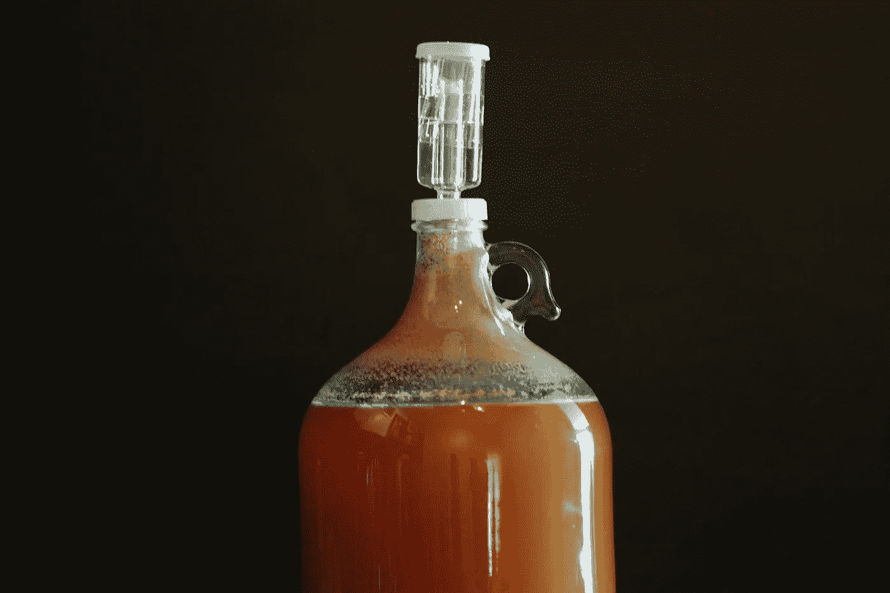

# 软件工程原理在啤酒酿造中的应用。

> 原文：<https://blog.devgenius.io/applying-software-engineering-principles-to-brewing-beer-524b2bc5be29?source=collection_archive---------20----------------------->

想要一个晶莹剔透的代码，*咳咳，*啤酒，那种无 bug 又被朋友欣赏的？

由[克里斯蒂安·亨特](https://unsplash.com/@krihun?utm_source=unsplash&utm_medium=referral&utm_content=creditCopyText)在 [Unsplash](/s/photos/homebrew?utm_source=unsplash&utm_medium=referral&utm_content=creditCopyText) 上拍摄的照片

这里有**五条**软件工程原则，你可以在考虑制作自己的自制软件时重复使用。

# #1.配置您的环境

拥有合适的工具只能让你到此为止，根据你的需要校准和配置它们会让你成为超级明星。

为了充分利用您的工具包，您需要了解它的功能、特点和局限性。软件怪癖倾向于以依赖关系之间不兼容的形式出现，并且当需求更加特殊时，这些倾向于更加明显。

酿造啤酒有点类似的故事，因为你的提取物批次很快转向全谷物酿造日。增加复杂性揭示了酿造设备的特性，因此相应地测试、校准和调整您的酿造计划非常重要。你的朋友一直怂恿你做的“香蕉、芫荽和碱水奶昔 IPA”并不一定是令人生畏的。

# #2.保持一致——变量太多可能是件坏事。

无论是软件中的功能还是 ale 中的 IBUs，能够专注于关键细节只有在保持一致性的情况下才会发生。

就像软件语法在间距、命名约定和组织上是零星的一样，拥有一个永远变化的 brew day 不会促进进步。从这两个角度来看，即使是环境本身的变化也会产生负面影响。

在添加细节之前，保持方法的一致性。

# #3.净化你的输入

就我个人而言，这是我在创建任何软件时的头号原则，在酿造啤酒时也应该是你的。

从食物的角度来看，消毒是不言自明的。任何会接触到你的冰镇麦芽汁的东西都需要是干净的，而不仅仅是涂上一层消毒剂。所有设备和您身上的任何可见的污垢都应彻底清除。

勤洗手，不要把胡子蘸到代码里。

# #4.测量并记录一切

酿造啤酒是一生的性能提升和调试练习。正如我们试图从软件应用程序中挤出尽可能多的性能一样，我们也试图从我们的配方和设备中获得最佳效率。

只有创建关键绩效指标，定期测量并记录我们所做的一切，我们才能做到这一点。比如不测 OG，测 OG，麦汁温度，冷却时间，室温，天气，你的心情。任何你将来会回顾的事情来描绘一幅更清晰的图景。

我们不能重复过去，在某些情况下，我们可能不想，但如果我们不能从中吸取教训，那么它的目的是什么。

# #5 投酵母是一个承诺

承诺是某件特定事情将会发生的声明。在软件术语中，承诺是一个异步契约，当某个东西完成处理时，将返回一个结果，允许其余的代码稍后处理该结果。

当你把酵母放进发酵容器时，你实际上是在创造一个承诺。接下来的几天，你可以继续你的日常生活，或者坐着盯着你酿造的啤酒；这是你的选择。

承诺的结果是有保证的；然而，啤酒的结果却并非如此。你的酵母可能会过早絮凝，或者其他东西可能会在你的成品酿造中产生异味。无论发生什么，事先做好准备并知道如何处理这种情况是有好处的。

如果上帝禁止你的批次被感染，因此倾倒入水槽，那么你唯一能做的就是冲洗和重复这个过程。

# 概括起来

创作软件和完善啤酒有很多相似之处。这是一个迭代的过程，只有通过一致性和应用才能得到改进。对于阅读这篇文章的人来说，我道歉。

我所有的程序员、工程师、家酿者和啤酒爱好者们。干杯！