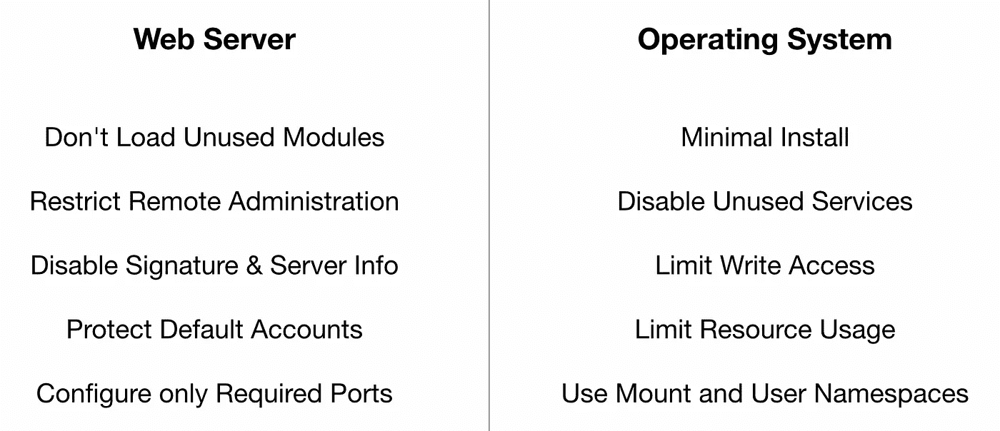

# 强化 Web 服务器的方法

> 原文：<https://blog.devgenius.io/approach-to-hardening-web-servers-6c514d8c77c0?source=collection_archive---------1----------------------->

## 系统级的攻击面减少

帕特里克·霍金斯在 [Unsplash](https://unsplash.com?utm_source=medium&utm_medium=referral) 上的照片

可公开访问的 web 服务器接收来自合法用户和恶意用户的请求。重要的是要认识到这两者，并采取适当的措施只处理那些应该处理的请求，只提供那些应该提供的内容。

简而言之，针对 web 服务器的攻击有两种不同的类型，一种是针对某个组织或域的，另一种是无目标的，试图危害任何可公开访问的 web 服务器。有针对性的攻击可能危害托管的 web 应用程序，而不是服务器软件本身。

# 锻炼

当我们谈到无针对性时，攻击媒介通常涉及利用已知的漏洞、错误配置和使用公开可用的 web 服务器软件信息。强化服务器使攻击者很难危害整个系统，并限制了攻击的进程。

从高层次来说，强化就是限制 web 服务器和操作系统的功能。web 服务器可能具有与部署无关的功能，并且可能会被关闭。这可能意味着修改默认配置文件、加载的模块、文件和目录的权限等等。在操作系统方面，默认情况下，将安装生产环境中不需要的工具和启用的服务。应该删除/禁用它们。

强化 web 服务器不会保护组织免受有针对性的攻击。然而，这是实现它的第一步，将保护 web 服务器免受非目标攻击。

# 操作系统

限制操作系统功能的几个原因是拒绝攻击者执行自定义代码、创建反向外壳或提升权限的能力。请注意，一旦 web 服务器进程被利用，系统上的其他工具就可能被利用来进行下一阶段的攻击。因此，删除所有不需要的工具和服务非常重要。

确保以受限用户身份运行 web 服务器进程，对系统的访问权限有限。通常，受限用户将需要对日志文件的写访问权限，并且默认情况下还拥有对临时目录的写访问权限。为了避免可执行文件出现在临时目录中，可以使用 **noexec** 和 **nosuid** 选项挂载它们。但是，这并不限制脚本的执行。但是，在不久的将来，这将成为可能。有[正在进行的工作](https://lwn.net/Articles/832959/)来控制文件内容的执行。

然而，隔离该进程的最佳方式是通过[改变根目录](https://www.man7.org/linux/man-pages/man1/chroot.1.html)并使用[内核名称空间](https://lwn.net/Articles/531114/)，特别是挂载和用户名称空间。当挂载命名空间将文件系统挂载点的视图更改为进程时，用户命名空间将包括 0(根)在内的所有 uid 映射到命名空间之外的一系列非特权 uid。用 [systemd 参数](https://www.man7.org/linux/man-pages/man5/systemd.exec.5.html)、 **RootDirectory=** 、 **MountAPIVFS=** 、 **PrivateUsers=** 就可以实现这些。

# 网络服务器

就像任何软件一样，web 服务器软件会不断更新新功能、错误修复和安全修复。因此，为了使攻击者的任务更加困难，不泄露任何关于所使用的 web 服务器软件的类型或版本的信息是很重要的。攻击者试图利用 web 服务器上的每个已知漏洞是不现实的。

大多数 web 服务器软件都是模块化的，支持可加载或静态编译的模块。通过只加载所需的模块，攻击面显著减少。结合定制的配置，如禁用目录列表、文件服务、欢迎消息、错误文档等，危害的可能性变得最小。

# 扫描和测试

即使有了加固的服务器，定期测试防御措施也很重要。漏洞扫描系统可以检查 web 服务器是否易受攻击、配置错误或过时。而定期渗透测试有助于识别防御漏洞。

> 然而，漏洞扫描器有一些明显的弱点。通常，它们只能识别表面漏洞，无法解决被扫描服务器的整体风险水平。虽然扫描过程本身是高度自动化的，但漏洞扫描器的误报率可能很高(当不存在漏洞时报告漏洞)。
> 
> [**第 6.4.1 节，NIST SP 800–123，通用服务器安全指南**](https://csrc.nist.gov/publications/detail/sp/800-123/final)

不幸的是，没有终极方法可以完全保护 web 服务器。在第 0 根，我们提供了一个解决方案，使用 TLS 客户端证书来保护组织的内部网站和应用程序。这种方法具有显著的优点，并且利用公钥/私钥对实现了强认证机制。

[*第 0 根安全网络*](https://www.0snet.com/) *提供三层安全，具有 Google Sign-In 集成，易于部署，比单点登录(SSO)更安全。在* [*AWS*](https://0snet.info/#install.aws) *，*[*GCP*](https://0snet.info/#install.gcp)*和* [*天蓝色*](https://0snet.info/#install.azu) *上也有图像。今天就尝试一下。*