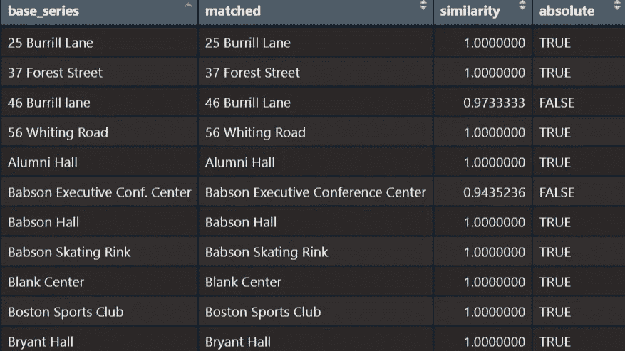

# 利用 Jaro-Winkler 相似度进行 R 中的近似字符串匹配

> 原文：<https://blog.devgenius.io/approximate-string-matching-in-r-using-jaro-winkler-similarity-a93436ecf38f?source=collection_archive---------3----------------------->

合并(联接)数据表要求要合并的列中的项是相同的。当合并来自不同来源的数据时，数据分析师经常面临相似但不完全匹配的项目的问题，例如“tiger-*a*member cross”对比“tiger-*u*member cross”。内部连接会将该项从合并的数据框中丢弃，因为这两个字符串近似匹配，而不是完全匹配。本文探讨了字符串相似性的评分方法(Levenshtein 和 Jaro-Winkler)，并提出了一个 R 函数来生成匹配的汇总表，以便分析员可以决定在何处以及如何进行适当的编辑，从而将近似(相对)匹配转换为绝对(精确)匹配。

巴布森学院的一个项目要求我匹配来自不同来源的关于学院建筑的数据。虽然我不能透露这个项目的细节，但我可以在 R 中提供一个案例研究和解决方案，来解决这个项目提出的近似匹配问题。请注意，我选择了 R 而不是 Python，因为:(1)我在相同的主 R 脚本中进行了统计(这是保密的，但我将在本博客中发布匹配函数)；(2)在 Python 中还有其他关于模糊近似匹配的[帖子。](https://medium.com/search?q=fuzzywuzzy)

假设我有两个关于巴布森建筑的数据集，每个都包含不同的变量，我需要在建筑的细节层次上合并它们。不幸的是，由于数据集来自不同的来源，建筑物被命名为不同的名称:“Nichols Building”vs“Nichols Hall”，“Public Safety”vs“Public Safety Building”。由于一个数据集中有 90 多栋建筑，而另一个数据集中有 60 栋建筑，因此逐一进行排序、观察和调整需要花费太多时间。此外，该功能还可以应用于其他用例，比如在营销中连接项目集，或者连接地理实体。

# Levenshtein 距离的初步尝试

**Levenshtein distance** 只是两个字符串之间需要编辑以匹配的字符数。为便于对两个以上字符串进行比较，常采用 **Levenstein *相似度函数*** 作为 0-1 的评分。Levenshtein 相似函数的公式为:

```
levenshtein_similarity = 1 - levenshteinDist(string_a, string_b) / max(nchar(string_a), nchar(string_b))
```

其中 levenshteinDist()是 Levenshtein 距离函数，用于计算字符串 a 和字符串 b 之间的编辑距离。

要计算 R 中的 Levenshtein 距离和 Levenshtein 相似度，只需使用 RecordLinkage 包中的函数:

```
library(RecordLinkage)
levenshtein_distance = levenshteinDist(string_a, string_b)
levenshtein_similarity = levenshteinSim(string_a, string_b)
```

Levenshtein 可能被证明过于简单，因为它不知道字符串中字符的顺序。下面的例子演示了这个弱点:第一个项集有“Hollister Building”，第二个项集有“Hollister Hall”和“Sullivan Building”。Leveshtein 方法将导致:

```
library(RecordLinkage)
# "Hollister Building" vs "Hollister Hall"
levenshteinDist("Hollister Building", "Hollister Hall")
## 7
levenshteinSim("Hollister Building", "Hollister Hall")
## 0.6111111

# "Hollister Building" vs "Sullivan Building"
levenshteinDist("Hollister Building", "Sullivan Building")
## 6
levenshteinSim("Hollister Building", "Sullivan Building")
## 0.6666667
```

*   “霍利斯特大楼”和“霍利斯特大厅”之间的 Levenshtein 相似度:0.61
*   “霍利斯特大楼”和“沙利文大楼”之间的 Levenshtein 相似度:0.66

对于我们人类来说，直觉地检测到霍利斯特大楼应该与霍利斯特大厅匹配，并相应地进行调整，但是当算法遍历两个列表以找到“最佳匹配”时，该“最佳匹配”被定义为第二列表中其名称具有与基础名称的最高 Levenshtein 得分的建筑物，它炮制出“沙利文大楼”( *Levenshtein 相似度* = 0.66)，因为与“霍利斯特大楼”的匹配度大于“霍利斯特大厅”( *Levenshtein 相似度* = 0.61)，这是不正确的。我们需要一种考虑到以下事实的方法:在英语中，主要名称、标识符或特征通常在宾语名词之前(例如，“Hollister Building”而不是“Building Hollister”，“tiger skin”而不是“skin tiger”)。

# Jaro-Winkler 相似性

像 Levenshtein 一样， **Jaro-Winkler similarity** 也测量两个字符串之间需要编辑以使字符串匹配的字符数，但是 Jaro-Winkler 给与较早字符匹配的字符串(即，字符串的前半部分)更多的权重。这个特性非常适用于我们的案例和其他库存管理场景。

Jaro-Winkler 有两个组成部分: **Jaro 相似度**和 **Winkler 的调整**。

**Jaro 相似度**计算如下:

```
jaro = [m/nchar(s1) + m/nchar(s2) + (m - t/2)/m]/3
```

*   **m** 是匹配字符的个数
*   **t** 是字符串匹配所需的编辑次数
*   **nchar(s1)** 是第一个字符串的长度
*   **nchar(s2)** 是第二个字符串的长度

**温克尔的调整**补充道:

```
jw = dj + prefix_length * p * (1 - dj)
```

其中 p 是常数缩放因子，用于对较早的匹配赋予更大的权重，prefix_length 是要考虑缩放的字符串的第一部分的长度(即“前缀”的长度)。在 Winkler 的工作和提供 Jaro-Winkler 计算的 R 包 RecordLinkage 中，标准的 p 是 0.1。在 RecordLinkage 的 jarowinkler()函数中，考虑缩放的默认前缀长度是 4 个字符。

***注意***:record linkage 中的 jarowinkler()函数也有一个“阈值”，默认为 0.7，高于该值时，应用偏向前缀的缩放，低于该值时，返回未调整的 Jaro 相似度。在这里阅读文档:[https://search . r-project . org/CRAN/ref mans/comparator/html/jarowinkler . html](https://search.r-project.org/CRAN/refmans/comparator/html/JaroWinkler.html)

要计算 R 中的 Jaro-Winkler 相似性:

```
library(RecordLinkage)
jaro_winkler_similarity = jarowinkler(string_a, string_b)
```

现在让我们测试一下霍利斯特大楼与霍利斯特大厅和沙利文大楼的问题:

```
library(RecordLinkage)
# "Hollister Building" vs "Hollister Hall"
jarowinkler("Hollister Building", "Hollister Hall")
## 0.8793651

# "Hollister Building" vs "Sullivan Building"
jarowinkler("Hollister Building", "Sullivan Building")
## 0.7908497
```

由于 Jaro-Winkler 给了前四个匹配字符更多的权重，“Hollister Hall”与“Hollister Building”的相似性得分(0.88)明显高于“Sullivan Building”(0.79)。

# 遍历两个项目集，使用 R 中的 Jaro-Winkler 距离查找匹配项

您可能正在处理两个数据表，每个数据表都包含一个具有相同详细程度的列，但是这些项目是完全匹配、相似匹配和不匹配的混合。您更喜欢一个函数，只传入序列或向量，让它在两个集合中循环，找到它能找到的最佳匹配，并为您提供一个整洁的表格，供您进行比较和决策。下面是该函数的 R 代码。

```
################
### Function ###
################

## To conveniently calculate Jaro-Winkler similarity, we need to use the package RecordLinkage,
## which only works with R version 4.2.2\. Upgrade your R!
library(RecordLinkage)

approxMatch = function(base_series, reference_series){ 
  # This function returns a data frame in which:
  # The first column is the base_series, which is the set of unique items from one of the series
  # The second column contains the item from the second itemset that the algorithm "believes" to match with the item in the same row on the first column, based on
  # The Jaro-Winkler similarity score in the third column, and
  # The fourth column indicates whether the match is an exact (absolute) or approximate (relative) match
  # The choice for which itemset to be base and which itemset to be used as reference is largely a preference
  base_series = sort(unique(base_series)) # filter only unique items from the vector
  reference_series = sort(unique(reference_series)) # and sort alphabetically 

  matches = as.data.frame(base_series)
  matches$matched = NA # create an empty column of matched base_series
  matches$similarity = NA
  for (i in 1:nrow(matches)){
    sim_scores = list()
    for (building_name in reference_series){
      sim_scores = append(sim_scores, jarowinkler(matches$base_series[i],building_name))
    } # loop through the longer column create a list of Jaro-Winkler similarity scores 
    matches$similarity[i] = max(unlist(sim_scores)) # return the highest similarity score
    matches$matched[i] = reference_series[which(sim_scores == max(unlist(sim_scores)))] 
    # take the item name corresponding to the highest similarity score
  }
  matches$absolute = ifelse(matches[,1] == matches$matched, TRUE, FALSE)
  return(matches)
}
```

```
###############
### Example ###
###############

# Initiate two datasets, each having a column with building names:
building = c("17 Seaver Street",
             "175 Wellesley Avenue",
             "189 Wellesley Avenue",
             "25 Burrill Lane",
             "37 Forest Street",
             "46 Burrill lane",
             "56 Whiting Road",
             "Alumni Hall",
             "Babson Executive Conf. Center",
             "Babson Hall",
             "Babson Skating Rink",
             "Blank Center",
             "Boston Sports Club",
             "Bryant Hall",
             "Campus",
             "Canfield Hall",
             "Central Services",
             "Coleman Chiller Plant",
             "Coleman Hall",
             "Forest Hall",
             "Forest Hall Annex",
             "Gerber Hall",
             "Glavin Chapel",
             "Hollister Building",
             "Horn Computer Center",
             "Horn Library",
             "Keith Hall",
             "Knight Auditorium",
             "Kriebel Hall",
             "Luksic Hall",
             "Malloy Hall",
             "Mandell Family Hall",
             "Mattos Hall",
             "McCullough Hall",
             "Millea Hall",
             "Mustard Hall",
             "Nichols Building",
             "Olin Hall",
             "Park Manor North",
             "Parking Deck",
             "Pietz Hall",
             "Post Office",
             "Public Safety Building",
             "Pump Station - Waste",
             "Putney Hall",
             "Reynolds Campus Center",
             "Sorenson Center for the Arts",
             "Sullivan Building",
             "Tomasso Hall",
             "Trim Hall",
             "Van Winkle Hall",
             "Webster Center",
             "Westgate Hall",
             "Woodland Hill 1",
             "Woodland Hill 10",
             "Woodland Hill 2",
             "Woodland Hill 2A",
             "Woodland Hill 3",
             "Woodland Hill 4",
             "Woodland Hill 5",
             "Woodland Hill 6",
             "Woodland Hill 7",
             "Woodland Hill 8",
             "Woodland Hill 9")
buildings = as.data.frame(cbind(building))

building_name = c(
  "17 Seaver Street",
  "175 Wellesley Avenue",
  "189 Wellesley Avenue",
  "25 Burrill Lane",
  "3 Burrill Lane",
  "37 Forest Street",
  "372 Washington Street",
  "46 Burrill Lane",
  "56 Whiting Road",
  "Alumni Hall",
  "Babson Commons",
  "Babson Executive Conference Center",
  "Babson Global (old)",
  "Babson Globe",
  "Babson Hall",
  "Babson Recreational Athletics Center",
  "Babson Skating Rink",
  "Baseball Press Box",
  "Blank Center",
  "Boston - 253 Summer St",
  "Boston Sports Club",
  "Boston Sports Club (Water Park)",
  "Bryant Hall",
  "Canfield Hall",
  "Central Services",
  "Coleman Chiller Plant",
  "Coleman Hall",
  "External Event",
  "Forest Hall",
  "Forest Hall Annex",
  "Gerber Hall",
  "Glavin Family Chapel",
  "Hollister Hall",
  "Horn Computer Center",
  "Horn Library",
  "Keith Hall",
  "Knight Auditorium",
  "Kriebel Hall",
  "Luksic Hall",
  "Malloy Hall",
  "Mandell Family Hall",
  "McCullough Hall",
  "Millea Hall",
  "Mustard Hall Lunder Admissions",
  "Nichols Hall",
  "Olin Hall",
  "Outdoor",
  "Outdoor-Zone Four",
  "Outdoor-Zone One",
  "Outdoor-Zone Three",
  "Outdoor-Zone Two",
  "Outdoor Field",
  "Park Manor Central",
  "Park Manor North",
  "Park Manor South",
  "Park Manor West",
  "Parking Deck",
  "Pietz Hall",
  "Post Office",
  "Public Safety",
  "Publishers Hall",
  "Pump Station (Sports Club)",
  "Putney Hall",
  "Reynolds Campus Center",
  "San Francisco Campus",
  "Service Garage",
  "Skating Rink - Snack Bar",
  "Softball Press Box",
  "Sorenson Theater (Center for Arts)",
  "Sullivan Building",
  "Tomasso Hall",
  "TrailerPool",
  "TrailerTurf",
  "Trim Hall",
  "Turf Field Press Box",
  "Universal Waste Facility",
  "Van Winkle Hall",
  "Webster Center",
  "Weissman Foundry",
  "Westgate Hall",
  "Wetlands",
  "Woodland Hills 1",
  "Woodland Hills 10",
  "Woodland Hills 2",
  "Woodland Hills 2A",
  "Woodland Hills 3",
  "Woodland Hills 4",
  "Woodland Hills 5",
  "Woodland Hills 6",
  "Woodland Hills 7",
  "Woodland Hills 8",
  "Woodland Hills 9",
  "Woodside",
  "X Dunkin Donuts") 
building_names = as.data.frame(building_name)
# Pass the vectors to the function
matches = approxMatch(buildings$building, building_names$building_name)
View(matches)
# We can filter out the absolute match to get a table of negative matches to make decisions on which name to use for our "single truth."
```

该函数根据唯一的项目过滤向量，并进行排序，因此可以简单地将向量传递给该函数，而不需要事先过滤或排序。下面是结果表的快照:



第二列包含参考向量中最有可能与基础向量中的项目相匹配的项目。第三列给出可能的最高 Jaro-Winkler 相似性分数，第四列指示匹配是精确(绝对)还是近似(相对)匹配。这有助于做出匹配列的编辑决定。例如，我可以更改“巴布森高管会议”。中心”改为“巴布森行政会议中心”

# 结论

这只是解决近似匹配问题的方法之一。请注意，Jaro-Winkler 方法在这种情况下效果最好，因为前几个字母(项目的主要名称)中的匹配在相似性得分中的权重更大。否则，如果项目名称的主要内容在中间或后缀，应该尝试其他更适合自己业务案例的方法。我乐于接受关于如何改进该解决方案的反馈和讨论。