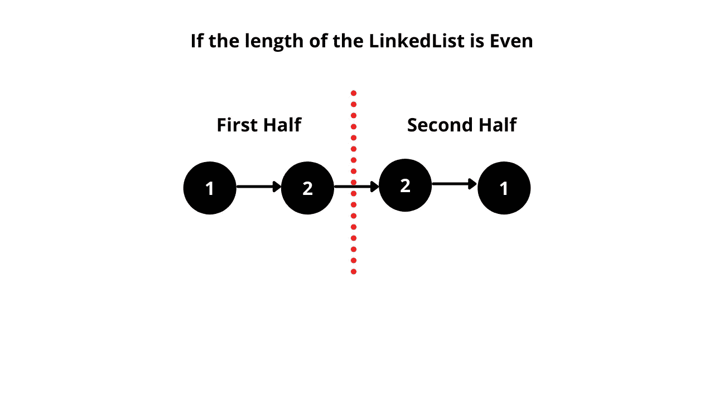
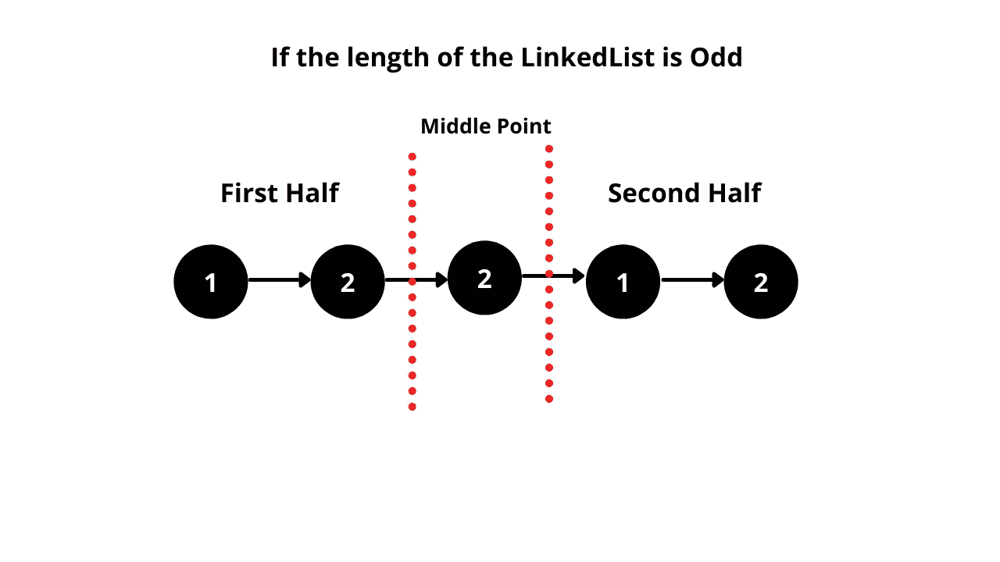

# 2021 年 4 月 LeetCoding 挑战—第一天:回文链表

> 原文：<https://blog.devgenius.io/april-leetcoding-challenge-2021-day-1-palindrome-linked-list-e7ee393e1c9b?source=collection_archive---------4----------------------->

从今天起，我们将开始进行四月的 LeetCoding 挑战。你可以在我的个人资料中查看三月电码挑战问题。


# 问题陈述

给定一个单链表的`head`，如果是回文就返回`true`。

**例 1:**


```
**Input:** head = [1,2,2,1]
**Output:** true
```

**例二:**


```
**Input:** head = [1,2]
**Output:** false
```

**约束:**

*   列表中的节点数量在`[1, 105]`范围内。
*   `0 <= Node.val <= 9`

跟进:你能在`O(n)`时间和`O(1)`空间做到吗？

# **解决方案**

在这个问题中，我们必须找出一个给定的链表是否是回文。我希望你知道什么是回文。([查看此处](https://computersciencewiki.org/index.php/Palindrome#:~:text=A%20palindrome%20is%20a%20word,racecar%2C%20or%20the%20number%2010801.&text=The%20output%20should%20be%20%22True,it%20is%20not%20a%20palindrome.))

我们将讨论解决这个问题的两种方法。

**方法 1:使用 ArrayList:** 这种方法背后的基本思想是将所有节点值存储在一个 ArrayList 中。之后，我们遍历列表中的`start` 和`end`，并不断比较`start` 索引和`end` 索引处的值。如果它们相等，则增加`start` 索引并减少`end`索引。如果两个值不相同，那么我们返回 **false** (其中`LinkedList` 不是回文)。

时间复杂度:`O(n)`，用于遍历链表

空间复杂度:`O(n)`，使用 ArrayList 存储节点值

**方法 2:** 在这个方法中，我们将使用 LinkedList 操作。

如果 LinkedList 的长度是偶数:

*   找到链表的中点。
*   反转后半段。
*   将反向列表与列表的前半部分进行比较，如果所有值相等，则返回`true` 否则返回`false`



表示具有偶数个节点的链接列表的图表

如果 LinkedList 的长度是奇数:

*   找到链表的中点。由于长度为`odd`，中点将位于 LinkedList 的前半部分和后半部分之间。
*   现在反转链表的后半部分
*   将反向列表与列表的前半部分进行比较，如果所有值都相等，则返回`true` 否则返回`false`



表示奇数个节点的链接列表的图表

代码如下。

时间复杂度:O(n)，用于遍历链表

空间复杂度:O(1)，不使用额外的空间

代码可以在这里找到

[](https://github.com/sksaikia/LeetCode/tree/main/src/MarchLeetcodeChallenge2021) [## sksaikia/LeetCode

### 在 GitHub 上创建一个帐户，为 sksaikia/LeetCode 开发做贡献。

github.com](https://github.com/sksaikia/LeetCode/tree/main/src/MarchLeetcodeChallenge2021)