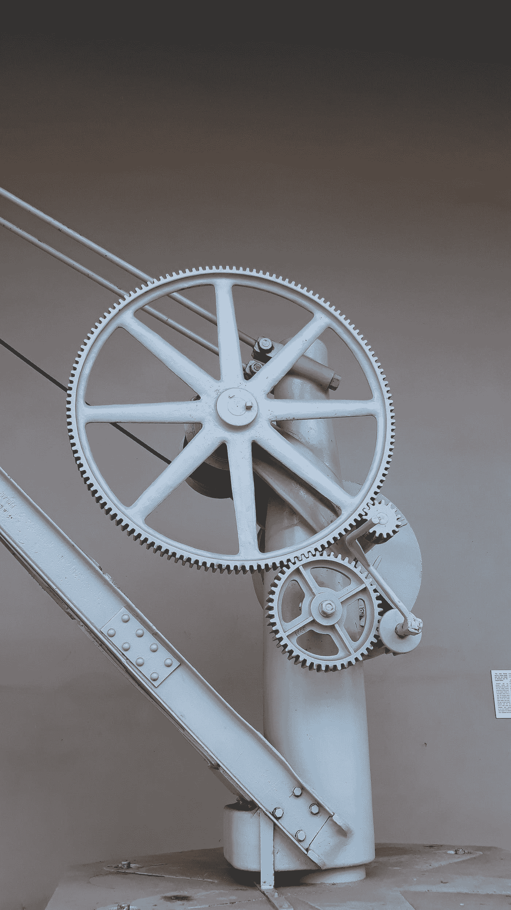

# 建筑气味

> 原文：<https://blog.devgenius.io/architectural-smells-2b72dbf093b5?source=collection_archive---------1----------------------->

软件中的一切都是一种取舍，架构也不例外。什么症状应该帮助我们改变我们的架构来解决新问题。

[帕万·卡万](https://unsplash.com/@pawankawan?utm_source=medium&utm_medium=referral)在 [Unsplash](https://unsplash.com?utm_source=medium&utm_medium=referral) 上的照片

很难定义什么是软件架构，我们可以认为这只是与系统的蓝图有关，有更高或更低的细节。我觉得这是一个很简单的解读。在我看来，一个更全面的观点是将架构看作是构建代码的组织的文化在软件世界(通常是代码)中的表现。

> *任何设计系统(广义定义)的组织都会产生一个设计，其结构是组织沟通结构的复制。*
> 
> *—梅尔文·康威*

因此，架构与我们在公司定义的沟通模式密切相关，团队互动、部门、流程现实世界的一切都将以某种方式印在我们的软件中。
但是组织会随着时间的推移而发展，那么我们的软件架构会发生什么变化，也会发展吗？。

## 建筑进化

软件架构的一个流行定义是，架构是“很难改变的东西”。在我看来，这正在发生，因为文化是关于那些没有人谈论的事情。因此，大多数情况下，要改变我们架构的某些方面，我们必须改变行为和交互，这并不容易改变。人们会反对改变，你必须说服他们，这是困难的部分，我们应该以一种容易改变的方式做软件，软件架构更多的是关于人而不是其他任何东西。

代码气味是众所周知的我们的代码可能存在的一系列问题，我们不需要修复所有的代码气味，但是我们可以使用它们来知道如何改进那些需要改变的部分。这是一种权衡有时问题很小，尝试修复这些气味没有价值，其他我们知道问题会增长，我们希望在问题变得太大之前预测并修复它们(最后负责任的时刻)。
我们知道，我们必须与意外的复杂情况作斗争，以将我们的代码始终保持在可维护的水平。新特性也代表了选择新的折衷方案来提高可维护性的新机会。
建筑行业也是如此。

## 建筑特征

在建筑方面，我认为我们有同样的问题，但要想用气味来思考，我们首先应该定义哪些是建筑特征，并试图测量它们。在[软件架构基础](http://fundamentalsofsoftwarearchitecture.com/)中，作者将它们称为“基础”。

*   有效性
*   可靠性
*   易测性
*   可量测性
*   安全性
*   灵活
*   容错
*   省略
*   可复性
*   表演
*   可部署性
*   可学性

首先要做的是将这些“能力”从对组织来说更重要到不太重要排序。这将塑造我们建筑的一些重要部分。

因为它们很重要，我们应该定义一些[适应度函数](https://www.thoughtworks.com/radar/techniques/architectural-fitness-function)，以了解随着时间的推移，我们在这些特征上有多好。这些适应度函数将帮助我们监控我们的重要“感受”和权衡，以决定我们当前的状态是好是坏。

只选择我们真正感兴趣的，并考虑实现它们的最佳架构。“能力”的顺序会随着时间的推移而改变，因为组织中的事情会改变，所以你的架构可能需要改变，为了做到这一点，你需要在某个时候改变你的组织和你的文化。
在某种程度上，我们必须创建一个专注于变革的组织，知道未来会发生变化，创建这种文化是快速解决我们的架构所产生的问题的关键。

## 建筑风格

有大量的架构风格，每一种都提供了一些折衷方案:

*   分层的
*   管道
*   微核
*   服务基础
*   事件驱动的
*   基于空间的
*   微服务

根据你团队和组织中的人的“能力”,选择更简单的来解决你的问题，但是要注意观察你的适应能力的变化。但也要重新检查你的新的优先事项。还要考虑到，您将始终处于不同架构风格之间的混合模型中。[比如分布式单片(分层分布式架构)比微服务更容易看到。](/distributed-monolith-1d2d9f86a68f?sk=7b489fa66af30f9946142485df6784d6)

## 大爆炸变化

大爆炸是延迟太多改变的例子，你可能认为架构足迹没有改变，这是一个谬论。我们通常会受到从零开始的诱惑，这通常是一条艰难的道路。
足够老的组织总是被迫改变他们的架构，这取决于他们如何很好地照顾他们的进化这将是困难的或者非常非常困难的。

制造简单的东西并不是一件容易的事情。