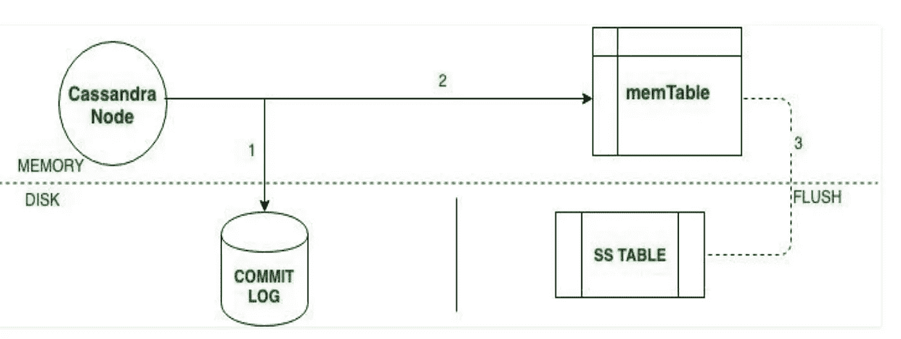

# 架构 Cassandra，最佳实践，带 Ansible 的安装集群多 DC

> 原文：<https://blog.devgenius.io/architecture-cassandra-best-practices-installation-cluster-multi-dc-with-ansible-da30dbe4b66?source=collection_archive---------7----------------------->

我将在本文中尝试解释 Apache Cassandra。这是一个分布式数据库管理系统，旨在处理众多数据中心的海量数据。最重要的特征是:

*   适应性很强
*   提供高水平的可用性
*   设计简单
*   分布式架构

**Cassandra 架构|数据复制策略&因素**

Cassandra 旨在处理大数据。Cassandra 的主要特点是跨多个节点存储数据，没有单点故障。

这种 Cassandra 架构的原因是硬件故障可能随时发生。任何节点都可以停机，在发生故障时，存储在另一个节点上的数据可以使用。因此，Cassandra 被设计成分布式架构。

Cassandra 通过其分布式架构将数据存储在不同的节点上。

所有节点都使用 Gossip 协议相互交换信息。Gossip 是 Cassandra 中的一种协议，节点可以在其中相互通信。

## 卡桑德拉建筑的组成部分

**节点**
节点是存储数据的地方。这是卡珊德拉的核心成分。

**数据中心**

节点的集合称为数据中心。许多节点被归类为数据中心。

**集群**
集群是许多数据中心的集合。

**提交日志** 每次写操作都会写入提交日志。提交日志用于崩溃恢复。

**记忆表**

将数据写入提交日志后，数据将被写入 Mem 表。数据被临时写入 Mem 表。

**SSTable**
当 mem 表达到一定值时，数据被导出到 SSTable 磁盘文件中。

## Cassandra 中的数据复制

卡珊德拉有两种类型的复制策略；

## **Cassandra 中的简单策略**

SimpleStrategy 仅在您有数据中心时使用。SimpleStrategy 将第一个副本放在由分割器选择的节点上。之后，剩余的副本被顺时针放置在节点环中

## Cassandra 中的网络拓扑系统策略

当有两个以上的数据中心时，使用 NetworkTopologyStrategy。在网络拓扑系统策略中，副本是为每个数据中心单独设置的。NetworkTopologyStrategy 将副本顺时针放置在环中，直到另一个 Rac 到达第一个节点。这种策略尝试将副本放在同一数据中心的不同 Rac 中。

这是因为 rac 中有时会出现故障或问题。那么其他节点上的副本可以提供数据。

> Cassandra Rac 是环中节点的逻辑分组。换句话说，Rac 是服务器的集合。数据库使用 Rac 在不同的逻辑组之间分发副本。多个节点(每个节点位于单独的 Rac 中)可以提供更高的容错能力和可用性。

## Cassandra 中的写操作

当节点收到写请求时，它首先写入提交日志(磁盘)。
然后，Cassandra 将数据写入 mem 表。每个写请求中写入 mem 表的数据也单独写入提交日志。Mem 表是临时存储在内存中的数据，而 Commit log 记录事务日志用于备份目的。提交日志是磁盘上仅附加的日志文件。Cassandra 中写过程很快的原因之一是提交日志只是附加的。
当 Mem 表满时，数据被导出到 SSTable 数据文件中。

## Cassandra 中的读取操作

协调器可以向副本发送三种不同类型的读取请求。

*   直接请求
*   摘要请求
*   阅读维修请求

其中一个复制品接收来自协调器的请求。然后，协调器向由一致性级别给定的数量的副本发送最高请求，并检查返回的数据是否已经更新。
然后，协调器发出对所有剩余拷贝的最大请求。如果任何节点返回过时的值，后台读取修复请求将更新该数据。读取修复机制是该过程的名称。

**种子提供者**:应该写入将包含在集群中的其他主机信息。建议每个数据中心有 3 个核心节点。

**listen_address** :客户端要访问的 IP，Cassandra 主机信息应该写在安装它的服务器上。

**rpc_address** :这是 Cassandra 将通过 CQL 协议监听的基于客户端的通信的 IP 地址。

**端点探听者**:输入您想要使用的拓扑的信息。你可以在这个地址找到关于告密者的详细信息[https://docs . datas tax . com/en/Cassandra-OSS/3.0/Cassandra/architecture/arch snitches about . html](http://SnitchesAbout)

**cluster_name** :它可以是您将要安装的项目的名称，也可以是您选择的任何名称。

**复制因子**:我们可以根据复制因子和复制策略来确定副本的数量和位置。复制因子是群集中副本的总数。当我们将这个因子设置为 1(一)时，意味着一个簇中的每一行只有一个副本，依此类推。我们可以在数据中心级别和 Rac 级别调整这一因素。

根据您赋予复制因子的值，您可以看到节点上的变化，并且您可以使用下面计算的 Cassandra 参数。

 [## 假人的卡珊德拉参数

### 这个简单的表单允许您为 Apache Cassandra 集群尝试不同的值，看看会有什么影响…

www.ecyrd.com](https://www.ecyrd.com/cassandracalculator/) 

## 一致性水平

**一个**:应该只有一个副本响应。

**两个**:两个副本应该响应。

**三**:三份应回应。

**法定人数**:多数副本(n/2+1)应响应。

所有副本必须响应。

**Each_Quorum** :每个数据中心的大多数副本都应该响应。

**Local_Quorum** :本地数据中心的大多数副本(无论协调器位于哪个数据中心)都应该响应。

**Local_One** :应该只有一个副本响应。在多数据中心群集中，这还可以确保读取请求不会发送到远程数据中心的副本。

**任意**:单个副本可以响应或者协调者可以隐藏提示。如果隐藏了一个提示，协调器将尝试重放该提示

## 创建一个简单的 Cassandra 集群，包含 3 个节点

创建最佳实践和用户的步骤应该在安装之前在 Linux 中完成

## 可能的库存主机信息:

**Cassandra _ servers _ av rupa**:av DC 中的节点信息

**种子**:要包含在集群中的其他主机信息需要写入。

**Dc_name** :应该写在哪个 Dc

**Cassandra _ servers _ asya**:as DC 中的节点信息

应填写项目名称或项目的目的。

**Cassandra_dbdashboard** :必须写入 pmm 监控 ip 地址

**Cassandra _ servers _ dbdashboard**:要添加到 pmm 的集群信息

## Cassandra 集群安装 3 个带 Ansible 的节点

您可以从我的 GitHub 地址访问和使用 Cassandra 安装、最佳实践、副本设置和 Percona 监控和管理安装的步骤以及其他步骤。你可以用 Ansible 快速安装。

> **用 Ansible** 安装集群

 [## GitHub-nazelin/Installation-Cassandra

### 卡珊德拉装置。Cassandra . YAML ve Cassandra-rack DC . properties . YAML dosy larn n düzelenmesi。卡珊德拉·贝斯特…

github.com](https://github.com/Nazelinn/Installation-Cassandra) 

**数据库(密钥空间)虚拟企业角色创建:**

我们可以用 nodetool status 在 Cassandra 中看到节点的状态。

> 参考资料:

 [## 如何在多个节点上设置 Cassandra 集群

### Cassandra 集群是整个 Cassandra 数据库中的一个外壳。多个 Cassandra 集群组合在一起…

www.guru99.com](https://www.guru99.com/cassandra-cluster.html)  [## 告密者

### 一个告密者决定哪些数据中心和机架节点属于哪个。告密者决定哪些数据中心和机架节点…

docs.datastax.com](https://docs.datastax.com/en/cassandra-oss/3.0/cassandra/architecture/archSnitchesAbout.html)  [## Apache Cassandra | Apache Cassandra 文档

### 管理大量数据，快速，不眠不休卡珊德拉 4.0 是 GA！我们如何提供最稳定的…

cassandra.apache.org](https://cassandra.apache.org/_/index.html)  [## Apache Cassandra - GeeksforGeeks 的架构

### Avinash Lakshman 和 Prashant Malik 最初在脸书开发了 Cassandra 来支持脸书收件箱搜索…

www.geeksforgeeks.org](https://www.geeksforgeeks.org/architecture-of-apache-cassandra/)