# 作为代码的架构建模和图表

> 原文：<https://blog.devgenius.io/architecture-modelling-diagramming-as-code-3636b42fdd17?source=collection_archive---------1----------------------->

在过去几年中,“作为代码”这个术语已经成为“作为代码的基础设施”领域的主流。该领域的一个明显趋势是，越来越多的工具允许使用通用编程语言(如 TypeScript、Java 和 C#)而不是配置语言(如 YAML 或 JSON)来定义基础设施，如 [AWS CDK](https://aws.amazon.com/de/cdk/) 或 [Pulumi](https://www.pulumi.com/) 。

在本文中，我们将探索将“as code”范例应用于架构文档意味着什么，看看可用的工具以及依靠通用编程语言可以获得的好处。

# 作为代码的建筑是关于什么的？

简而言之，它是关于以一种不主要依赖于绘图和图表的方式记录和描述您的系统架构，而是使用更接近于开发人员经常使用的工具。

周围已经有一些工具允许“作为配置来绘图”，即[美人鱼](https://mermaid-js.github.io/mermaid)、 [PlantUML](https://plantuml.com) 和 [Ilograph](https://www.ilograph.com) 。所有这些都是将文本描述转换成可视化图表的工具。

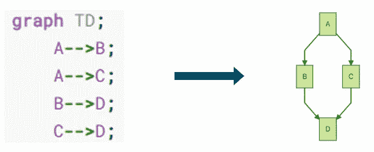

美人鱼图示例

在这些工具中，Mermaid 的优势在于能够将图表直接嵌入 markdown 文件中，并且有一些工具——包括 GitHub 呈现结果图表，而不是定义文本。

另一方面，Ilograph 呈现了非常好的交互图，并且迈出了将架构模型从图中分离出来的第一步——但是后面会详细介绍。

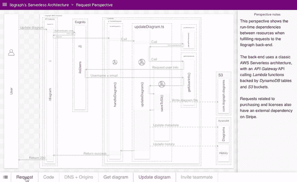

然而，所有这些工具都有一些缺陷(从代码架构的角度来看):

*   它们依赖于配置语言，而不是通用编程语言
*   他们要么根本没有将架构模型从图中分离出来的概念(像 Mermaid 和 PlantUML)，要么将建模和图表混合在一起(像 Ilograph)

# 使用 Structurizr 将架构模型从图的创建中分离出来

为了更好地理解最后两个要点，让我们看看另一个工具: [Structurizr](https://structurizr.com/) 。

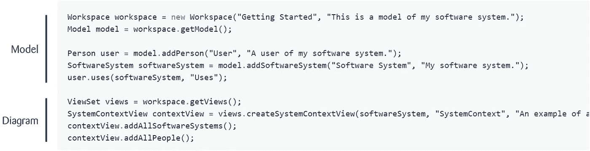

让我强调一下上面代码片段的一些内容:

*   它使用 Java，而不是配置语言
*   它清楚地将定义架构模型(意思是:系统的构建块以及它们之间的关系)与定义基于该模型的图分开
*   它没有说这些图是如何呈现的。这是因为——虽然自带渲染引擎——Structurizr 可以与不同的渲染引擎一起使用，包括 Mermaid、PlantUML 和 Ilograph

使用 Structurizr 通常包括 3 个不同的步骤:

## **1。为您的架构建模**

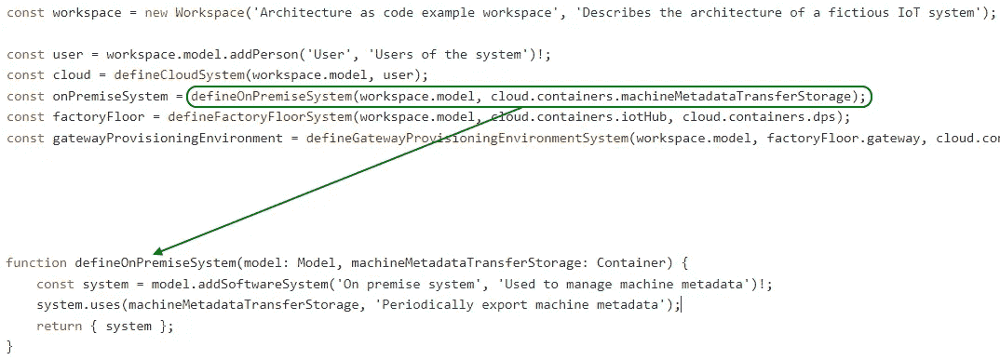

在这里，您已经可以看到使用通用编程语言来描述您的架构的好处之一:它允许您应用相同的工具和技术来结构化和重构您的架构文档，就像您对“生产性”代码所做的那样。

## **2。基于定义的模型定义图表**

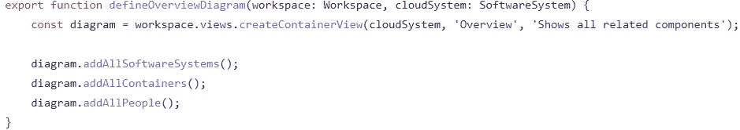

将图的定义从模型中分离出来，可以让您控制模型的哪些元素与图相关，而不需要跨图重复元素定义。

## **3。渲染图**

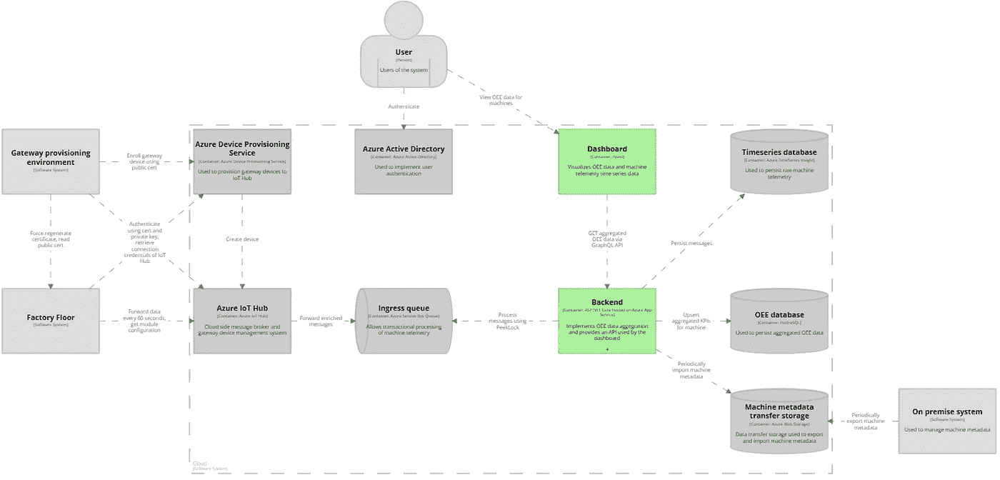

一旦您定义了您的模型和图，您就可以利用许多方法来呈现图:

*   使用付费的 [Structurizr 云服务](https://structurizr.com/help/cloud-service/getting-started)
*   使用免费的 [Structurizr Lite](https://structurizr.com/help/lite) Docker 图像
*   使用 PlantUML，Mermaid，Ilograph 等，详见[https://structurizr.org/](https://structurizr.org/)

# 建模优于作图的优势

通过将架构模型从图的定义中分离出来，您获得了一些可能性，这些可能性在记录非平凡系统的架构(并且必须维护所述文档)时被证明是非常有价值的。

## 创建多个一致的视图

最大和最突出的好处之一是能够在同一个模型上创建多个一致的视图。

*   针对不同的受众，在不同的抽象层次上创建图表
*   创建包含系统组件不同子集的图表，突出不同的用例

下面的例子显示了两个不同的代码片段，在代码片段的旁边产生了图。两个图都是从同一个模型中创建的。

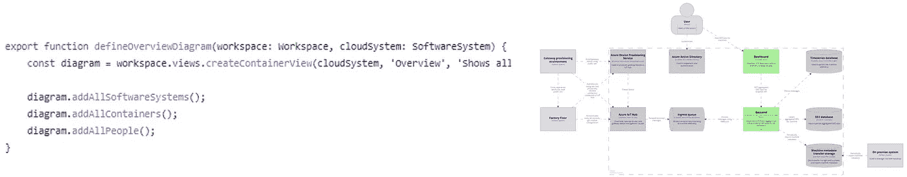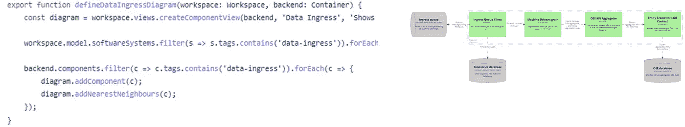

## 重新设计图表

您获得的第二个最有用的优势是能够快速和一致地(重新)样式化您的所有图表:

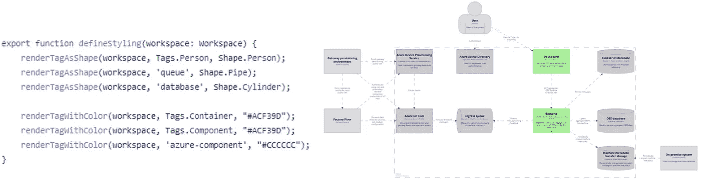

# 编码优于绘图的优势

最后，让我们更深入地了解使用通用编程语言创建架构模型和图表所能实现的类型——相对于基于配置的解决方案，如 Mermaid、PlantUML 或 Ilograph，或经典的绘图工具，如[diagrams.net](https://diagrams.net/)或 Visio。

## 更轻松的文档版本管理

这主要适用于比较基于代码的解决方案，如 Structurizr 和经典的绘图工具，如 diagrams.net。其他基于配置的解决方案，如 Mermaid，也获得了部分好处。

下面的截图显示了…

*   一个使用 diagrams.net 创建的`.drawio`文件，只做了一个小的布局更改

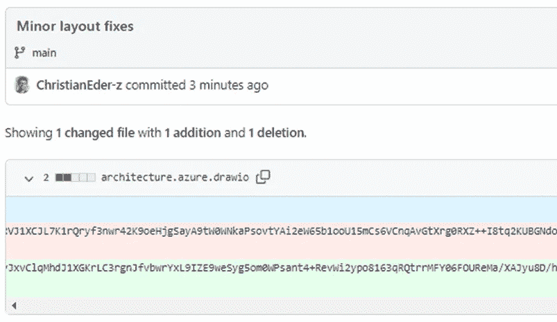

*   在向系统架构中添加关于全新组件的文档之后的结构化模型

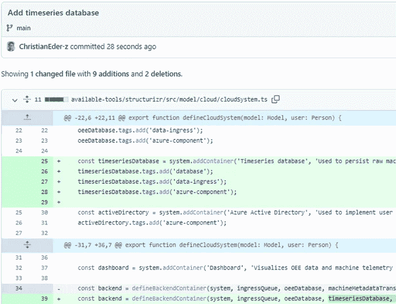

对于这些差异中哪一个更容易审查并带来更多价值，应该没有太多问题…

## 工具之间的互操作性

当使用通用编程语言时，通常很容易添加与另一个工具的互操作性。我给你举个例子。假设您已经使用 Structurizr 创建了一个架构模型，但是想要使用 Ilograph 来呈现图表。使用像 [ilograph-typescript](https://github.com/ChristianEder/ilograph-typescript) 这样的库，从你的结构化模型创建 ilograph 图只需要几行代码就可以实现:

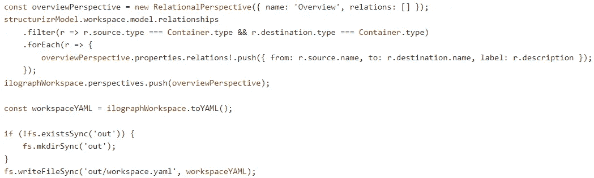

## 组件依赖一致地出现在图和代码中

我就用一张图来说明这一点:

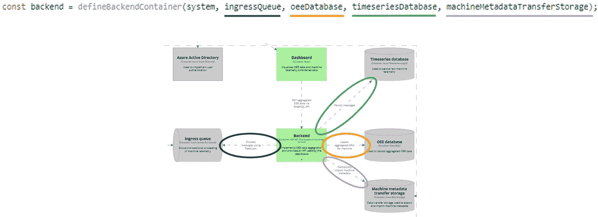

## 您的文档将更有可能保持最新

让我们面对现实吧——大多数开发人员更喜欢编写代码，而不是使用 Visio 或其他绘图工具来使文档与不断变化的代码库保持一致。结果是，许多架构文档都过时了。使用源代码作为文档工作的基础，您可以将文档更新包含到 CI/CD 流程中。

觉得这篇文章有用？在 Medium 上关注我( [Christian Eder](https://medium.com/@christian.johann.eder) )并查看我下面关于 Azure、AWS、基础设施代码和物联网的文章！不要忘记👏这篇文章分享一下吧！

*   [使用 Newtonsoft。ASP.NET 的 JSON Core 和 SignalR](https://medium.com/@christian.johann.eder/using-newtonsoft-json-in-asp-net-core-and-signalr-55b0fa4645aa)
*   [使用 CDK 将 ASP.NET 核心 API 部署到 AWS Fargate】](https://awstip.com/deploying-an-asp-net-core-api-to-aws-fargate-using-cdk-dab10bef51a1)
*   [消费者驱动的契约测试——使用 Azure 函数托管模拟 API](https://medium.com/@christian.johann.eder/consumer-driven-contract-testing-hosting-a-mocked-api-using-azure-functions-a42d634c47fd)
*   [使用实体框架核心和 PostgreSQL 按日历周分组](/grouping-by-calendar-week-using-entity-framework-core-and-postgresql-49d24412e0e5)

另外，如果你还不是中等会员，可以考虑在这里加入。