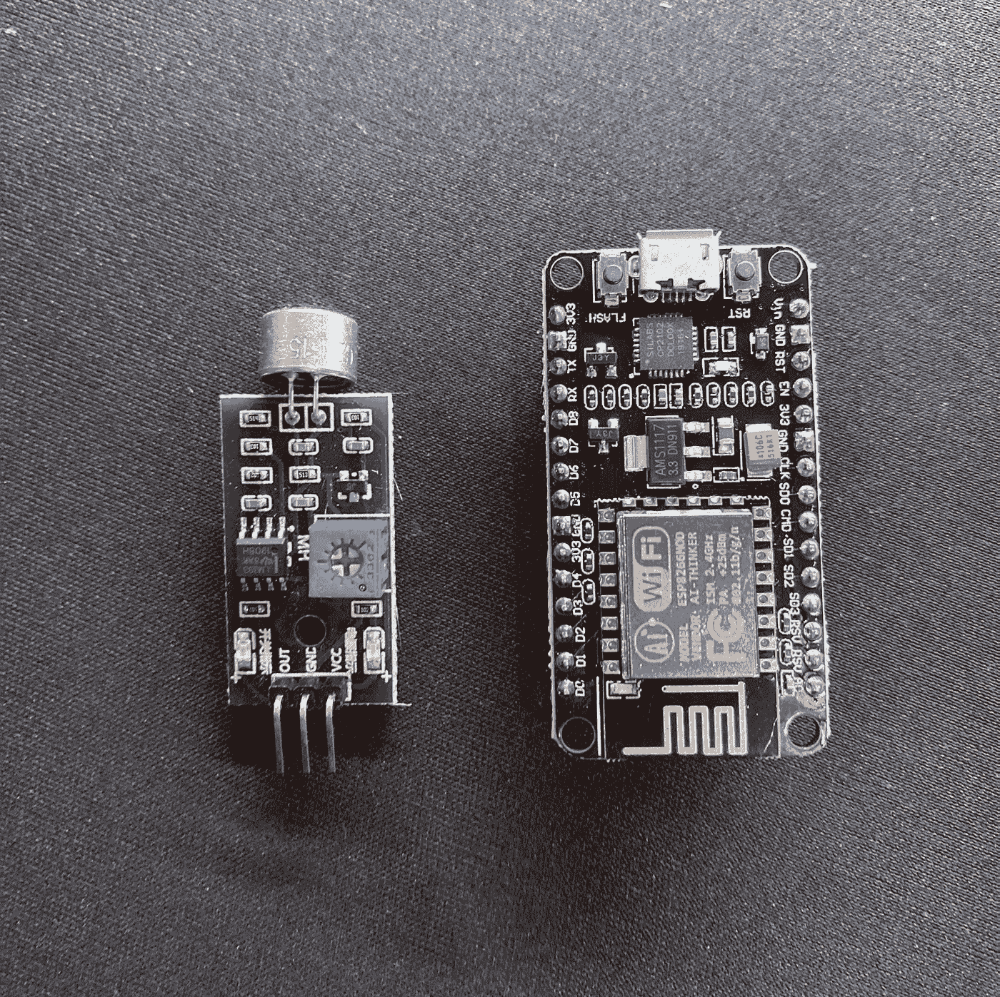
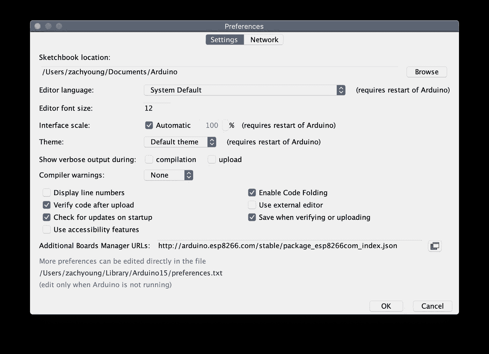
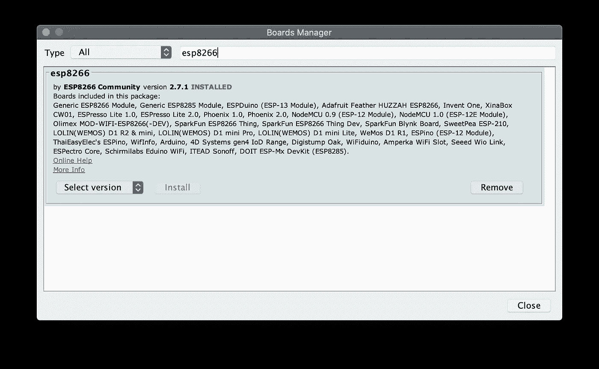
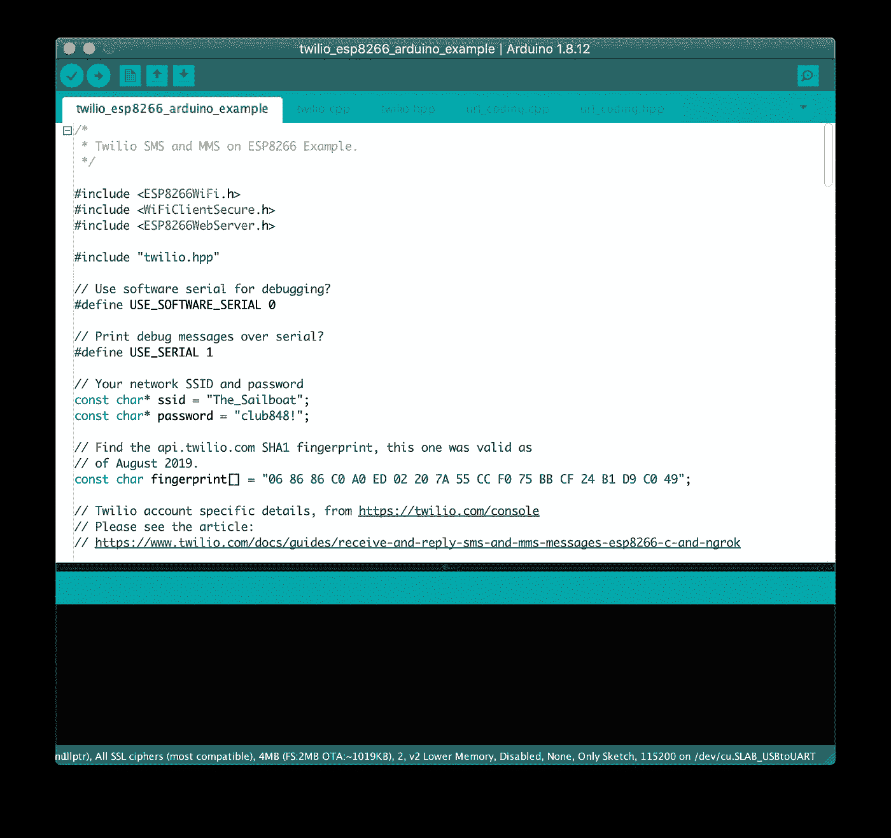
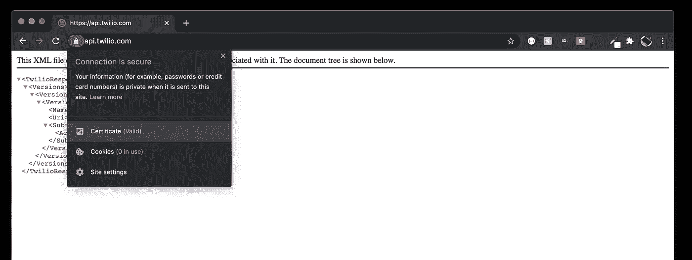
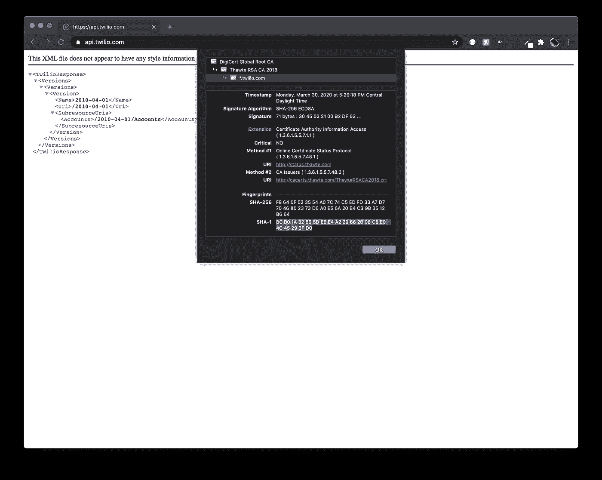
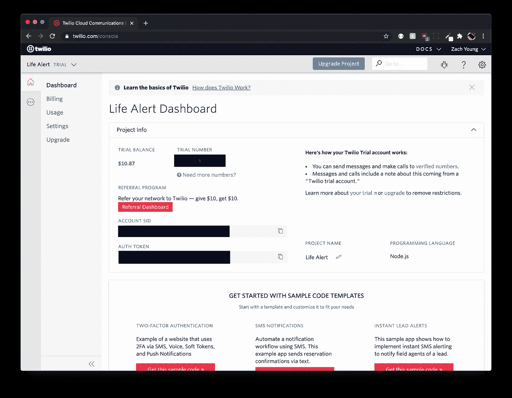
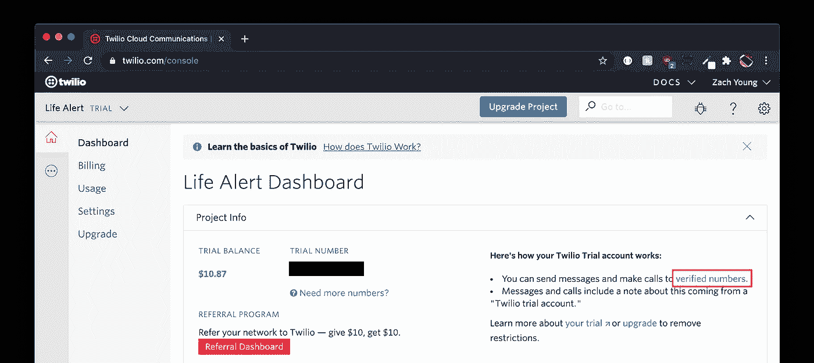
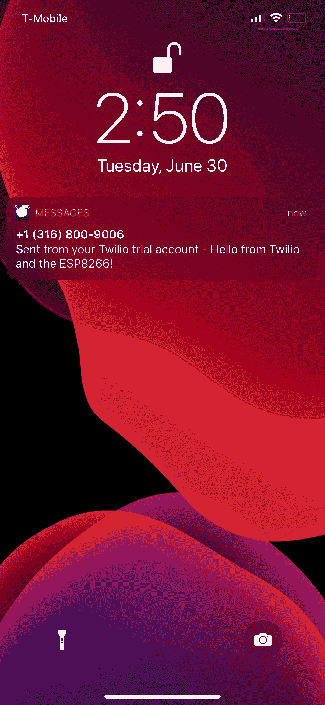

# 基于 Arduino 的短信提醒系统(生活提醒启发)

> 原文：<https://blog.devgenius.io/arduino-based-sms-alert-system-life-alert-inspired-88ad3dc5129a?source=collection_archive---------10----------------------->

## 这个项目是一个如何使用 ESP8266、基于 LM393 的声音传感器和 Twilio API 在传感器被触发时发送 SMS 警报的例子。



我发现 Twilio 文档中当前的[教程](https://www.twilio.com/docs/sms/tutorials/how-to-send-sms-messages-esp8266-cpp)对于如何让它在 ESP8266 上运行有点混乱。因此，我决定记录将 Twilio 的 API 合并到我的项目中的过程，以便任何想做同样事情的人都清楚地了解如何完成它。但是首先，这个项目的背景是什么。

# 背景

要理解这个项目的有用性，你必须首先理解创建它的必要环境。

我哥哥患有一种高功能自闭症，叫做 T4 阿斯伯格综合症。在很多情况下，包括他的情况，患有这种疾病的人可能会崩溃。最近几个月，他崩溃的频率和强度急剧增加。以至于有几次他在不知不觉中弄伤了自己。很多时候，这些都发生在半夜我父母睡着的时候。虽然这些情绪崩溃通常与奔跑、跳跃和尖叫有关，但通常情况下并不会惊醒他们。能够干预并给他一些帮助他冷静下来的东西，已经成为防止他伤害自己的必要条件。但是如果我的父母没有意识到这一点，他们怎么能干预呢？

进来的是我认为的“生命警报”。

就像实际的生命警报一样，当它被触发时，这个传感器会发出通知来提醒某人。在这个系统中，因为他的崩溃总是与尖叫有关，当声音传感器在一定的分贝水平被触发时，ESP8266 就会通过 Twilio 向我的父母发送短信，提醒他们，以便他们可以干预。

*该项目可根据您的需求调整使用任何传感器。然而，重点将是如何将 Twilio 集成到您的项目中。*

# 所需材料

*(1) ESP8266
(1) LM393 模拟声音传感器
(3)母到母跳线
(或者您可以使用普通线、焊料和烙铁)
(1)微型 USB 电缆
(1) 5V 电源适配器*

# 设置

我假设你已经安装了 Arduino IDE，但是如果没有，你可以在这里找到它。

我使用的是 ESP8266，它需要一些配置才能与 Arduino 配合使用。如果您使用不同的主板，过程可能会略有不同。

首先，您需要下载并安装允许通过 usb 与 ESP8266 通信的驱动程序。根据您的 ESP8266 的具体版本，所需的驱动程序可能会有所不同，因此请参考随附的文档来确定具体的驱动程序。我的用的是 CP2102 驱动，你可以在这里找到[。](https://www.silabs.com/products/development-tools/software/usb-to-uart-bridge-vcp-drivers)

接下来，您需要将 ESP8266 添加到 Arduino IDE 中的电路板管理器中。在 IDE 中导航到**首选项** > **附加板管理器 URL**和粘贴到以下内容:[**http://arduino . esp8266 . com/stable/package _ esp8266 com _ index . JSON**](http://arduino.esp8266.com/stable/package_esp8266com_index.json)



现在进入**工具>板>板管理器**打开板管理器，搜索“ *ESP8266* ”，安装 **ESP8266 社区**的板管理器。



现在你应该已经准备好上传代码了。

# 特维利奥

要通过 Twilio API 集成短信通知，你需要创建一个[账户](https://www.twilio.com/try-twilio)。完成后，您需要创建一个新项目并验证一个电话号码。接下来，你需要一个电话号码来发送信息。点击项目仪表板中的**获取试用号**并选择一个电话号码。

现在开始下载 Twilio 的 ESP8266 项目文件。你可以在这里找到它们。下载后，将文件夹从**twilio _ esp8266 _ arduino _ example-master**重命名为**twilio _ esp8266 _ arduino _ example**。虽然这种改变看起来微不足道，但却很重要，这样 Arduino IDE 就可以正确地读取文件。现在在 Arduino IDE 中打开它，方法是转到**文件>打开**并导航到您刚刚重命名的文件夹。打开标题为**twilio _ esp 8266 _ arduino _ example . ino**的文件。



在这里，您可以根据自己的喜好定制项目。从设置活动和非活动时间段到向自定义 API 发出 POST 请求以存储日志。但是为了简单起见，我将展示如何在传感器被触发时发送通知。

你要做的第一件事就是配置 Wi-Fi 设置。将 **ssid** 和**密码**变量更改为您的网络名称和密码。接下来，我们需要一个有效的**指纹**。这个问题花了我一分钟才弄明白，但是很容易得到。在 Chrome 中，转到**api.twilio.com。**点击**锁图标>证书。**



展开模式中的**细节**下拉菜单，滚动到底部显示**指纹**的地方，并复制 **SHA-1** 键的值。



现在将该键粘贴到草图中的**指纹**变量中。

回到你的 Twilio 项目的仪表板。你需要**试用号**、**账号 sid** 和**认证令牌。**分别粘贴到 **from_number、account_sid、**和 **auth_token** 变量中。



您还需要在 **to_number** 变量中提供一个电话号码，以接收这些文本消息。

**注:** *如果您的项目使用的是 Twilio 的试用版，则只有* **验证过的号码** *才能接收短信。默认情况下，您用来注册的号码已经过验证。如果您希望向注册号码以外的号码发送消息，您需要将该电话号码添加到项目仪表板的* **验证号码**部分。



# 密码

在这个例子中，我只演示了如何发送消息，所以我已经删除了任何不必要的代码，这些代码与发送的消息无关。草图可以在下面找到。

*如果您跟随的是 ESP8266 和声音传感器，您需要将传感器连接到+3.3v、接地和 ESP8266 上的 GPIO 引脚 4 (D2)。*

```
/*
 * Twilio SMS and MMS on ESP8266 Example.
 */#include <ESP8266WiFi.h>
#include <WiFiClientSecure.h>
#include <ESP8266WebServer.h>#include "twilio.hpp"// Use software serial for debugging?
#define USE_SOFTWARE_SERIAL 0// Print debug messages over serial?
#define USE_SERIAL 1// Your network SSID and password
const char* ssid = "The_Sailboat";
const char* password = "club848!";// Find the api.twilio.com SHA1 fingerprint, this one was valid as 
// of August 2019.
const char fingerprint[] = "06 86 86 C0 A0 ED 02 20 7A 55 CC F0 75 BB CF 24 B1 D9 C0 49";// Twilio account specific details, from [https://twilio.com/console](https://twilio.com/console)
// Please see the article: 
// [https://www.twilio.com/docs/guides/receive-and-reply-sms-and-mms-messages-esp8266-c-and-ngrok](https://www.twilio.com/docs/guides/receive-and-reply-sms-and-mms-messages-esp8266-c-and-ngrok)// If this device is deployed in the field you should only deploy a revocable
// key. This code is only suitable for prototyping or if you retain physical
// control of the installation.
const char* account_sid = "ACXXXXXXXXXXXXXXXXXXXXXXXXXXXXXXXXXX";
const char* auth_token = "Your AUTH TOKEN";// Details for the SMS we'll send with Twilio.  Should be a number you own 
// (check the console, link above).
String to_number    = "+18005551212";
String from_number = "+18005551212";
String message_body    = "Hello from Twilio and the ESP8266!";// The 'authorized number' to text the ESP8266 for our example
//String master_number    = "+18005551212";// Optional - a url to an image.  See 'MediaUrl' here: 
// [https://www.twilio.com/docs/api/rest/sending-messages](https://www.twilio.com/docs/api/rest/sending-messages)
//String media_url = "";// Global twilio objects
Twilio *twilio;
ESP8266WebServer twilio_server(8000);//  Optional software serial debugging
#if USE_SOFTWARE_SERIAL == 1
#include <SoftwareSerial.h>
// You'll need to set pin numbers to match your setup if you
// do use Software Serial
extern SoftwareSerial swSer(14, 4, false, 256);
#else
#define swSer Serial
#endif//initialize sensor on GPIO pin 4
int micPin = 4;/* Setup function for ESP8266 Twilio Example.
 * Here we connect to a friendly wireless network, set the time, instantiate 
 * our twilio object, optionally set up software serial, then send a SMS 
 * or MMS message.
 */
void setup() {
        WiFi.begin(ssid, password);
        twilio = new Twilio(account_sid, auth_token, fingerprint);#if USE_SERIAL == 1
        swSer.begin(115200);
        while (WiFi.status() != WL_CONNECTED) {
                delay(1000);
                swSer.print(".");
        }
        swSer.println("");
        swSer.println("Connected to WiFi, IP address: ");
        swSer.println(WiFi.localIP());
        #else
        while (WiFi.status() != WL_CONNECTED) delay(1000);
        #endif      
}
void loop() {
        //if sensor is triggered send a notification
        if (digitalRead(micPin) == LOW){
        // Response will be filled with connection info and Twilio API responses
        // from this initial SMS send.
        String response;
        twilio->send_message(
                to_number,
                from_number,
                message_body,
                response,
                media_url
        );
        swSer.println(response);
        delay(100);
        }
}
```

就是这样！这个循环将持续运行，如果它感应到**鼠标**被触发*(变低)*，那么它将向您提供的 **to_number** 发送短信。



# 后续步骤

如前所述，有许多方法可以修改这个项目，使其符合您的需要，但这只是一个样板文件，可以帮助您启动并运行 Twilio，以便您可以集成到自己的项目中。

如果有兴趣创建一个完整的堆栈应用程序来记录和显示数据，我将创建本教程的**第 2 部分**。