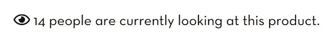

# 14 个人真的在看那个产品吗？

> 原文：<https://blog.devgenius.io/are-14-people-currently-looking-at-this-product-e7fe8412f16b?source=collection_archive---------0----------------------->

## 一个网上商店的源代码中揭露的无耻谎言。

网上商店会使用书中的任何技巧来引诱你购买他们的产品，但是在欺骗中很少有像我将在本文中讨论的公然欺骗这样明显的教训。

当浏览网上商店时，你有时会发现一个数字，表明有多少人正在浏览你现在正在浏览的同一产品。这在机票和酒店预订服务中尤其受欢迎。这可能是为了鼓励你尽快购买产品，以免别人抢在你前面。

有时候，这个数字是合法的。其他时候，是随机的。非常随机。

让我们看看一家名为[达芙妮](https://dafnihair.com)的店铺。如果你不知道 Dafni 是什么，不要担心:我也不知道。我知道的关于他们的两件事是:1)他们卖产品，2)他们谎报目前有多少人在浏览他们的产品。请注意，这篇文章并不意味着特别是对这种电子商务的攻击，因为你将要看到的并不是什么不寻常的把戏，但它很少像这里这样明显。这种电子商务是网上商店如何试图欺骗顾客的一个很好的例子。

在进入[他们的网站](https://dafnihair.com)时，我选择了我能在首页找到的第一个产品，在我的例子中恰好是[这个产品](https://dafnihair.com/dafni-allure/#product-section):

截图来自[dafnihair.com](https://dafnihair.com/dafni-allure/#product-section)摄于 2020-06-11。橙色边框是作者添加的。

我知道你可能会被这个事实分散注意力，它用粗体大写字母写道:“最优秀的创新”，而不是语法正确的“its”，但我想让你看看这段文字:“目前有 14 个人在看这个产品。”

截图来自[dafnihair.com](https://dafnihair.com/dafni-allure/#product-section)拍摄于 2020-06-11。

虽然你不能从静态图像中分辨出来，但这个数字对我来说很突出，因为它每隔几秒钟就会发生剧烈的变化。我决定看看源代码，看看他们用什么方法来更新数字。

如果你不知道，为了让开发者在网站首次加载后更新网站上的元素，他们通常必须使用客户端语言。这些语言在你的网络浏览器中运行，因此，你可以自己查看。只需右键单击页面上的任意位置并选择类似于“查看源代码”的内容，就可以检查正在运行什么代码来更新元素，比如当前查看产品的人数。

在这个特殊的电子商务中，我发现了这个代码:

一个在源代码中找到的方法用于[dafnihair.com](https://dafnihair.com/)。图像本身是作者制作的。

这是代码的精确副本。是的，源代码里写着“prodiutc”。但更有趣的是，这段代码清楚地表明，观看产品的人数是明显随机的。

我把代码翻译成人类语言:

翻译成人类语言的 Javascript 代码。形象是作者做的。

因此，浏览这篇文章的人数完全是捏造的。代码只是每五秒钟生成一个随机数。这使得看起来好像人们在不断地浏览网站，使它看起来活泼而忙碌。这可能是为了让网站看起来更值得信任，因为许多其他人似乎都在浏览。它还可以鼓励顾客尽快结账，因为他们感兴趣的产品可能需求量很大。

如果你在很久以后读到这篇文章，并且网站已经更新了，你可能会很高兴地知道，该网站在 2020 年 5 月 16 日被网络档案馆的爬虫编入索引，并且这段代码保存在其中。你可以在这里找到[网站的索引版本](https://web.archive.org/web/20191230031401/https://dafnihair.com/dafni-allure/)。

如果你在探索世界 *wild* web 时发现了类似的东西，不要害怕查看源代码，看看你是否能发现隐藏在接口下的可疑之处。

网站所有者可能会说谎，但代码永远不会。

*感谢阅读！成为会员后，你可以阅读无数来自我和其他作家的文章。如果你使用* [*我的链接*](https://bergdahl.medium.com/membership) *，我会从你的会员费中提成。*

 [## 通过我的推荐链接加入 Medium-Jacob Berg Dahl

### 作为一个媒体会员，你的会员费的一部分会给你阅读的作家，你可以完全接触到每一个故事…

bergdahl.medium.com](https://bergdahl.medium.com/membership) 

*如果你喜欢这篇文章，你可能也会喜欢这两段文字:*

 [## 这个招聘网站公开暴露用户数据

### 我发现超过 1000 个用户的工资期望值

javascript.plainenglish.io](https://javascript.plainenglish.io/this-recruitment-website-publicly-exposes-user-data-6a2f5736f805)  [## 这个网站不小心在源代码中留下了推广代码

### 通过浏览网站找到有趣的东西

javascript.plainenglish.io](https://javascript.plainenglish.io/this-website-accidentally-left-promo-codes-in-their-public-source-code-176c52fbfdc3)