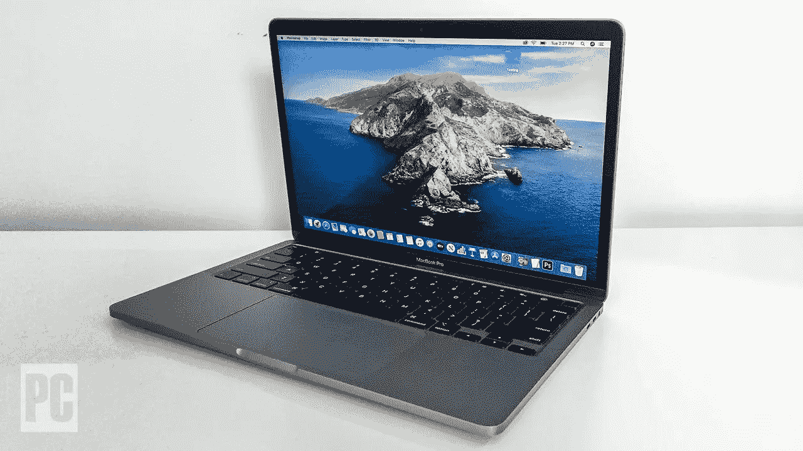
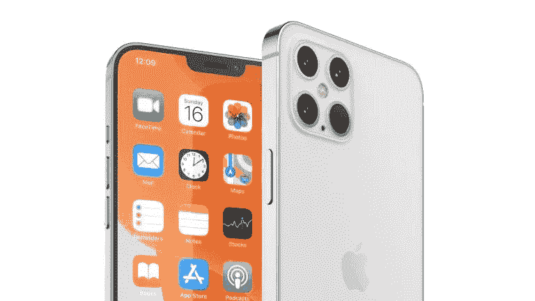
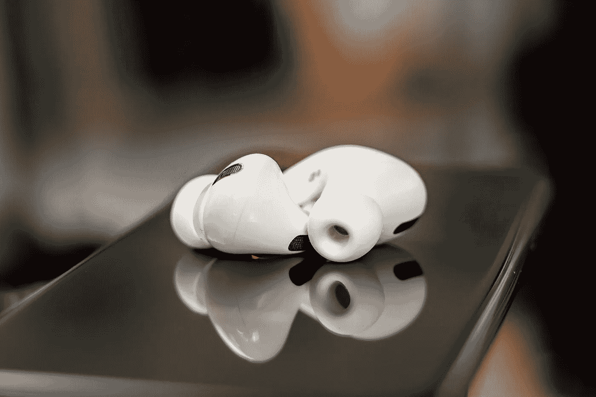

# 苹果产品值得我们花 1000 美元购买吗——追求最新最好的技术！

> 原文：<https://blog.devgenius.io/are-apples-products-worth-the-1000s-we-spend-on-them-striving-for-the-latest-greatest-tech-ae09b2c8d206?source=collection_archive---------33----------------------->

作为一个多年的苹果产品所有者，我在苹果产品上投入了 1000 美元，我真的可以说我在苹果的时间是值得的吗？或者我是在浪费我辛苦赚来的钱吗？

我目前的苹果产品清单如下:

*   2019 款 macbook pro 13 寸
*   Airpods Pro
*   Iphone X
*   苹果手表

因此，我目前在苹果产品上投资了 2000 多美元，我计划购买 Iphone 12，这将使我在苹果的总支出超过 3000 美元。我必须承认，从制作视频到撰写本文，我每天都在使用我的苹果产品，苹果让我的生活变得更加简单，但这也是有代价的。

我相信，当生活变得简单时，它有助于减少压力，并有更多的时间专注于做你喜欢的事情。对我来说，苹果产品很容易操作，让我可以做我喜欢的事情，比如编辑我的 youtube 视频，或者更简单的事情，比如看网飞。不管任务是什么，我相信我的 Macbook 已经准备好迎接挑战，它将允许我做我喜欢的事情，而没有任何额外的废话。

苹果总是发布更多创新的更新，加上较长的技术寿命和值得信赖的网络，这给了我很大的信心来购买苹果产品，获得最好的质量和“物有所值”。当我遇到我的 iPhone X 屏幕停止工作但没有破裂并且仍然输出声音的问题时，我面对苹果并在他们的商店预约，令我惊讶的是，苹果当天就解决了这个问题，没有丢失数据，而且完全免费！这让我对苹果的产品充满信心，也是我加入苹果“生态系统”的另一个原因

多年来，我确实相信苹果产品的价格是值得的，它们提供了一个令人惊叹的操作系统，总是有新的和不断变化的功能，易于下载和导航。使用苹果产品让我的生活变得更加轻松，因此增加了我每天的整体幸福感，并给了我额外的时间来做我喜欢做的事情。

因此，是的，对我来说，苹果产品值我投资的 1000 美元，因为我确切地知道我会得到什么，我知道它会是可靠的。