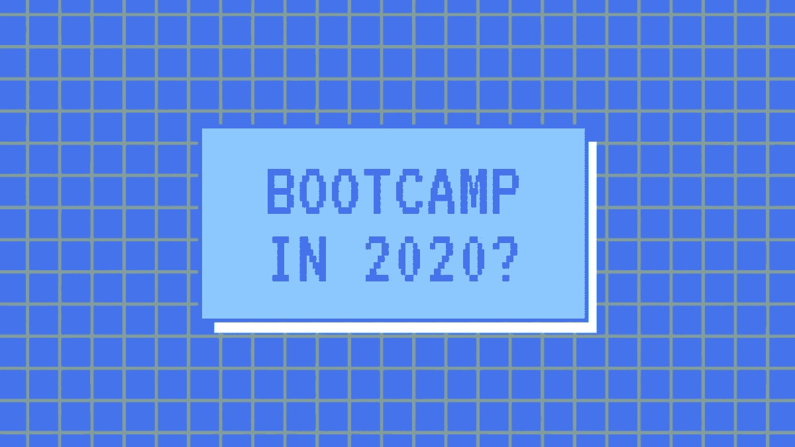

# 2020 年编码训练营值得吗？(检疫版)

> 原文：<https://blog.devgenius.io/are-coding-bootcamps-worth-it-in-2020-quarantine-edition-a9edeb8f27a9?source=collection_archive---------41----------------------->

这的确是个奇怪的时代。今年已经过去一半了，但是请原谅我。编程是一个充满机会的领域，这一年我有了训练营的第一手经验。

# 简而言之，我的背景

我会长话短说-我的背景。2015 年电气工程硕士毕业，去不同的项目工作过一段时间。我没有感到满足，觉得我的坦克里还有充沛的精力和雄心。于是有了一个申请编码训练营的机会。请注意，我写这篇文章的时候才 27 岁(对于那些害怕比许多人晚开始的人来说)。我第一个跳进了编码头，从此再也没有回头。毫无疑问，以前的研究根本不包括任何编码。这一切对我来说都是新的。

# 这个时代的训练营？

就在世界被全球隔离打击之前，我申请了一个训练营。有那么一会儿，我认为这个想法可能会失败。我们设法只听了几次面对面的讲座。这对我的学习意味着什么？一切都被快速定制，因此这些研究将完全以在线形式进行。

作为一个自学者，我很快意识到这甚至是有益的。我可以节省精力、时间甚至金钱，这样我就可以在我的编码技能上多下功夫。这可能不是对每个人都适用，但对许多程序员来说肯定是适用的。

# 变量

当然，训练营有不同的类型。我申请的那所学校非常严肃，注重实际项目、知识和成长。即使在训练营结束后，所有的参与者(来自所有的小组)都有一个特殊的休闲小组，我们可以在那里进行不同的对话和话题。训练营的创建者在每一步都帮助我们做到最好。

训练营总共进行了大约 4 个月的强化学习。

而且，他们正在帮助我们找工作。因为我最近刚从训练营毕业，我正在寻找我的第一份编程工作。

老实说，有些训练营对学生所学的东西并不投入。老实说，持续两周或一个月的课程对初学者来说并不友好。那段时间真的学不了那么多。所以，如果你是完全的初学者，申请一个持续时间稍微长一点的训练营。对我来说，我发现三个月后你就开始接受一些复杂的原则。

# 结论

以我个人的经验和看法，我认为 2020 年编码 Bootcamps 还是值得的。在很大程度上，这取决于你的投入和你的学习能力，但是训练营很有帮助。尤其是，如果讲师对他们的学生投入足够长的时间。

当我得到这份工作时，我会告诉你最新的消息。我有很多经验可以和你分享。我有一种感觉，它会很快。回去工作！

**跟我上** [**推特**](https://twitter.com/ArtursBri)**&**[**GitHub**](https://github.com/artursbridaks)