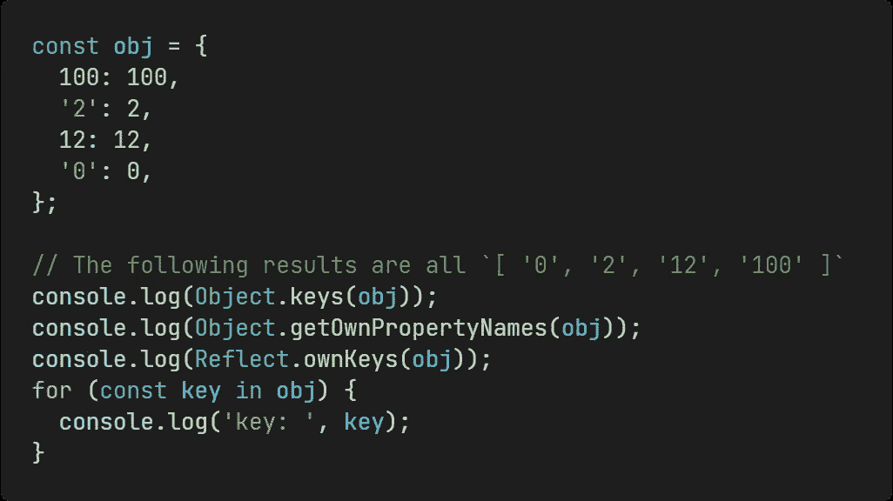
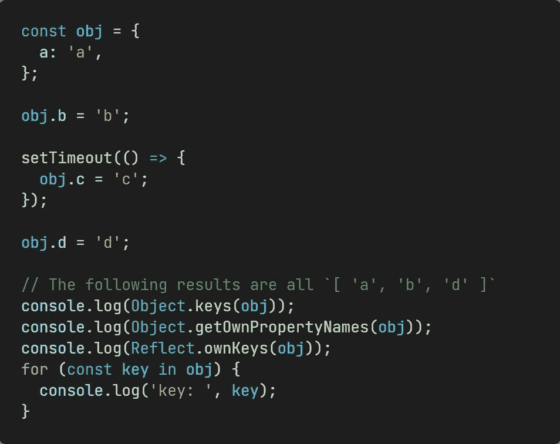
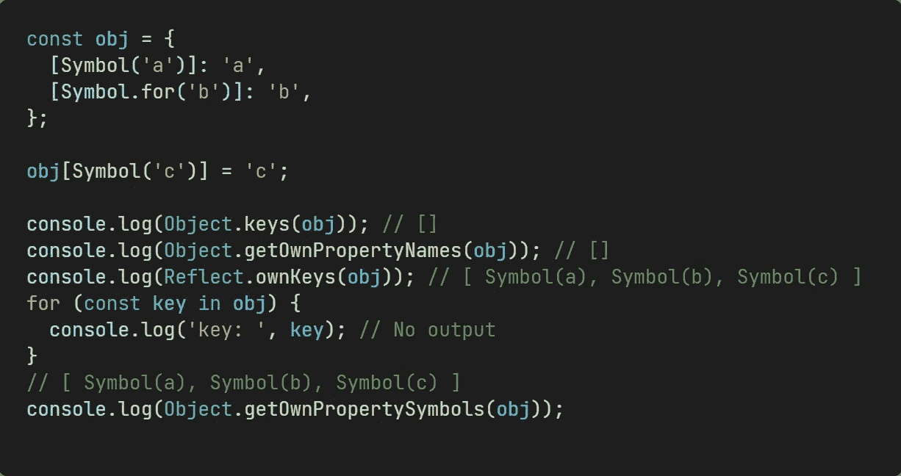
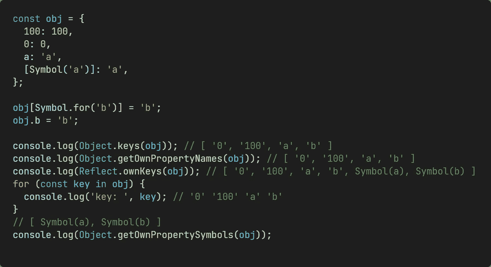

# JavaScript 对象属性是有序的吗？

> 原文：<https://blog.devgenius.io/are-javascript-object-properties-ordered-c30597754e5c?source=collection_archive---------4----------------------->

## 它与地图对象有何不同？


由 [Markus Spiske](https://unsplash.com/@markusspiske?utm_source=medium&utm_medium=referral) 在 [Unsplash](https://unsplash.com?utm_source=medium&utm_medium=referral) 上拍摄的照片

最近有人问我，JavaScript 对象属性一定是无序的、不可预测的吗？

早期接触 JavaScript 的开发人员可能会回答说`Object.keys()`或`for...in`会返回不可预测的对象属性顺序。

但现在还是这样吗？

如你所料，现在有规则可循了。

从 ECMAScript 2020 开始，`Object.keys`、`for...in`、`Object.getOwnPropertyNames`和`Reflect.ownKeys`都遵循相同的规范顺序。它们是:

# 1.自己的属性是数组索引，按数字索引升序排列



```
const obj = {
  100: 100,
  '2': 2,
  12: 12,
  '0': 0,
};// The following results are all `[ '0', '2', '12', '100' ]`
console.log(Object.keys(obj));
console.log(Object.getOwnPropertyNames(obj));
console.log(Reflect.ownKeys(obj));
for (const key in obj) {
  console.log('key: ', key);
}
```

数组索引是一个字符串值属性键，它是一个规范的数字字符串。一个[规范的数字串](http://www.ecma-international.org/ecma-262/10.0/#sec-canonicalnumericindexstring)是一个由`ToString`产生的数字的字符串表示，或者说是字符串“-0”。例如，“012”是*而不是*一个规范的数字字符串，但是“12”是。

# 2.其他自己的字符串属性，按属性创建的时间升序排列



```
const obj = {
  a: 'a',
};obj.b = 'b';setTimeout(() => {
  obj.c = 'c';
});obj.d = 'd';// The following results are all `[ 'a', 'b', 'd' ]`
console.log(Object.keys(obj));
console.log(Object.getOwnPropertyNames(obj));
console.log(Reflect.ownKeys(obj));
for (const key in obj) {
  console.log('key: ', key);
}
```

上面的代码增加了事件循环的知识点。因为`setTimeout`是一个异步宏任务，所以在输出`console.log`时`c`属性还没有添加到`obj`中。

# 3.拥有符号属性，按属性创建的时间升序排列



```
const obj = {
  [Symbol('a')]: 'a',
  [Symbol.for('b')]: 'b',
};obj[Symbol('c')] = 'c';console.log(Object.keys(obj)); // []
console.log(Object.getOwnPropertyNames(obj)); // []
console.log(Reflect.ownKeys(obj)); // [ Symbol(a), Symbol(b), Symbol(c) ]
for (const key in obj) {
  console.log('key: ', key); // No output
}
// [ Symbol(a), Symbol(b), Symbol(c) ]
console.log(Object.getOwnPropertySymbols(obj));
```

Symbol 属性与 String 属性相同，按属性创建的时间升序排列。但是`Object.keys`、`for...in`、`Object.getOwnPropertyNames`方法不能获取对象的符号属性，`Reflect.ownKeys`和`Object.getOwnPropertySymbols`可以。

# 结论

当对象的属性键是上述类型的组合时，对象的非负整数键(可枚举和不可枚举)首先按升序添加到数组中，然后按插入顺序添加字符串键。最后，按插入顺序添加符号键。



```
const obj = {
  100: 100,
  0: 0,
  a: 'a',
  [Symbol('a')]: 'a',
};obj[Symbol.for('b')] = 'b';
obj.b = 'b';console.log(Object.keys(obj)); // [ '0', '100', 'a', 'b' ]
console.log(Object.getOwnPropertyNames(obj)); // [ '0', '100', 'a', 'b' ]
console.log(Reflect.ownKeys(obj)); // [ '0', '100', 'a', 'b', Symbol(a), Symbol(b) ]
for (const key in obj) {
  console.log('key: ', key); // '0' '100' 'a' 'b'
}
// [ Symbol(a), Symbol(b) ]
console.log(Object.getOwnPropertySymbols(obj));
```

但是如果您强烈依赖于插入顺序，那么 [Map](https://developer.mozilla.org/en-US/docs/Web/JavaScript/Reference/Global_Objects/Map) 会为您保证这一点。

# 参考

[1]https://v8.dev/blog/fast-properties

[2][https://262 . ECMA-international . org/10.0/# sec-ordinaryownpropertykeys](https://262.ecma-international.org/10.0/#sec-ordinaryownpropertykeys)

[3][https://262.ecma-international.org/7.0/#sec-object.keys](https://262.ecma-international.org/7.0/#sec-object.keys)

*感谢阅读。如果你喜欢这样的故事，想支持我，请考虑成为* [*中会员*](https://medium.com/@islizeqiang/membership) *。每月 5 美元，你可以无限制地访问媒体内容。如果你通过* [*我的链接*](https://medium.com/@islizeqiang/membership) *报名，我会得到一点佣金。*

你的支持对我来说非常重要——谢谢。