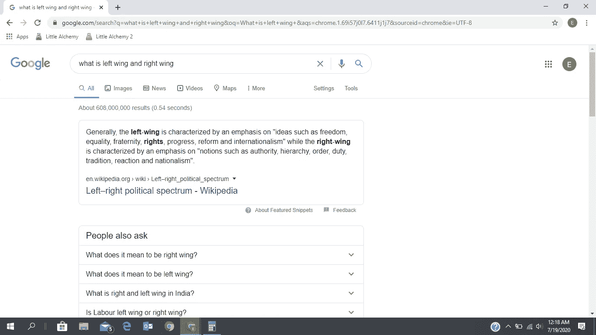

# 软件开发人员是自由派还是保守派？

> 原文：<https://blog.devgenius.io/are-software-developers-liberal-or-conservative-3b7e53988c7?source=collection_archive---------6----------------------->

我想向你坦白一件事。

在为这篇文章做研究之前，我不知道“左翼”或“右翼”到底是什么意思。我对他们之间的区别有一个模糊的概念，一方支持堕胎，一方不支持，但我真的不太了解。

说到做研究，谷歌是每个人的朋友。键入搜索查询“什么是左翼和右翼”，这就是你会得到的。

所以，简单来说，左翼是自由派，右翼是保守派(我觉得)。这是我非常理解的一种意识形态。

我不在美国，但你们是世界上最强大、最有影响力的国家，无论你们在任何特定情况下决定做什么，都会对世界其他地方产生连锁反应。那里发生的事情值得研究。作为一名强烈信奉信息自由、法律面前人人平等和言论自由的开发者，我将自己归类为自由主义者。

这并不意味着保守派在说傻话。我支持他们对权威、民族主义和等级制度的立场。最终，只有极少数人处于政治光谱的极端，大多数人只是温和地倾向于某一方面。

也就是说，这篇文章是我的研究结果，仔细审查，和我的意见(当然不是没有一些偏见)。

不管我们喜不喜欢，政治影响着每个人。开发商一直是一个强大的群体，因此少数人的政治倾向可以作为整体的缩影。请放心，这个数据不是结论性的，许多人(可能是你们中的一些人)对这个问题有非常不同的看法。

前进。

约书亚·苏考夫在 [Unsplash](https://unsplash.com?utm_source=medium&utm_medium=referral) 上的照片

# 1.我们热爱自由和开源软件——自由派

开源可能是软件领域发生的最伟大的事情。在过去，一个开发人员必须亲自设计和实现他的软件的每个方面。或者，这可能需要几个月的时间，或者支付高额的许可费，或者购买费。因此，软件的发展非常缓慢。

自从 80 年代随着 GNU 项目的引入而开始的开源运动以来，开发人员不必为每个软件项目重新发明轮子。事实上，今天所有的软件都从开源软件中借用了这样或那样的东西，甚至现代公司也向大众发布这样的项目。

开源的核心是一种自由的意识形态。信息自由根植于黑客伦理之中，并由此引发了这场运动。没有人愿意像 Linux 那样，为编程语言、数据库软件甚至整个操作系统这样的基本东西付费。

像史蒂夫·沃兹尼亚克、马克·扎克伯格(脸书的联合创始人兼首席执行官，我个人的英雄)、谢尔盖·布林和拉里·佩奇(谷歌，人人。他们发明了谷歌)推动了一个开源的未来，因为这样做符合公众利益。尽管他们有一个低调的动机(节省大量时间和金钱)，但这对每个人都有好处。

1:0 到自由主义。

# 2.我们讨厌盗版——保守

在这一点上，许多人会和我争论。为一天的辛苦工作要求合理的工资是保守的吗？事实上，它是——而且它没有错。

大概每个人都用过盗版软件，非法看过电影，或者见鬼，甚至下载了一首歌都没有付费。在我的国家，从 iTunes 合法下载的一首歌的价格相当于一顿早餐的价格。流媒体将是一个更好的选择，但是，正如我已经说过无数次，我们大多数人都没有互联网接入工作，更不用说音乐了。

这一切真的不是借口(如果你觉得是，就在下面这么说)。音乐家和程序员都非常努力地做出好的产品，他们应该得到所有的收入。自由发布我的努力成果应该是我的选择，而不是某个盗版者的。

作为世界闻名的开发商和亿万富翁，比尔·盖茨被认为倾向于右翼(像大多数富人一样)。他想要钱，因为他投入了时间。我们都想这样，对吗？

1:1.

# 3.我们不喜欢秘密——自由主义者

2013 年 5 月 24 日，一位名为爱德华·斯诺登(Edward Snowden)的美国国家安全局雇员和黑客开始向媒体发布高度机密信息，内容涉及美国不加区别地对个人进行间谍活动。由此引发的愤怒是有据可查的。由于他的罪行，他不得不逃到俄罗斯，这是少数几个愿意与美国合作的国家之一。

每个政治评论家对斯诺登都有不同的看法。有些人说他做的是对的，有些人则不这么认为。事实是；他是一名黑客，他泄露了对自己和美国有害的机密，他逃跑了。

编码能力是现代信息时代的一种超能力。英雄是真实存在的，那些能编码的人通常匿名编码，选择帮助那些不能编码的人。

众所周知的“Hactivism”是一种新的抗议形式，我敢说是一种非常有效的抗议形式。当今世界的权力在于磁盘驱动器和二进制代码，强烈反对某个动作的开发人员可能会选择黑掉它。虽然这是一种犯罪，但人们从一开始就因为他们的信仰而受到迫害，这种情况将会持续下去。

开发者不喜欢让非开发者蒙在鼓里，无论代价如何。

2:1

# 4.我们支持权力下放——自由主义

开发者喜欢去中心化。从一开始，我们就接受了云计算、远程工作以及最近的区块链等技术。

加密货币是当今世界的热门话题。crypto 的基本思想是使用区块链分散资金。比特币是迄今为止最成功的，它在甚至金融阶层中的流行表明去中心化是一种趋势。

加密的起源在于长期的黑客道德。比特币是由一个不知名的人(或一群人)中本聪创造的。显然是一个黑客，他/他们很好地利用了区块链技术，确保他们的新货币不能被单一实体控制。事实上，这样做将需要(截至 2017 年 11 月)大约 50，000，000 万亿次/秒的处理能力。相比之下，2015 年最强大的超级计算机天河二号可以计算 33，862 万亿次/秒。因此，比特币实际上**不可能**完全控制。

干得好，聪。

3:1

写完这篇文章后，我得出的结论是，开发者作为一个整体(包括刻板的)是自由主义者，会倾向于解放技术(和政治家)。截至 2016 年(顺便说一下，选举年)，美国估计有 440 万软件工程师。

我们是少数，但我们正在崛起。政治家们应该注意到这一点。

感谢阅读。

我也写一些有趣的、古怪的但有启发性的东西。给你:

 [## 连外星人都不知道的东西

### 包括但不限于生命、宇宙和一切

medium.com](https://medium.com/illumination/stuff-that-even-aliens-dont-know-c4013b12beae)  [## 电影对外星人的误解，由外星人造成的

### 首先，他们不想吃我们

medium.com](https://medium.com/illumination/three-things-movies-get-wrong-about-aliens-551621f73837)  [## 外星人如何看待崩溃后的比特币

### 事情最终只会变得更好

medium.com](https://medium.com/illumination/what-aliens-think-about-post-crash-bitcoin-413bde784e03)