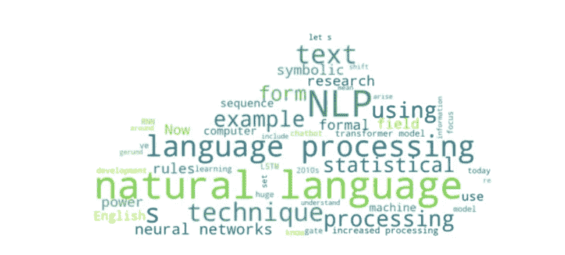
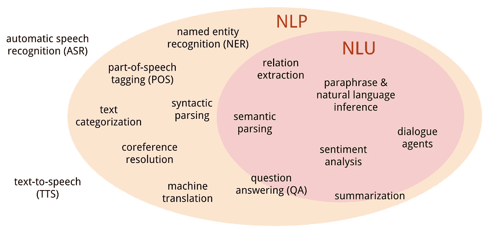

# 2020 年代是自然语言处理的十年吗？

> 原文：<https://blog.devgenius.io/are-the-2020s-the-decade-of-natural-language-processing-6304d6d6b9c4?source=collection_archive---------6----------------------->

## 如果在 21 世纪 20 年代，你需要了解人工智能的哪个领域，那就是自然语言处理。

图片来自作者

自然语言处理(NLP)将是 2020 年代人工智能发展最快的行业。为什么？80–90%的业务数据是非结构化文本数据。数据分析是 2010 年代发展最快的行业之一。2012 年 IDC 的一项研究显示，只有 0.5%的数据正在被分析。与此同时，我们每天产生总计 2.5 万亿字节的数据。想想吧。这意味着可能会产生 2 万亿字节的文本数据，我们可以利用每一个。单身。日。

# 什么是自然语言处理？

[图片](https://devopedia.org/natural-language-processing)来自 2014 年麦卡特尼 Devopedia

自然语言处理是机器学习的一个子领域。它包括自然语言理解(NLU)、自然语言生成(NLG)和自然语言交互(NLI)。NLP 既可以应用于语音，也可以应用于文本。为了将 NLP 应用于语音，我们目前需要首先通过自动语音识别(ASR)将语音转换为文本。因为语音需要首先转换成文本才能用 NLP 进行分析，所以我们将把重点放在文本处理上。

## 自然语言理解

NLU 是将语音或文本数据转换成可分析的格式。它是关于能够获取原始文本并从中提取某种信息。我们能提取什么样的信息？我们可以做情感分析，看看文本是正面的还是负面的。我们可以做[命名实体识别](https://pythonalgos.com/2021/11/07/the-best-way-to-do-named-entity-recognition-ner/)来找出文本是关于谁、什么、何时、何地的。NLU 的主要优势在于，我们可以获取大量文本，并将其转换为一组简洁的信息，以便采取行动。

## 自然语言生成

自然语言生成就是从数据集中生成文本。我们已经看到了 NLG 在 2010 年代的一些有趣的应用。比如 2016 年微软的 Twitter bot，几乎立刻就变成了种族主义和黑暗。NLG 真正说明了源数据和数据清理的重要性。NLG 的应用包括像伊莱扎这样的事情，伊莱扎是麻省理工学院在 20 世纪 60 年代创造的一个问答“治疗师”，就一个主题写一段文字，甚至[使用人工智能写一整篇博文](https://pythonalgos.com/2021/11/19/written-by-ai-natural-language-processing-nlp/)。

## 自然语言交互

NLI 站在自然语言理解、自动语音识别(ASR)和某种任务自动化的十字路口。虽然自然语言交互不是 NLP 的第一个广泛的商业应用，但它可以说是帮助 NLP 进入公众视野的原因。在 Siri 之前，Alexa、Cortana 和所有其他语音助手在 2010 年代初取得了巨大成功。在此之前，ASR 和任务自动化产品为 NLI 通过语音助手崭露头角铺平了道路。

# 如何应用 NLP 分析文本数据？

那么，我们如何通过 NLP 从文本中提取数据呢？下面是我们使用 NLP 将文本数据转化为有用信息的七种方法。

1.  总结:我们在通读文本时，大约有 70%的时间是注意力不集中的。你读这篇文章的时候有没有集中注意力？大概不会。我们可以使用[人工智能总结](https://pythonalgos.com/2021/11/28/build-your-own-ai-text-summarizer-in-python/)来提取一些最重要的信息，以提高我们的效率。
2.  提取最常见的短语:提取最常见的短语可以让我们找到一组文本的主题和主旨。它可以是一组文档、单个文档或相关文本的集合。提取最常见的短语向我们展示了一篇文章的主题。
3.  检测关键词:这个可以用来看一段文字是否谈到了一些我们想看或者不想看的关键词。例如，这可以用于内容审核。它还可以用来快速查看一篇文章是否谈到了我们正在寻找的内容。
4.  用关键词提取句子:这是第 3 点的扩展。我们可以提取包含某些关键词的句子。更好的是，我们还可以把句子放在这些句子的周围。这让我们可以快速看到文本对我们正在寻找的关键词的描述。
5.  寻找文本情感:寻找文本的整体情感对于像声誉管理这样的服务是很重要的。获取文本情感可以让你了解人们对你的产品是积极的还是消极的。文本情感可以在单个句子或整个文本上运行。为了进一步说明这一点，我们还可以寻找更具体的情感，比如愤怒、快乐、悲伤、幸福等等。
6.  命名实体识别:NER 帮助我们找出谁/什么/何时/何地的文本。它帮助我们找出一个文档所谈论的中心人物、地点和组织，以及该文本的时间线。这对于内部评审、战略文件和在线评审来说非常重要。
7.  文本相似性:我们可以使用文本相似性来查看有多少内容是模板化的，有多少是实际内容。例如，我在网上看到一个 Reddit 帖子，有人发现一个竞争对手使用几乎 100%的模板文本在 Google 上排名。我们可以用这个来检查网站策略以及剽窃。

# 使用 NLP 分析数据对我的企业有什么好处？

[图片](http://www.duperrin.com/english/2015/04/07/leverage-partnerships-increase-experience/)来自杜柏林

在 Siri (2010 年)和 Alexa (2014 年)取得成功之后，2010 年代末出现了一批从事自动语音识别的初创公司。我们可以看到 NLP 在 2010 年成为一个行业。随着我们走向未来，越来越多的文本变得可用。通过文本处理的自然语言处理将成为信息的金矿。我们上面提到的七点只是我们可以用文本处理做的一些事情。

基于所有这些观点，我预测能够利用 NLP 更好地处理文本数据将是区分兴旺的企业和生存的企业的关键。我们已经在大数据分析中看到了这一点。利用他们的分析来衡量结果并采取行动的公司是赢得行业的公司。大数据分析的下一步是文本分析。2020 年代会是 NLP 的十年吗？只有时间能证明一切。

如果你喜欢这篇文章或者它对你有帮助，请在 Twitter 或 LinkedIn 上分享！要想无限制地访问 Medium 上的信息宝库，今天就注册成为 [Medium 会员](https://medium.com/@ytang07/membership)！更多关于技术、自然语言处理和成长的文章，记得关注我，[唐](https://www.medium.com/@ytang07)。

## 进一步阅读

作为一名 Python 开发人员开始学习自然语言处理(对不起，其他开发人员，我学 Python，所以我不太熟悉其他语言和它们的 NLP 库，但是如果你熟悉，请在评论中删除它们！)查看 [spaCy](http://spacy.io) 、 [NLTK](http://nltk.org) 和 [BERT](https://bert-as-service.readthedocs.io/en/latest/) 开源库，或者查看[文本 API](https://www.thetextapi.com) (声明:这是我做的)。

## 来源:

1.  [大数据统计，增长& Facts 2021 | SaaS 球探(原 SoftwareFindr)](https://saasscout.com/statistics/big-data-statistics/)
2.  [https://www . Reuters . com/article/us-Microsoft-Twitter-bot-iduskcn 0 wq 2 la](https://www.reuters.com/article/us-microsoft-twitter-bot-idUSKCN0WQ2LA)