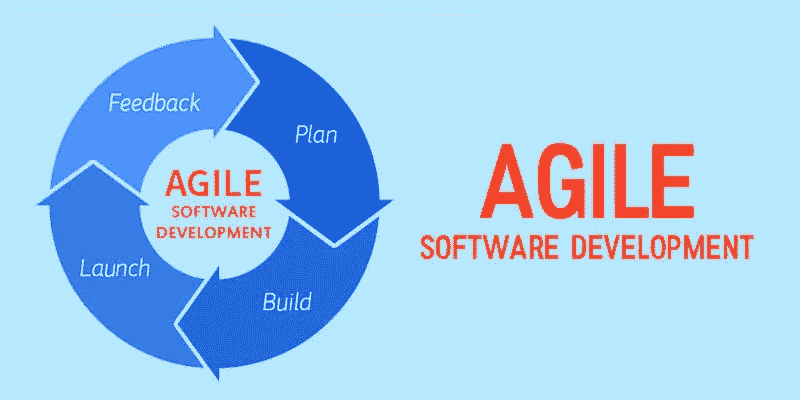

# 你做敏捷软件开发的方式正确吗？

> 原文：<https://blog.devgenius.io/are-you-doing-agile-software-development-the-right-way-f1b8beebad20?source=collection_archive---------18----------------------->

敏捷开发已经存在很多年了，但是并不是每个人都以正确的方式进行。

大多数开发团队说他们使用敏捷软件开发来构建[世界级的应用](http://entradasoft.com/blogs/benefits-of-agile-software-development-you-should-know)。在某种程度上，他们是对的。敏捷肯定支持顶级应用程序的开发。但是团队可能没有以正确的方式使用敏捷。几个团队可能会混淆灵活过程和敏捷，然后意识到他们的错误。当谈到敏捷时，开发人员谈论不同的原则、框架等等，但并没有真正正确地利用它们。

**全文:**[http://entradasoft . com/blogs/benefits-of-agile-software-development-you-should-know](http://entradasoft.com/blogs/benefits-of-agile-software-development-you-should-know)

# 为什么我们实施敏捷

以下是一些让敏捷对我们的团队不可或缺的东西:

*   [快速响应变化](http://entradasoft.com/blogs/benefits-of-agile-software-development-you-should-know)——无论是市场的变化还是来自最终用户的新反馈，敏捷使我们能够快速改变开发方向，而不会违背几个月来制定的计划。小批量发货使我们的团队能够以最低的成本收集反馈并进行整合。
*   [僵化流程上的人际互动](http://entradasoft.com/blogs/benefits-of-agile-software-development-you-should-know)——敏捷帮助我们与客户高效协作，而不强迫每个人都遵循预先定义的安排。它还帮助我们专注于尽快交付价值，因为这比创建极其详细的文档更重要。
*   [共同的愿景和所有权](http://entradasoft.com/blogs/benefits-of-agile-software-development-you-should-know)——我们的团队共享核心的敏捷价值观，并被授权设定他们自己的质量和完整性标准。他们对完成的定义协调了他们的工作，并定义了他们完成工作的速度。

# 高效敏捷的软件开发方法

[**随着迭代而发展**](http://entradasoft.com/blogs/benefits-of-agile-software-development-you-should-know)
敏捷软件开发过程必须随着每次迭代而发展。它使团队更有效率，但却是整个方法中经常被忽略的元素。在每个阶段都需要检查和调整，以确定您的团队增长了多少以及流程中每个迭代的成功。

[**低效的问题解决**](http://entradasoft.com/blogs/benefits-of-agile-software-development-you-should-know)
事后剖析是识别敏捷软件开发团队在项目中的缺点、挑战和优势的绝佳方式。但是很多时候，团队抱怨在不同的时期有相同的问题。它显示了解决问题的低效率，并描绘了团队解决问题的无能。

[**预先存在的问题**](http://entradasoft.com/blogs/benefits-of-agile-software-development-you-should-know)
在遵循敏捷软件开发方法的同时，有时团队也会忽略系统中预先存在的问题。由于不确定的限制，这些问题超出了范围。问题是新的发展发生在这些问题之上。在过程结束后，它们会产生问题，导致开发团队变得复杂。因为这样的话，团队不得不花费大量的时间来寻找这些被掩盖的问题。

[**大胆决策**](http://entradasoft.com/blogs/benefits-of-agile-software-development-you-should-know)
敏捷软件开发过程需要团队做出一些大胆的决策。只有正确遵循检查和调整周期，才能进行检查和调整。这些决策有助于克服有时进入开发系统的僵化的挑战。

[**不必要的讨论**](http://entradasoft.com/blogs/benefits-of-agile-software-development-you-should-know)
敏捷就是做和适应。有时，团队会花很多时间讨论需求，即使经常有变化。这导致了项目交付的延迟，并影响了整个敏捷软件开发方法。

你如何知道你做的敏捷是正确的？[敏捷酸测试](http://entradasoft.com/blogs/benefits-of-agile-software-development-you-should-know)它有三个部分:

**交付持续的价值流。这并不意味着发展*更快*，而是发展*更快*。您可以更频繁地将功能以更小的规模交付给客户，并更快地获得反馈。**

以可持续的速度。如果对团队来说不可持续，更频繁地交付软件是行不通的。

**同时适应不断变化的业务需求。随着世界的变化，你的组织也需要随之变化。敏捷软件开发确保你不会构建没人想要的软件产品。**

**阅读更多:**[http://entradasoft . com/blogs/benefits-of-agile-software-development-you-should-know](http://entradasoft.com/blogs/benefits-of-agile-software-development-you-should-know)