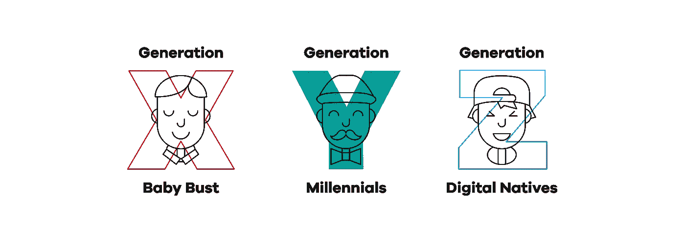
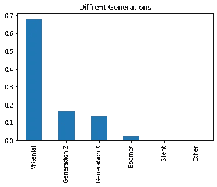
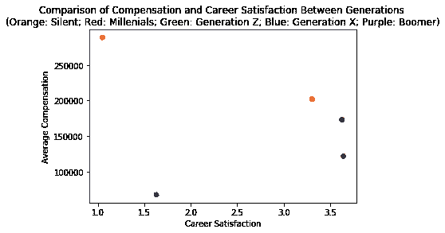
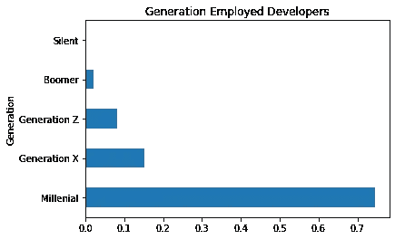
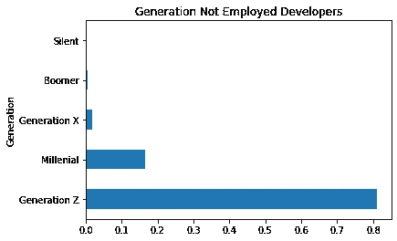
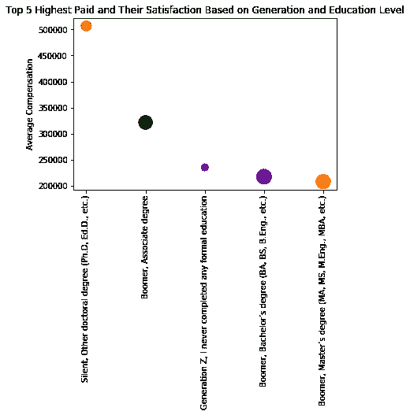
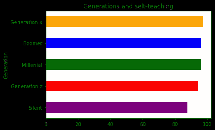

# 作为一名开发人员，你属于正确的一代吗？

> 原文：<https://blog.devgenius.io/are-you-in-the-right-generation-as-a-developer-4fedb7cf2602?source=collection_archive---------28----------------------->

stack overflow 2019 年调查中各代开发人员之间的比较

来源:[https://www . engarde . net/introducing-generation-y/# . xwt 6 epmza 34](https://www.engarde.net/introducing-generation-y/#.Xwt6epMza34)

**简介**

许多代人来了又去，每一代人都从上一代人那里学习，并教导下一代人。最近，两代人之间的许多比较浮出水面，尤其是随着科技的迅速发展。

你会听到“像鳄梨吐司一样的千禧年”和“Z 世代痴迷于抖音”这样的短语，这有助于模糊地识别两者，然而，通过识别每一代人的出生年份，可以获得清晰的区别。在这篇文章中，我们比较了五代不同的开发者。这几代人是:

1.  沉默:生于 1928 年至 1945 年
2.  婴儿潮一代:出生于 1946 年至 1964 年之间
3.  X 一代:出生于 1965 年至 1980 年之间
4.  Y 一代(千禧一代):出生于 1981 年至 1996 年之间
5.  Z 世代:出生于 1997 年至 2012 年

为了确定各代开发人员之间的差异，分析了 stack overflow 在 2019 年针对开发人员进行的一项调查的数据，以回答有关代际差异的问题。

**问题 1:哪一代拥有最多的开发者？**

每个回答者根据他们的年龄被归类到他们这一代。

从上面的条形图中，我们可以看到千禧一代在堆栈溢出调查中所占的比例最高，其次是最年轻的一代。

**问题 2:哪一代人对自己的编程生涯最满意？**

这里我们想找出不同代人的职业满意度。在下图中，我们比较了几代人的平均薪酬和职业满意度。

由此可见，沉默的一代薪酬最高，但职业满意度最低。千禧一代有很好的职业满意度，然而，Z 世代和婴儿潮一代比他们更满意，尽管工资较低。

**问题 3:受教育程度和就业水平是否因代而异？**

在下面的两个图中，我感兴趣的是找到每一代中受雇(左)和未受雇(右)开发人员的百分比。雇佣开发人员包括全职和独立承包人、自由职业者或自雇开发人员。而未就业的开发者既包括那些正在找工作的，也包括那些没有找工作的。

有趣的是，千禧一代是就业率最高的一代，而 Z 一代是就业率最低的一代。但是，千禧一代也排在未就业排行榜的第二位。

为了进一步了解代际差异，我有兴趣了解哪一代人的工资最高，他们的满意度如何，他们的教育水平如何。在下图中，圆圈的大小定义了职业满意度。

不出所料，前两个数据点显示，学历较高的老一代人获得的薪酬满意度最高。令人惊讶的是，第三代是 Z 一代，他们从未完成任何正规教育，职业满意度非常低。千禧一代没有出现在这个排名中，尽管他们是拥有最多开发者的一代。

**问题 4:哪一代人最自学成才？**

人们对几代人形成刻板印象的一种方式是他们被教育的方式。人们说，由于技术的发展，年轻一代有更多的机会获取知识。在下图中，我比较了几代人学习成为开发人员的方式，而不是获得学位的方式。

我们可以看到，两代人之间非常接近，这意味着许多开发人员实际上是在自学，尽管存在代际差异。

**结论**

在这篇文章中，我们根据 Stack Overflow 2019 调查数据看了看不同的开发人员。这些是最有趣的发现:

1.  千禧一代的开发者人数最多。
2.  Z 世代和婴儿潮一代是对职业最满意的一代。
3.  千禧一代是就业率最高的一代，Z 一代是就业率最低的一代。
4.  Z 世代从未完成任何正规教育，平均薪酬排名第三，仅次于拥有副学士学位的婴儿潮一代和拥有更高学位的沉默者。
5.  尽管普遍认为，所有开发人员都在某个时候自学了编程。

这里的发现是观察性的，不是正式研究的结果，必须指出的是，这个样本主要是千禧一代的代表，任何关于其他代人的结果都可能无法准确地扩展到现实世界。然而，问题仍然存在:

*你认为你是开发人员的正确一代吗？*

要了解更多关于这个分析的内容，请点击这里的链接