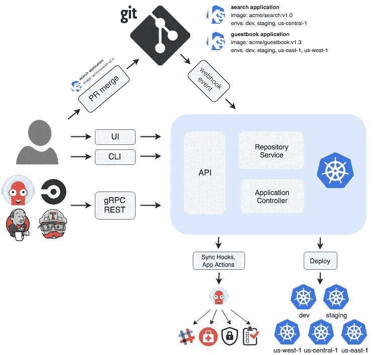

# 阿尔戈 CD 游戏攻略

> 原文：<https://blog.devgenius.io/argo-cd-introduction-4b16f50b0d56?source=collection_archive---------1----------------------->

## 什么是 ArgoCD，为什么使用它


# 阿尔戈概述

在讲 ArgoCD 之前，我们先来快速看一下`Argo`。`Argo`或`ArgoProj`，是一个在 K8s 中完成工作并显著提高生产力的工具集合。2020 年 4 月 7 日，CNCF 技术监督委员会(TOC)投票通过`Argo`项目进入 CNCF 孵化。

最初的`ArgoProj`由 Applatix 创建，并于 2018 年初被 Intuit 收购。之后，贝莱德贡献了`Argo Events`子项目，现在两家公司都在积极参与开发`ArgoProj`。

`ArgoProj`由四个主要产品组成，专注于各种用例，共同构成了一个强大的应用交付平台。

*   **Argo Workflows** —一个开源的容器本地工作流引擎，用于编排 K8s 上的并行作业。`Argo Workflows`实现为 K8s CRD(自定义资源定义)。


图片来自 [Argo 工作流程](https://github.com/argoproj/argo-workflows/blob/master/README.md#community-blogs-and-presentations)

*   Argo CD —一个用于 K8s 的声明式 GitOps 连续交付工具。


图片来自 [Argo CD](https://github.com/argoproj/argo-cd/blob/master/README.md#community-blogs-and-presentations)

*   Argo Events —一个事件驱动的 K8s 工作流自动化框架。


图片来自[蓉城事件](https://github.com/argoproj/argo-events/blob/master/README.md#community-blogs-and-presentations)

*   **Argo 部署** —一个 K8s 控制器和一组 CRD，为 K8s 提供高级部署功能，如蓝绿色、金丝雀、金丝雀分析、实验和渐进交付功能。

# 什么是阿尔戈光盘

如上所述，`Argo CD`是一款面向 K8s 的声明式 GitOps 持续交付工具。`Argo CD`支持多种配置管理工具，包括 ksonnet/jsonnet、kustomize、Helm 等。它扩展了声明式和基于 Git 的配置管理的优势，以加速应用程序部署和生命周期管理，而不会影响安全性和合规性。

# 阿尔戈光盘功能

一些主要的`Argo CD`特性是:

*   **自动化部署** —它可以自动将您的应用程序部署到 K8s 中。Argo CD 支持部署到公共云(AWS/GCP/Azure)或本地数据中心托管的多个集群中。
*   **GitOps 风格部署** —实现 GitOps 风格的软件交付。它在 Git 中声明应用程序的期望状态，`Argo CD`会自动将应用程序配置同步到当前声明的状态。
*   **部署策略** —快速将任何应用回滚到 Git 中的任何先前版本。
*   **SSO 集成** —借助 OIDC、OAuth2、LDAP、SAML 2.0、GitHub、GitLab、微软等 SSO 提供商的内置集成，轻松支持您的团队访问`Argo CD`。
*   **多租户**和 **RBAC** 政策授权
*   **健康状态**应用资源分析
*   **Web UI** 提供应用活动的实时视图
*   自动化和 CI 集成的 CLI
*   **普罗米修斯指标**

# Argo CD 架构

`Argo CD`的建筑看起来像:



图片来自[阿尔戈](https://argo-cd.readthedocs.io/en/stable/)

从上图中，我们可以看到`Argo CD`有三个主要组件:

## API 服务器

它是一个 gRPC/REST 服务器，公开 Web UI、CLI 和 CI/CD 系统使用的 API，其职责包括:

*   应用程序管理和状态报告
*   同步、回滚等应用操作
*   凭证管理
*   证明
*   RBAC 执法

## 存储库服务器

这是一个内部服务，维护 Git repos 的本地缓存，保存应用程序清单。当提供以下输入时，它负责生成并返回 K8ss 清单:

*   回购 URL
*   修订(提交、标记、分支)
*   应用程序路径
*   模板特定设置:参数，舵值. yaml

## 应用控制器

在引擎盖下是一个 K8s 控制器，它持续监听正在运行的应用程序，并将当前的实时状态与所需的目标状态进行比较。像其他 K8s 控制器一样，它检测`OutOfSync`应用程序状态并采取行动。

# Argo CD 核心概念

一些核心概念是:

*   **应用** —由清单定义的一组 K8s 资源。这是自定义资源定义(CRD)。
*   **应用程序源类型** —哪个工具用于构建应用程序。
*   **目标状态** —应用程序的期望状态。
*   **实时状态** —该应用的实时状态。
*   **同步状态** —实时状态是否与目标状态匹配。
*   **同步运行状态** —同步是否成功。
*   **刷新** —将 Git 中的最新代码与 live 状态进行比较。找出不同之处。
*   **健康** —应用程序的健康状况，运行是否正确？

更多详情可以查看官网:[https://argo-cd.readthedocs.io/en/stable/core_concepts/](https://argo-cd.readthedocs.io/en/stable/core_concepts/)

# 安装 Argo 光盘

*   创建一个名为“argocd”的新命名空间

```
$ kubectl create ns argocd
```

*   安装`Argo CD`

```
$ kubectl apply -n argocd -f [https://raw.githubusercontent.com/argoproj/argo-cd/stable/manifests/install.yaml](https://raw.githubusercontent.com/argoproj/argo-cd/stable/manifests/install.yaml)
customresourcedefinition... created
...
robinding..created
...
```

*   检查安装状态

```
$ kubectl get po -n argocd
```


*   要访问`argocd`网络用户界面

```
$ kubectl port-forward --namespace=argocd service/argocd-server --address 0.0.0.0 8080:80
```

*   打开浏览器并转到:http:// <ip>:8080</ip>


用户名为“admin ”,密码从以下命令获得:

```
$ kubectl -n argocd get secret argocd-initial-admin-secret -o jsonpath="{.data.password}" | base64 -d
```