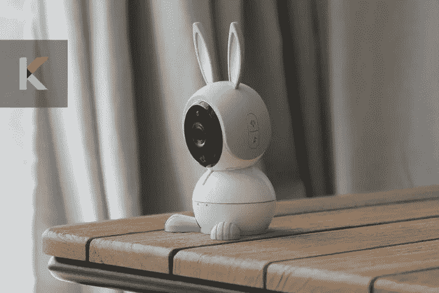
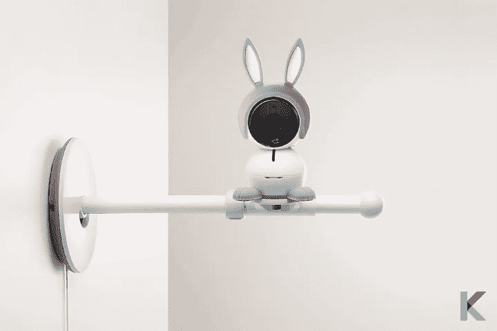
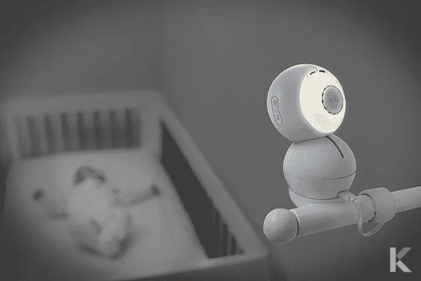
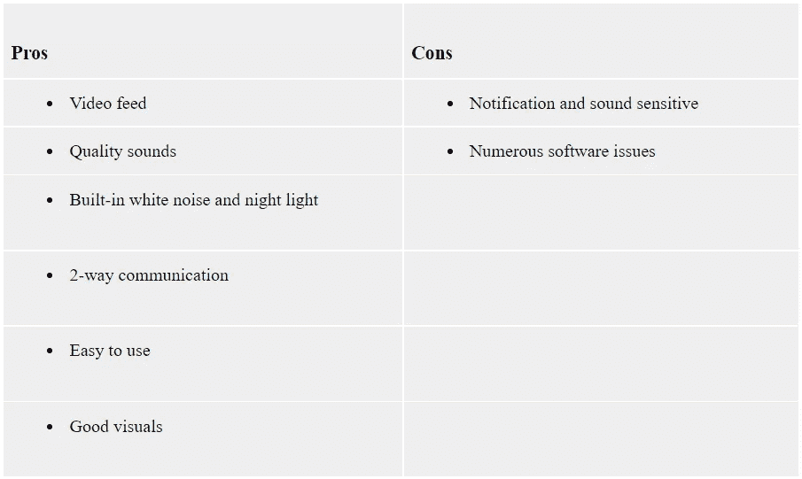
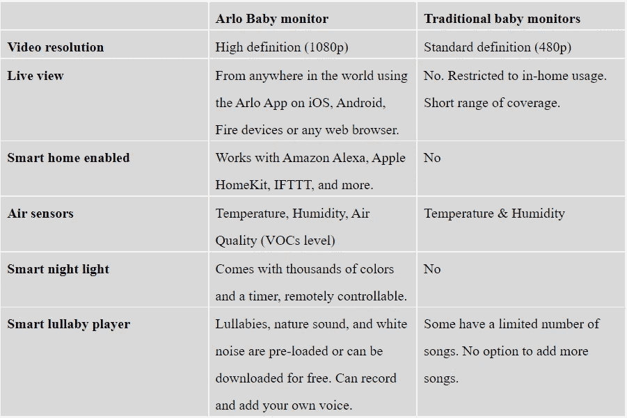
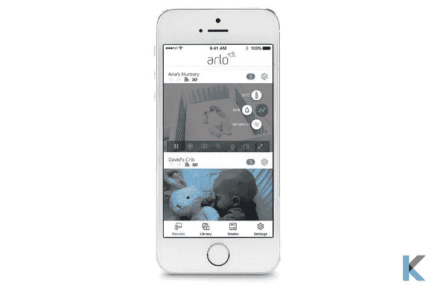
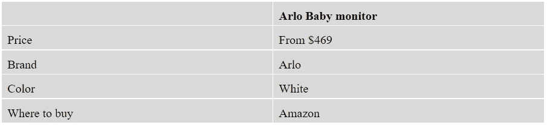

# 阿洛婴儿监视器

> 原文：<https://blog.devgenius.io/arlo-baby-monitor-d92bdec4af73?source=collection_archive---------6----------------------->

你想继续关注你的小奇迹吗？那么，婴儿监视器对你很有帮助。它就像一个昂贵的对讲机。是真的。说到带新生儿回家，大多数父母能达成一致的少数几件事之一就是睡眠不足。现在，你不想离开你的床。这个婴儿监视器会在有事发生时提醒你。所以，你可以对你的宝宝做出更好的决定，是否起床帮助你的孩子。欢迎光临！你来对地方了。在这篇评论中，您将能够全面了解爱洛婴儿监护仪。所以，我们开始吧。

阿洛婴儿监视器

***在这篇文章中，你会学到；***

*   什么是爱洛婴儿监视器？
*   爱洛婴儿监视器规格
*   爱洛婴儿监视器的利与弊
*   如何选择最适合自己的婴儿监护仪？
*   与其他婴儿监视器的功能比较
*   如何设置和使用
*   爱洛婴儿监视器安全吗？
*   定价

# 什么是爱洛婴儿监听器？

要不要超级保姆？爱洛婴儿监控器是您小宝宝的超级保姆。这是一个带有 1080p 高清摄像头的[一体式智能 Wi-Fi 婴儿监视器](https://original.newsbreak.com/@ishara-fernando-1590158/2408327722851-arlo-baby-monitor-smart-wi-fi-baby-monitor-with-bunny-ears?s=influencer)。你知道吗，无线监视器的覆盖范围是无限的。因此，当您连接到 Wi-Fi 网络时，您的设备就有了蜂窝连接。当然，这是幼儿园以外的生活。

**检查智能婴儿监视器的兼容性**

如果你有自己的谷歌助手，那么你可以很容易地检查智能家居设备与谷歌助手的兼容性。而且，不仅仅是谷歌助手的兼容性，你还可以检查设备与 Alexa 和 Siri 的兼容性。因此，如果您想要检查智能家居设备与您首选生态系统的兼容性，您可以通过下面的按钮[下载 Canda——智能家居设备兼容性检查器](https://play.google.com/store/apps/details?id=com.knovik.canda)。

Android 用户- [下载 Canda](https://play.google.com/store/apps/details?id=com.knovik.canda)

对于 iPhone 用户- [下载 Canda](https://apps.apple.com/us/app/canda-compatibility-checker/id1630339464)

阿洛婴儿监控摄像机

有一个免费的应用程序可用于 Android/ Apple 作为父单元。它利用你的智能手机或平板电脑。当你的宝宝不再需要监控时，这可以用来做保姆摄像头或保安。它有一个平均价格，但它将比一些竞争对手的价格更高。如果您已经有爱洛产品，您可能会发现爱洛婴儿监视器，因为它在同一应用程序上工作。此外，它还是英国、澳大利亚和加拿大著名的婴儿监视器。

此外，它比其他 Wi-Fi 显示器具有更多以婴儿为中心的功能。它有可爱的兔子耳朵，互联网范围，而且很容易使用。有趣的是它新发现的 HomeKit 支持。你可以让 Siri“给我看看托儿所”，或者你可以在 iOS Home 应用程序中查看提要。但所有的功能都不会出现在 Home 应用程序中，例如触发场景、空气传感器数据和夜灯控制。

如果你对安全摄像头感兴趣，可以查看[最佳智能家居安全摄像头 2021](https://kodmy.com/best-home-security-cameras/) 和[对比 Eufy SpaceView Pro vs Eufy 安全婴儿监视器](https://kodmy.com/compare/smart-baby-monitors?modelList=eufy-spaceview-pro,eufy-security)选出最佳。

现在从亚马逊获得 [Eufy SpaceView pro 婴儿监视器](https://amzn.to/2ZuXoCH)和 [Eufy 安全婴儿监视器](https://amzn.to/3jJb1W8)。

***让我们看看爱洛的每个组件***

*   **子单元**

爱洛婴儿儿童单元包括摄像头、扬声器、小夜灯、电池和壁挂套件。它的扬声器可以让你和你的宝宝说话。是的。您可以通过 1080 HD 高清视频，在水晶般清晰的高清画面中看到您的小孩。它也非常适合整个房间的监控和近距离监控。它可以通过爱洛应用程序改变视野(从 90 度到 130 度)。当它检测到婴儿啼哭的声音时，就会提醒父母。然后，您可以查看屏幕了解更多信息。

阿洛婴儿监视器

爱洛相机的另一个有趣的方面是夜视。如果你经常在黑暗中看着你的孩子，这种夜视对你很重要。这是极好的，因为你可以看到婴儿的每一个动作，即使在完全黑暗的。此外，它还有不可见的红外 LED 灯，亮度，颜色可调，并关闭。别担心。它确保您的宝宝睡眠不受干扰。

当我们谈到音频质量时，它真的很敏感，也很酷。可以监听，可以和宝宝双向交流。它能够通过应用程序和扬声器与婴儿交流，并具有播放音乐等奇妙的功能。它可以给你的宝宝发送白噪音和舒缓的催眠曲。所以，你的宝宝可以每晚睡觉。此外，您甚至可以从智能手机远程管理音乐播放和录制语音。使用这款智能爱洛婴儿监控器，您可以将自己的家变成[智能家居](https://kodmy.com/smart-home-technology/)。

阿洛婴儿相机

它有一个内置的充电电池。所以，你可以在家里自由移动相机几个小时。空气监测功能是另一个有趣的方面。因此，您可以监控婴儿托儿所的空气条件，包括温度、挥发性有机化合物(VOC)水平、湿度等。当它感应到什么的时候，你也可以收到关于空气质量的警报。当宝宝哭闹时，它会使用婴儿哭闹警报来检测宝宝的声音。

*   **家长单位(爱洛宝贝 App)**

爱洛婴儿监视器使用您的智能手机或平板电脑作为父母单位。是的。爱洛宝贝应用程序旨在控制您的爱洛宝贝监视器。您可以给宝宝喂线，让您轻松使用其他智能功能。除此之外，你还可以和宝宝顶嘴，照看宝宝，监测温度，播放摇篮曲。

这是我们的[最佳 HomeKit 兼容智能家居设备 2021](https://kodmy.com/homekit-compatible-smart-devices/) 文章。

# 爱洛婴儿监视器规格

**尺寸** : 4.3x 2.6 x 2.5 英寸

**重量** : 1.72 磅

**电源**:充电电池、蓄电池

**最大范围** : 50 英尺

# 爱洛婴儿监视器的利与弊

# 如何选择最适合自己的婴儿监护仪？

当您选择婴儿监视器时，您应该考虑哪个产品效果最好，哪些功能最重要，以及哪些婴儿监视器不值得您花费时间。你知道婴儿监视器以前是奢侈品。但这已成为常态，而且比以往任何时候都更实惠。此外，在购买显示器之前，您应该确认在不影响睡眠的情况下对宝宝进行目视检查的能力。此外，您的显示器应该有能力检查室温和检查不寻常的行为，您的宝宝。

有三种类型的视频监视器，其中只有两种是婴儿观看的简单选择。专用视频婴儿监视器， [Wi-Fi 视频婴儿监视器](https://www.whattoexpect.com/baby-products/baby-monitors/best-wireless-network-baby-monitors/)，有线监视器是其中三种。这种有线监视器需要硬连线和视频监视器设备。接下来的事情，接收的单元之间可以隔几堵墙，你离镜头可以有多远？

你需要考虑视频质量、夜视、显示器尺寸和声音质量。毕竟，它是否提供音量调节功能、语音激活功能等等？当然，如果能有一个更大的显示屏来看到宝宝胖乎乎的脸颊和颤动的睫毛，那就太好了。Wi-Fi 婴儿监视器提供最好的视频图像。所以，多亏了他们的 1080p 技术。

***的一些特性要简要考虑:***

*   温度和空气传感器
*   以婴儿为中心的特色，如摇篮曲
*   视觉质量
*   父设备的屏幕尺寸
*   声音激活
*   运动检测
*   与婴儿双向对话
*   能够添加摄像头
*   安全和隐私问题
*   监控位置
*   预算
*   安装类型
*   电话应用功能

# 与传统婴儿监视器的功能比较

# 如何设置和使用

爱洛婴儿监视器简单易用。它在爱洛应用程序上有一个用户友好的界面，可以立即学习，没有任何麻烦。你需要的大部分东西都在爱洛应用的主屏幕上。别担心。即使关闭应用程序，爱洛仍会继续向您的手机发送提醒。

首先，您必须将爱洛显示器插入您想要的位置。之后，下载爱洛应用程序并按照说明连接您的相机。简单来说，你只是想通过手机设置连接到爱洛的 Wi-Fi。接下来，您可以输入宝宝的基本信息，您已经在比赛中了。有时，设置需要几分钟时间。然而，应用程序界面在最初几天可能会令人困惑。

爱洛应用程序

有时，你不得不在设置过程中努力使用应用程序建立连接。因此，在不同设备上下载和登录爱洛应用程序之前，您最好先在电脑上进行设置。当爱洛婴儿监视器停产时，我们可以确认使用爱洛应用程序。

# 爱洛婴儿监视器安全吗？

爱洛婴儿监视器提供了更多关于安全和隐私问题的信息。在修复可用之前，他们不会公开宣布安全漏洞。当修复可用时，他们会自动向所有爱洛设备发布安全更新。因此，您可以让您的显示器更安全。您可以随时更新固件，立即更改显示器的密码，并限制摄像机的视野。您应该输入包含数字和特殊字符的复杂密码。你最好经常更换密码。不用显示器时，你应该拔掉插头。

# 定价

***雄霸天下***

正如我们之前说过的，有很多很棒的功能，包括图像质量、声音质量和一些奇妙的附加功能。幸运的是，我们的评估有助于您做出正确的决定。它还具有安装选项的多功能性，允许从婴儿床的鸟瞰到整个房间的视野。当我们考虑母单位时，它更容易管理。然而，它有一些延迟问题和软件问题。我们相信，有最好的爱洛婴儿监视器，即使是最偏执的父母也可以放心。

相反，看看我们的[2021 年最佳环形报警家庭安全套件](https://kodmy.com/ring-alarm-home-security-kit/)文章，对任何家庭安全设备感兴趣。

请鼓掌，分享，并在下面的评论框中留下你的宝贵想法。