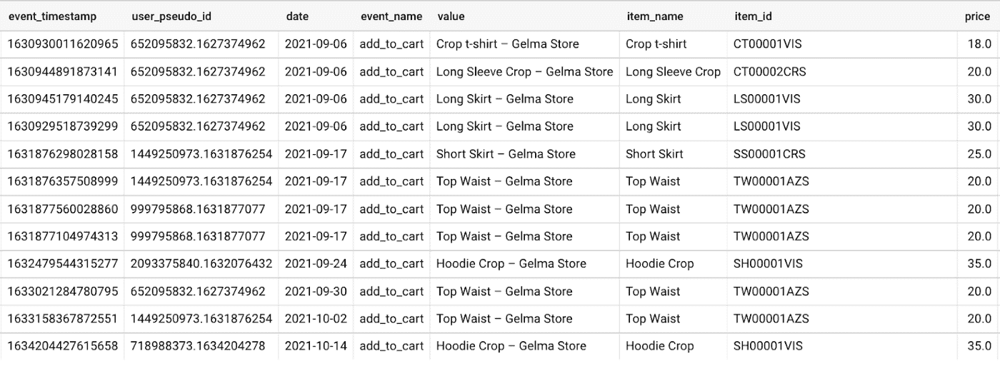
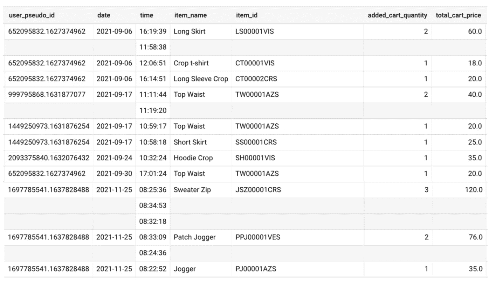

# ARRAY_AGG(expr)，聚合重复的行，用 BigQuery 得到一个易读的 GA4 电子商务表

> 原文：<https://blog.devgenius.io/array-agg-expr-aggregate-repeated-rows-and-get-an-easy-to-read-ga4-e-commerce-table-with-6b40a779b292?source=collection_archive---------5----------------------->

目录

> [简介](#4f53)
> [经典场景](#9ab7)
> [ARRAY _ AGG(expr)](#116b)
> [有什么变化？](#e333)
> [结论](#15ca)

# 介绍

情况是这样的:您想要一个为数据源返回`x, y and z`的查询。知道有可能，你努力尝试，寻找方法。有时候你很快就明白了，有时候你绞尽脑汁直到明白为止。

第二天你检查结果，看着*查询*，你对自己说“*这没问题，它能工作，但是如果我改变它，它会更好*”。然后你重新开始这个过程，然后……**嘣！回到起点！**

**改进和优化*查询*** 是分析师日常工作的一部分。甚至在实现了你计划要做的事情之后，你(自愿地)破坏自己，重新开始以提高结果。

在今天的文章中，我通过使用`ARRAY_AGG(expr)`函数来增强已经运行良好的*查询*来解释这种情况。

# 经典场景

之前……在本文的[中,](https://medium.com/@Marshall.Sansano.Roma/with-create-permanent-unnested-tables-from-temporary-tables-in-a-ga4-e-commerce-project-in-cfbf87381797)我们使用了`UNNEST`函数来取消嵌套参数，使用`WITH`函数来创建一个表，该表结合了特定事件的 *event_params、items* 和*user _ properties’*值。

**q*查询的*结果**是正确的**，表格显示了按日期和 user_pseudo_id 添加到购物车的产品。**

**我们能改进查询*并得到一个更容易阅读的表格吗？我们当然可以🤓 ️***

# **ARRAY_AGG 函数**

**`ARRAY_AGG(expr)`函数**聚集重复行**的值，返回这些重复值的空行。在大数据量中，它允许减少*查询*的权重，从而**改善处理**和成本。**

****

***查询*的结果是一个比前一个更好的****表**，使得**更容易读取和解释数据**。****

# ****有什么变化？****

****我们使用的*查询*与上一篇文章的原始查询略有不同。三个新函数被添加到**返回一个优化的结果。******

1.  ****`FORMAT_TIME('%T', TIME(TIMESTAMP_MICROS(event_timestamp)))` 将 *event_timestamp* 转换为特定的小时时间。
    例如:1630944891873141 → 16:19****
2.  ****`ARRAY_AGG(time)`对表中重复的值进行分组，并返回空的重复行，**允许更快的读取和分析**。****
3.  ****`COUNT (item_id), COUNT(item_id) * price`返回产品被添加到购物车的次数以及产品的总价。****

> ****“小变化带来大变化”****

# ****结论****

****`SQL`爱好者通常会寻找改进*查询*的方法，以便在分析和数据解释时更加**高效。或者，至少，我认为应该是这样。******

****在这种寻求持续改进的过程中，数字分析师获得了新的功能，如`ARRAY_AGG(expr)`，这也为分析中新的相关问题打开了大门。****

*   ****一些用户在一天的不同时间向购物车添加产品是一种趋势还是一个孤立的案例？****
*   ****从用户将产品添加到购物车到进行购买已经过去了多少天？****
*   ****这些加入购物车的产品中有多少最终被购买了？****
*   ****我们能想出什么点子让用户往购物车里添加更多产品？****

****这些**新假设**的每一个都伴随着**基于测试或数据比较的反思练习**来验证或反驳它。这是找到不断上升的分析问题的答案的唯一途径。****

****我受到了 Martin Weitzmann 的文章 [BigQuery:用 SQL 创建嵌套数据](https://towardsdatascience.com/bigquery-creating-nested-data-with-sql-727b761f1755)的启发****