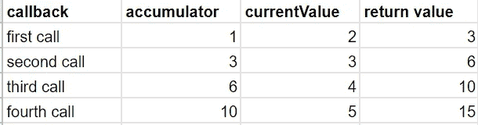

# JS 系列#13:数组回调方法和箭头函数

> 原文：<https://blog.devgenius.io/array-callback-methods-arrow-functions-9ecbd728f63?source=collection_archive---------4----------------------->

## 带有内置函数的回调


[Erda Estremera](https://unsplash.com/@erdaest?utm_source=medium&utm_medium=referral) 在 [Unsplash](https://unsplash.com?utm_source=medium&utm_medium=referral) 拍摄的照片

我们已经学习了[数组](/js-series-8-arrays-in-js-41fc9f443cf7)、[数组方法](/js-series-9-array-methods-1f18f760249d)和[回调](/js-series-12-first-class-functions-higher-order-functions-b69537d4612)。Array 附带了许多与`callback`方法一起工作的内置方法。现在我们已经学习了`callback`方法，所以是时候学习如何将`callbacks`与[数组方法](/js-series-9-array-methods-1f18f760249d)一起使用了。

本文涵盖了以下方法列表…

1.  forEach()
2.  地图()
3.  查找()
4.  过滤器()
5.  每隔()
6.  一些()
7.  排序()
8.  减少()

# 1.forEach()

接受一个`callback`函数，并对数组的每个元素执行一次给定的函数。

## 示例|迭代数字数组

```
const nums = [1,2,3,4,5];nums.forEach(function(num) {
   console.log(num);
});**output:** 1
4
9
16
25
```

## 示例 2:迭代一个对象

```
const employees = [
    {
        id: 101,
        name: 'Alex',
        sal: 10000
    },
    {
        id: 102,
        name: 'Clark',
        sal: 13000
    },
    {
        id: 103,
        name: 'John',
        sal: 12000
    },
    {
        id: 104,
        name: 'Tony',
        sal: 20000
    }
]employees.forEach(function(emp) {
    console.log(emp.name.toUpperCase());
});**Output:**
ALEX
CLARK
JOHN
TONY
```

# 2.地图()

`map()`函数创建一个新的`array`，其结果是在`array`的每个元素上调用`callback`函数。

## example-1 |对数组中的每个元素求平方，并将结果存储到另一个数组中

```
const nums = [1,2,3,4,5]const squareNums = nums.map(function(num) {
      return num * num;
});console.log(squareNums); // [1, 4, 9, 16, 25]
```

## example-2 |通过从给定对象中获取雇员姓名来创建一个包含所有雇员姓名的数组。

```
const employees = [
    {
        id: 101,
        name: 'Alex',
        sal: 10000
    },
    {
        id: 102,
        name: 'Clark',
        sal: 13000
    },
    {
        id: 103,
        name: 'John',
        sal: 12000
    },
    {
        id: 104,
        name: 'Tony',
        sal: 20000
    }
];const names = employees.map(function(emp) {
      return emp.name;
});console.log(names); // ['Alex', 'Clark', 'John', 'Tony']
```

## 示例— 3 |制作缩写

```
const words = ['lol','brb','btw','lmk','g2g'];const abbreviations = words.map(function(word) {
      return word.toUpperCase().split('').join('.');
});console.log(abbreviations); // ['L.O.L', 'B.R.B', 'B.T.W', 'L.M.K', 'G.2.G']
```

# 箭头功能

A rrow 功能是常规`function expression`的`syntactically`紧凑替代方案。这是一种更加简洁的现代文风。

## 箭头函数怎么写？

考虑一个简单的`function expression`来计算数字的**平方，如下例所示。**

```
const square = function(num) {
    return num * num;
}
```

现在将上面的`function`变成`arrow function`做以下步骤…

1.  删除`function`关键字。
2.  在`arrow (=>)`后写入`function definition`
3.  `Parenthesis()`对于一个参数是可选的。
4.  对于`one-liner function`，可以选择将语句放入块中，对于单行函数来说`return`语句也是可选的。

```
// Arrow function
const square = (num) => {
    return num * num;
}// Without parenthesis
const square = num => {
    return num * num;
}// Implicit Return - one liner
const square = num => num * num;
```

`Arrow function`使得用简洁的语法编写`callback`函数变得容易。让我们回顾一下上面用`arrow function`讨论的一些例子。

```
**Example-1:**
const nums = [1,2,3,4,5];
nums.forEach(num => console.log(num * num));**Example-2:** const nums = [1,2,3,4,5,6];
const squareNums = nums.map(num => num * num);
console.log(squareNums); // [1, 4, 9, 16, 25, 36]**Example-3:** const nums = [11,2,3,5,4,7,8,10];
const parityList = nums.map(num => (num%2===0 ? 0 : 1));
console.log(parityList); // [1, 0, 1, 1, 0, 1, 0, 0]
```

# 3.查找()

从满足给定`callback function`的`array`返回`first element`。

## 示例— 1:查找名称

```
const names = ['Jimmy Shah','Ram Sharma','Vikram Gupta','Shyam Sharma'];const result = names.find(name => name.includes('Sharma'))
console.log(result); // Ram Sharma
```

## 示例 2:查找收入超过 20，000 英镑的员工。

```
const employees = [
    {
        id: 101,
        name: 'Alex',
        sal: 10000
    },
    {
        id: 102,
        name: 'Clark',
        sal: 23000
    },
    {
        id: 103,
        name: 'John',
        sal: 22000
    },
    {
        id: 104,
        name: 'Tony',
        sal: 20000
    }
];const emp = employees.find(e => e.sal >= 20000)
console.log(emp) // {id: 102, name: 'Clark', sal: 23000}
```

# 4.过滤器()

创建一个新的`array`，其中所有通过测试的元素都由提供的`callback`函数实现。

## 示例-1:过滤器名称

```
const names = ['Jimmy Shah','Ram Sharma','Vikram Gupta','Shyam Sharma'];const result = names.filter(name => name.includes('Sharma'))
console.log(result); //  ['Ram Sharma', 'Shyam Sharma']
```

## 示例 2:按薪金筛选员工

```
const employees = [
    {
        id: 101,
        name: 'Alex',
        sal: 10000
    },
    {
        id: 102,
        name: 'Clark',
        sal: 23000
    },
    {
        id: 103,
        name: 'John',
        sal: 22000
    },
    {
        id: 104,
        name: 'Tony',
        sal: 20000
    }
];const filtered = employees.filter(e => e.sal >= 20000)
console.log(filtered);**Output:**
[ 
  {id: 102, name: 'Clark', sal: 23000},
  {id: 103, name: 'John', sal: 22000},
  {id: 104, name: 'Tony', sal: 20000}
]
```

# 5.每隔()

此`function`检查`array`中的每个项目是否通过`callback`功能。它返回`boolean`值。

## 示例 1:

```
const words = ['kia','karen','king','korean'];// Check all words starts with k
console.log(words.every(word => word[0] === 'k')) // true// Check all words ends with g
console.log(words.every(word => word[words.length-1] === 'g')) // false
```

# 6.一些()

该方法与`every()`方法非常相似，但不同之处在于，如果`array`中的任何项目通过给定函数，它将返回`true`。

```
const words = ['kia','karen','king','korean'];// Check all words starts with k
console.log(words.some(word => word[0] === 'k')) // true// Check all words ends with g
console.log(words.some(word => word[words.length-1] === 'g')) // true
```

# 7.排序()

我们都知道排序，但是默认情况下排序函数执行`Natural order sorting`(将所有内容视为`string`并逐字符比较)。但是我们可以通过一个`compare callback`函数来更新`sorting`的行为。

> **语法(compareFunc(a，b))**

`Compare function`从数组中取出两个项目`a`和`b`并进行比较。

1.  如果`a-b > 0`则按升序排序。
2.  如果`a-b < 0`则按降序排序。

## 示例 1:自然顺序排序

```
const nums = [1,20,10,22,30,44,100,11];
nums.sort(); // [1, 10, 100, 11, 20, 22, 30, 44]
```

## 示例 2:升序排序

```
const nums = [1,20,10,22,30,44,100,11];
nums.sort((a,b) => a - b); // [1, 10, 11, 20, 22, 30, 44, 100]
```

# 8.减少()

它对`array`的每个元素执行一个`reducer`方法，并产生一个值。

## 示例— 1:数组元素的总和

```
const nums = [1,2,3,4,5];
let output = nums.reduce((accumulator,currentValue) => accumulator + currentValue);
console.log(output); //15
```

你可以通过下图了解执行情况…



观察执行图，`first call`中的`first value`被认为是`accumulator`，迭代从`second value`开始。

从`second call`中，无论什么`return value`都存储在`accumulator`中，而`next value`被选为`current value`。

## 示例 2:使用 reducer()方法查找最大值

```
const nums = [44,2,66,45,17];
let result = nums.reduce((max,item) => Math.max(max,item))
console.log(result); // 66
```

## 示例 3:计票

```
const votes = ['y','y','n','y','n','n','n'];
const result = votes.reduce((tally,vote) => {
   tally[vote] = ( tally[vote] || 0 ) + 1 
    return tally;
},{}); // Initial value: {}**Output:** {y: 3, n: 4}
```

如果你喜欢这篇文章，请关注我:

**中:**[https://medium.com/@maheshshittlani](https://medium.com/@maheshshittlani)
**Github:**[https://github.com/maheshshittlani](https://github.com/maheshshittlani)
**LinkedIn:**[https://in.linkedin.com/in/mahesh-shittlani-638b7429](https://in.linkedin.com/in/mahesh-shittlani-638b7429)