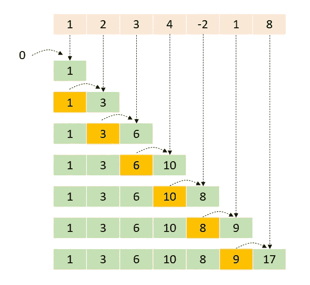
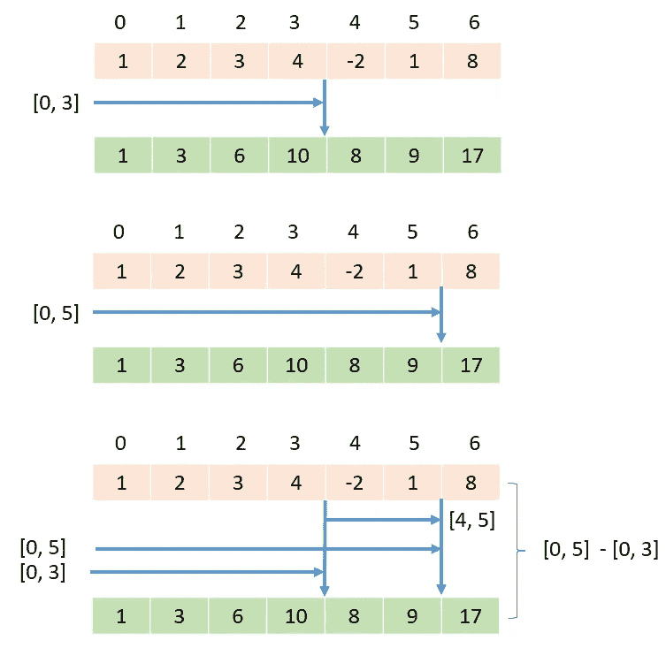
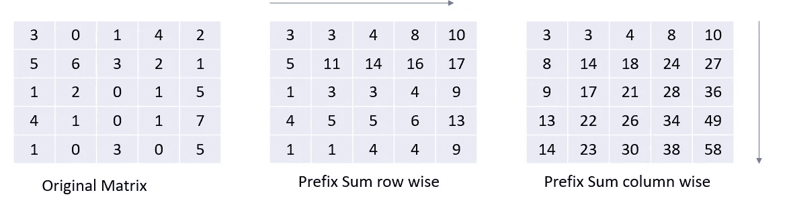
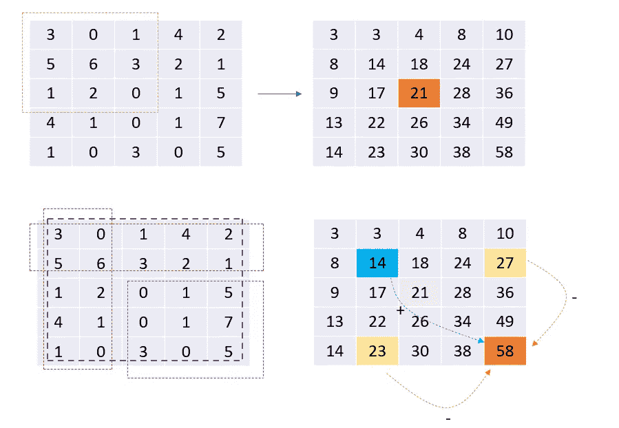
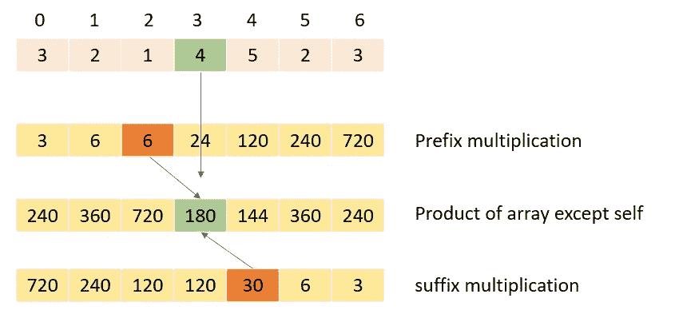

# 阵列编码模式—前缀和

> 原文：<https://blog.devgenius.io/array-coding-pattern-prefix-sum-a83d313c7e5a?source=collection_archive---------4----------------------->


图片来源 google.com

也称为累积和或包含扫描

对于给定的数组 A，前缀和数组 P 是与 A 大小相同的数组，其中每个索引`0 <= i < n` P[i]表示`A[0] + A[1] …. + A[i]`。



如上图所述，要生成前缀总和数组，我们只需获取前一个值(到该索引为止的元素总和)并添加数组的当前值。上述逻辑的代码实现如下:

```
def get_prefix_sum(array):
    prev_sum = 0
    prefix_sum_array = []
    for num in array:
        curr_sum = prev_sum + num
        prefix_sum_array.append(cur_sum)
        prev_sum = curr_sum 
    return prefixSum

print(get_prefix_sum([1, 2, 3, 4, -2, 1, 8]))
>>> [1, 3, 6, 10, 8, 9, 17]
```

因为我们只遍历数组一次，这需要 O(n)步。因此，生成前缀和数组的时间复杂度为 O(n)。此外，由于生成的数组大小为 n，并且我们没有任何其他额外的内存需求，因此空间复杂度为 O(n)。

## 范围和查询

我们需要回答要求给定索引范围内元素总和的查询。如果我们遍历数组来查找每个查询的总和，我们将对数组元素进行多次扫描，导致时间复杂度为 O(n*q)。为了改进这一点，我们预先计算从 0 到给定索引的范围的总和(基本上是前缀总和数组),然后在常数时间内返回查询的答案。下图解释了直觉。



上述逻辑的代码实现如下:

```
def range_sum_query(prefix_sum_array, l, r):
    if (l == 0):
        return prefix_sum_array[r]
    return prefix_sum_array[r] - prefix_sum_array[l - 1]
```

**时间&空间复杂度** —如果数组的大小为 n，要回答的查询数为 q，那么时间复杂度为 O(n + q)。其中，构造前缀和数组需要 O(n ),回答每个查询需要 O(1)时间。因为前缀和数组的大小为 n，所以解的空间复杂度为 O(n)。

## 范围和查询 2D

给定一个 2D 矩阵`matrix`，处理以下类型的多个查询:

*   计算其左上角**`(row1, col1)`和右下角**`(row2, col2)`定义的矩形内`matrix`元素的**和**。****

****实现`NumMatrix`类:****

*   ****`NumMatrix(int[][] matrix)`用整数矩阵`matrix`初始化对象。****
*   ****`int sumRegion(int row1, int col1, int row2, int col2)`返回其左上角**`(row1, col1)`和右下角**`(row2, col2)`定义的矩形内`matrix`元素的**和**。********

****你必须设计一个算法，让`sumRegion`对`O(1)`的时间复杂度起作用。****

****方法:这是一个与前一个例子类似的问题。不同之处在于，这里用矩阵代替了数组。所以我们可以计算水平和垂直前缀和。****

********

****在第三个矩阵中，在上面的 pic 中，我们看到每个单元值表示在该单元结束并从(0，0)开始的矩阵的总和。****

********

****在上面的图片中，我们试图找到(2，2)和(4，4)之间形成的子矩阵的元素之和。这个矩阵包含元素(0，1，5，0，1，7，3，0，5)。这些元素的和是 22。前缀矩阵中(4，4)处的值表示在(0，0)和(4，4)之间形成的子矩阵的和。类似地，(1，4)处的值表示(0，0)和(1，4)之间的子矩阵的元素之和。此外,( 4，1)处的值表示在(0，0)和(4，1)之间形成的子矩阵的元素之和。****

****子矩阵[(2，2) → (4，4) ] =子矩阵(4，4) —子矩阵(1，4) —子矩阵(4，1) +子矩阵(1，1)。最后一次相加是由于(0，0)和(1，1)之间的元素在(1，4)和(4，1)子矩阵中是公共的，并且它们被减去两次。所以我们加了一次。****

****上述逻辑的代码实现:****

```
**class NumMatrix:
    def __init__(self, matrix: List[List[int]]):
        m, n = len(matrix), len(matrix[0])
        for row in range(m):
            for col in range(1, n):
                matrix[row][col] += matrix[row][col - 1]

        for row in range(1, m):
            for col in range(n):
                matrix[row][col] += matrix[row-1][col]

        self.matrix = matrix

    def sumRegion(self, row1: int, col1: int, row2: int, col2: int) -> int:
        answer = self.matrix[row2][col2]
        if col1 - 1 >= 0: 
            answer -= self.matrix[row2][col1 - 1]
        if row1 - 1 >= 0:
            answer -= self.matrix[row1 - 1][col2]
        if row1 - 1 >= 0 and col1 - 1 >= 0:
            answer += self.matrix[row1 - 1][col1 - 1]
        return answer**
```

****在上面的例子中，我们在固定的时间内回答每个查询。我们取 O(n*n)来生成前缀矩阵。所以时间复杂度是 O(n*n + q)。****

## ****除自身以外的数组乘积****

****给定一个整数数组`nums`，返回*一个数组* `answer` *使得* `answer[i]` *等于* `nums` *除* `nums[i]`之外的所有元素的乘积。****

****`nums`的任何前缀或后缀的乘积是**保证**适合一个 **32 位**整数。你必须写一个在`O(n)`时间内运行并且不使用除法运算的算法。****

## ****方法****

****这个问题可以用前缀和的思想来解决。我们创建两个数组:****

*   ****计算前缀乘法****
*   ****计算后缀乘法(前缀从右到左)****

********

## ****代码实现****

```
**class Solution:
    def productExceptSelf(self, nums: List[int]) -> List[int]:
        left_products = []
        right_products = []
        result = []

        left_prod = 1
        for num in nums:
            left_products.append(left_prod)
            left_prod *= num

        right_prod = 1
        for num in nums[::-1]:
            right_products.append(right_prod)
            right_prod *= num
        right_products = right_products[::-1]

        return [left * right for left, right in zip(left_products, right_products)]**
```

## ****最大子阵列和等于 k****

****给定一个整数数组`nums`和一个整数`k`，返回*总计为* `k`的子数组的最大长度。如果没有，则返回`0`。****

## ****方法****

****我们使用前缀 sum 和 two sum 以及字典方法来解决这个问题。我们继续计算前缀总和，然后检查 target-curr 前缀总和是否在 sum_index_map 中。****

## ****代码实现****

```
**class Solution:
    def maxSubArrayLen(self, nums: List[int], k: int) -> int:
        sum_idx_map = defaultdict(list)
        prev = 0
        max_len = -math.inf
        for idx, num in enumerate(nums):
            curr_sum = prev + num
            prev = curr_sum
            sum_idx_map[curr_sum].append(idx)
            if curr_sum == k:
                max_len = max(max_len, idx+1)
            if (curr_sum - k) in sum_idx_map:
                max_len = max(max_len, idx - sum_idx_map[curr_sum - k][0])

        return max_len if max_len != -math.inf else 0**
```

## ****范围和的计数****

****给定一个整数数组`nums`和两个整数`lower`和`upper`，返回*位于*`[lower, upper]`*中的范围和的个数。范围和`S(i, j)`被定义为索引`i`和`j`之间的`nums`中元素的和，其中`i <= j`。*****

## *****方法*****

*****我们预先计算前缀总和，然后使用二分搜索法来查找范围内的总和数。*****

## *****代码实现*****

```
***class Solution:
    def countRangeSum(self, nums: List[int], lower: int, upper: int) -> int:
        prefix_sum = list(accumulate(nums))
        prefix_sum_sorted = sorted(prefix_sum)

        ans = n = 0

        for i in range(0, len(nums)):

            l = bisect_left(prefix_sum_sorted, lower)
            r = bisect_right(prefix_sum_sorted, upper)

            ans += r - l
            lower += nums[n]
            upper += nums[n]
            prefix_sum_sorted.pop(bisect_left(prefix_sum_sorted, prefix_sum[n]))
            n += 1

        return ans***
```

*****编码快乐！！*****