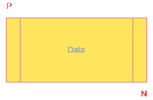
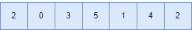
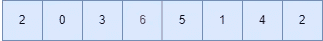
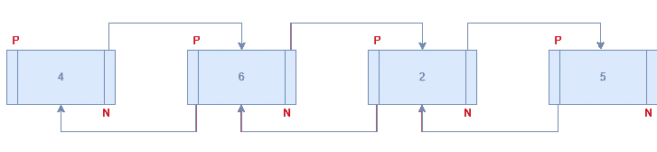
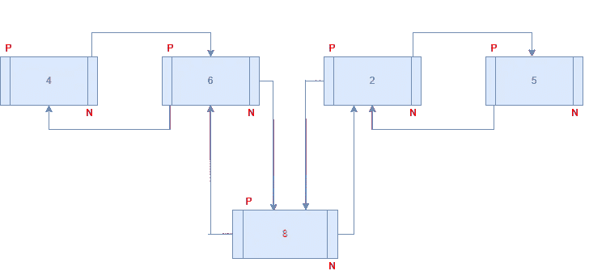

# ArrayList 还是 LinkedList？选择正确的一个— Java

> 原文：<https://blog.devgenius.io/arraylist-or-linkedlist-choose-correct-one-e2491d586a7d?source=collection_archive---------7----------------------->

照片由 [Unsplash](https://unsplash.com/s/photos/java?utm_source=unsplash&utm_medium=referral&utm_content=creditCopyText) 上的 [Clément Hélardot](https://unsplash.com/@clemhlrdt?utm_source=unsplash&utm_medium=referral&utm_content=creditCopyText) 拍摄

Java ArrayList 遵循动态数组的概念。当你创建一个数组列表时，初始容量是 10。如果超过 10，数组列表将自动调整大小。

Java LinkedList 基于双向链表数据结构。在链表中，每个条目被称为一个“节点”每个节点包括数据、前一个元素的地址和下一个元素的地址。

一个节点

链表的第一个元素被称为**头**。头的前一个元素(P)的地址将为空。

链表的最后一个元素叫做**尾**。尾部的下一个元素(N)的地址将为空。

每当我们需要动态数组时，ArrayList 和 LinkedList 都可以使用。但是我们怎样才能为这项工作选择一个合适的呢？你马上就会看到。

## 添加/删除中间数据

假设我们有一个如下的数组列表。

我们需要在 3 和 5 之间加 6。

请注意，它会将 6 之后的每个元素向右移动一位。从性能的角度来看，如果数组列表有很多数据，这不是一个好方法，而且是一个开销很大的操作。

删除数据也会导致同样的问题。如果我们删除一个中间元素，之前的所有元素都将向左移动一位。

让我们用链表来看看同样的事情。图像我们有下面的链表。

现在我们需要在 6 和 2 之间加上 8。我们如何做到这一点？

唯一发生的事情是，6 和 2 之间的链接将被删除，它们将被引用到 8。

它只是影响两个节点的链接，而不是整个列表。每当在数组列表之间添加元素时，这将比数组列表更有效。移除元件也是如此。

## 获取元素

ArrayList 只是一个数组，但带有动态属性。所以它有索引号。所以数组列表可以非常快地获取数据。但是链表呢？

如果你需要获取一个中间元素，链表需要从头开始遍历它来找到它。所以在这种情况下使用链表并不是一个好的选择。

## 包裹

正如我们现在所认识到的，使用哪一种取决于您的要求。如果您没有在数组列表之间添加或删除数据，这应该是最好的选择。另一方面，如果你需要在列表之间添加数据，最好使用链表。

希望这对您有所帮助！。