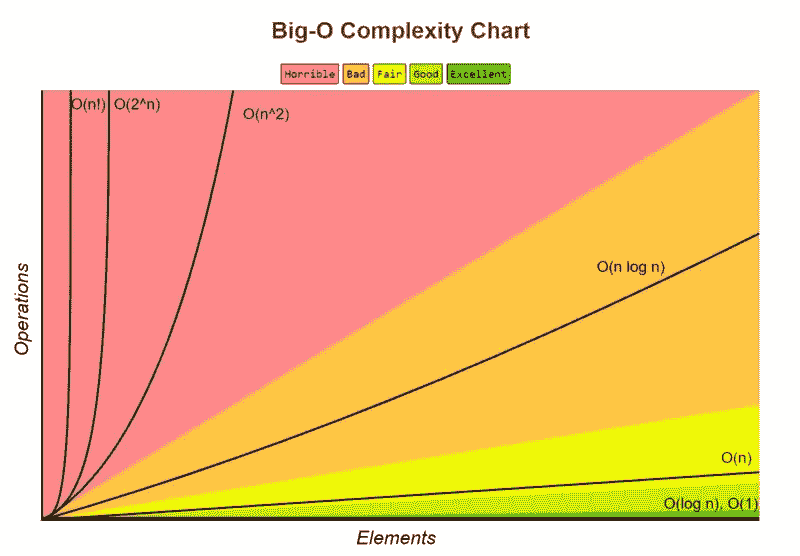

# 数组和算法

> 原文：<https://blog.devgenius.io/arrays-algorithms-b6f02e3ba138?source=collection_archive---------10----------------------->

> 计算机科学的算法理论。

[https://unsplash.com/photos/vR8wZ3TzpvM](https://unsplash.com/photos/vR8wZ3TzpvM)

> 当编程时，我们通常利用值的集合来将许多因素结合到我们的程序中。例如，我们可能使用 Array 创建购物车或电话联系信息。但是这是如何在我们的应用程序背后发生的呢？今天我们将探讨数组和算法背后的理论。

在讨论数组如何在两种编程语言中工作之前，我们将关注 swift 数组，并将注意力转移到 Objective C 数组上。我举几个例子。我们将重温两种语言对数组编程的方式。

Swift 阵列和集合示例。

上面列出了几个例子，说明我们在使用数组时如何利用 Swift 编程语言。Swift 提供了不同的数组声明方式。例如，我们可以在编程中利用类型推理或文字数组类型。使用数组时要记住的一个要点是在计算机科学中什么是索引和元素。

> ***索引*** :数组内放置一个元素或对象的地点和位置。
> 
> ***Element*** :是存储在数组的花括号或中括号之间的项目或对象。

Objective C 数组和集合示例。

Objective C 在程序中声明数组时略有不同，但它遵循的理论与编程中每个数组的原理相同。参考我在编程中列出的一些关于目标 C 数组的例子。根据程序中声明的方法或逻辑，集合可以插入、遍历、更新、搜索和删除对象*。*

> 静态数组:声明为内存中的固定空间量，用于保存值数组
> 
> 动态数组:声明为数组中存储值的内存量的两倍。

大 O 符号

在算法和数据结构中，我们遵循大 O 符号，它对编程中算法的速度和能力进行了分类。在计算机科学中，我们用数组执行的每个动作都有一个复杂性分析。让我们研究一下在程序中使用数组的一些复杂性。

> 在数组中插入值= O(n)
> 
> 更新特定值索引= O(1)
> 
> 访问特定值索引= O(1)
> 
> 移除特定值索引= O(n)

# **结论**

今天我们讨论了一些在编程中使用数组时容易理解的简单术语。我在本文中指定了 Swift 和 Objective C 编程，但是您可以使用任何编程语言并遵循相同的信息。算法和数据结构学起来很有趣。在学习算法和数据结构时，强调理解大 O 符号，因为它定义了数据结构的速度和复杂性。编码快乐！

 [## Michael Balsa -系统管理员-美国海军陆战队| LinkedIn

### 经验丰富的数据专家和系统管理员，监督维护飞机数据和信息管理…

www.linkedin.com](https://www.linkedin.com/in/michael-balsa-9474431b0/)