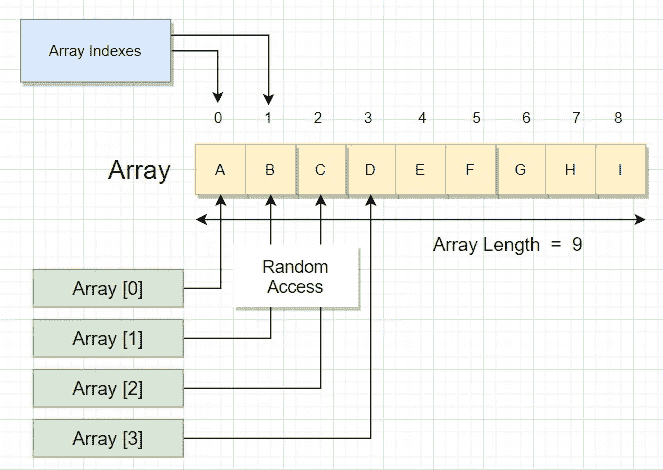
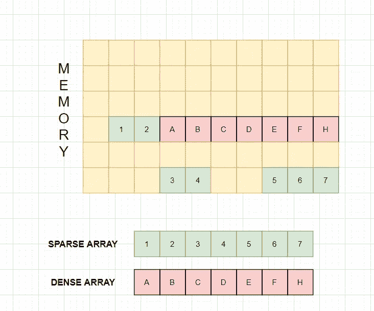
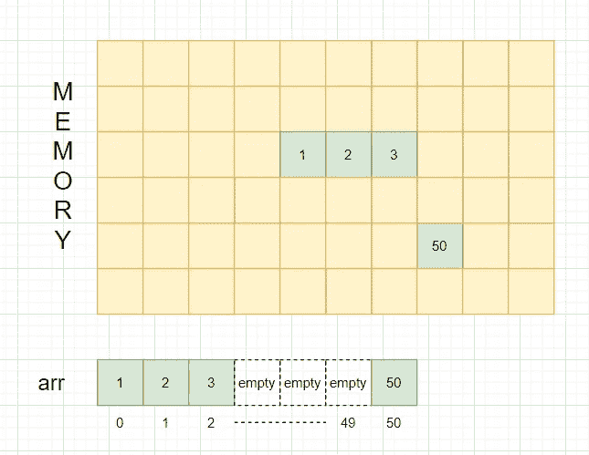

# Javascript 数组对象，密集和稀疏数组

> 原文：<https://blog.devgenius.io/arrays-and-array-in-javascript-345b4f87a232?source=collection_archive---------1----------------------->

数组数据结构，Javascript 数组对象，密集数组和稀疏数组介绍。


在这个故事中，我将详细介绍*数组数据结构*和一些关于*Javascript 数组对象*的有趣的核心事实，使它们不同于原始的数组数据结构。为了更好地理解这个故事，您应该对 javascript 中的数组有一个基本的概念。

**什么是数组？**

***“数组是固定大小的同质元素的集合”。*** 数组是最简单的数据结构之一，可能也是使用最多的数据结构。以下是阵列的一些功能:

*   **固定大小**数组有一个预定义的固定大小。
*   所有元素都具有相同的数据类型。
*   每个元素被分配一个从 0 到 n-1 的索引，其中 n 是元素的数量。
*   **连续内存分配**数组被分配给连续的内存块。
*   **O(1)** 时间复杂度为**插入**和**随机接入**。
*   **O(n)** 时间复杂度为**删除**和**搜索**。



**Javascript 中数组对象是什么？**

Javascript 中的数组是类似列表的全局对象。虽然，它们的工作非常像一个原始的数组数据结构，但它实际上是一个使用哈希表实现的 API。由于使用了哈希表，javascript 中的数组作为一种结构更加强大。

*   无论您最初是否定义了大小，javascript 中的数组大小都是动态的。

```
**let arr = new Array()
let arr = new Array(10);
let arr = [];**
```

*   javascript 中的数组可以包含不同数据类型的元素。

```
**let arr = [1,'hello',true,undefined]**
```

*   Javascript 支持密集和稀疏数组。

**什么是密集阵列和稀疏阵列？**

**密集数组**只分配连续的内存块。

**稀疏数组**不一定要分配连续的内存块。

**为什么 javascript 支持稀疏数组？**

答案很简单，它允许数组的大小和数据类型是动态的。但最重要的是，它提高了内存利用率。



**如何在 javascript 中创建稀疏数组？**

如果需要，Javascript 倾向于自动创建一个稀疏数组，以便更有效地利用内存。javascript 做这种事情的频率比你注意到的还要高。考虑下面的例子:

```
**let arr = [1,2,3];
arr[50] = 50;**
```

我们用元素 1，2，3 定义了一个数组*‘arr’*。Javascript 在读取第一条语句后为*arr*分配一个连续的内存。然后 javascript 读取第二条语句，并在内存中为该元素分配内存。但问题是，它不会为索引 3 到索引 49 分配内存。相反，它只会为索引 50 分配内存。请参见下面的框图:



到目前为止，有两个非常重要的问题需要回答。

**指数 3 到 49 的数值是多少？**

```
**console.log(arr[3],arr[4],arr[49])  
// output : undefined undefined undefined****console.log(arr.filter( a => a === undefined)
// output : []**
```

如果你试图检查数组' *arr'* '从 3 到 49 的任何索引的值，它们都将是*'未定义'*。但是，如果您过滤数组，使其只有*‘未定义’*值，那么结果将是一个*空数组*。因为实际上 javascript 从来没有给索引 3 到 49 分配内存，因为它们从来没有被声明过。

**数组 *arr* 的长度是多少？**

虽然索引 3 到 49 是空的，并且只有 4 个索引有值。尽管如此，数组的长度仍然是 51。因为，这就是 javascript 通过为未声明的索引制造漏洞来管理一致索引的方式。

```
**console.log(arr.length)
// output : 51**
```

javascript 中的数组对象是惊人的结构。但是，如果你想在 javascript 中创建一个基本的数组数据结构，你可以在 javascript 中使用类型化数组。试试看，如果你发现了一些很酷的东西，请在回复部分告诉我。

[](https://medium.com/@tdillusionisme/javascript-lexical-grammar-strings-getter-and-setter-443f53c79743) [## Javascript 词汇语法、字符串、Getter 和 Setter

### 您可能会错过的 Javascript 特性

medium.com](https://medium.com/@tdillusionisme/javascript-lexical-grammar-strings-getter-and-setter-443f53c79743)