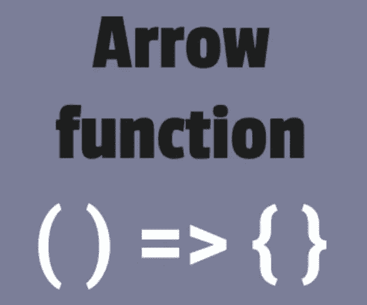

# JavaScript 箭头函数与常规函数

> 原文：<https://blog.devgenius.io/arrow-functions-vs-regular-functions-bad0e41b48c4?source=collection_archive---------10----------------------->

*本文将深入探讨 ES6 箭头函数和常规函数的区别*



箭头函数语法

ES6(也称为 ES2015)为 JavaScript 开发人员带来了使用箭头功能的能力。

所以，不要像这样写函数表达式

```
const sayHi = function(name) {
   return `Hi ${name}`;
}
```

我们可以只写

```
const sayHi = (name) => {
    return `Hi ${name}`;
}
```

因此，正如我们在上面看到的，箭头函数为我们提供了一个更短的语法来编写函数，这是一个很大的好处。我们甚至可以简化上面的箭头函数语法，去掉 name 参数周围的括号，因为我们只使用了一个参数(如果我们使用了多个参数，我们必须保留它们)

```
const sayHi = name => { 
   return `Hi ${name}`;
}
```

箭头函数的另一个好处是，如果它包含一个表达式，我们可以省略函数的花括号，然后表达式被隐式返回，而不需要使用 **return** 关键字(这种函数实际上被称为内联箭头函数)

```
const sayHi = name => `Hi ${name}`;
```

在一个常规的 JavaScript 函数中，`this`值可以是动态的，并且取决于调用函数的方式。有 4 种不同类型的调用类型:

1.regular——`this`值是全局对象(或者如果打开了严格模式，则是未定义的)

```
function sayHi() {
   console.log(this); // this is the global object
}
sayHi();
```

2.函数-**`this`值是包含该方法的对象。**

```
const wrapper = {
  sayHi() {
    console.log(this); // this is the wrapper object
  }
};
wrapper.sayHi()
```

**3.间接——**`this`值是包含该方法的对象(以`call` 或`apply`为例)****

```
**const person = { age: 24, name: 'john' };
function sayHi() {
  console.log(this); // this is the person object
}
sayHi.call(person);**
```

****4.构造函数——`this`值是通过`new`关键字创建的实例。****

```
**function sayHi() {
  console.log(this); // this is the instance of sayHi
}
new sayHi();**
```

****另一方面，arrow 函数不定义自己的执行上下文。这意味着它在哪里执行并不重要，arrow 函数中的`this`值总是等于外部函数中的相同值。这也意味着，与常规函数相反，使用`call`或`apply`对箭头函数的间接调用不起作用。****

```
**function sayHi(){
 console.log(this.age);
}sayHi(); // logs undefined, this is the global objectconst person = { age : 34 };
sayHi.call(person); // logs 34, call allows binding the this valueconst sayHi2 = () => console.log(this.age); sayHi2.call(person); // logs undefined, call/apply doesn't work!**
```

****因此，常规函数中的`this`值是动态的，就像我们上面看到的一样，它的值取决于调用的类型，而箭头函数中的`this`值将总是相同的，并且将等于外部函数，因为它是词汇绑定的。****

```
**let person = { 
  arrowHi:() => { 
    console.log(this); 
  },
  regularHi(){ 
    console.log(this); 
  } 
};person.arrowHi(); // logs the global object
person.regularHi(); // logs person object**
```

****因为`this`在 arrow 函数中进行了词法解析，所以我们实际上不能将它用作构造函数。****

```
**function Car(brand) {
 this.brand = brand;
}const reno = new Car(‘Reno’);
console.log(reno instanceof Car); // trueconst Car2 = (brand) => {
 this.brand = brand;
};const reno2 = new Car2(‘Reno’); // error — Uncaught TypeError: Car2 is not a constructor**
```

****常规函数和箭头函数的另一个区别是方法在类中的工作方式。在简单的情况下，它们的工作是一样的，但是如果我们需要提供一个方法作为异步事件的回调，比如`setTimeout`或者网络请求，事情就不那么简单了..****

```
**class Person {
  constructor(age) {
    this.age = age;
  }
  sayAge() {
    console.log(“this person age is “ + this.age);
  }
  sayAge2 = () => console.log(“this person age is “ + this.age);
}const person = new Person(34);
person.sayAge(); // "this person age is 34"
person.sayAge2(); // "this person age is 34"setTimeout(person.sayAge, 1000); // "this person age is undefined"// we can actually fix that with bind, but this is an extra overheadsetTimeout(person.sayAge.bind(person), 1000);// "this person age is 34"**
```

****与常规函数相比，arrow 函数将`this`在词汇上绑定到类实例，这实际上可以帮助我们解决上面看到的问题。****

```
**class Person2 {
  constructor(age) {
    this.age = age;
  }
  sayAge = () => {
    console.log("this person age is " + this.age);
  }
}const person2 = new Person2(34);
person2.sayAge(); // "this person age is 34"
setTimeout(person2.sayAge, 1000); // "this person age is 34"**
```

****我希望这篇文章能帮助你理解箭头函数和常规函数的区别，以及在哪里明智地使用它们。如果你觉得这篇文章有帮助，我会很感激下面的一些掌声(:****

****您也可以关注我以获得更多类似的文章(:****