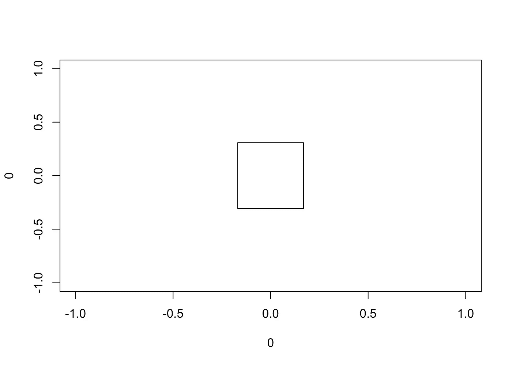

# 带 R 的艺术

> 原文：<https://blog.devgenius.io/art-with-r-d3534144cc91?source=collection_archive---------14----------------------->

[在这篇博文中，我将展示我们如何使用基本绘图特性和函数在 R 中创建艺术作品(目标板)。](https://www.datawim.com/post/art-with-r/)

在我的上一篇文章中，我分享了我们如何使用一些简单的基本函数(如 matrix)在 R 中生成不同的空间模式，然后使用`ggplot2`包将它们可视化。

在这篇文章中，我将做更多的创新，并展示我们如何使用 R 来做艺术工作，并创建漂亮的目标板。

准确度和精确度是机器学习中的重要概念，尤其是在评估模型质量以进行预测时。**准确度**指的是测量值与真实值的接近程度。相比之下，**精度**指的是同类的测量值彼此之间的接近程度。当然，两者都是相互独立的。

你们中熟悉这些术语的人可能会遇到下图，它很好地形象化了这些概念。


在这篇博文中，我将使用基本绘图函数用 R 重新创建这些形状。

# 简单的形状

我们可以使用 R 中的 base `plot`函数来绘制不同的形状，如圆形、正方形、三角形等。利用这些形状，我们可以做很多事情。

# 一个圆圈

```
plot(0, 0, cex = 12)
```


# 一个三角形

```
plot(0, 0, cex = 12, pch = 2)
```


# 一个正方形

```
plot(0, 0, cex = 12, pch = 0)
```



我们也可以通过将这些图形绘制在一起，将它们组合在同一个图形中。

```
plot(0, 0, cex = 12)
points(0.5, 0.5, cex = 12, pch = 2)
points(-0.5, -0.5, cex = 12, pch = 0)
```


为了使这些颜色丰富多彩，我们可以用自己选择的颜色填充它们。

```
plot(0, 0, cex = 12, pch = 21, bg = "orange")
points(0.5, 0.5, cex = 12, pch = 24, bg = "green")
points(-0.5, -0.5, cex = 12, pch = 22, bg = "blue")
```


回到业务，即目标板。为此，我们可以使用不同大小的圆圈，将它们叠放在一起，并填充不同的颜色，即橙色和白色。首先，我们可以从一个大的橙色圆圈(cex = 45)开始，然后是相应的不同颜色的小圆圈。

```
*# target board*
plot(0, 0, cex = 45, pch = 21, bg = "orange", col = "black")
points(0, 0, cex = 39, pch = 21, bg = "white", col = "white")
points(0, 0, cex = 33, pch = 21, bg = "orange", col = "orange")
points(0, 0, cex = 27, pch = 21, bg = "white", col = "white")
points(0, 0, cex = 21, pch = 21, bg = "orange", col = "orange")
points(0, 0, cex = 15, pch = 21, bg = "white", col = "white")
points(0, 0, cex = 9, pch = 21, bg = "orange", col = "orange")
points(0, 0, cex = 3, pch = 21, bg = "white", col = "white")
```


现在，我将在圆的中心绘制五个彼此靠近的目标点(乘法符号),并删除轴标题和边界线

```
*# target board*
plot(0, 0, cex = 45, pch = 21, bg = "orange", col = "black", axes=F, xlab = NA, ylab = NA)
points(0, 0, cex = 39, pch = 21, bg = "white", col = "white")
points(0, 0, cex = 33, pch = 21, bg = "orange", col = "orange")
points(0, 0, cex = 27, pch = 21, bg = "white", col = "white")
points(0, 0, cex = 21, pch = 21, bg = "orange", col = "orange")
points(0, 0, cex = 15, pch = 21, bg = "white", col = "white")
points(0, 0, cex = 9, pch = 21, bg = "orange", col = "orange")
points(0, 0, cex = 3, pch = 21, bg = "white", col = "white")*# target points*
points(0, 0, pch = 4, lwd = 2, cex = 1.5, col = "blue")
points(0, 0.1, pch = 4, lwd = 2, cex = 1.5, col = "blue")
points(0, -0.1, pch = 4, lwd = 2, cex = 1.5, col = "blue")
points(0.1, 0, pch = 4, lwd = 2, cex = 1.5, col = "blue")
points(-0.1, 0, pch = 4, lwd = 2, cex = 1.5, col = "blue")
```


因为我们有生成目标纸板图的基本代码，所以我将使用这个代码创建一个函数，在下面的部分中使用，以减少重复。

```
*# target board function*
target_board <- **function**(title) {
  plot(0, 0, cex = 45, pch = 21, bg = "orange", col = "black", axes=F, main = title, xlab = NA, ylab = NA)
  points(0, 0, cex = 39, pch = 21, bg = "white", col = "white")
  points(0, 0, cex = 33, pch = 21, bg = "orange", col = "orange")
  points(0, 0, cex = 27, pch = 21, bg = "white", col = "white")
  points(0, 0, cex = 21, pch = 21, bg = "orange", col = "orange")
  points(0, 0, cex = 15, pch = 21, bg = "white", col = "white")
  points(0, 0, cex = 9, pch = 21, bg = "orange", col = "orange")
  points(0, 0, cex = 3, pch = 21, bg = "white", col = "white")
}
```

# 具有不同准确度和精度的目标板

现在，我将使用 target board 函数在不同的位置生成四个不同的目标板和目标点，以显示不同的准确度和精度级别。

```
*# 2 by 2 grid*
par(mfrow = c(2, 2))*# remove extra white space*
par(mar = c(1, 1, 1.5, 1)) *# High Accuracy High Precision*
target_board(title = "High Accuracy High Precision")
points(0, 0, pch = 4, lwd = 2, cex = 1.5, col = "blue")
points(0, 0.1, pch = 4, lwd = 2, cex = 1.5, col = "blue")
points(0, -0.1, pch = 4, lwd = 2, cex = 1.5, col = "blue")
points(0.1, 0, pch = 4, lwd = 2, cex = 1.5, col = "blue")
points(-0.1, 0, pch = 4, lwd = 2, cex = 1.5, col = "blue")*# Low Accuracy High Precision*
target_board(title = "Low Accuracy High Precision")
points(0.15, 0.3, pch = 4, lwd = 2, cex = 1.5, col = "blue")
points(0.15, 0.4, pch = 4, lwd = 2, cex = 1.5, col = "blue")
points(0.15, 0.2, pch = 4, lwd = 2, cex = 1.5, col = "blue")
points(0.25, 0.3, pch = 4, lwd = 2, cex = 1.5, col = "blue")
points(0.05, 0.3, pch = 4, lwd = 2, cex = 1.5, col = "blue")*# High Accuracy Low Precision*
target_board(title = "High Accuracy Low Precision")
points(0, 0.15, pch = 4, lwd = 2, cex = 1.5, col = "blue")
points(-0.1, 0.2, pch = 4, lwd = 2, cex = 1.5, col = "blue")
points(0.09, -0.12, pch = 4, lwd = 2, cex = 1.5, col = "blue")
points(0.15, 0, pch = 4, lwd = 2, cex = 1.5, col = "blue")
points(-0.1, -0.1, pch = 4, lwd = 2, cex = 1.5, col = "blue")*# Low Accuracy Low Precision*
target_board(title = "Low Accuracy Low Precision")
points(0.3, 0.4, pch = 4, lwd = 2, cex = 1.5, col = "blue")
points(-0.3, 0.2, pch = 4, lwd = 2, cex = 1.5, col = "blue")
points(-0.2, -0.2, pch = 4, lwd = 2, cex = 1.5, col = "blue")
points(0.2, -0.4, pch = 4, lwd = 2, cex = 1.5, col = "blue")
points(-0.05, -0.5, pch = 4, lwd = 2, cex = 1.5, col = "blue")
```


**就是这样！**

如果您有任何问题，请随时联系我。